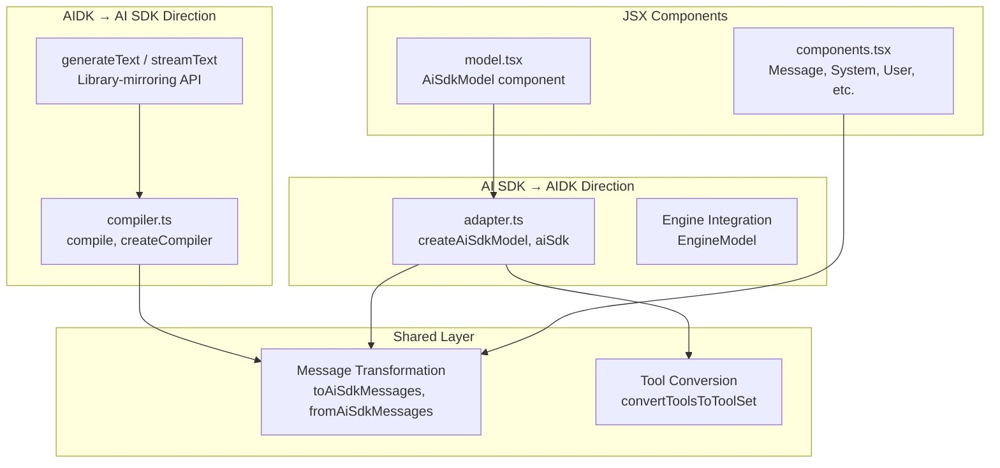
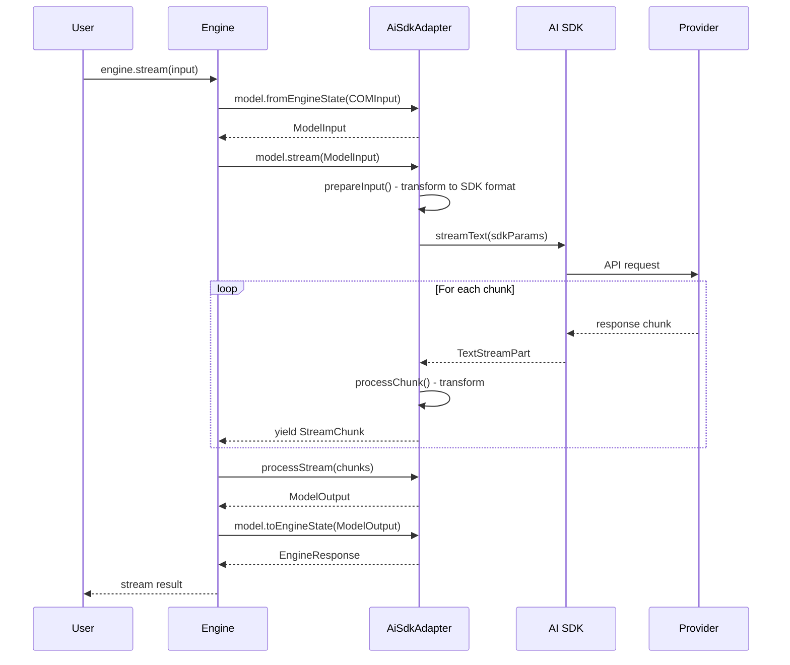
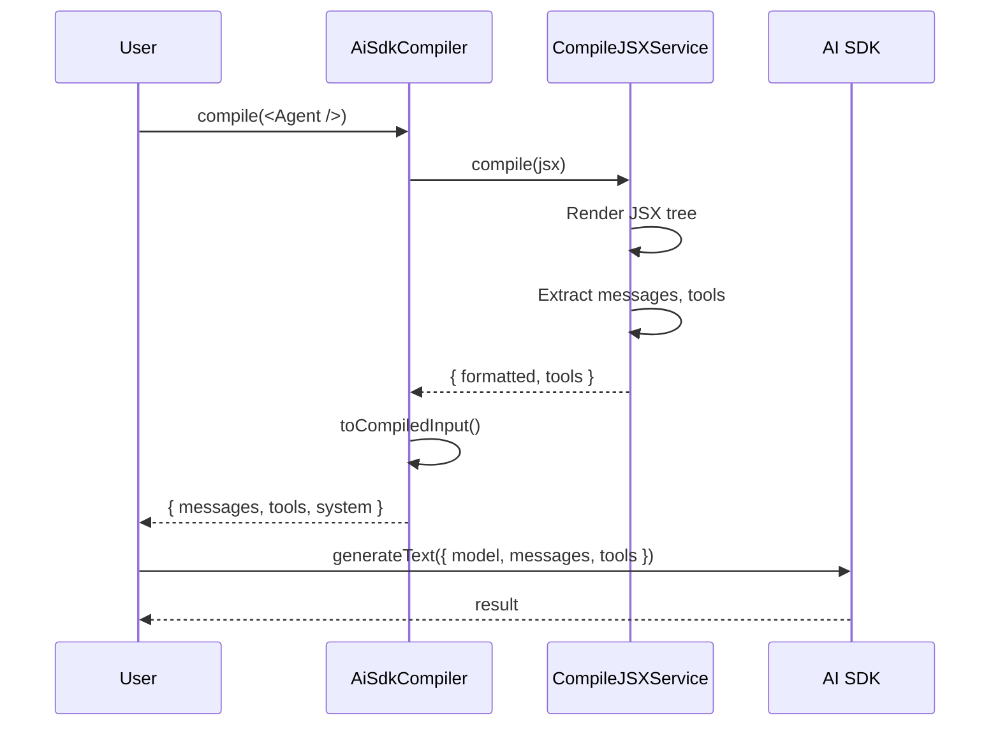
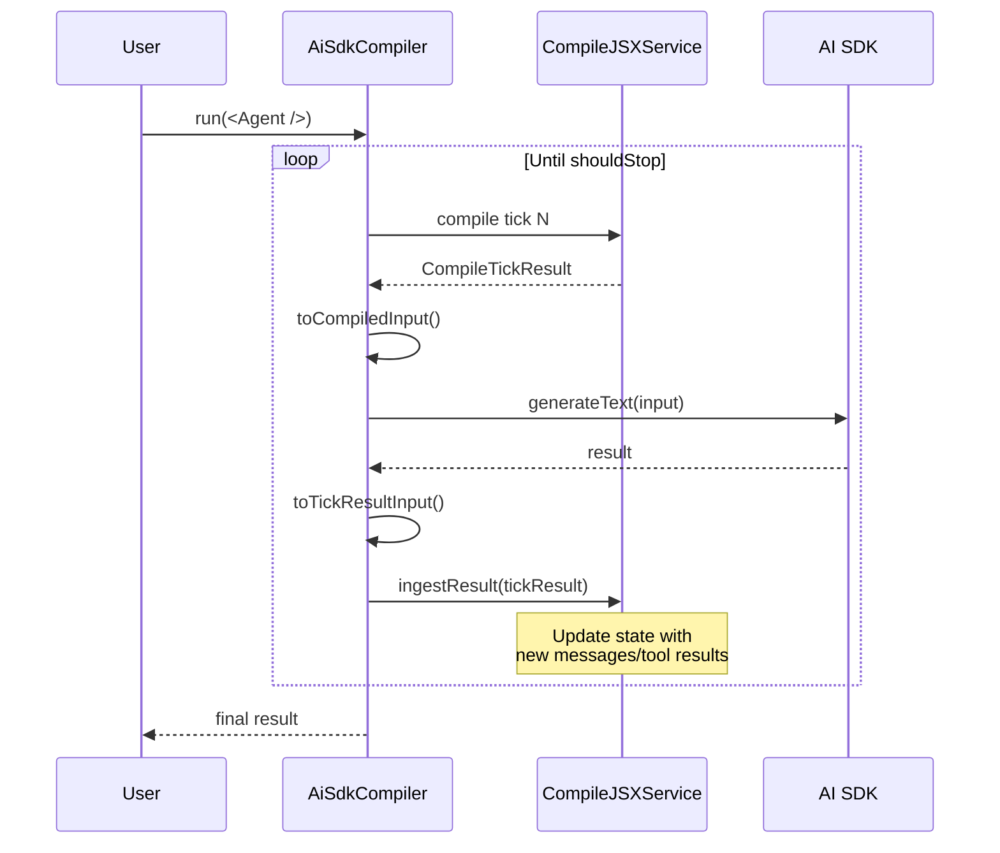

# aidk-ai-sdk Adapter Architecture

> **Bidirectional adapter for Vercel AI SDK and AIDK integration**

The AI SDK adapter package provides seamless integration between Vercel's AI SDK and AIDK. It supports two integration directions: using AI SDK models within AIDK's engine, and using AIDK's JSX compilation with AI SDK's native API.

---

## Table of Contents

1. [Overview](#overview)
2. [Module Structure](#module-structure)
3. [Core Concepts](#core-concepts)
4. [API Reference](#api-reference)
5. [Data Flow](#data-flow)
6. [Usage Examples](#usage-examples)
7. [Integration Points](#integration-points)

---

## Overview

### What This Package Does

The AI SDK adapter provides:

- **Model Wrapping** - Wrap any AI SDK `LanguageModel` for use with AIDK's engine
- **Progressive Adoption** - Four levels of integration from simple compilation to full managed execution
- **Message Transformation** - Bidirectional conversion between AIDK and AI SDK message formats
- **Streaming Support** - Full streaming support with chunk transformation
- **Tool Integration** - Convert AIDK tools to AI SDK ToolSet format
- **JSX Components** - AI SDK-style components for declarative configuration

### Why It Exists

Developers using Vercel's AI SDK can:

1. **Adopt AIDK incrementally** - Start with JSX compilation, gradually adopt full engine
2. **Use familiar APIs** - `generateText()` and `streamText()` work with JSX input
3. **Mix and match** - Use AI SDK models with AIDK's component system
4. **Maintain portability** - Switch providers without changing agent code

### Design Principles

- **Bidirectional** - Supports both AI SDK → AIDK and AIDK → AI SDK directions
- **Progressive adoption** - Four levels from minimal to full integration
- **Native types** - Returns AI SDK native types where possible
- **Zero lock-in** - Components are portable across adapter packages

---

## Module Structure

```
packages/adapters/ai-sdk/src/
├── index.ts        # Public exports (progressive adoption API, components, engine integration)
├── adapter.ts      # Model adapter: AI SDK → AIDK engine direction
├── compiler.ts     # JSX compiler: AIDK → AI SDK direction (progressive adoption)
├── model.tsx       # JSX <Model> component for declarative config
└── components.tsx  # AI SDK-style message components
```



### File Overview

| File             | Size       | Purpose                                       |
| ---------------- | ---------- | --------------------------------------------- |
| `adapter.ts`     | 1085 lines | Model adapter for engine integration          |
| `compiler.ts`    | 920 lines  | JSX compiler with progressive adoption levels |
| `components.tsx` | 325 lines  | AI SDK-style message components               |
| `model.tsx`      | 60 lines   | Declarative model component                   |
| `index.ts`       | 72 lines   | Public API exports                            |

---

## Core Concepts

### 1. Bidirectional Integration

The adapter supports two directions of integration:

```
┌─────────────────────────────────────────────────────────────────┐
│                   Bidirectional Integration                      │
├─────────────────────────────────────────────────────────────────┤
│                                                                 │
│  Direction 1: AI SDK → AIDK Engine                              │
│  ┌────────────────────────────────────────────────────────┐     │
│  │  AI SDK LanguageModel                                  │     │
│  │  (openai, anthropic, google, etc.)                     │     │
│  └───────────────────────┬────────────────────────────────┘     │
│                          │ createAiSdkModel()                   │
│                          ▼                                      │
│  ┌────────────────────────────────────────────────────────┐     │
│  │  EngineModel (AIDK interface)                          │     │
│  │  - generate: Procedure                                 │     │
│  │  - stream: Procedure                                   │     │
│  │  - fromEngineState / toEngineState                     │     │
│  └────────────────────────────────────────────────────────┘     │
│                                                                 │
│  Direction 2: AIDK → AI SDK                                     │
│  ┌────────────────────────────────────────────────────────┐     │
│  │  JSX Component Tree                                    │     │
│  │  <MyAgent><System>...</System></MyAgent>               │     │
│  └───────────────────────┬────────────────────────────────┘     │
│                          │ compile() / createCompiler()         │
│                          ▼                                      │
│  ┌────────────────────────────────────────────────────────┐     │
│  │  CompiledInput (AI SDK native format)                  │     │
│  │  - messages: ModelMessage[]                            │     │
│  │  - tools: ToolSet                                      │     │
│  │  - system: string                                      │     │
│  └───────────────────────┬────────────────────────────────┘     │
│                          │ generateText() / streamText()        │
│                          ▼                                      │
│  ┌────────────────────────────────────────────────────────┐     │
│  │  AI SDK Response (native types)                        │     │
│  └────────────────────────────────────────────────────────┘     │
│                                                                 │
└─────────────────────────────────────────────────────────────────┘
```

### 2. Progressive Adoption Levels

The compiler supports four levels of adoption:

```
┌─────────────────────────────────────────────────────────────────┐
│                   Progressive Adoption Levels                    │
├─────────────────────────────────────────────────────────────────┤
│                                                                 │
│  Level 1: compile() only                                        │
│  ┌─────────────────────────────────────────────────────────┐    │
│  │  User calls generateText() themselves                   │    │
│  │  const { messages, tools } = await compile(<Agent />);  │    │
│  │  await generateText({ model, messages, tools });        │    │
│  └─────────────────────────────────────────────────────────┘    │
│                                                                 │
│  Level 2: run() with executor                                   │
│  ┌─────────────────────────────────────────────────────────┐    │
│  │  User controls model execution, we handle tick loop     │    │
│  │  compiler.run(<Agent />, async (input) => {             │    │
│  │    return await generateText({ model, ...input });      │    │
│  │  });                                                    │    │
│  └─────────────────────────────────────────────────────────┘    │
│                                                                 │
│  Level 3: run() / stream() - managed execution                  │
│  ┌─────────────────────────────────────────────────────────┐    │
│  │  We handle everything. Model from config or <Model>     │    │
│  │  const compiler = createCompiler({ model });            │    │
│  │  await compiler.run(<Agent />);                         │    │
│  └─────────────────────────────────────────────────────────┘    │
│                                                                 │
│  Level 4: generateText() / streamText() - mirror library API    │
│  ┌─────────────────────────────────────────────────────────┐    │
│  │  Same API as ai-sdk, JSX as first argument              │    │
│  │  await generateText(<Agent />, { temperature: 0.8 });   │    │
│  │  Returns native AI SDK types                            │    │
│  └─────────────────────────────────────────────────────────┘    │
│                                                                 │
└─────────────────────────────────────────────────────────────────┘
```

### 3. Message Transformation

The adapter handles bidirectional message conversion:

```
┌─────────────────────────────────────────────────────────────────┐
│                   Message Transformation                         │
├─────────────────────────────────────────────────────────────────┤
│                                                                 │
│  AIDK Message Format                    AI SDK Message Format   │
│  ┌─────────────────────┐                ┌─────────────────────┐ │
│  │ {                   │                │ {                   │ │
│  │   role: 'assistant',│◄──────────────►│   role: 'assistant',│ │
│  │   content: [        │                │   content: [        │ │
│  │     {               │                │     {               │ │
│  │       type: 'text', │                │       type: 'text', │ │
│  │       text: '...'   │                │       text: '...'   │ │
│  │     },              │                │     },              │ │
│  │     {               │                │     {               │ │
│  │       type: 'tool_  │                │       type: 'tool-  │ │
│  │       use',         │                │       call',        │ │
│  │       toolUseId,  │                │       toolCallId,   │ │
│  │       name,         │                │       toolName,     │ │
│  │       input         │                │       args          │ │
│  │     }               │                │     }               │ │
│  │   ]                 │                │   ]                 │ │
│  │ }                   │                │ }                   │ │
│  └─────────────────────┘                └─────────────────────┘ │
│                                                                 │
│  Key Transformations:                                           │
│  • tool_use ↔ tool-call (type naming)                          │
│  • toolUseId ↔ toolCallId (ID field)                         │
│  • name ↔ toolName (tool name field)                           │
│  • input ↔ args (arguments field)                              │
│  • reasoning block ↔ reasoning part                            │
│  • image/document sources ↔ data/url format                    │
│                                                                 │
└─────────────────────────────────────────────────────────────────┘
```

### 4. Streaming Support

Full streaming with chunk transformation:

```
┌─────────────────────────────────────────────────────────────────┐
│                   Streaming Pipeline                             │
├─────────────────────────────────────────────────────────────────┤
│                                                                 │
│  AI SDK Stream Chunks              AIDK Stream Chunks           │
│  ┌─────────────────────┐          ┌─────────────────────┐       │
│  │ text-delta          │────────►│ content_delta        │       │
│  │ text-start          │────────►│ content_start        │       │
│  │ text-end            │────────►│ content_end          │       │
│  │ reasoning-delta     │────────►│ reasoning_delta      │       │
│  │ tool-input-start    │────────►│ tool_input_start     │       │
│  │ tool-input-delta    │────────►│ tool_input_delta     │       │
│  │ tool-call           │────────►│ tool_call            │       │
│  │ tool-result         │────────►│ tool_result          │       │
│  │ start-step          │────────►│ step_start           │       │
│  │ finish-step         │────────►│ step_end             │       │
│  │ finish              │────────►│ message_end          │       │
│  └─────────────────────┘          └─────────────────────┘       │
│                                                                 │
│  processChunk() maps each AI SDK chunk type to AIDK's          │
│  unified StreamChunk interface                                  │
│                                                                 │
└─────────────────────────────────────────────────────────────────┘
```

### 5. Tool Conversion

Tools are converted from AIDK format to AI SDK's ToolSet:

```
┌─────────────────────────────────────────────────────────────────┐
│                   Tool Conversion                                │
├─────────────────────────────────────────────────────────────────┤
│                                                                 │
│  AIDK Tool Formats:                                             │
│  ┌─────────────────────────────────────────────────────────┐    │
│  │  ExecutableTool                                         │    │
│  │  {                                                      │    │
│  │    metadata: { name, description, parameters },         │    │
│  │    run: async (input) => result                        │    │
│  │  }                                                      │    │
│  ├─────────────────────────────────────────────────────────┤    │
│  │  ToolDefinition                                         │    │
│  │  {                                                      │    │
│  │    name, description, parameters                        │    │
│  │  }                                                      │    │
│  └─────────────────────────────────────────────────────────┘    │
│                          │                                      │
│                          │ convertToolsToToolSet()              │
│                          ▼                                      │
│  AI SDK ToolSet:                                                │
│  ┌─────────────────────────────────────────────────────────┐    │
│  │  {                                                      │    │
│  │    [toolName]: {                                        │    │
│  │      description: string,                               │    │
│  │      inputSchema: ZodSchema | JSONSchema,               │    │
│  │      providerOptions?: {...}                            │    │
│  │      // No execute - engine handles execution           │    │
│  │    }                                                    │    │
│  │  }                                                      │    │
│  └─────────────────────────────────────────────────────────┘    │
│                                                                 │
│  Note: Tools are passed as definitions only.                    │
│  AIDK engine handles tool execution.                            │
│                                                                 │
└─────────────────────────────────────────────────────────────────┘
```

### 6. Stop Reason Mapping

AI SDK finish reasons map to AIDK's StopReason enum:

| AI SDK FinishReason | AIDK StopReason  |
| ------------------- | ---------------- |
| `stop`              | `STOP`           |
| `length`            | `MAX_TOKENS`     |
| `tool-calls`        | `TOOL_USE`       |
| `content-filter`    | `CONTENT_FILTER` |
| `error`             | `ERROR`          |
| `other`             | `OTHER`          |
| (unknown)           | `UNSPECIFIED`    |

---

## API Reference

### adapter.ts - Engine Integration

#### `createAiSdkModel(config)`

Creates an AIDK `EngineModel` from an AI SDK `LanguageModel`:

```typescript
interface AiSdkAdapterConfig {
  model: LanguageModel; // AI SDK model instance
  system?: string; // Default system prompt
  tools?: ToolSet; // Default tools
  temperature?: number; // 0-2
  maxTokens?: number; // Max output tokens
  topP?: number; // Top P sampling
  frequencyPenalty?: number; // Frequency penalty
  presencePenalty?: number; // Presence penalty
  providerOptions?: Record<string, unknown>; // Provider-specific
}

function createAiSdkModel(config: AiSdkAdapterConfig): EngineModel;
```

#### `aiSdk(config)`

Shorthand alias for `createAiSdkModel`:

```typescript
function aiSdk(config: AiSdkAdapterConfig): EngineModel;
```

#### Message Conversion Functions

```typescript
// AIDK → AI SDK
function toAiSdkMessages(messages: Message[]): ModelMessage[];
function mapContentBlocksToAiSdkContent(content: ContentBlock[]): AiSdkPart[];
function mapContentBlockToAiSdkPart(block: ContentBlock): AiSdkPart | undefined;

// AI SDK → AIDK
function fromAiSdkMessages(messages: ResponseMessage[]): Message[];
function mapAiSdkContentToContentBlocks(content: AiSdkContent): ContentBlock[];
function mapAiSdkPartToContentBlock(part: AiSdkPart): ContentBlock | undefined;

// Tool result conversion
function mapToolResultContent(
  content: ContentBlock[],
  isError?: boolean,
): ToolResultOutput;
function mapToolResultToContentBlocks(result: unknown): ContentBlock[];
```

### compiler.ts - JSX Compilation

#### `compile(jsx, initialMessages?)`

Level 1: Compile JSX to AI SDK native format:

```typescript
interface CompiledInput {
  messages: ModelMessage[]; // AI SDK message format
  tools?: ToolSet; // AI SDK tool definitions
  system?: string; // Extracted system prompt
  model?: LanguageModel; // Model from <Model> component
  tick: number; // Current tick number
}

async function compile(
  jsx: JSX.Element,
  initialMessages?: ModelMessage[],
): Promise<CompiledInput>;
```

#### `createCompiler(config?)`

Levels 2-4: Create a compiler with managed execution:

```typescript
interface CompilerConfig {
  model?: LanguageModel; // Default model
  temperature?: number; // Default temperature
  maxTokens?: number; // Default max tokens
  maxTicks?: number; // Max execution ticks (default: 10)
  serviceConfig?: Partial<CompileJSXServiceConfig>;
}

class AiSdkCompiler {
  // Level 2-3: Run with optional executor
  async run(
    jsx: JSX.Element,
    executorOrMessages?: Executor | ModelMessage[],
    maybeExecutor?: Executor,
  ): Promise<GenerateTextResult>;

  // Level 2-3: Stream with optional executor
  async *stream(
    jsx: JSX.Element,
    executorOrMessages?: StreamExecutor | ModelMessage[],
    maybeExecutor?: StreamExecutor,
  ): AsyncGenerator<CompilerStreamEvent>;

  async destroy(): Promise<void>;
}

function createCompiler(config?: CompilerConfig): AiSdkCompiler;
```

#### `generateText(jsx, options?)`

Level 4: Mirror AI SDK's generateText API:

```typescript
async function generateText(
  jsx: JSX.Element,
  options?: GenerateOptions,
): Promise<GenerateTextResult>;
```

#### `streamText(jsx, options?)`

Level 4: Mirror AI SDK's streamText API:

```typescript
function streamText(
  jsx: JSX.Element,
  options?: GenerateOptions,
): StreamTextResult;
```

### model.tsx - Model Component

#### `AiSdkModel`

Declarative model configuration in JSX:

```typescript
interface AiSdkModelProps extends AiSdkAdapterConfig {
  onMount?: (model: EngineModel) => void;
  onUnmount?: () => void;
}

function AiSdkModel(props: AiSdkModelProps): JSX.Element;
```

### components.tsx - Message Components

AI SDK-style message components for JSX:

```typescript
// Message with full control
interface MessageProps {
  role: "system" | "user" | "assistant" | "tool";
  content: string | AiSdkContentPart[];
  children?: JSX.Element | JSX.Element[];
}
function Message(props: MessageProps): JSX.Element;

// Convenience components
function System(props: {
  content?: string;
  children?: JSX.Element;
}): JSX.Element;
function User(props: {
  content?: AiSdkContent;
  children?: JSX.Element;
}): JSX.Element;
function Assistant(props: {
  content?: AiSdkContent;
  children?: JSX.Element;
}): JSX.Element;

// Tool result component
interface ToolResultProps {
  toolCallId: string;
  toolName: string;
  result: unknown;
  isError?: boolean;
}
function ToolResult(props: ToolResultProps): JSX.Element;
```

---

## Data Flow

### Engine Integration Flow (AI SDK → AIDK)



### JSX Compilation Flow (AIDK → AI SDK)



### Managed Execution Flow



---

## Usage Examples

### Basic Model Integration

```typescript
import { createAiSdkModel } from "aidk-ai-sdk";
import { createEngine } from "aidk";
import { openai } from "@ai-sdk/openai";

// Create adapter from AI SDK model
const model = createAiSdkModel({
  model: openai("gpt-4o"),
  temperature: 0.7,
});

// Use with AIDK engine
const engine = createEngine({ model });

const result = await engine.run({
  timeline: [
    {
      kind: "message",
      message: { role: "user", content: [{ type: "text", text: "Hello!" }] },
    },
  ],
});
```

### Progressive Adoption Level 1: compile()

```typescript
import { compile } from 'aidk-ai-sdk';
import { generateText } from 'ai';
import { openai } from '@ai-sdk/openai';

function MyAgent() {
  return (
    <>
      <System>You are a helpful assistant.</System>
      <User>What is 2 + 2?</User>
    </>
  );
}

// Compile JSX to AI SDK format
const { messages, tools, system } = await compile(<MyAgent />);

// Use with AI SDK directly
const result = await generateText({
  model: openai('gpt-4o'),
  messages,
  tools,
  system,
});
```

### Progressive Adoption Level 2: run() with Executor

```typescript
import { createCompiler } from 'aidk-ai-sdk';
import { generateText } from 'ai';
import { openai } from '@ai-sdk/openai';

const compiler = createCompiler();

// User controls model execution
const result = await compiler.run(<MyAgent />, async (input) => {
  // Add custom logic, logging, etc.
  console.log('Executing with', input.messages.length, 'messages');

  return await generateText({
    model: openai('gpt-4o'),
    ...input,
  });
});
```

### Progressive Adoption Level 3: Managed Execution

```typescript
import { createCompiler } from 'aidk-ai-sdk';
import { openai } from '@ai-sdk/openai';

// Configure model once
const compiler = createCompiler({
  model: openai('gpt-4o'),
  temperature: 0.7,
  maxTicks: 5,
});

// Managed execution - we handle everything
const result = await compiler.run(<MyAgent />);

// Or streaming
for await (const event of compiler.stream(<MyAgent />)) {
  if (event.type === 'chunk') {
    process.stdout.write(event.chunk.textDelta ?? '');
  }
}
```

### Progressive Adoption Level 4: Library-Mirroring API

```typescript
import { generateText, streamText } from 'aidk-ai-sdk';
import { openai } from '@ai-sdk/openai';

// Same API as AI SDK, but with JSX
const result = await generateText(<MyAgent />, {
  model: openai('gpt-4o'),
  temperature: 0.8,
});

// Streaming - returns same type as AI SDK
const stream = streamText(<MyAgent />, {
  model: openai('gpt-4o'),
});

for await (const chunk of stream.fullStream) {
  // Native AI SDK chunks
}
```

### Declarative Model Component

```tsx
import { AiSdkModel, System, User } from "aidk-ai-sdk";
import { openai } from "@ai-sdk/openai";

function MyAgent() {
  return (
    <>
      <AiSdkModel model={openai("gpt-4o")} temperature={0.7} maxTokens={1000} />
      <System>You are a helpful coding assistant.</System>
      <User>Explain React hooks.</User>
    </>
  );
}
```

### Multi-Provider Support

```typescript
import { createAiSdkModel, aiSdk } from "aidk-ai-sdk";
import { openai } from "@ai-sdk/openai";
import { anthropic } from "@ai-sdk/anthropic";
import { google } from "@ai-sdk/google";

// OpenAI
const gpt4 = createAiSdkModel({ model: openai("gpt-4o") });

// Anthropic
const claude = aiSdk({ model: anthropic("claude-3-5-sonnet-20241022") });

// Google
const gemini = aiSdk({ model: google("gemini-2.5-flash") });

// Use any with AIDK engine
const engine = createEngine({ model: claude });
```

### Tool Integration

```typescript
import { createAiSdkModel } from "aidk-ai-sdk";
import { createEngine, defineTool } from "aidk";
import { z } from "zod";

const weatherTool = defineTool({
  name: "get_weather",
  description: "Get weather for a location",
  parameters: z.object({
    location: z.string(),
  }),
  run: async ({ location }) => {
    return { temperature: 72, conditions: "sunny" };
  },
});

const model = createAiSdkModel({
  model: openai("gpt-4o"),
});

const engine = createEngine({
  model,
  tools: [weatherTool], // AIDK handles execution
});
```

---

## Integration Points

### With AIDK Core

| Core Feature        | Adapter Support                         |
| ------------------- | --------------------------------------- |
| `EngineModel`       | Fully implements interface              |
| `Procedure`         | generate/stream wrapped as procedures   |
| `fromEngineState`   | Transforms COMInput → ModelInput        |
| `toEngineState`     | Transforms ModelOutput → EngineResponse |
| `StreamChunk`       | Full streaming chunk type mapping       |
| `ModelHookRegistry` | Supports all model hooks                |

### With AI SDK

| AI SDK Feature   | Adapter Support                |
| ---------------- | ------------------------------ |
| `LanguageModel`  | Any provider model supported   |
| `generateText`   | Wrapped in execute()           |
| `streamText`     | Wrapped in executeStream()     |
| `ToolSet`        | Tools converted to definitions |
| `ModelMessage`   | Full message format conversion |
| `TextStreamPart` | All chunk types mapped         |
| `FinishReason`   | Mapped to StopReason           |

### With JSX Components

The adapter exports portable component names that work across all adapters:

| Component    | Purpose                           |
| ------------ | --------------------------------- |
| `Model`      | Declarative model configuration   |
| `Message`    | Generic message with role/content |
| `System`     | System message                    |
| `User`       | User message                      |
| `Assistant`  | Assistant message                 |
| `ToolResult` | Tool result message               |
| `Timeline`   | Message timeline container        |

### Module Augmentation

The adapter extends AIDK's types for AI SDK-specific options:

```typescript
declare module "aidk" {
  interface LibraryGenerationOptions {
    "ai-sdk"?: Partial<Parameters<typeof generateText>[0]>;
  }

  interface LibraryToolOptions {
    "ai-sdk"?: Partial<Tool>;
  }
}
```

---

## Summary

The AI SDK adapter provides:

- **`createAiSdkModel()` / `aiSdk()`** - Wrap AI SDK models for AIDK engine
- **`compile()`** - Level 1: JSX to AI SDK format
- **`createCompiler()`** - Levels 2-3: Managed execution with optional executor
- **`generateText()` / `streamText()`** - Level 4: Mirror AI SDK API
- **`AiSdkModel`** - Declarative model component
- **`Message`, `System`, `User`, `Assistant`** - AI SDK-style message components
- **Full message/tool/stream transformation** - Bidirectional conversion

This enables seamless integration between Vercel's AI SDK ecosystem and AIDK's component-based agent development model.
