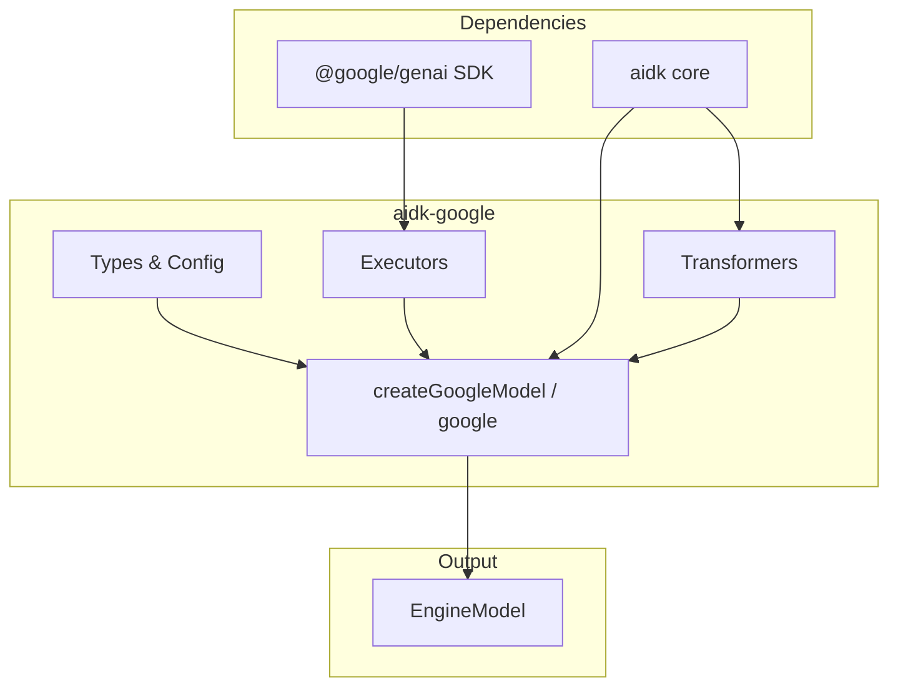
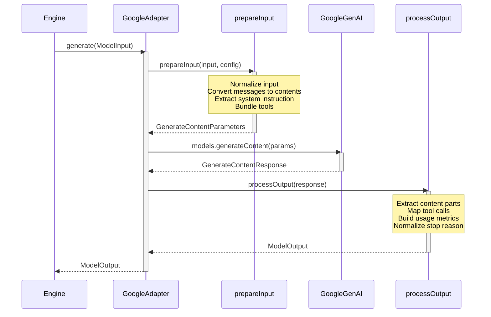
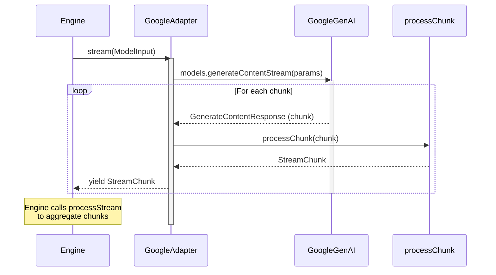

# aidk-google Architecture

> **Google Gemini model adapter for AIDK**

The `aidk-google` package provides an adapter that integrates Google's Gemini models with AIDK. It wraps the `@google/genai` SDK and transforms between AIDK's unified model interface and Google's API format.

---

## Table of Contents

1. [Overview](#overview)
2. [Module Structure](#module-structure)
3. [Core Concepts](#core-concepts)
4. [API Reference](#api-reference)
5. [Data Flow](#data-flow)
6. [Usage Examples](#usage-examples)
7. [Integration Points](#integration-points)

---

## Overview

### What This Package Does

The Google adapter provides:

- **Gemini Model Integration** - Connect to Google's Gemini models (gemini-2.5-flash, gemini-pro, etc.)
- **Vertex AI Support** - Use Google Cloud's Vertex AI platform for enterprise deployments
- **Streaming Support** - Full streaming generation with delta chunks
- **Tool Calling** - Native function calling support with Google's format
- **Content Transformation** - Convert AIDK content blocks to Google's parts format

### Why It Exists

Google's Gemini models have a unique API format that differs from other providers:

1. **Different message structure** - Uses `contents` with `parts` instead of simple messages
2. **Role mapping** - Uses `model` role instead of `assistant`
3. **System instructions** - Separate config field instead of inline messages
4. **Function declarations** - All tools must be bundled in a single declarations array

This adapter handles all these differences transparently.

### Design Principles

- **Factory function pattern** - Uses `createLanguageModel()` for clean adapter creation
- **Minimal dependencies** - Only depends on `aidk` core and `@google/genai` as peer
- **Provider passthrough** - Supports Google-specific options via `providerOptions.google`
- **Graceful fallbacks** - Handles unexpected content types with warnings

---

## Module Structure

```
packages/adapters/google/
├── src/
│   ├── google.ts       # Main adapter implementation
│   ├── types.ts        # Type definitions and module augmentation
│   └── index.ts        # Public exports
├── package.json
├── tsconfig.json
└── tsconfig.build.json
```



### File Overview

| File        | Size      | Purpose                                      |
| ----------- | --------- | -------------------------------------------- |
| `google.ts` | 643 lines | Adapter factory, transformers, and executors |
| `types.ts`  | 83 lines  | Configuration types and module augmentation  |
| `index.ts`  | 2 lines   | Re-exports                                   |

---

## Core Concepts

### 1. Google SDK Integration

The adapter uses `@google/genai` SDK (version 1.31.0+) which provides:

```
┌─────────────────────────────────────────────────────────────────┐
│                    @google/genai SDK                             │
├─────────────────────────────────────────────────────────────────┤
│                                                                 │
│  GoogleGenAI                                                    │
│  ├── models.generateContent(params)     → Non-streaming         │
│  └── models.generateContentStream(params) → Streaming           │
│                                                                 │
│  Authentication modes:                                          │
│  ├── API Key (default)                                          │
│  └── Vertex AI (Google Cloud)                                   │
│                                                                 │
└─────────────────────────────────────────────────────────────────┘
```

### 2. Configuration Options

The adapter supports multiple configuration modes:

```typescript
interface GoogleAdapterConfig {
  // Authentication
  apiKey?: string; // Google AI Studio API key
  vertexai?: boolean; // Enable Vertex AI mode
  project?: string; // GCP project ID (Vertex AI)
  location?: string; // GCP region (Vertex AI)

  // HTTP options
  timeout?: number; // Request timeout
  baseUrl?: string; // Custom endpoint

  // Google Auth (Vertex AI)
  googleAuthOptions?: {
    keyFilename?: string;
    credentials?: any;
    scopes?: string[];
    projectId?: string;
  };

  // Model defaults
  model?: string; // Default model (gemini-2.5-flash)
  client?: GoogleGenAI; // Pre-configured client
  providerOptions?: ProviderClientOptions;
}
```

### 3. Message Transformation

Google's API uses a different structure than AIDK's unified format:

```
┌─────────────────────────────────────────────────────────────────┐
│              AIDK Message → Google Content Transformation        │
├─────────────────────────────────────────────────────────────────┤
│                                                                 │
│  AIDK Message                    Google Content                 │
│  ┌───────────────────┐          ┌───────────────────┐          │
│  │ role: 'user'      │    →     │ role: 'user'      │          │
│  │ content: [        │          │ parts: [          │          │
│  │   { type: 'text', │          │   { text: '...' } │          │
│  │     text: '...' } │          │ ]                 │          │
│  │ ]                 │          └───────────────────┘          │
│  └───────────────────┘                                          │
│                                                                 │
│  ┌───────────────────┐          ┌───────────────────┐          │
│  │ role: 'assistant' │    →     │ role: 'model'     │          │
│  │ content: [...]    │          │ parts: [...]      │          │
│  └───────────────────┘          └───────────────────┘          │
│                                                                 │
│  ┌───────────────────┐          ┌─────────────────────────┐    │
│  │ role: 'system'    │    →     │ config.systemInstruction│    │
│  │ content: [...]    │          │   parts: [{ text }]     │    │
│  └───────────────────┘          └─────────────────────────┘    │
│                                                                 │
└─────────────────────────────────────────────────────────────────┘
```

### 4. Content Block Conversion

AIDK content blocks map to Google parts:

| AIDK Block Type  | Google Part Type       | Notes                         |
| ---------------- | ---------------------- | ----------------------------- |
| `text`           | `{ text }`             | Direct mapping                |
| `image` (URL)    | `{ fileData }`         | Uses `fileUri` and `mimeType` |
| `image` (base64) | `{ inlineData }`       | Uses `data` and `mimeType`    |
| `tool_use`       | `{ functionCall }`     | Maps `name` and `args`        |
| `tool_result`    | `{ functionResponse }` | Wraps content in `response`   |

### 5. Tool Declaration Format

Google requires all function declarations bundled together:

```
┌─────────────────────────────────────────────────────────────────┐
│                    Tool Format Transformation                    │
├─────────────────────────────────────────────────────────────────┤
│                                                                 │
│  AIDK Tools (array)              Google Tools (single object)   │
│  ┌─────────────────┐            ┌─────────────────────────────┐│
│  │ [{              │            │ config.tools: [{            ││
│  │   name: 'foo',  │     →      │   functionDeclarations: [   ││
│  │   parameters... │            │     { name: 'foo', ... },   ││
│  │ },              │            │     { name: 'bar', ... }    ││
│  │ {               │            │   ]                         ││
│  │   name: 'bar',  │            │ }]                          ││
│  │   parameters... │            └─────────────────────────────┘│
│  │ }]              │                                            │
│  └─────────────────┘                                            │
│                                                                 │
└─────────────────────────────────────────────────────────────────┘
```

### 6. Stop Reason Mapping

Google finish reasons are normalized to AIDK's `StopReason` enum:

```typescript
const STOP_REASON_MAP = {
  stop: StopReason.STOP,
  length: StopReason.MAX_TOKENS,
  content_filter: StopReason.CONTENT_FILTER,
  tool_calls: StopReason.TOOL_USE,
  function_call: StopReason.FUNCTION_CALL,
};
```

---

## API Reference

### google.ts

#### `createGoogleModel(config?)`

Factory function that creates a Google Gemini model adapter:

```typescript
function createGoogleModel(config?: GoogleAdapterConfig): GoogleAdapter;

// GoogleAdapter is an alias for:
type GoogleAdapter = EngineModel<ModelInput, ModelOutput>;
```

Returns an `EngineModel` with:

- `metadata` - Model capabilities and transformation config
- `generate` - Procedure for non-streaming generation
- `stream` - Procedure for streaming generation
- `fromEngineState` - Convert COMInput to ModelInput (provided by `createLanguageModel`)
- `toEngineState` - Convert ModelOutput to EngineResponse (provided by `createLanguageModel`)

#### `google(config?)`

Alias for `createGoogleModel` for convenience:

```typescript
const google: (config?: GoogleAdapterConfig) => GoogleAdapter;
```

#### Internal Functions

| Function                     | Purpose                                          |
| ---------------------------- | ------------------------------------------------ |
| `buildClientOptions`         | Build GoogleGenAI constructor options            |
| `prepareInput`               | Convert ModelInput to GenerateContentParameters  |
| `processOutput`              | Convert GenerateContentResponse to ModelOutput   |
| `processChunk`               | Convert streaming chunk to StreamChunk           |
| `processStreamChunks`        | Aggregate chunks into final ModelOutput          |
| `convertBlocksToGoogleParts` | Convert ContentBlocks to Google parts            |
| `mapToolDefinition`          | Convert AIDK tool to Google function declaration |
| `mapGoogleFinishReason`      | Normalize finish reason to StopReason            |
| `execute`                    | Call non-streaming API                           |
| `executeStream`              | Call streaming API (async generator)             |

### types.ts

#### `GoogleAdapterConfig`

Main configuration interface for the adapter.

#### `GoogleClientOptions`

Google-specific client initialization options (Vertex AI, auth, etc.).

#### `GoogleGenerationOptions`

Google-specific generation parameters (extends `GenerateContentParameters`).

#### `GoogleToolOptions`

Google-specific tool/function declaration options.

#### Module Augmentation

The types file extends AIDK's provider option interfaces:

```typescript
declare module "aidk" {
  interface ProviderClientOptions {
    google?: GoogleClientOptions;
  }
  interface ProviderGenerationOptions {
    google?: GoogleGenerationOptions;
  }
  interface ProviderToolOptions {
    google?: GoogleToolOptions;
  }
}
```

---

## Data Flow

### Non-Streaming Generation



### Streaming Generation



### Content Transformation Flow

```
┌─────────────────────────────────────────────────────────────────┐
│                    Input Transformation                          │
├─────────────────────────────────────────────────────────────────┤
│                                                                 │
│  ModelInput                                                     │
│  ├── messages[]                                                 │
│  │   ├── system → config.systemInstruction                      │
│  │   ├── user/assistant → contents[]                            │
│  │   └── content blocks → parts[]                               │
│  ├── tools[] → config.tools[0].functionDeclarations[]           │
│  ├── temperature → config.temperature                           │
│  ├── maxTokens → config.maxOutputTokens                         │
│  └── providerOptions.google → merged into config                │
│                                                                 │
│                          ↓                                      │
│                                                                 │
│  GenerateContentParameters                                      │
│  ├── model: 'gemini-2.5-flash'                                  │
│  ├── contents: [{ role, parts }]                                │
│  └── config: { systemInstruction, tools, temperature, ... }    │
│                                                                 │
└─────────────────────────────────────────────────────────────────┘

┌─────────────────────────────────────────────────────────────────┐
│                    Output Transformation                         │
├─────────────────────────────────────────────────────────────────┤
│                                                                 │
│  GenerateContentResponse                                        │
│  ├── candidates[0].content.parts[]                              │
│  │   ├── { text } → ContentBlock { type: 'text' }               │
│  │   └── { functionCall } → ContentBlock { type: 'tool_use' }   │
│  ├── candidates[0].finishReason → stopReason                    │
│  ├── usageMetadata → usage                                      │
│  └── modelVersion → model                                       │
│                                                                 │
│                          ↓                                      │
│                                                                 │
│  ModelOutput                                                    │
│  ├── message: { role: 'assistant', content: ContentBlock[] }    │
│  ├── toolCalls: [{ id, name, input }]                           │
│  ├── stopReason: StopReason                                     │
│  ├── usage: { inputTokens, outputTokens, ... }                  │
│  └── raw: GenerateContentResponse                               │
│                                                                 │
└─────────────────────────────────────────────────────────────────┘
```

---

## Usage Examples

### Basic Usage

```typescript
import { google } from "aidk-google";
import { createEngine } from "aidk";

// Create adapter with API key
const model = google({
  apiKey: process.env.GOOGLE_API_KEY,
  model: "gemini-2.5-flash",
});

// Use with engine
const engine = createEngine({ model });
const result = await engine.run("Explain quantum computing");
```

### Vertex AI Mode

```typescript
import { google } from "aidk-google";

const model = google({
  vertexai: true,
  project: "my-gcp-project",
  location: "us-central1",
});
```

### With Tool Calling

```typescript
import { google } from "aidk-google";
import { createEngine, defineTool } from "aidk";
import { z } from "zod";

const calculator = defineTool({
  name: "calculator",
  description: "Perform calculations",
  parameters: z.object({
    expression: z.string().describe("Math expression"),
  }),
  handler: async ({ expression }) => {
    return { result: eval(expression) };
  },
});

const model = google({
  model: "gemini-2.5-flash",
});

const engine = createEngine({
  model,
  tools: [calculator],
});

const result = await engine.run("What is 42 * 17?");
```

### Streaming Response

```typescript
import { google } from "aidk-google";
import { createEngine } from "aidk";

const model = google({ model: "gemini-2.5-flash" });
const engine = createEngine({ model });

for await (const chunk of engine.stream("Write a poem about coding")) {
  if (chunk.type === "content_delta") {
    process.stdout.write(chunk.delta);
  }
}
```

### Provider-Specific Options

```typescript
import { google } from "aidk-google";

const model = google({
  model: "gemini-2.5-flash",
  providerOptions: {
    google: {
      // Any GenerateContentConfig options
      safetySettings: [
        {
          category: "HARM_CATEGORY_HARASSMENT",
          threshold: "BLOCK_ONLY_HIGH",
        },
      ],
    },
  },
});
```

### Pre-configured Client

```typescript
import { GoogleGenAI } from "@google/genai";
import { google } from "aidk-google";

// Create client with custom configuration
const client = new GoogleGenAI({
  apiKey: process.env.GOOGLE_API_KEY,
  httpOptions: {
    timeout: 60000,
    baseUrl: "https://custom-endpoint.example.com",
  },
});

const model = google({
  client,
  model: "gemini-2.5-flash",
});
```

---

## Integration Points

### How This Adapter Integrates with AIDK

```
┌─────────────────────────────────────────────────────────────────┐
│                     AIDK Integration                             │
├─────────────────────────────────────────────────────────────────┤
│                                                                 │
│  Engine                                                         │
│    │                                                            │
│    ├── Uses EngineModel interface                               │
│    │   └── GoogleAdapter implements EngineModel                 │
│    │                                                            │
│    ├── Calls model.generate(ModelInput)                         │
│    │   └── Adapter transforms → Google API → transforms back    │
│    │                                                            │
│    └── Calls model.stream(ModelInput)                           │
│        └── Adapter yields StreamChunk via async iterator        │
│                                                                 │
│  Message Transformation                                         │
│    │                                                            │
│    └── metadata.capabilities.messageTransformation              │
│        ├── preferredRenderer: 'markdown'                        │
│        ├── roleMapping: { event: 'user', ephemeral: 'user' }    │
│        ├── delimiters: { event: '[Event]', ephemeral: '[Context]' }│
│        └── ephemeralPosition: 'flow'                            │
│                                                                 │
└─────────────────────────────────────────────────────────────────┘
```

### Dependencies

| Package         | Type          | Purpose                         |
| --------------- | ------------- | ------------------------------- |
| `aidk`          | dependency    | Core types, createLanguageModel |
| `@google/genai` | peer (>=1.31) | Google AI SDK                   |

### Extension Points

1. **Provider Options** - Pass Google-specific config via `providerOptions.google`
2. **Custom Client** - Provide pre-configured `GoogleGenAI` instance
3. **Model Override** - Set default model or override per-request
4. **Tool Options** - Use `providerOptions.google` on tool definitions

---

## Summary

The `aidk-google` adapter provides:

- **`createGoogleModel()` / `google()`** - Factory functions for Gemini model creation
- **Vertex AI support** - Enterprise Google Cloud integration
- **Full streaming** - Async iterator-based streaming with delta chunks
- **Tool calling** - Native function calling with bundled declarations
- **Content transformation** - Handles text, images, and tool use/results
- **Provider passthrough** - Access to all Google-specific options

This adapter enables AIDK to seamlessly integrate with Google's Gemini models while maintaining the unified model interface that AIDK consumers expect.
