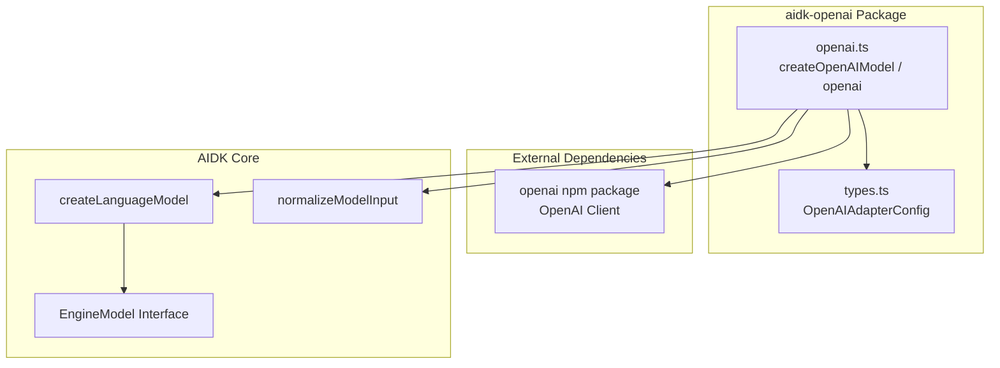
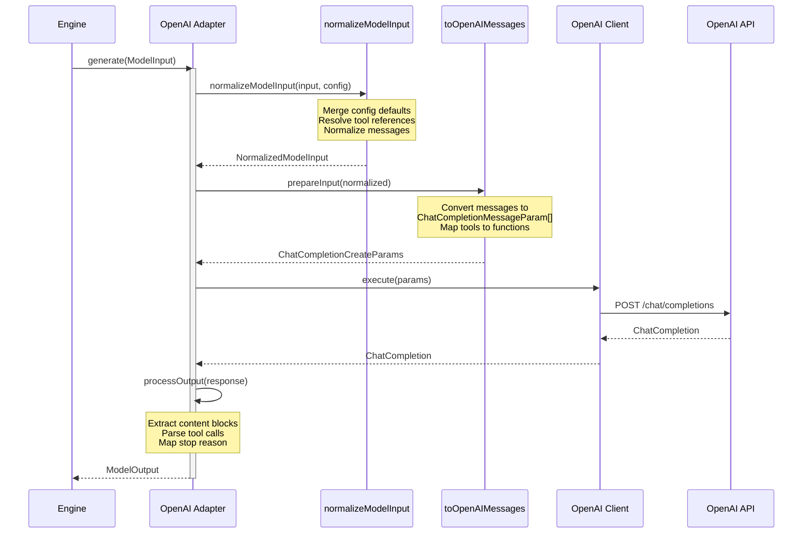
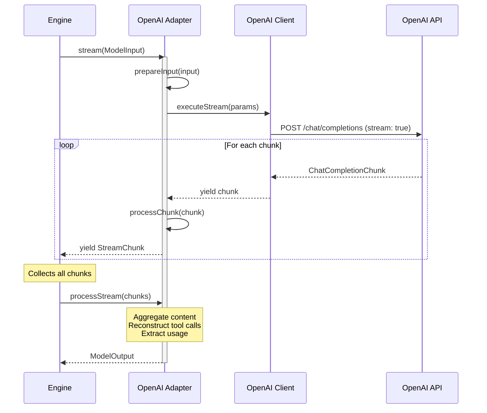

# aidk-openai Architecture

> **Direct OpenAI API adapter for AIDK**

The aidk-openai package provides a direct integration with the OpenAI API, enabling AIDK applications to use OpenAI models (GPT-4, GPT-4o, o1, etc.) without requiring intermediary SDKs.

---

## Table of Contents

1. [Overview](#overview)
2. [Module Structure](#module-structure)
3. [Core Concepts](#core-concepts)
4. [API Reference](#api-reference)
5. [Data Flow](#data-flow)
6. [Usage Examples](#usage-examples)
7. [Configuration](#configuration)

---

## Overview

### What This Package Does

The aidk-openai adapter provides:

- **Direct OpenAI Integration** - Uses the official `openai` npm package directly
- **Message Transformation** - Converts AIDK's unified message format to OpenAI's ChatCompletionMessageParam
- **Tool Calling Support** - Full support for OpenAI function calling with tool definitions
- **Streaming Support** - Real-time token streaming with chunk aggregation
- **Provider Options** - Passthrough for OpenAI-specific configuration
- **Model-Aware Transformation** - Intelligent message handling based on model capabilities

### Why It Exists

While aidk-ai-sdk provides OpenAI access through Vercel's AI SDK, this adapter:

1. **Direct API access** - No intermediary SDK means fewer dependencies and more control
2. **Full OpenAI features** - Access to all OpenAI-specific options without abstraction limitations
3. **Provider-specific optimization** - Message transformation tuned for OpenAI's expected formats
4. **Simpler dependency tree** - Only requires the official `openai` package

### Design Principles

- **Minimal abstraction** - Thin wrapper that preserves OpenAI API semantics
- **Type safety** - Full TypeScript support with OpenAI's types
- **Configuration passthrough** - Provider options flow directly to the OpenAI client
- **Functional architecture** - Uses `createLanguageModel()` factory pattern

---

## Module Structure

```
openai/
├── src/
│   ├── openai.ts     # Main adapter implementation
│   ├── types.ts      # Configuration types and stop reason mapping
│   └── index.ts      # Public exports
├── package.json
└── ARCHITECTURE.md
```



### File Overview

| File        | Size      | Purpose                                  |
| ----------- | --------- | ---------------------------------------- |
| `openai.ts` | 621 lines | Adapter factory, transformers, executors |
| `types.ts`  | 75 lines  | Configuration types, stop reason mapping |
| `index.ts`  | 2 lines   | Public exports                           |

---

## Core Concepts

### 1. Adapter Factory Pattern

The adapter uses AIDK's `createLanguageModel()` factory to construct an `EngineModel`:

```
┌─────────────────────────────────────────────────────────────────┐
│                    createOpenAIModel(config)                     │
├─────────────────────────────────────────────────────────────────┤
│                                                                 │
│  1. Create or use provided OpenAI client                        │
│     ┌─────────────────────────────────────────┐                 │
│     │ new OpenAI({                            │                 │
│     │   apiKey, baseURL, organization, ...    │                 │
│     │ })                                      │                 │
│     └─────────────────────────────────────────┘                 │
│                                                                 │
│  2. Configure createLanguageModel() with:                       │
│     ├── metadata (id, provider, capabilities)                   │
│     ├── transformers (prepareInput, processOutput, ...)         │
│     └── executors (execute, executeStream)                      │
│                                                                 │
│  3. Return EngineModel<ModelInput, ModelOutput>                 │
│                                                                 │
└─────────────────────────────────────────────────────────────────┘
```

### 2. Message Transformation Pipeline

Messages flow through a transformation pipeline that handles AIDK's rich content types:

```
┌─────────────────────────────────────────────────────────────────┐
│                  Message Transformation                          │
├─────────────────────────────────────────────────────────────────┤
│                                                                 │
│  AIDK Message                      OpenAI Message(s)            │
│  ┌─────────────────┐              ┌─────────────────┐           │
│  │ role: 'user'    │              │ role: 'user'    │           │
│  │ content: [      │    ──▶       │ content: [      │           │
│  │   { type: text }│              │   { type: text }│           │
│  │   { type: image}│              │   { type:       │           │
│  │ ]               │              │     image_url } │           │
│  └─────────────────┘              │ ]               │           │
│                                   └─────────────────┘           │
│                                                                 │
│  ┌─────────────────┐              ┌─────────────────┐           │
│  │ role: 'assistant│              │ role: 'assistant│           │
│  │ content: [      │    ──▶       │ content: [text] │           │
│  │   { type:       │              │ tool_calls: [   │           │
│  │     tool_use }  │              │   { id, type,   │           │
│  │ ]               │              │     function }  │           │
│  └─────────────────┘              │ ]               │           │
│                                   └─────────────────┘           │
│                                                                 │
│  ┌─────────────────┐              ┌─────────────────┐           │
│  │ content: [      │    ──▶       │ role: 'tool'    │ (one per  │
│  │   { type:       │              │ tool_call_id    │  result)  │
│  │     tool_result}│              │ content: '...'  │           │
│  │ ]               │              └─────────────────┘           │
│  └─────────────────┘                                            │
│                                                                 │
└─────────────────────────────────────────────────────────────────┘
```

**Key transformations:**

| AIDK Block Type  | OpenAI Format                                           |
| ---------------- | ------------------------------------------------------- |
| `text`           | `{ type: 'text', text: '...' }`                         |
| `image` (URL)    | `{ type: 'image_url', image_url: { url } }`             |
| `image` (base64) | `{ type: 'image_url', image_url: { url: 'data:...' } }` |
| `tool_use`       | `tool_calls[]` on assistant message                     |
| `tool_result`    | Separate `role: 'tool'` message per result              |

### 3. Tool Definition Mapping

Tools are converted from AIDK's `ToolDefinition` to OpenAI's function format:

```
┌─────────────────────────────────────────────────────────────────┐
│                    Tool Definition Mapping                       │
├─────────────────────────────────────────────────────────────────┤
│                                                                 │
│  AIDK ToolDefinition               OpenAI ChatCompletionTool    │
│  ┌─────────────────────┐          ┌─────────────────────┐       │
│  │ name: 'search'      │          │ type: 'function'    │       │
│  │ description: '...'  │   ──▶    │ function: {         │       │
│  │ parameters: {...}   │          │   name: 'search'    │       │
│  │ providerOptions: {  │          │   description: '...'│       │
│  │   openai: {...}     │          │   parameters: {...} │       │
│  │ }                   │          │ }                   │       │
│  └─────────────────────┘          └─────────────────────┘       │
│                                                                 │
│  Provider options are merged into the OpenAI tool definition    │
│                                                                 │
└─────────────────────────────────────────────────────────────────┘
```

### 4. Model-Aware Message Transformation

The adapter provides intelligent message transformation based on model capabilities:

```typescript
messageTransformation: (modelId: string, provider?: string) => {
  const isGPT4 = modelId.includes("gpt-4") || modelId.includes("o1");
  const supportsDeveloper = isGPT4; // GPT-4 and newer support developer role

  return {
    preferredRenderer: "markdown",
    roleMapping: {
      event: supportsDeveloper ? "developer" : "user",
      ephemeral: supportsDeveloper ? "developer" : "user",
    },
    delimiters: {
      useDelimiters: !supportsDeveloper,
      event: "[Event]",
      ephemeral: "[Context]",
    },
    ephemeralPosition: "flow",
  };
};
```

### 5. Streaming Architecture

Streaming uses async generators for efficient chunk processing:

```
┌─────────────────────────────────────────────────────────────────┐
│                    Streaming Flow                                │
├─────────────────────────────────────────────────────────────────┤
│                                                                 │
│  executeStream()                                                │
│       │                                                         │
│       ▼                                                         │
│  client.chat.completions.create({                               │
│    stream: true,                                                │
│    stream_options: { include_usage: true }                      │
│  })                                                             │
│       │                                                         │
│       ▼                                                         │
│  ┌─────────────────────────────────────────┐                    │
│  │ for await (chunk of stream)             │                    │
│  │   └── yield chunk (ChatCompletionChunk) │                    │
│  └─────────────────────────────────────────┘                    │
│       │                                                         │
│       ▼                                                         │
│  processChunk() - converts each chunk to StreamChunk            │
│       │                                                         │
│       ▼                                                         │
│  processStreamChunks() - aggregates all chunks into ModelOutput │
│                                                                 │
└─────────────────────────────────────────────────────────────────┘
```

**Chunk aggregation handles:**

- Content accumulation (text deltas)
- Tool call reconstruction (arguments arrive incrementally)
- Usage extraction (from final chunk with `include_usage: true`)
- Stop reason detection

---

## API Reference

### openai.ts

#### `createOpenAIModel(config?)`

Factory function for creating an OpenAI model adapter:

```typescript
function createOpenAIModel(config?: OpenAIAdapterConfig): OpenAIAdapter;
```

**Parameters:**

| Parameter                | Type                     | Description                                             |
| ------------------------ | ------------------------ | ------------------------------------------------------- |
| `config.model`           | `string`                 | Default model (e.g., 'gpt-4o', 'gpt-4-turbo')           |
| `config.apiKey`          | `string`                 | OpenAI API key (defaults to `OPENAI_API_KEY` env)       |
| `config.baseURL`         | `string`                 | Custom base URL (defaults to `OPENAI_BASE_URL` env)     |
| `config.organization`    | `string`                 | Organization ID (defaults to `OPENAI_ORGANIZATION` env) |
| `config.client`          | `OpenAI`                 | Pre-configured OpenAI client instance                   |
| `config.headers`         | `Record<string, string>` | Custom HTTP headers                                     |
| `config.timeout`         | `number`                 | Request timeout in milliseconds                         |
| `config.maxRetries`      | `number`                 | Maximum retry attempts                                  |
| `config.providerOptions` | `ProviderClientOptions`  | Additional OpenAI client options                        |

**Returns:** `EngineModel<ModelInput, ModelOutput>`

#### `openai(config?)`

Alias for `createOpenAIModel()`:

```typescript
function openai(config?: OpenAIAdapterConfig): OpenAIAdapter;
```

### types.ts

#### `OpenAIAdapterConfig`

Configuration interface extending OpenAI's `ClientOptions`:

```typescript
interface OpenAIAdapterConfig extends ClientOptions {
  model?: string;
  apiKey?: string;
  baseURL?: string;
  organization?: string;
  project?: string;
  headers?: Record<string, string>;
  timeout?: number;
  maxRetries?: number;
  client?: OpenAI;
  providerOptions?: ProviderClientOptions;
}
```

#### `OpenAIGenerationOptions`

Provider-specific generation options:

```typescript
type OpenAIGenerationOptions = Partial<ChatCompletionCreateParams> & {
  [key: string]: unknown;
};
```

#### `OpenAIToolOptions`

Provider-specific tool configuration:

```typescript
interface OpenAIToolOptions {
  type?: "function" | "code_interpreter" | "file_search";
  function?: {
    name?: string;
    description?: string;
    parameters?: Record<string, unknown>;
  };
}
```

#### `STOP_REASON_MAP`

Maps OpenAI finish reasons to AIDK's `StopReason`:

| OpenAI Reason      | AIDK StopReason             |
| ------------------ | --------------------------- |
| `'stop'`           | `StopReason.STOP`           |
| `'length'`         | `StopReason.MAX_TOKENS`     |
| `'content_filter'` | `StopReason.CONTENT_FILTER` |
| `'tool_calls'`     | `StopReason.TOOL_USE`       |
| `'function_call'`  | `StopReason.FUNCTION_CALL`  |

### Module Augmentation

The adapter extends AIDK's provider option interfaces:

```typescript
declare module "aidk" {
  interface ProviderClientOptions {
    openai?: OpenAIAdapterConfig;
  }

  interface ProviderGenerationOptions {
    openai?: OpenAIGenerationOptions;
  }

  interface ProviderToolOptions {
    openai?: OpenAIToolOptions;
  }
}
```

This allows type-safe provider-specific options in engine configuration.

---

## Data Flow

### Non-Streaming Request Flow



### Streaming Request Flow



### Tool Call Reconstruction

During streaming, tool calls arrive incrementally and must be reconstructed:

```
┌─────────────────────────────────────────────────────────────────┐
│                Tool Call Streaming Reconstruction                │
├─────────────────────────────────────────────────────────────────┤
│                                                                 │
│  Chunk 1: { delta: { tool_calls: [{ index: 0, id: 'call_abc',  │
│                      function: { name: 'search' } }] } }        │
│                           │                                     │
│                           ▼                                     │
│  toolCallsMap: { 0: { id: 'call_abc', function: { name: 'search'│
│                                        arguments: '' } } }      │
│                                                                 │
│  Chunk 2: { delta: { tool_calls: [{ index: 0,                   │
│                      function: { arguments: '{"query":' } }] } }│
│                           │                                     │
│                           ▼                                     │
│  toolCallsMap: { 0: { id: 'call_abc', function: { name: 'search'│
│                            arguments: '{"query":' } } }         │
│                                                                 │
│  Chunk 3: { delta: { tool_calls: [{ index: 0,                   │
│                      function: { arguments: '"test"}' } }] } }  │
│                           │                                     │
│                           ▼                                     │
│  toolCallsMap: { 0: { id: 'call_abc', function: { name: 'search'│
│                            arguments: '{"query":"test"}' } } }  │
│                                                                 │
│  Final: Parse JSON arguments for ModelOutput                    │
│                                                                 │
└─────────────────────────────────────────────────────────────────┘
```

---

## Usage Examples

### Basic Usage

```typescript
import { openai } from "aidk-openai";
import { createEngine } from "aidk";

// Create adapter with defaults (uses OPENAI_API_KEY env)
const model = openai({
  model: "gpt-4o",
});

// Use with AIDK engine
const engine = createEngine({ model });
const response = await engine.run({
  messages: [{ role: "user", content: [{ type: "text", text: "Hello!" }] }],
});
```

### With Custom Configuration

```typescript
import { createOpenAIModel } from "aidk-openai";

const model = createOpenAIModel({
  model: "gpt-4-turbo",
  apiKey: process.env.MY_OPENAI_KEY,
  organization: "org-abc123",
  baseURL: "https://my-proxy.example.com/v1",
  timeout: 60000,
  maxRetries: 3,
  headers: {
    "X-Custom-Header": "value",
  },
});
```

### With Pre-configured Client

```typescript
import { OpenAI } from "openai";
import { openai } from "aidk-openai";

// Create your own OpenAI client with full control
const client = new OpenAI({
  apiKey: process.env.OPENAI_API_KEY,
  baseURL: process.env.OPENAI_BASE_URL,
  defaultHeaders: { "X-Custom": "header" },
});

const model = openai({
  model: "gpt-4o",
  client, // Use pre-configured client
});
```

### With Provider-Specific Options

```typescript
import { openai } from "aidk-openai";
import { createEngine } from "aidk";

const model = openai({ model: "gpt-4o" });
const engine = createEngine({ model });

// Pass OpenAI-specific options in the run call
const response = await engine.run({
  messages: [
    { role: "user", content: [{ type: "text", text: "Be creative!" }] },
  ],
  providerOptions: {
    openai: {
      seed: 42,
      response_format: { type: "json_object" },
      logprobs: true,
      top_logprobs: 3,
    },
  },
});
```

### With Tools

```typescript
import { openai } from "aidk-openai";
import { createEngine, Tool } from "aidk";

const searchTool = new Tool({
  name: "search",
  description: "Search the web",
  parameters: {
    type: "object",
    properties: {
      query: { type: "string", description: "Search query" },
    },
    required: ["query"],
  },
  run: async ({ query }) => {
    return { results: [`Result for: ${query}`] };
  },
});

const model = openai({ model: "gpt-4o" });
const engine = createEngine({
  model,
  tools: [searchTool],
});

// The model will use tools automatically
const response = await engine.run({
  messages: [
    { role: "user", content: [{ type: "text", text: "Search for AIDK" }] },
  ],
});
```

### Streaming

```typescript
import { openai } from "aidk-openai";
import { createEngine } from "aidk";

const model = openai({ model: "gpt-4o" });
const engine = createEngine({ model });

const stream = await engine.stream({
  messages: [
    { role: "user", content: [{ type: "text", text: "Tell me a story" }] },
  ],
});

for await (const chunk of stream) {
  if (chunk.type === "content_delta") {
    process.stdout.write(chunk.delta);
  }
}
```

---

## Configuration

### Environment Variables

The adapter respects standard OpenAI environment variables:

| Variable              | Description                            |
| --------------------- | -------------------------------------- |
| `OPENAI_API_KEY`      | Default API key                        |
| `OPENAI_BASE_URL`     | Custom base URL (for proxies or Azure) |
| `OPENAI_ORGANIZATION` | Organization ID                        |

### Configuration Precedence

Configuration is resolved in the following order (later overrides earlier):

1. Environment variables (`OPENAI_API_KEY`, etc.)
2. Adapter config (`createOpenAIModel({ apiKey: '...' })`)
3. Engine config (`createEngine({ model, temperature: 0.7 })`)
4. Per-request options (`engine.run({ providerOptions: { openai: {...} } })`)

### Supported Models

The adapter works with any OpenAI chat completion model:

- **GPT-4 family**: `gpt-4`, `gpt-4-turbo`, `gpt-4o`, `gpt-4o-mini`
- **GPT-3.5 family**: `gpt-3.5-turbo`
- **o1 family**: `o1-preview`, `o1-mini`
- **Custom/fine-tuned models**: Any model accessible via the OpenAI API

---

## Summary

The aidk-openai adapter provides:

- **`createOpenAIModel()` / `openai()`** - Factory functions for creating OpenAI adapters
- **Direct API integration** - Uses the official `openai` package
- **Full message transformation** - Text, images, tool calls, and tool results
- **Streaming support** - Efficient chunk-based streaming with aggregation
- **Provider options passthrough** - Type-safe access to all OpenAI features
- **Model-aware behavior** - Intelligent defaults based on model capabilities

This adapter enables AIDK applications to leverage OpenAI's full capabilities while maintaining the unified AIDK interface for model interactions.
