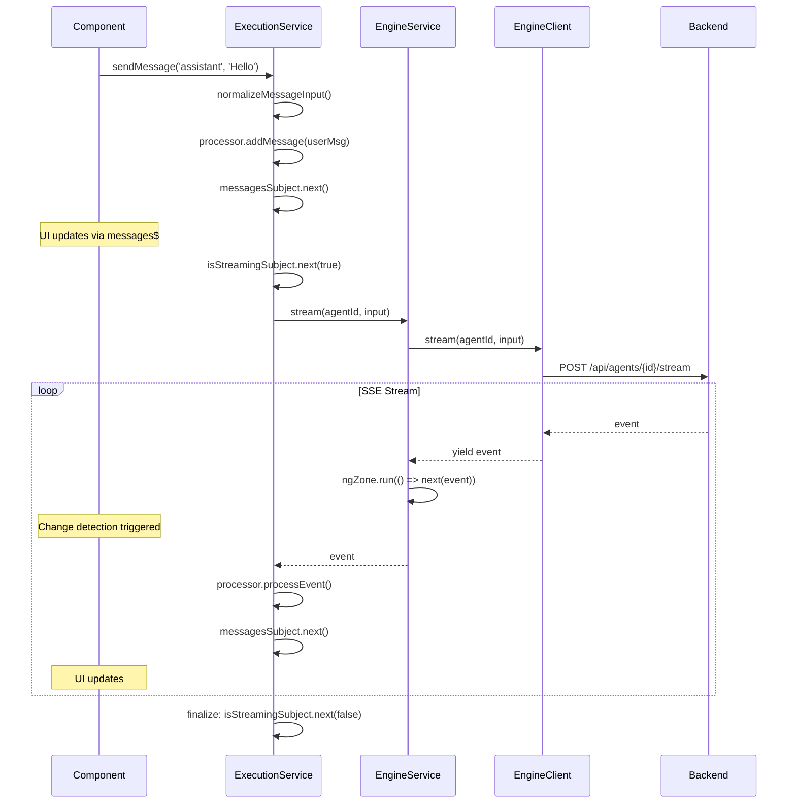
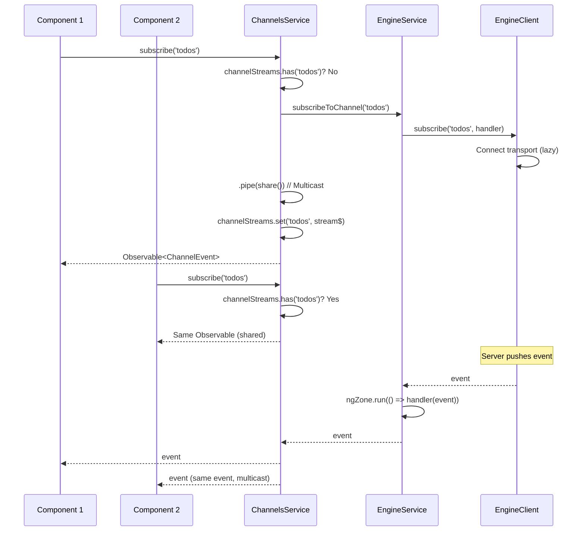

# aidk-angular Architecture

> **Angular services and components for AIDK frontends**

The Angular package provides a complete Angular integration for AIDK, offering RxJS-based services, UI components for rendering AI content, and seamless Zone.js integration for automatic change detection.

---

## Table of Contents

1. [Overview](#overview)
2. [Module Structure](#module-structure)
3. [Core Concepts](#core-concepts)
4. [API Reference](#api-reference)
5. [Data Flow](#data-flow)
6. [Usage Examples](#usage-examples)
7. [Integration Points](#integration-points)

---

## Overview

### What This Package Does

The Angular package provides:

- **Angular Services** - RxJS-wrapped services for agent execution, channels, and client management
- **UI Components** - Standalone components for rendering AI content blocks (text, code, images, tool calls)
- **Zone.js Integration** - Automatic change detection triggering for async operations
- **Module/Provider System** - Both NgModule and standalone provider patterns for configuration
- **Lifecycle Management** - Automatic cleanup on service/component destruction

### Why It Exists

Angular applications need to:

1. **Use RxJS patterns** - Observables instead of raw Promises/AsyncGenerators
2. **Trigger change detection** - Zone.js must be notified of async updates
3. **Manage subscriptions** - Automatic cleanup via Angular lifecycle hooks
4. **Render AI content** - Display markdown, code, images, and tool calls
5. **Share channel connections** - Multicast channel subscriptions across components

### Design Principles

- **RxJS-first** - All async operations return Observables
- **Zone.js aware** - All callbacks run within `NgZone.run()`
- **Standalone components** - Modern Angular patterns, no NgModule required for components
- **Layered architecture** - Services wrap `aidk-client`, components consume services
- **Automatic cleanup** - `takeUntil(destroy$)` pattern for all subscriptions

---

## Module Structure

```
┌─────────────────────────────────────────────────────────────────────────────┐
│                           Application Layer                                  │
│                    (Your Angular Components)                                 │
└─────────────────────────────────────────────────────────────────────────────┘
                                    │
              ┌─────────────────────┼─────────────────────┐
              ▼                     ▼                     ▼
┌──────────────────────┐ ┌───────────────────┐ ┌───────────────────────────┐
│   ExecutionService   │ │  ChannelsService  │ │   Content Components      │
│  Stream processing   │ │  Pub/sub channels │ │  ContentBlockComponent    │
│  Message accumulation│ │  Shared streams   │ │  TextBlockComponent       │
│  Thread management   │ │                   │ │  ToolUseBlockComponent    │
└──────────────────────┘ └───────────────────┘ │  (+ more...)              │
              │                     │          └───────────────────────────┘
              └─────────────────────┘
                          │
                          ▼
┌─────────────────────────────────────────────────────────────────────────────┐
│                            EngineService                                     │
│  ┌─────────────────┐  ┌─────────────────┐  ┌─────────────────────────────┐  │
│  │  execute()      │  │  stream()       │  │  subscribeToChannel()       │  │
│  │  Observable     │  │  Observable     │  │  Observable                 │  │
│  └─────────────────┘  └─────────────────┘  └─────────────────────────────┘  │
│  ┌─────────────────┐  ┌─────────────────┐  ┌─────────────────────────────┐  │
│  │  publish()      │  │  getExecutions()│  │  updateConfig()             │  │
│  │  Observable     │  │  Observable     │  │  Zone.js aware              │  │
│  └─────────────────┘  └─────────────────┘  └─────────────────────────────┘  │
└─────────────────────────────────────────────────────────────────────────────┘
                                    │
                                    ▼
┌─────────────────────────────────────────────────────────────────────────────┐
│                           aidk-client                                        │
│                    (EngineClient, SSETransport)                              │
└─────────────────────────────────────────────────────────────────────────────┘
```

### File Overview

| File                                    | Size      | Purpose                                           |
| --------------------------------------- | --------- | ------------------------------------------------- |
| `engine.service.ts`                     | 163 lines | Core service wrapping EngineClient                |
| `execution.service.ts`                  | 153 lines | Agent execution with message accumulation         |
| `channels.service.ts`                   | 74 lines  | Shared channel subscriptions                      |
| `engine.module.ts`                      | 86 lines  | NgModule and standalone providers                 |
| `index.ts`                              | 60 lines  | Public API exports                                |
| `blocks/content-block.component.ts`     | 91 lines  | Router for content block types                    |
| `blocks/text-block.component.ts`        | 73 lines  | Text rendering (plain text default, customizable) |
| `blocks/tool-use-block.component.ts`    | 31 lines  | Tool call display                                 |
| `blocks/tool-result-block.component.ts` | 28 lines  | Tool result display                               |
| `blocks/reasoning-block.component.ts`   | 37 lines  | Collapsible reasoning display                     |
| `blocks/image-block.component.ts`       | 33 lines  | Image rendering (URL/base64)                      |
| `blocks/code-block.component.ts`        | 24 lines  | Code block with language label                    |
| `blocks/placeholder-block.component.ts` | 17 lines  | Fallback for unknown types                        |
| `markdown.css`                          | 202 lines | Optional markdown styling                         |

---

## Core Concepts

### 1. EngineService

The core service that wraps `EngineClient` with RxJS and Zone.js integration:

```
┌────────────────────────────────────────────────────────────────────────────┐
│                            EngineService                                    │
├────────────────────────────────────────────────────────────────────────────┤
│                                                                             │
│   Lifecycle:                                                                │
│   ┌──────────────────────────────────────────────────────────────────────┐ │
│   │  constructor(NgZone, ENGINE_CONFIG)                                  │ │
│   │     └──▶ createEngineClient(config)                                  │ │
│   │                                                                       │ │
│   │  ngOnDestroy()                                                        │ │
│   │     └──▶ destroy$.next() ──▶ client.dispose()                        │ │
│   └──────────────────────────────────────────────────────────────────────┘ │
│                                                                             │
│   Zone.js Integration:                                                      │
│   ┌──────────────────────────────────────────────────────────────────────┐ │
│   │  runInZone<T>(fn: () => T): T                                        │ │
│   │     └──▶ ngZone.run(fn)  // Triggers change detection                │ │
│   │                                                                       │ │
│   │  All callbacks (next, error, complete) wrapped in runInZone()        │ │
│   └──────────────────────────────────────────────────────────────────────┘ │
│                                                                             │
│   Cleanup Pattern:                                                          │
│   ┌──────────────────────────────────────────────────────────────────────┐ │
│   │  private destroy$ = new Subject<void>();                             │ │
│   │                                                                       │ │
│   │  .pipe(takeUntil(this.destroy$))  // On all observables              │ │
│   └──────────────────────────────────────────────────────────────────────┘ │
│                                                                             │
└────────────────────────────────────────────────────────────────────────────┘
```

### 2. ExecutionService

High-level execution management with BehaviorSubjects for reactive state:

```
┌────────────────────────────────────────────────────────────────────────────┐
│                          ExecutionService                                   │
├────────────────────────────────────────────────────────────────────────────┤
│                                                                             │
│   State (BehaviorSubjects):                                                 │
│   ┌──────────────────────────────────────────────────────────────────────┐ │
│   │  messagesSubject    ──▶  messages$     // Message[]                  │ │
│   │  isStreamingSubject ──▶  isStreaming$  // boolean                    │ │
│   │  threadIdSubject    ──▶  threadId$     // string | null              │ │
│   │  errorSubject       ──▶  error$        // Error | null               │ │
│   └──────────────────────────────────────────────────────────────────────┘ │
│                                                                             │
│   StreamProcessor (from aidk-client):                                       │
│   ┌──────────────────────────────────────────────────────────────────────┐ │
│   │  Framework-agnostic event processing                                 │ │
│   │  ──▶ processEvent() accumulates messages                             │ │
│   │  ──▶ Callbacks update BehaviorSubjects                               │ │
│   └──────────────────────────────────────────────────────────────────────┘ │
│                                                                             │
│   sendMessage() Flow:                                                       │
│   ┌──────────────────────────────────────────────────────────────────────┐ │
│   │  1. normalizeMessageInput(input)     // String → Message[]           │ │
│   │  2. processor.addMessage(userMsg)    // Display immediately          │ │
│   │  3. createMessage('assistant', [])   // Placeholder for response     │ │
│   │  4. engineService.stream(agentId, input)                             │ │
│   │  5. tap(event => processor.processEvent(event))                      │ │
│   │  6. finalize(() => isStreaming = false)                              │ │
│   └──────────────────────────────────────────────────────────────────────┘ │
│                                                                             │
└────────────────────────────────────────────────────────────────────────────┘
```

### 3. ChannelsService

Shared channel subscriptions with multicast:

```
┌────────────────────────────────────────────────────────────────────────────┐
│                          ChannelsService                                    │
├────────────────────────────────────────────────────────────────────────────┤
│                                                                             │
│   channelStreams: Map<string, Observable<ChannelEvent>>                    │
│                                                                             │
│   subscribe('todos') ──▶ channelStreams.get('todos')                       │
│                              │                                              │
│                              ├── exists? ──▶ Return cached Observable      │
│                              │                                              │
│                              └── not found? ──▶ Create new:                │
│                                   engineService.subscribeToChannel()       │
│                                   .pipe(share())  // Multicast             │
│                                   .pipe(takeUntil(destroy$))               │
│                                                                             │
│   on('todos', 'task_created') ──▶ subscribe('todos')                       │
│                                   .pipe(filter(e => e.type === 'task_created'))
│                                   .pipe(map(e => e.payload))               │
│                                                                             │
│   publish('todos', 'create', payload) ──▶ engineService.publish()          │
│                                                                             │
└────────────────────────────────────────────────────────────────────────────┘
```

### 4. Content Block Components

Standalone Angular components for rendering AI content:

```
┌────────────────────────────────────────────────────────────────────────────┐
│                       ContentBlockComponent                                 │
│                      (Router Component)                                     │
├────────────────────────────────────────────────────────────────────────────┤
│                                                                             │
│   @switch (block.type) {                                                   │
│     'text'        ──▶  <aidk-text-block>                                   │
│     'reasoning'   ──▶  <aidk-reasoning-block>                              │
│     'tool_use'    ──▶  <aidk-tool-use-block>                               │
│     'tool_result' ──▶  <aidk-tool-result-block>                            │
│     'image'       ──▶  <aidk-image-block>                                  │
│     'generated_image' ──▶  <aidk-image-block> (converted)                  │
│     'code'        ──▶  <aidk-code-block>                                   │
│     'json'        ──▶  <aidk-code-block> (language: 'json')                │
│     'executable_code' ──▶  <aidk-code-block> (converted)                   │
│     'code_execution_result' ──▶  inline template                           │
│     default       ──▶  <aidk-placeholder-block>                            │
│   }                                                                         │
│                                                                             │
└────────────────────────────────────────────────────────────────────────────┘

┌─────────────────────┐  ┌─────────────────────┐  ┌─────────────────────────┐
│  TextBlockComponent │  │ ReasoningBlockComp. │  │  ToolUseBlockComponent  │
├─────────────────────┤  ├─────────────────────┤  ├─────────────────────────┤
│  Plain text default │  │  Collapsible panel  │  │  Tool name + status     │
│  ng-content support │  │  "Thinking..." btn  │  │  🔧 name — fields       │
│  renderedHtml input │  │  Uses TextBlock     │  │  ⏳/✅/❌ status        │
└─────────────────────┘  └─────────────────────┘  └─────────────────────────┘

┌─────────────────────┐  ┌─────────────────────┐  ┌─────────────────────────┐
│ ToolResultBlockComp.│  │ ImageBlockComponent │  │  CodeBlockComponent     │
├─────────────────────┤  ├─────────────────────┤  ├─────────────────────────┤
│  Success/error      │  │  URL or base64      │  │  Language label         │
│  Executor info      │  │  Alt text           │  │  Syntax highlighting    │
│  ✅/❌ indicator    │  │  Generated images   │  │  Dark theme             │
└─────────────────────┘  └─────────────────────┘  └─────────────────────────┘
```

### 5. Provider Configuration

Two patterns for service configuration:

```
┌────────────────────────────────────────────────────────────────────────────┐
│                         Provider Patterns                                   │
├────────────────────────────────────────────────────────────────────────────┤
│                                                                             │
│   Standalone (Recommended):                                                 │
│   ┌──────────────────────────────────────────────────────────────────────┐ │
│   │  bootstrapApplication(AppComponent, {                                │ │
│   │    providers: [                                                       │ │
│   │      provideEngine({ baseUrl: 'http://localhost:3000' }),            │ │
│   │    ],                                                                 │ │
│   │  });                                                                  │ │
│   └──────────────────────────────────────────────────────────────────────┘ │
│                                                                             │
│   NgModule:                                                                 │
│   ┌──────────────────────────────────────────────────────────────────────┐ │
│   │  @NgModule({                                                          │ │
│   │    imports: [                                                         │ │
│   │      EngineModule.forRoot({ baseUrl: 'http://localhost:3000' }),     │ │
│   │    ],                                                                 │ │
│   │  })                                                                   │ │
│   │  export class AppModule {}                                            │ │
│   └──────────────────────────────────────────────────────────────────────┘ │
│                                                                             │
│   Provider Structure:                                                       │
│   ┌──────────────────────────────────────────────────────────────────────┐ │
│   │  { provide: ENGINE_CONFIG, useValue: config }                        │ │
│   │  { provide: EngineService, useFactory: ... }                         │ │
│   │  ExecutionService                                                     │ │
│   │  ChannelsService                                                      │ │
│   └──────────────────────────────────────────────────────────────────────┘ │
│                                                                             │
└────────────────────────────────────────────────────────────────────────────┘
```

---

## API Reference

### engine.service.ts

#### `EngineService`

Core Angular service for Engine client operations:

```typescript
@Injectable()
class EngineService implements OnDestroy {
  // Properties
  readonly sessionId: string;
  get userId(): string | undefined;

  // Configuration
  updateConfig(updates: Partial<EngineClientConfig>): void;
  getClient(): EngineClient;

  // Agent Execution
  execute(agentId: string, input: EngineInput): Observable<ExecutionResult>;
  stream(agentId: string, input: EngineInput): Observable<EngineStreamEvent>;

  // Channels
  subscribeToChannel(channels: string | string[]): Observable<ChannelEvent>;
  publish<T>(channel: string, type: string, payload?: unknown): Observable<T>;

  // History
  getExecutions(params?: ExecutionQueryParams): Observable<unknown[]>;
  getExecution(executionId: string): Observable<unknown>;
}
```

#### `ENGINE_CONFIG`

Injection token for client configuration:

```typescript
const ENGINE_CONFIG = new InjectionToken<EngineClientConfig>("ENGINE_CONFIG");
```

---

### execution.service.ts

#### `ExecutionService`

High-level execution management:

```typescript
@Injectable()
class ExecutionService implements OnDestroy {
  // Observables
  readonly messages$: Observable<Message[]>;
  readonly isStreaming$: Observable<boolean>;
  readonly threadId$: Observable<string | null>;
  readonly error$: Observable<Error | null>;

  // Synchronous accessors
  get messages(): Message[];
  get isStreaming(): boolean;
  get threadId(): string | null;

  // Methods
  sendMessage(
    agentId: string,
    input: MessageInput,
    threadId?: string,
  ): Observable<EngineStreamEvent>;

  clearMessages(): void;
}
```

#### `MessageInput`

Flexible input types (from `aidk-client`):

```typescript
type MessageInput =
  | string // Converted to user message with TextBlock
  | ContentBlock // Single block in user message
  | ContentBlock[] // Array of blocks in user message
  | Message // Full message with role
  | Message[]; // Multiple messages
```

---

### channels.service.ts

#### `ChannelsService`

Shared channel subscriptions:

```typescript
@Injectable()
class ChannelsService implements OnDestroy {
  // Subscribe to channel(s) - shared/multicast
  subscribe(channels: string | string[]): Observable<ChannelEvent>;

  // Publish event to channel
  publish<T>(channel: string, type: string, payload?: unknown): Observable<T>;

  // Subscribe to specific event type
  on<T>(channel: string, eventType: string): Observable<T>;
}
```

---

### engine.module.ts

#### `EngineModule`

NgModule for traditional Angular apps:

```typescript
@NgModule({})
class EngineModule {
  static forRoot(config: EngineClientConfig): ModuleWithProviders<EngineModule>;
}
```

#### `provideEngine()`

Standalone provider function:

```typescript
function provideEngine(
  config: EngineClientConfig,
): (Provider | EnvironmentProviders)[];
```

---

### Content Block Components

All components are standalone and use `@Input()` for data binding:

| Component                   | Selector                 | Input Type                          |
| --------------------------- | ------------------------ | ----------------------------------- |
| `ContentBlockComponent`     | `aidk-content-block`     | `ContentBlock`                      |
| `TextBlockComponent`        | `aidk-text-block`        | `TextBlock \| ReasoningBlock`       |
| `ReasoningBlockComponent`   | `aidk-reasoning-block`   | `ReasoningBlock`                    |
| `ToolUseBlockComponent`     | `aidk-tool-use-block`    | `ToolUseBlock`                      |
| `ToolResultBlockComponent`  | `aidk-tool-result-block` | `ToolResultBlock`                   |
| `ImageBlockComponent`       | `aidk-image-block`       | `ImageBlock \| GeneratedImageBlock` |
| `CodeBlockComponent`        | `aidk-code-block`        | `CodeBlock`                         |
| `PlaceholderBlockComponent` | `aidk-placeholder-block` | `ContentBlock`                      |

#### `TextBlockComponent` Inputs

```typescript
@Input() block!: TextBlock | ReasoningBlock;
@Input() className?: string;
@Input() renderedHtml?: string;        // Pre-rendered HTML (sanitize first!)
@Input() hasProjectedContent = false;  // Set true when using ng-content
```

**Design Decision**: TextBlockComponent does NOT include built-in markdown rendering. This decoupled approach:

- Avoids XSS vulnerabilities from unsanitized HTML
- Lets users choose their preferred markdown library (ngx-markdown, marked, etc.)
- Gives full control over sanitization (DOMPurify, Angular's built-in, etc.)
- Reduces bundle size if markdown isn't needed

---

## Data Flow

### Agent Execution Flow



### Channel Subscription Flow



### Component Lifecycle Flow

```
┌────────────────────────────────────────────────────────────────────────────┐
│                      Service Lifecycle Management                           │
├────────────────────────────────────────────────────────────────────────────┤
│                                                                             │
│   Construction:                                                             │
│   ┌──────────────────────────────────────────────────────────────────────┐ │
│   │  EngineService                                                        │ │
│   │     ├── @Inject(ENGINE_CONFIG) config                                │ │
│   │     ├── createEngineClient(config)                                   │ │
│   │     └── destroy$ = new Subject<void>()                               │ │
│   │                                                                       │ │
│   │  ExecutionService                                                     │ │
│   │     ├── inject(EngineService)                                        │ │
│   │     └── new StreamProcessor({ onMessagesChange: ... })               │ │
│   │                                                                       │ │
│   │  ChannelsService                                                      │ │
│   │     ├── inject(EngineService)                                        │ │
│   │     └── channelStreams = new Map()                                   │ │
│   └──────────────────────────────────────────────────────────────────────┘ │
│                                                                             │
│   Destruction (ngOnDestroy):                                                │
│   ┌──────────────────────────────────────────────────────────────────────┐ │
│   │  EngineService                                                        │ │
│   │     ├── destroy$.next()      // Completes all takeUntil() pipes      │ │
│   │     ├── destroy$.complete()  // Cleanup subject                      │ │
│   │     └── client.dispose()     // Disconnect transport                 │ │
│   │                                                                       │ │
│   │  ExecutionService                                                     │ │
│   │     ├── destroy$.next()                                              │ │
│   │     └── destroy$.complete()                                          │ │
│   │                                                                       │ │
│   │  ChannelsService                                                      │ │
│   │     ├── destroy$.next()                                              │ │
│   │     ├── destroy$.complete()                                          │ │
│   │     └── channelStreams.clear()                                       │ │
│   └──────────────────────────────────────────────────────────────────────┘ │
│                                                                             │
└────────────────────────────────────────────────────────────────────────────┘
```

---

## Usage Examples

### Basic Setup

```typescript
// main.ts
import { bootstrapApplication } from "@angular/platform-browser";
import { provideEngine } from "aidk-angular";
import { AppComponent } from "./app/app.component";

bootstrapApplication(AppComponent, {
  providers: [
    provideEngine({
      baseUrl: "http://localhost:3000",
      // Optional: userId, tenantId, threadId for context
    }),
  ],
});
```

### Chat Component with Streaming

```typescript
import { Component, inject, OnInit } from "@angular/core";
import { AsyncPipe, NgFor } from "@angular/common";
import {
  EngineService,
  ExecutionService,
  ContentBlockComponent,
} from "aidk-angular";

@Component({
  selector: "app-chat",
  standalone: true,
  imports: [AsyncPipe, NgFor, ContentBlockComponent],
  template: `
    <!-- Messages -->
    <div class="messages">
      @for (message of execution.messages$ | async; track message.id) {
        <div [class]="message.role">
          @for (block of message.content; track $index) {
            <aidk-content-block [block]="block" />
          }
        </div>
      }
    </div>

    <!-- Input -->
    <div class="input-area">
      <input
        #input
        (keydown.enter)="send(input.value); input.value = ''"
        [disabled]="execution.isStreaming$ | async"
        placeholder="Type a message..."
      />
      <button
        (click)="send(input.value); input.value = ''"
        [disabled]="execution.isStreaming$ | async"
      >
        Send
      </button>
    </div>

    <!-- Loading indicator -->
    @if (execution.isStreaming$ | async) {
      <div class="loading">AI is thinking...</div>
    }
  `,
})
export class ChatComponent implements OnInit {
  private engine = inject(EngineService);
  protected execution = inject(ExecutionService);

  ngOnInit() {
    // Set user context after authentication
    this.engine.updateConfig({ userId: "user-123" });
  }

  send(text: string) {
    if (!text.trim()) return;

    // Subscribe to trigger the stream
    this.execution.sendMessage("assistant", text).subscribe({
      error: (err) => console.error("Stream error:", err),
    });
  }
}
```

### Channel Subscriptions

```typescript
import { Component, inject, OnInit, OnDestroy } from "@angular/core";
import { Subject, takeUntil } from "rxjs";
import { ChannelsService } from "aidk-angular";

interface Task {
  id: string;
  title: string;
  completed: boolean;
}

@Component({
  selector: "app-task-list",
  template: `
    <ul>
      @for (task of tasks; track task.id) {
        <li [class.completed]="task.completed">
          {{ task.title }}
          <button (click)="toggle(task.id)">Toggle</button>
        </li>
      }
    </ul>
    <input #input (keydown.enter)="addTask(input.value); input.value = ''" />
  `,
})
export class TaskListComponent implements OnInit, OnDestroy {
  private channels = inject(ChannelsService);
  private destroy$ = new Subject<void>();

  tasks: Task[] = [];

  ngOnInit() {
    // Subscribe to all events on the channel
    this.channels
      .subscribe("tasks")
      .pipe(takeUntil(this.destroy$))
      .subscribe((event) => {
        if (event.type === "state_changed") {
          this.tasks = event.payload.tasks;
        }
      });

    // Or subscribe to specific event type
    this.channels
      .on<{ task: Task }>("tasks", "task_created")
      .pipe(takeUntil(this.destroy$))
      .subscribe(({ task }) => {
        this.tasks = [...this.tasks, task];
      });
  }

  ngOnDestroy() {
    this.destroy$.next();
    this.destroy$.complete();
  }

  addTask(title: string) {
    this.channels.publish("tasks", "create_task", { title }).subscribe();
  }

  toggle(taskId: string) {
    this.channels
      .publish("tasks", "toggle_complete", { task_id: taskId })
      .subscribe();
  }
}
```

### Custom Transport Configuration

```typescript
import { bootstrapApplication } from "@angular/platform-browser";
import { provideEngine } from "aidk-angular";
import { SSETransport } from "aidk-client";

// Create custom transport with specific options
const transport = new SSETransport({
  buildUrl: () => "https://api.example.com/channels/sse",
  send: async (data) => {
    const response = await fetch("https://api.example.com/channels/events", {
      method: "POST",
      headers: { "Content-Type": "application/json" },
      body: JSON.stringify(data),
    });
    return response.json();
  },
  reconnectDelay: 2000,
  maxReconnectDelay: 10000,
});

bootstrapApplication(AppComponent, {
  providers: [
    provideEngine({
      baseUrl: "https://api.example.com",
      transport, // Use custom transport
    }),
  ],
});
```

### Using NgModule Pattern

```typescript
// app.module.ts
import { NgModule } from "@angular/core";
import { BrowserModule } from "@angular/platform-browser";
import { EngineModule } from "aidk-angular";
import { AppComponent } from "./app.component";

@NgModule({
  declarations: [AppComponent],
  imports: [
    BrowserModule,
    EngineModule.forRoot({
      baseUrl: "http://localhost:3000",
    }),
  ],
  bootstrap: [AppComponent],
})
export class AppModule {}
```

### Custom Markdown Rendering

The TextBlockComponent does not include built-in markdown rendering to avoid XSS vulnerabilities
and give you control over the rendering pipeline. Here are the recommended patterns:

```typescript
// Option 1: Using ngx-markdown (recommended)
@Component({
  template: `
    <aidk-text-block [block]="block" [hasProjectedContent]="true">
      <markdown [data]="block.text"></markdown>
    </aidk-text-block>
  `,
})
export class ChatMessageComponent {
  @Input() block!: TextBlock;
}

// Option 2: Using marked with DOMPurify
@Component({
  template: `
    <aidk-text-block [block]="block" [renderedHtml]="sanitizedHtml">
    </aidk-text-block>
  `,
})
export class ChatMessageComponent {
  @Input() block!: TextBlock;

  get sanitizedHtml(): string {
    const html = marked.parse(this.block.text) as string;
    return DOMPurify.sanitize(html);
  }
}

// Option 3: Custom component via ng-content
@Component({
  template: `
    <aidk-text-block [block]="block" [hasProjectedContent]="true">
      <my-custom-markdown [text]="block.text"></my-custom-markdown>
    </aidk-text-block>
  `,
})
export class ChatMessageComponent {
  @Input() block!: TextBlock;
}
```

For styling markdown content, create your own SCSS or use a library's default styles:

```scss
// Your custom markdown styles
.aidk-markdown {
  h1 {
    font-size: 1.5rem;
    margin-bottom: 0.5rem;
  }
  code {
    background: #f5f5f5;
    padding: 2px 4px;
  }
  pre {
    background: #1e1e1e;
    padding: 1rem;
    overflow-x: auto;
  }
}
```

---

## Integration Points

### How This Package Integrates with AIDK

| Dependency    | Uses                                     | For                        |
| ------------- | ---------------------------------------- | -------------------------- |
| `aidk-client` | `EngineClient`, `StreamProcessor`        | Core client functionality  |
| `aidk-client` | `createMessage`, `normalizeMessageInput` | Message handling utilities |
| `aidk-client` | `ChannelEvent`, `Message`, types         | Type definitions           |

### Extension Points

1. **Custom Components** - Create your own block components by matching the `ContentBlock` type
2. **Custom Services** - Extend `EngineService` for application-specific logic
3. **Custom Transports** - Provide custom `ChannelTransport` via config
4. **Theming** - Override `markdown.css` with custom styles

### Angular Requirements

| Peer Dependency             | Version |
| --------------------------- | ------- |
| `@angular/core`             | ^20.0.0 |
| `@angular/common`           | ^20.0.0 |
| `@angular/platform-browser` | ^20.0.0 |
| `@angular/router`           | ^20.0.0 |
| `@angular/forms`            | ^20.0.0 |
| `rxjs`                      | ^7.0.0  |
| `tslib`                     | ^2.6.0  |

**Note**: `marked` is no longer a peer dependency. TextBlockComponent renders plain text by default.
For markdown rendering, install your preferred library (ngx-markdown, marked + DOMPurify, etc.).

---

## Summary

The Angular package provides a complete Angular integration for AIDK:

- **EngineService** - RxJS wrapper around EngineClient with Zone.js integration
- **ExecutionService** - Reactive state management for agent execution with BehaviorSubjects
- **ChannelsService** - Shared channel subscriptions with multicast support
- **Content Components** - Standalone components for rendering all AI content types
- **Provider Functions** - Both `provideEngine()` and `EngineModule.forRoot()` patterns

All services handle cleanup automatically via `takeUntil(destroy$)` and `ngOnDestroy()`, and all async callbacks run within `NgZone.run()` for proper change detection.
