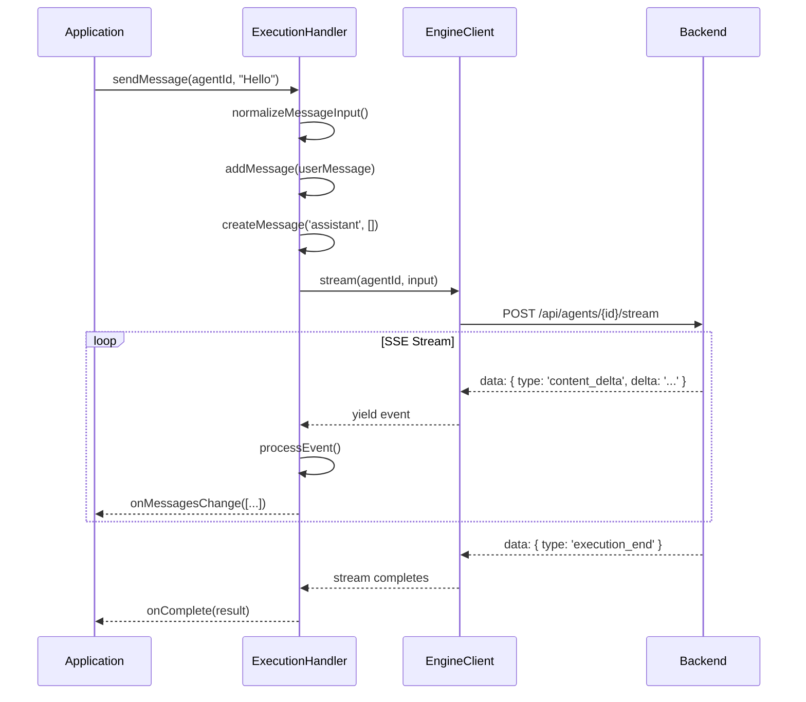
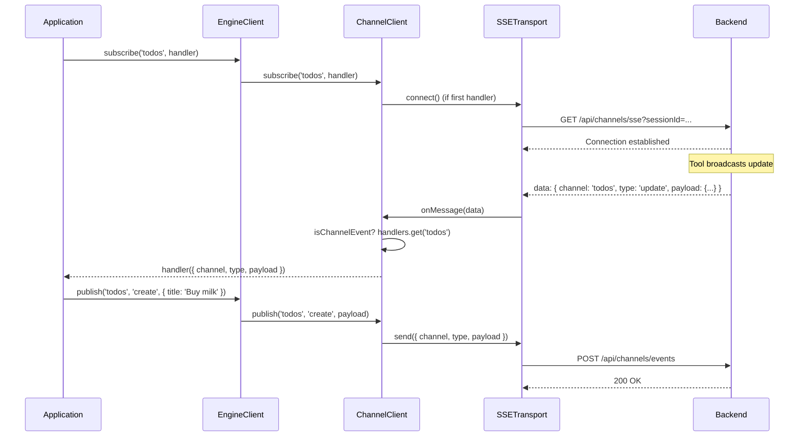
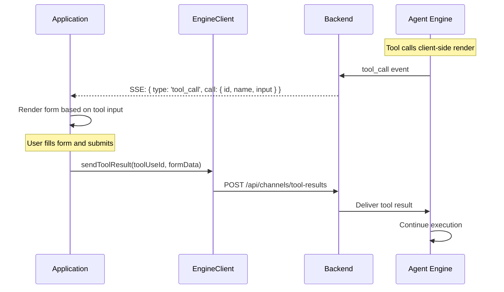
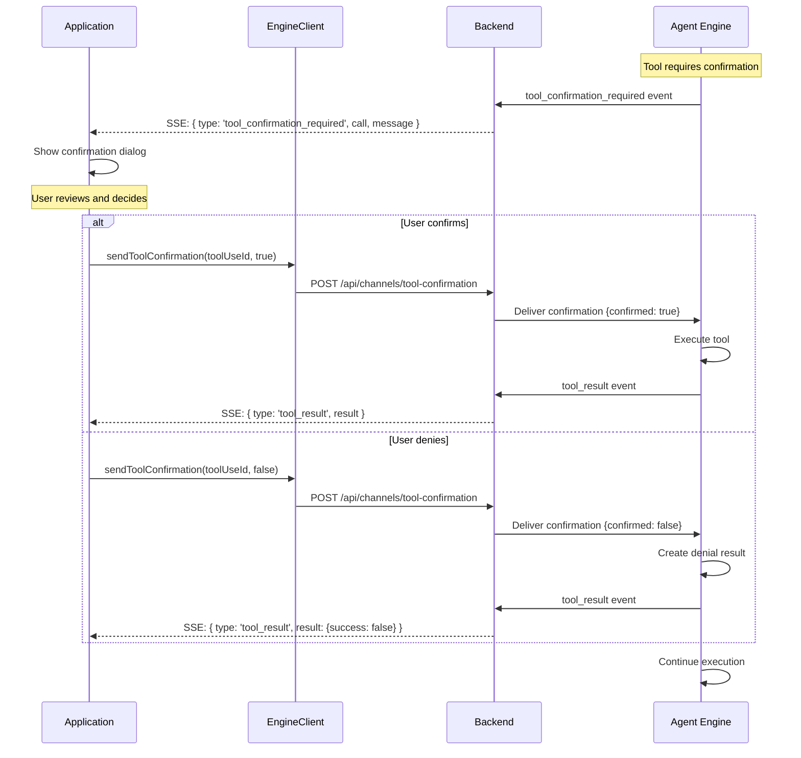

# aidk-client Architecture

> **Browser/frontend client for connecting to AIDK backends**

The client package provides a complete solution for browser-based applications to communicate with AIDK agent backends. It handles connection management, real-time streaming, channel-based pub/sub, and client-side tool coordination.

---

## Table of Contents

1. [Overview](#overview)
2. [Module Structure](#module-structure)
3. [Core Concepts](#core-concepts)
4. [API Reference](#api-reference)
5. [Data Flow](#data-flow)
6. [Usage Examples](#usage-examples)
7. [Integration Points](#integration-points)

---

## Overview

### What This Package Does

The client package provides:

- **Agent Execution** - Execute agents via HTTP or stream responses in real-time
- **Transport Abstraction** - Pluggable transports (SSE, WebSocket) with automatic reconnection
- **Channel Communication** - Typed pub/sub for bidirectional real-time messaging
- **Stream Processing** - Framework-agnostic message accumulation and event handling
- **Tool Coordination** - Send client-side tool results back to the server
- **State Management** - Connection state tracking with lifecycle callbacks

### Why It Exists

Frontend applications need to:

1. **Stream agent responses** - Display model output as it generates
2. **Handle real-time updates** - React to server-pushed events (tool calls, state changes)
3. **Send user input mid-execution** - Provide feedback or tool results during agent runs
4. **Maintain reliable connections** - Auto-reconnect with exponential backoff
5. **Stay framework-agnostic** - Work with React, Angular, Vue, or vanilla JS

### Design Principles

- **Transport-agnostic** - Core primitives work with any transport (SSE, WebSocket, etc.)
- **Layered architecture** - Low-level transports, mid-level channels, high-level client
- **Framework-agnostic** - No React/Angular dependencies in core; adapters live elsewhere
- **Automatic enrichment** - Session/user context automatically added to requests
- **Lazy connection** - Transport connects only when first handler is registered

---

## Module Structure

```
┌─────────────────────────────────────────────────────────────────────────────┐
│                           Application Layer                                  │
│                    (React hooks, Angular services)                           │
└─────────────────────────────────────────────────────────────────────────────┘
                                    │
                                    ▼
┌─────────────────────────────────────────────────────────────────────────────┐
│                            EngineClient                                      │
│  ┌─────────────────┐  ┌─────────────────┐  ┌─────────────────────────────┐  │
│  │  execute()      │  │  stream()       │  │  sendToolResult()           │  │
│  │  Agent HTTP     │  │  Agent SSE      │  │  Client tool responses      │  │
│  └─────────────────┘  └─────────────────┘  └─────────────────────────────┘  │
│  ┌─────────────────────────────────────────────────────────────────────────┐│
│  │  sendToolConfirmation() - Confirm or deny tool execution                ││
│  └─────────────────────────────────────────────────────────────────────────┘│
│  ┌─────────────────┐  ┌─────────────────┐  ┌─────────────────────────────┐  │
│  │  subscribe()    │  │  publish()      │  │  sendMessage()              │  │
│  │  Channel events │  │  Channel events │  │  Execution messages         │  │
│  └─────────────────┘  └─────────────────┘  └─────────────────────────────┘  │
└─────────────────────────────────────────────────────────────────────────────┘
                                    │
                    ┌───────────────┴───────────────┐
                    ▼                               ▼
┌──────────────────────────────┐    ┌──────────────────────────────────────┐
│       ChannelClient          │    │      ExecutionHandler                 │
│  Pub/sub over any transport  │    │  Stream processing & message mgmt    │
└──────────────────────────────┘    └──────────────────────────────────────┘
                    │
                    ▼
┌──────────────────────────────────────────────────────────────────────────┐
│                         Transport Layer                                   │
│  ┌──────────────────────────┐  ┌──────────────────────────────────────┐  │
│  │      SSETransport        │  │     ChannelTransport (interface)     │  │
│  │  Receive: EventSource    │  │  - connect(), disconnect()           │  │
│  │  Send: HTTP POST         │  │  - onMessage(), send()               │  │
│  │  Auto-reconnect          │  │  - getState(), getInfo()             │  │
│  └──────────────────────────┘  └──────────────────────────────────────┘  │
└──────────────────────────────────────────────────────────────────────────┘
```

### File Overview

| File                     | Size      | Purpose                                          |
| ------------------------ | --------- | ------------------------------------------------ |
| `engine-client.ts`       | 780 lines | High-level client with agent execution & routing |
| `execution-handler.ts`   | 641 lines | Stream event processing & message accumulation   |
| `channel.ts`             | 249 lines | Typed channel abstraction (`defineChannel`)      |
| `types.ts`               | 292 lines | Shared types for engine I/O & events             |
| `core/transport.ts`      | 129 lines | Transport interface & reconnect config           |
| `core/sse-transport.ts`  | 340 lines | SSE transport implementation                     |
| `core/channel-client.ts` | 228 lines | Transport-agnostic pub/sub                       |

---

## Core Concepts

### 1. Transport Layer

The transport layer abstracts how messages are sent and received. All transports implement `ChannelTransport`:

```
┌─────────────────────────────────────────────────────────────────────────────┐
│                          ChannelTransport                                    │
├─────────────────────────────────────────────────────────────────────────────┤
│  Lifecycle:           Messaging:            State:                          │
│  - connect()          - onMessage(handler)  - getState()                    │
│  - disconnect()       - send(data)          - getInfo()                     │
│  - reconnect()                              - isConnected()                 │
│  - dispose()                                                                │
└─────────────────────────────────────────────────────────────────────────────┘
                                    │
                    ┌───────────────┴───────────────┐
                    ▼                               ▼
┌──────────────────────────────┐    ┌──────────────────────────────────────┐
│       SSETransport           │    │     (Future) WebSocketTransport      │
├──────────────────────────────┤    ├──────────────────────────────────────┤
│  Receive: EventSource        │    │  Receive: ws.onmessage               │
│  Send: HTTP POST callback    │    │  Send: ws.send()                     │
│  Reconnect: exponential      │    │  Reconnect: exponential              │
│  Network: online/offline     │    │                                      │
└──────────────────────────────┘    └──────────────────────────────────────┘
```

**Transport States:**

```typescript
type TransportState =
  | "disconnected" // Not connected, not trying
  | "connecting" // Attempting to connect
  | "connected" // Active connection
  | "reconnecting" // Lost connection, attempting to restore
  | "offline"; // Browser is offline (navigator.onLine = false)
```

### 2. SSE Transport

SSE (Server-Sent Events) transport receives messages via `EventSource` and sends via HTTP POST:

```
┌────────────────────────────────────────────────────────────────────────────┐
│                            SSETransport                                     │
├────────────────────────────────────────────────────────────────────────────┤
│                                                                             │
│   ┌─────────────────────────────────────────────────────────────────────┐  │
│   │                         EventSource                                  │  │
│   │   GET /api/channels/sse?sessionId=xxx&userId=yyy                    │  │
│   │                              │                                       │  │
│   │   onopen ──────────────────▶ setState('connected')                  │  │
│   │   onmessage ──────────────▶ dispatchMessage(JSON.parse(data))       │  │
│   │   onerror ─────────────────▶ scheduleReconnect()                    │  │
│   └─────────────────────────────────────────────────────────────────────┘  │
│                                                                             │
│   send() ──▶ POST /api/channels/events { channel, type, payload }          │
│                                                                             │
│   Reconnection:                                                             │
│   - Exponential backoff: delay * 2^attempts                                │
│   - Capped at maxReconnectDelay (default 5s)                               │
│   - Cycling: resets to base delay after hitting cap                        │
│   - Jitter: ±25% randomization to prevent thundering herd                  │
│                                                                             │
└────────────────────────────────────────────────────────────────────────────┘
```

### 3. ChannelClient

Transport-agnostic pub/sub over any transport:

```
┌────────────────────────────────────────────────────────────────────────────┐
│                           ChannelClient                                     │
├────────────────────────────────────────────────────────────────────────────┤
│                                                                             │
│   Handlers:   Map<channel, Set<handler>>                                   │
│               'todos' ──▶ [handler1, handler2]                             │
│               'chat' ───▶ [handler3]                                       │
│               '*' ──────▶ [wildcardHandler]  // receives all events        │
│                                                                             │
│   subscribe(channel, handler):                                             │
│   1. Add handler to channel's Set                                          │
│   2. Connect transport if first handler                                    │
│   3. Return unsubscribe function                                           │
│                                                                             │
│   Transport message flow:                                                   │
│   transport.onMessage ──▶ isChannelEvent? ──▶ handlers.get(event.channel)  │
│                                          └──▶ handlers.get('*')            │
│                                                                             │
│   publish(channel, type, payload):                                         │
│   └──▶ transport.send({ channel, type, payload })                          │
│                                                                             │
└────────────────────────────────────────────────────────────────────────────┘
```

### 4. EngineClient

High-level client that combines all primitives with opinionated defaults:

```
┌────────────────────────────────────────────────────────────────────────────┐
│                            EngineClient                                     │
├────────────────────────────────────────────────────────────────────────────┤
│                                                                             │
│   Config:                                                                   │
│   - baseUrl: 'http://localhost:3001'                                       │
│   - sessionId: auto-generated UUID                                         │
│   - userId, tenantId, threadId: context enrichment                         │
│   - routes: customizable endpoint paths                                    │
│                                                                             │
│   Routes (defaults):                                                        │
│   - agentExecute:  /api/agents/{id}/execute                                │
│   - agentStream:   /api/agents/{id}/stream                                 │
│   - channelsSse:   /api/channels/sse                                       │
│   - channelsPublish: /api/channels/events                                  │
│   - toolResults:   /api/channels/tool-results                              │
│                                                                             │
│   Automatic enrichment:                                                     │
│   - sessionId added to all requests                                        │
│   - userId, tenantId added to metadata                                     │
│   - threadId for conversation continuity                                   │
│                                                                             │
└────────────────────────────────────────────────────────────────────────────┘
```

### 5. Typed Channels

`defineChannel` creates type-safe channel contracts:

```typescript
// Define the contract
const TodoChannel = defineChannel<
  // Incoming events (server → client)
  {
    state_changed: { tasks: Task[] };
    task_created: { task: Task };
  },
  // Outgoing events (client → server)
  {
    create_task: { title: string };
    toggle_complete: { task_id: string };
  }
>('todo-list');

// Connect to client
const todo = TodoChannel.connect(client);

// Type-safe subscriptions
todo.on('state_changed', ({ tasks }) => updateUI(tasks));  // ✓ typed
todo.on('unknown_event', ...);  // ✗ compile error

// Type-safe publishing
await todo.send('create_task', { title: 'Buy milk' });  // ✓ typed
await todo.send('create_task', { wrong: 'field' });     // ✗ compile error
```

### 6. ExecutionHandler

Framework-agnostic execution management with stream processing:

```
┌────────────────────────────────────────────────────────────────────────────┐
│                         ExecutionHandler                                    │
├────────────────────────────────────────────────────────────────────────────┤
│                                                                             │
│   ┌─────────────────────────────────────────────────────────────────────┐  │
│   │                      StreamProcessor                                 │  │
│   │                                                                      │  │
│   │   messages: Message[]           toolUseIndex: Map<id, location>     │  │
│   │                                                                      │  │
│   │   processEvent():                                                    │  │
│   │   - execution_start ───▶ extract threadId from metadata             │  │
│   │   - content_delta ─────▶ accumulate text deltas                     │  │
│   │   - reasoning_delta ───▶ accumulate reasoning                       │  │
│   │   - tool_call ─────────▶ add tool_use block, index by id            │  │
│   │   - tool_result ───────▶ O(1) lookup, patch tool_use block          │  │
│   │   - execution_end ─────▶ onComplete callback                        │  │
│   │   - engine_error ──────▶ onError callback                           │  │
│   │                                                                      │  │
│   └─────────────────────────────────────────────────────────────────────┘  │
│                                                                             │
│   sendMessage(agentId, input):                                             │
│   1. Normalize input to Message[]                                          │
│   2. Add user messages to display                                          │
│   3. Create assistant placeholder                                          │
│   4. Stream events, process each                                           │
│   5. Update isStreaming state                                              │
│                                                                             │
└────────────────────────────────────────────────────────────────────────────┘
```

---

## API Reference

### engine-client.ts

#### `EngineClient`

Main client class combining all capabilities:

```typescript
class EngineClient {
  // Configuration
  constructor(config?: EngineClientConfig);
  updateConfig(updates: Partial<EngineClientConfig>): void;
  getSessionId(): string;
  getUserId(): string | undefined;

  // Agent Execution
  execute(agentId: string, input: EngineInput): Promise<ExecutionResult>;
  stream(
    agentId: string,
    input: EngineInput,
  ): AsyncGenerator<EngineStreamEvent>;

  // Channel Communication
  subscribe(
    channel: string | string[],
    handler: (event: ChannelEvent) => void,
  ): () => void;
  publish<T>(channel: string, type: string, payload?: unknown): Promise<T>;

  // Tool Results
  sendToolResult(
    toolUseId: string,
    content: unknown,
    options?: { isError?: boolean; error?: string },
  ): Promise<{ success: boolean; toolUseId: string }>;

  // Tool Confirmation
  sendToolConfirmation(
    toolUseId: string,
    confirmed: boolean,
    options?: { always?: boolean },
  ): Promise<{ success: boolean; toolUseId: string }>;

  // Execution Messages
  sendMessage(
    message: { type: string; content?: unknown },
    options?: { targetPid?: string },
  ): Promise<void>;

  // Connection State
  getConnectionState(): ConnectionState;
  getConnectionInfo(): ConnectionInfo;
  isConnected(): boolean;
  reconnect(): void;
  disconnect(): void;

  // Execution History
  getExecutions(params?: Record<string, unknown>): Promise<Execution[]>;
  getExecution(executionId: string): Promise<Execution>;
  getMetrics(params?: Record<string, unknown>): Promise<ExecutionMetrics[]>;

  // Cleanup
  dispose(): void;
}
```

#### `EngineClientConfig`

```typescript
interface EngineClientConfig {
  // Connection
  baseUrl?: string;
  sessionId?: string; // Auto-generated if not provided
  userId?: string; // For user-scoped routing
  tenantId?: string; // For multi-tenant apps
  threadId?: string; // For conversation continuity
  metadata?: Record<string, unknown>;

  // Routes (optional - override defaults)
  routes?: EngineRoutes;

  // Transport (optional - SSETransport created if not provided)
  transport?: ChannelTransport;
  channels?: ChannelClient;

  // API overrides
  api?: EngineClientApi;

  // Reconnection
  reconnectDelay?: number; // Default: 1000ms
  maxReconnectDelay?: number; // Default: 5000ms
  maxReconnectAttempts?: number; // Default: 0 (infinite)

  // Lifecycle callbacks
  callbacks?: EngineClientCallbacks;
}
```

#### Factory Functions

```typescript
// Get or create singleton client
function getEngineClient(config?: EngineClientConfig): EngineClient;

// Create new client instance
function createEngineClient(config?: EngineClientConfig): EngineClient;
```

---

### core/transport.ts

#### `ChannelTransport` (interface)

```typescript
interface ChannelTransport {
  // Lifecycle
  connect(): void;
  disconnect(): void;
  reconnect(): void;
  dispose(): void;

  // Messaging
  onMessage(handler: (data: unknown) => void): () => void;
  send<T = unknown>(data: unknown): Promise<T>;

  // State
  getState(): TransportState;
  getInfo(): TransportInfo;
  isConnected(): boolean;
}
```

#### `TransportCallbacks`

```typescript
interface TransportCallbacks {
  onConnect?: () => void;
  onDisconnect?: (reason: string) => void;
  onReconnecting?: (attempt: number, delay: number) => void;
  onReconnected?: (attempts: number) => void;
  onReconnectFailed?: (attempts: number) => void;
  onError?: (error: unknown) => void;
  onOffline?: () => void;
  onOnline?: () => void;
  onStateChange?: (state: TransportState, info: TransportInfo) => void;
}
```

---

### core/sse-transport.ts

#### `SSETransport`

```typescript
class SSETransport implements ChannelTransport {
  constructor(config: SSETransportConfig);
  // ... implements ChannelTransport
}

interface SSETransportConfig {
  buildUrl: () => string; // Called on each connection attempt
  send: <T = unknown>(data: unknown) => Promise<T>; // HTTP POST implementation
  callbacks?: TransportCallbacks;
  reconnectDelay?: number; // Default: 1000ms
  maxReconnectDelay?: number; // Default: 5000ms
  maxReconnectAttempts?: number; // Default: 0 (infinite)
  reconnectJitter?: number; // Default: 0.25 (±25%)
}
```

---

### core/channel-client.ts

#### `ChannelClient`

```typescript
class ChannelClient {
  constructor(config: ChannelClientConfig);

  subscribe(channel: string | string[], handler: EventHandler): () => void;
  publish<T>(channel: string, type: string, payload?: unknown): Promise<T>;

  getState(): TransportState;
  getInfo(): TransportInfo;
  isConnected(): boolean;

  reconnect(): void;
  disconnect(): void;
  dispose(): void;
}

interface ChannelEvent {
  channel: string;
  type: string;
  payload: unknown;
  metadata?: Record<string, unknown>;
}
```

---

### channel.ts

#### `defineChannel<TIncoming, TOutgoing>(name)`

```typescript
function defineChannel<
  TIncoming extends Record<string, unknown>,
  TOutgoing extends Record<string, unknown>,
>(name: string): ChannelDefinition<TIncoming, TOutgoing>;

interface Channel<TIncoming, TOutgoing> {
  readonly name: string;
  readonly connected: boolean;

  on<K extends keyof TIncoming>(
    eventType: K,
    handler: (payload: TIncoming[K], event: ChannelEvent) => void,
  ): () => void;

  onAny(handler: (event: ChannelEvent) => void): () => void;

  send<K extends keyof TOutgoing>(
    eventType: K,
    payload: TOutgoing[K],
  ): Promise<unknown>;

  disconnect(): void;
}
```

---

### execution-handler.ts

#### `ExecutionHandler`

```typescript
class ExecutionHandler {
  constructor(config: ExecutionHandlerConfig);

  updateClient(client: EngineClient): void;
  getThreadId(): string | null;
  getMessages(): Message[];
  getIsStreaming(): boolean;

  sendMessage(
    agentId: string,
    input: MessageInput,
    options?: SendMessageOptions,
  ): Promise<void>;

  clear(): void;
}

interface ExecutionHandlerConfig {
  client: EngineClient;
  onMessagesChange: (messages: Message[]) => void;
  onStreamingChange?: (isStreaming: boolean) => void;
  onThreadIdChange?: (threadId: string | null) => void;
  onErrorChange?: (error: Error | null) => void;
  onEvent?: (event: StreamEvent) => void;
  onComplete?: (result: unknown) => void;
  onError?: (error: Error) => void;
}
```

#### `StreamProcessor`

```typescript
class StreamProcessor {
  constructor(callbacks: StreamProcessorCallbacks);

  getMessages(): Message[];
  addMessage(message: Message): void;
  updateMessage(id: string, updater: (msg: Message) => Message): void;

  processEvent(
    event: StreamEvent,
    context: StreamEventContext,
    addedAssistantMessage: boolean,
  ): { addedAssistantMessage: boolean };

  clear(): void;
}
```

#### Message Helpers

```typescript
function generateMessageId(): string;
function createMessage(
  role: Message["role"],
  content: ContentBlock[] | string,
): Message;
function normalizeMessageInput(
  input: MessageInput,
  defaultRole?: Message["role"],
): Message[];
```

---

## Data Flow

### Agent Streaming Flow



### Channel Communication Flow



### Client Tool Result Flow



### Tool Confirmation Flow



**Key features:**

- **`tool_confirmation_required` event**: Contains tool call info and confirmation message
- **`sendToolConfirmation()`**: Sends confirm/deny decision to server
- **`always` option**: Client can indicate "always allow/deny this tool" for persistence
- **Parallel handling**: Multiple confirmations can be pending simultaneously

### Reconnection Flow

```
┌─────────────────────────────────────────────────────────────────────────────┐
│                          SSETransport Reconnection                           │
├─────────────────────────────────────────────────────────────────────────────┤
│                                                                              │
│   connected ───▶ onError ───▶ cleanup() ───▶ scheduleReconnect()            │
│                                                    │                         │
│   ┌────────────────────────────────────────────────┘                         │
│   │                                                                          │
│   ▼                                                                          │
│   Check offline? ───yes───▶ setState('offline')                              │
│        │                    └──▶ wait for 'online' event                     │
│        no                                                                    │
│        │                                                                     │
│        ▼                                                                     │
│   Check maxAttempts? ───exceeded───▶ onReconnectFailed()                    │
│        │                             └──▶ setState('disconnected')           │
│        ok                                                                    │
│        │                                                                     │
│        ▼                                                                     │
│   Calculate delay:                                                           │
│   - delay = baseDelay * 2^attempts                                          │
│   - if delay >= maxDelay: reset attempts (cycling)                          │
│   - add jitter: delay ± 25%                                                 │
│        │                                                                     │
│        ▼                                                                     │
│   setState('reconnecting') ───▶ onReconnecting(attempt, delay)              │
│        │                                                                     │
│        ▼                                                                     │
│   setTimeout(ensureConnection, delay)                                        │
│        │                                                                     │
│        ▼                                                                     │
│   onOpen? ───yes───▶ onReconnected(attempts) ───▶ setState('connected')     │
│        │                                                                     │
│        no ───▶ onerror ───▶ (loop back to scheduleReconnect)                │
│                                                                              │
└─────────────────────────────────────────────────────────────────────────────┘
```

---

## Usage Examples

### Basic Agent Execution

```typescript
import { createEngineClient } from 'aidk-client';

// Create client
const client = createEngineClient({
  baseUrl: 'http://localhost:3001',
  userId: 'user-123',
});

// Non-streaming execution
const result = await client.execute('assistant', {
  messages: [{ role: 'user', content: [{ type: 'text', text: 'Hello!' }] }],
});

// Streaming execution
for await (const event of client.stream('assistant', { messages: [...] })) {
  switch (event.type) {
    case 'content_delta':
      process.stdout.write(event.delta);
      break;
    case 'execution_end':
      console.log('\nDone!');
      break;
  }
}
```

### Using ExecutionHandler (React-like pattern)

```typescript
import { ExecutionHandler, createEngineClient, Message } from "aidk-client";

let messages: Message[] = [];
let isStreaming = false;

const handler = new ExecutionHandler({
  client: createEngineClient({ baseUrl: "http://localhost:3001" }),
  onMessagesChange: (msgs) => {
    messages = msgs;
    renderUI();
  },
  onStreamingChange: (streaming) => {
    isStreaming = streaming;
    renderUI();
  },
  onError: (error) => console.error("Error:", error),
});

// Send a message (automatically handles streaming)
await handler.sendMessage("assistant", "What is the weather today?");
```

### Typed Channel Communication

```typescript
import { defineChannel, createEngineClient } from "aidk-client";

// Define channel contract
interface Task {
  id: string;
  title: string;
  completed: boolean;
}

const TodoChannel = defineChannel<
  { state_changed: { tasks: Task[] }; task_created: { task: Task } },
  { create_task: { title: string }; toggle_complete: { task_id: string } }
>("todo-list");

// Use the channel
const client = createEngineClient({ baseUrl: "http://localhost:3001" });
const todos = TodoChannel.connect(client);

// Subscribe (type-safe)
todos.on("state_changed", ({ tasks }) => {
  console.log("Tasks updated:", tasks);
});

todos.on("task_created", ({ task }) => {
  console.log("New task:", task.title);
});

// Publish (type-safe)
await todos.send("create_task", { title: "Buy groceries" });
await todos.send("toggle_complete", { task_id: "task-123" });

// Cleanup
todos.disconnect();
```

### Client-Side Tool Handling

```typescript
import { createEngineClient } from "aidk-client";

const client = createEngineClient({
  baseUrl: "http://localhost:3001",
  userId: "user-123",
});

// Subscribe to tool calls
client.subscribe("execution", (event) => {
  if (event.type === "tool_call" && event.payload.name === "user_form") {
    const toolCallId = event.payload.id;
    const formSpec = event.payload.input;

    // Render form UI and wait for user input
    showForm(formSpec, async (formData) => {
      // Send result back to server
      await client.sendToolResult(toolCallId, formData);
    });
  }
});

// Or send messages to running execution
await client.sendMessage({
  type: "user_feedback",
  content: { priority: "high" },
});
```

### Tool Confirmation Handling

```typescript
import { createEngineClient } from "aidk-client";

const client = createEngineClient({
  baseUrl: "http://localhost:3001",
  userId: "user-123",
});

// Handle tool confirmation requests
for await (const event of client.stream("assistant", input)) {
  if (event.type === "tool_confirmation_required") {
    const { call, message } = event;

    // Show confirmation dialog to user
    const userConfirmed = await showConfirmationDialog({
      title: `Confirm: ${call.name}`,
      message: message,
      details: call.input,
    });

    // Send confirmation response
    await client.sendToolConfirmation(call.id, userConfirmed);
  }

  if (event.type === "tool_confirmation_result") {
    const { confirmation } = event;
    if (confirmation.confirmed) {
      console.log(`Tool ${confirmation.toolName} was confirmed`);
    } else {
      console.log(`Tool ${confirmation.toolName} was denied`);
    }
  }

  // Handle other events...
}
```

### Tool Confirmation with "Always" Option

```typescript
// Allow user to set permanent preference
const { confirmed, always } = await showConfirmationDialog({
  title: `Confirm: ${call.name}`,
  message: message,
  showAlwaysCheckbox: true, // "Always allow/deny this tool"
});

// Send with always flag for persistence
await client.sendToolConfirmation(call.id, confirmed, { always });

// The 'always' flag is passed to the onToolConfirmation lifecycle hook
// where the server can persist it (e.g., to a database)
```

### Custom Transport

```typescript
import { ChannelClient, createEngineClient } from "aidk-client";
import type { ChannelTransport } from "aidk-client";

// Implement custom transport (e.g., WebSocket)
class WebSocketTransport implements ChannelTransport {
  private ws: WebSocket | null = null;
  private handlers = new Set<(data: unknown) => void>();

  connect() {
    this.ws = new WebSocket("wss://api.example.com/ws");
    this.ws.onmessage = (e) => {
      const data = JSON.parse(e.data);
      this.handlers.forEach((h) => h(data));
    };
  }

  onMessage(handler: (data: unknown) => void) {
    this.handlers.add(handler);
    return () => this.handlers.delete(handler);
  }

  async send<T>(data: unknown): Promise<T> {
    this.ws?.send(JSON.stringify(data));
    return {} as T; // WebSocket doesn't have request/response
  }

  // ... other methods
}

// Use with EngineClient
const client = createEngineClient({
  baseUrl: "http://localhost:3001",
  transport: new WebSocketTransport(),
});
```

### Connection Lifecycle Handling

```typescript
const client = createEngineClient({
  baseUrl: "http://localhost:3001",
  reconnectDelay: 1000,
  maxReconnectDelay: 5000,
  callbacks: {
    onConnect: () => {
      showStatus("Connected");
    },
    onDisconnect: (reason) => {
      showStatus(`Disconnected: ${reason}`);
    },
    onReconnecting: (attempt, delay) => {
      showStatus(`Reconnecting (attempt ${attempt}) in ${delay}ms...`);
    },
    onReconnected: (attempts) => {
      showStatus(`Reconnected after ${attempts} attempts`);
    },
    onOffline: () => {
      showStatus("Offline - waiting for network");
    },
    onOnline: () => {
      showStatus("Online - reconnecting...");
    },
    onStateChange: (state, info) => {
      updateConnectionIndicator(state);
    },
  },
});
```

---

## Integration Points

### How Other Packages Use Client

| Package        | Uses                               | For                             |
| -------------- | ---------------------------------- | ------------------------------- |
| `aidk-react`   | `ExecutionHandler`, `EngineClient` | React hooks for agent execution |
| `aidk-angular` | `EngineClient`, `defineChannel`    | Angular services for channels   |
| Applications   | Full API                           | Custom integrations             |

### Extension Points

1. **Custom Transport** - Implement `ChannelTransport` for WebSocket, long-polling, etc.
2. **Custom Routes** - Override default endpoint paths via `config.routes`
3. **API Overrides** - Provide custom implementations via `config.api`
4. **Publish Override** - Custom publish logic via `ChannelClientConfig.publish`
5. **Event Filtering** - Custom `isChannelEvent` for non-standard message formats

### Server Requirements

The client expects these server endpoints (customizable via routes):

| Endpoint                          | Method | Purpose                           |
| --------------------------------- | ------ | --------------------------------- |
| `/api/agents/{id}/execute`        | POST   | Non-streaming agent execution     |
| `/api/agents/{id}/stream`         | POST   | Streaming agent execution (SSE)   |
| `/api/channels/sse`               | GET    | SSE connection for channel events |
| `/api/channels/events`            | POST   | Publish channel events            |
| `/api/channels/tool-results`      | POST   | Client tool result submission     |
| `/api/channels/tool-confirmation` | POST   | Tool confirmation response        |
| `/api/executions`                 | GET    | List executions                   |
| `/api/executions/{id}`            | GET    | Get single execution              |
| `/api/executions/metrics`         | GET    | Get execution metrics             |

---

## Summary

The client package provides a complete solution for browser-based AIDK applications:

- **EngineClient** - High-level client with agent execution, channels, and tool coordination
- **SSETransport** - Reliable SSE-based transport with automatic reconnection
- **ChannelClient** - Transport-agnostic pub/sub for real-time messaging
- **ExecutionHandler** - Framework-agnostic stream processing and message management
- **defineChannel** - Type-safe channel contracts for bidirectional communication

The layered architecture allows using low-level primitives directly for custom needs while providing a batteries-included experience via `EngineClient`.
