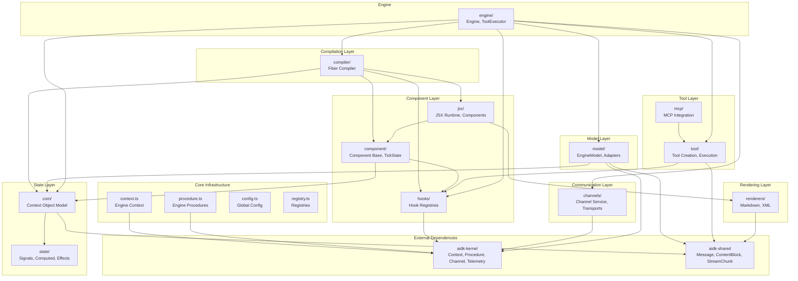

# aidk (Core Package) Architecture

> **The complete AI agent development framework**

The `aidk` core package is the central package for building AI agents. It provides the engine, component model, JSX runtime, state management, model adapters, tools, and all primitives needed to define and execute AI agents.

---

## Table of Contents

1. [Overview](#overview)
2. [Package Structure](#package-structure)
3. [Module Dependency Graph](#module-dependency-graph)
4. [High-Level Architecture](#high-level-architecture)
5. [Module Documentation](#module-documentation)
6. [Root-Level Exports](#root-level-exports)
7. [Package Exports](#package-exports)
8. [Getting Started](#getting-started)
9. [Integration with Other Packages](#integration-with-other-packages)

---

## Overview

### What This Package Does

The `aidk` package provides:

- **Engine** - Orchestrates agent execution with tick-based model interactions
- **Component Model** - React-inspired components for declarative agent definition
- **JSX Runtime** - Custom JSX implementation for agent composition
- **Context Object Model (COM)** - Shared state tree for agent execution
- **Compiler** - Fiber-based JSX-to-COM transformation
- **State Management** - Signals-based reactive state
- **Model Integration** - Unified interface for AI model adapters
- **Tools** - Type-safe tool definition and execution
- **Channels** - Bidirectional streaming communication
- **Hooks** - React-style hooks and middleware registries
- **MCP Support** - Model Context Protocol integration
- **Renderers** - Markdown, XML, and custom content formatters

### Why It Exists

AIDK agents need a unified framework that:

1. **Enables declarative composition** - Build agents from reusable components
2. **Manages execution lifecycle** - Tick-based model interactions with proper state flow
3. **Abstracts model differences** - Work with any AI provider through adapters
4. **Provides observability** - Automatic tracking, telemetry, and logging
5. **Supports extensibility** - Hooks, middleware, and plugin points throughout

### Design Principles

- **React-inspired** - Familiar patterns (JSX, components, hooks) for React developers
- **Async-first** - All operations support async (no UI thread constraints)
- **Tick-based execution** - Discrete model interaction cycles, not continuous rendering
- **Provider agnostic** - Core logic decoupled from specific AI providers
- **Build on kernel** - Uses kernel primitives (Context, Procedure, Channel) for infrastructure

---

## Package Structure

```
packages/core/
├── src/
│   ├── index.ts              # Main package exports
│   ├── types.ts              # Core type definitions
│   ├── context.ts            # Engine context wrapper
│   ├── content.ts            # Content block re-exports
│   ├── registry.ts           # Tool, model, engine registries
│   ├── normalization.ts      # Input normalization utilities
│   ├── config.ts             # Global engine configuration
│   ├── procedure.ts          # Engine procedure factory
│   ├── entity-ids.ts         # ID generation utilities
│   │
│   ├── engine/               # Agent execution engine
│   ├── compiler/             # Fiber-based JSX compiler
│   ├── component/            # Component base class and hooks
│   ├── com/                  # Context Object Model
│   ├── state/                # Signals-based state management
│   ├── model/                # Model adapter interface
│   ├── tool/                 # Tool definition and execution
│   ├── hooks/                # Hook registry system
│   ├── jsx/                  # JSX runtime and components
│   ├── channels/             # Streaming communication
│   ├── mcp/                  # Model Context Protocol
│   ├── renderers/            # Content formatters
│   ├── client/               # Server-side client utilities
│   ├── middleware/           # Default middleware
│   └── utils/                # Utility functions
│
├── package.json              # Package configuration
├── tsconfig.json             # TypeScript configuration
└── ARCHITECTURE.md           # This document
```

---

## Module Dependency Graph



### Module Dependency Summary

| Module      | Depends On                         | Depended By                 |
| ----------- | ---------------------------------- | --------------------------- |
| `context`   | kernel                             | All modules via Context.get |
| `com`       | kernel, shared, state              | compiler, engine, component |
| `state`     | kernel                             | com, component              |
| `compiler`  | com, component, jsx, hooks, kernel | engine                      |
| `component` | com, hooks                         | compiler, jsx               |
| `hooks`     | kernel                             | compiler, component, engine |
| `jsx`       | component, renderers               | compiler, user code         |
| `model`     | kernel, shared, com                | engine, adapters            |
| `tool`      | kernel, shared, hooks              | engine, mcp                 |
| `mcp`       | tool, kernel                       | engine                      |
| `channels`  | kernel                             | engine, user code           |
| `renderers` | shared                             | jsx, model                  |
| `engine`    | all internal modules               | user code                   |

---

## High-Level Architecture

```
┌─────────────────────────────────────────────────────────────────────────────────┐
│                              AIDK Core Package                                   │
├─────────────────────────────────────────────────────────────────────────────────┤
│                                                                                  │
│   ┌──────────────────────────────────────────────────────────────────────────┐   │
│   │                            User Application                               │   │
│   │  ┌─────────────────────────────────────────────────────────────────────┐ │   │
│   │  │  const engine = createEngine({ model: myAdapter });                 │ │   │
│   │  │  const result = await engine.execute(input, <MyAgent />);           │ │   │
│   │  └─────────────────────────────────────────────────────────────────────┘ │   │
│   └──────────────────────────────────────────────────────────────────────────┘   │
│                                        │                                         │
│                                        ▼                                         │
│   ┌──────────────────────────────────────────────────────────────────────────┐   │
│   │                              ENGINE                                       │   │
│   │  ┌────────────────┐  ┌────────────────┐  ┌────────────────┐              │   │
│   │  │ Tick Loop      │  │ Tool Executor  │  │ State Manager  │              │   │
│   │  │ ───────────    │  │ ────────────   │  │ ─────────────  │              │   │
│   │  │ Compile → Model│  │ Route & Execute│  │ previous  │              │   │
│   │  │ → Process →    │  │ Server/Client/ │  │ current   │              │   │
│   │  │ Continue/Stop  │  │ Provider/MCP   │  │ finalState     │              │   │
│   │  └────────────────┘  └────────────────┘  └────────────────┘              │   │
│   └──────────────────────────────────────────────────────────────────────────┘   │
│                                        │                                         │
│            ┌───────────────────────────┼───────────────────────────┐             │
│            ▼                           ▼                           ▼             │
│   ┌─────────────────┐       ┌─────────────────┐       ┌─────────────────┐        │
│   │    COMPILER     │       │      MODEL      │       │   CHANNELS      │        │
│   │  ─────────────  │       │  ─────────────  │       │  ────────────   │        │
│   │  JSX → Fiber →  │       │  fromEngine →   │       │  Sessions,      │        │
│   │  COM Updates    │       │  generate →     │       │  Transports,    │        │
│   │                 │       │  toEngine       │       │  Routers        │        │
│   └────────┬────────┘       └─────────────────┘       └─────────────────┘        │
│            │                                                                     │
│   ┌────────┴─────────────────────────────────────────────────────────────────┐   │
│   │                                                                          │   │
│   │   ┌────────────┐   ┌────────────┐   ┌────────────┐   ┌────────────┐      │   │
│   │   │    COM     │   │   STATE    │   │ COMPONENT  │   │    JSX     │      │   │
│   │   │ ─────────  │   │ ─────────  │   │ ─────────  │   │ ─────────  │      │   │
│   │   │ Timeline   │   │ signal()   │   │ Component  │   │ Fragment   │      │   │
│   │   │ Sections   │   │ computed() │   │ Lifecycle  │   │ User       │      │   │
│   │   │ State      │   │ effect()   │   │ TickState  │   │ System     │      │   │
│   │   │ Tools      │   │ comState() │   │ Hooks      │   │ Message    │      │   │
│   │   └────────────┘   └────────────┘   └────────────┘   └────────────┘      │   │
│   │                                                                          │   │
│   │   ┌────────────┐   ┌────────────┐   ┌────────────┐   ┌────────────┐      │   │
│   │   │   TOOLS    │   │    MCP     │   │ RENDERERS  │   │   HOOKS    │      │   │
│   │   │ ─────────  │   │ ─────────  │   │ ─────────  │   │ ─────────  │      │   │
│   │   │ createTool │   │ MCPClient  │   │ Markdown   │   │ Model      │      │   │
│   │   │ Execution  │   │ MCPService │   │ XML        │   │ Tool       │      │   │
│   │   │ Types      │   │ MCPTool    │   │ Custom     │   │ Engine     │      │   │
│   │   └────────────┘   └────────────┘   └────────────┘   └────────────┘      │   │
│   │                                                                          │   │
│   └──────────────────────────────────────────────────────────────────────────┘   │
│                                        │                                         │
│                                        ▼                                         │
│   ┌──────────────────────────────────────────────────────────────────────────┐   │
│   │                          KERNEL (aidk-kernel)                             │   │
│   │  ┌──────────┐  ┌───────────┐  ┌─────────┐  ┌───────────┐  ┌───────────┐  │   │
│   │  │ Context  │  │ Procedure │  │ Channel │  │ Telemetry │  │  Logger   │  │   │
│   │  └──────────┘  └───────────┘  └─────────┘  └───────────┘  └───────────┘  │   │
│   └──────────────────────────────────────────────────────────────────────────┘   │
│                                                                                  │
└─────────────────────────────────────────────────────────────────────────────────┘
```

---

## Module Documentation

Each module has its own detailed ARCHITECTURE.md document:

| Module                                                     | Description                              |
| ---------------------------------------------------------- | ---------------------------------------- |
| [channels/ARCHITECTURE.md](src/channels/ARCHITECTURE.md)   | Streaming communication infrastructure   |
| [com/ARCHITECTURE.md](src/com/ARCHITECTURE.md)             | Context Object Model - shared state tree |
| [compiler/ARCHITECTURE.md](src/compiler/ARCHITECTURE.md)   | Fiber-based JSX compilation              |
| [component/ARCHITECTURE.md](src/component/ARCHITECTURE.md) | Component model and lifecycle            |
| [hooks/ARCHITECTURE.md](src/hooks/ARCHITECTURE.md)         | Hook registries and React-style hooks    |
| [jsx/ARCHITECTURE.md](src/jsx/ARCHITECTURE.md)             | JSX runtime and components               |
| [mcp/ARCHITECTURE.md](src/mcp/ARCHITECTURE.md)             | Model Context Protocol integration       |
| [model/ARCHITECTURE.md](src/model/ARCHITECTURE.md)         | Model adapter interface                  |
| [renderers/ARCHITECTURE.md](src/renderers/ARCHITECTURE.md) | Content formatters                       |
| [state/ARCHITECTURE.md](src/state/ARCHITECTURE.md)         | Signals-based state management           |
| [tool/ARCHITECTURE.md](src/tool/ARCHITECTURE.md)           | Tool definition and execution            |

### Module Quick Reference

```
┌────────────────────────────────────────────────────────────────────────┐
│                        Module Quick Reference                           │
├────────────────────────────────────────────────────────────────────────┤
│                                                                         │
│  CHANNELS         Real-time bidirectional communication                 │
│  ├── ChannelService     Session management, transport/adapter coord    │
│  ├── ChannelRouter      Declarative event handling with scopes         │
│  └── Transports         WebSocket, Socket.io, Streamable HTTP          │
│                                                                         │
│  COM               Context Object Model - the shared state tree         │
│  ├── ContextObjectModel Timeline, sections, state, tools, ephemeral    │
│  └── COMInput/Output    Serializable snapshots for model I/O           │
│                                                                         │
│  COMPILER          Fiber-based JSX to COM transformation                │
│  ├── FiberCompiler      Reconciliation, hooks runtime, lifecycle       │
│  ├── FiberNode          Internal representation of components          │
│  └── ContentBlockRegistry  JSX to ContentBlock mapping                  │
│                                                                         │
│  COMPONENT         React-inspired component model                       │
│  ├── Component<P,S>     Base class for class components                 │
│  ├── TickState          Execution context for each tick                 │
│  └── ComponentHookRegistry  Lifecycle middleware                        │
│                                                                         │
│  HOOKS             React-style hooks and middleware registries          │
│  ├── useSignal, useComState, useWatch    State hooks                    │
│  ├── useEffect, useTickStart, useTickEnd Effect hooks                   │
│  └── ModelHookRegistry, ToolHookRegistry Operation middleware           │
│                                                                         │
│  JSX               Custom JSX runtime for agent definition              │
│  ├── jsx, jsxs, Fragment    Core runtime functions                      │
│  ├── User, Assistant, System    Message components                      │
│  └── Section, Timeline, Tool    Structural components                   │
│                                                                         │
│  MCP               Model Context Protocol integration                   │
│  ├── MCPClient          SDK wrapper for connections                     │
│  ├── MCPService         Tool discovery and registration                 │
│  └── MCPTool            ExecutableTool wrapper for MCP tools            │
│                                                                         │
│  MODEL             Unified model adapter interface                      │
│  ├── EngineModel        Core interface for all models                   │
│  ├── createModel()      Factory for model creation                      │
│  ├── ModelAdapter       Base class for adapters                         │
│  └── fromEngineState/toEngineState  State transformation                │
│                                                                         │
│  RENDERERS         Content formatters for semantic blocks               │
│  ├── Renderer           Abstract base class                             │
│  ├── MarkdownRenderer   GFM, CommonMark formatting                      │
│  └── XMLRenderer        XML/HTML formatting                             │
│                                                                         │
│  STATE             Signals-based reactive state                         │
│  ├── signal()           Local reactive state                            │
│  ├── computed()         Derived values                                  │
│  ├── effect()           Side effects                                    │
│  └── comState()         COM-bound shared state                          │
│                                                                         │
│  TOOL              Tool definition and execution                        │
│  ├── createTool()       Type-safe tool factory                          │
│  ├── ExecutableTool     Minimal tool interface                          │
│  └── ToolExecutor       Execution routing (server/client/provider/mcp)  │
│                                                                         │
└────────────────────────────────────────────────────────────────────────┘
```

---

## Root-Level Exports

The root-level source files provide core infrastructure:

### context.ts

Engine-specific context wrapper over kernel's Context:

```typescript
import { Context } from 'aidk';

// Get current engine context (with Engine-specific types)
const ctx = Context.get();

// Create a new context
const ctx = Context.create({ user: { id: 'user-1' } });

// Run with context
const result = await Context.run(ctx, async () => { ... });
```

### types.ts

Core type definitions including:

- `EngineContext` - Engine-augmented kernel context
- `EngineContextMetadata` / `EngineContextMetrics` - Engine-specific context fields
- `ProviderClientOptions` / `ProviderGenerationOptions` / `ProviderToolOptions` - Provider extensibility
- `LibraryClientOptions` / `LibraryGenerationOptions` / `LibraryToolOptions` - Library extensibility
- Image generation types, embedding types, agent event types

### config.ts

Global engine configuration:

```typescript
import { configureEngine, getGlobalMiddleware, getGlobalHooks } from 'aidk';

configureEngine({
  globalMiddleware: [loggingMiddleware],
  globalHooks: {
    engine: { execute: [...] },
    model: { generate: [...] },
    tool: { run: [...] },
  },
});
```

### registry.ts

Global registries for tools, models, and engines:

```typescript
import { toolRegistry, modelRegistry, engineRegistry } from "aidk";

toolRegistry.register("calculator", calculatorTool);
modelRegistry.register("gpt-4", gpt4Model);
```

### procedure.ts

Engine procedure factory with default middleware:

```typescript
import { createEngineProcedure, isProcedure } from "aidk";

const myProc = createEngineProcedure(async (input) => {
  // Automatically has telemetry, error handling, and global middleware
});
```

### normalization.ts

Input normalization utilities:

```typescript
import { normalizeModelInput, resolveTools, normalizeMessages } from "aidk";

const normalized = normalizeModelInput(input, config);
```

### entity-ids.ts

ID generation for streaming events:

```typescript
import { generateMessageId, generateContentId, generateToolCallId } from "aidk";

const msgId = generateMessageId(); // 'msg_a1b2c3d4e5f6g7h8'
```

---

## Package Exports

The package provides multiple entry points:

### Main Entry (`aidk`)

```typescript
// Engine
export { Engine, createEngine } from "./engine";

// Components
export { Component } from "./component";
export { Fragment, jsx, jsxs } from "./jsx";
export {
  User,
  Assistant,
  System,
  Message,
  Section,
  Timeline,
} from "./jsx/components";

// State
export { signal, computed, effect, comState, watch } from "./state";

// Model
export { createModel, ModelAdapter, isEngineModel } from "./model";

// Tools
export { createTool, ToolExecutionType, ToolIntent } from "./tool";

// Hooks (React-style)
export {
  useSignal,
  useComState,
  useEffect,
  useTickStart,
  useTickEnd,
  useOnMessage,
} from "./compiler/hooks";

// Kernel re-exports
export { Context, Logger, Telemetry } from "aidk-kernel";
```

### Subpath Exports

```typescript
// Model utilities
import { fromEngineState, toEngineState } from "aidk/model";

// Tool types
import { ExecutableTool, ToolMetadata } from "aidk/tool";

// State management
import { signal, computed, effect, comState } from "aidk/state";

// Engine internals
import { ToolExecutor, ExecutionHandle } from "aidk/engine";

// Channel types
import { ChannelService, ChannelRouter } from "aidk/channels";

// COM types
import { ContextObjectModel, COMInput, COMOutput } from "aidk/com";

// JSX components
import { User, Assistant, Fork, Spawn } from "aidk/jsx/components";

// Content utilities
import { normalizeContentInput, isMessage } from "aidk/content";
```

---

## Getting Started

### Basic Agent

```tsx
import { createEngine, Model, User, System } from "aidk";
import { createAiSdkModel } from "aidk-ai-sdk";
import { openai } from "@ai-sdk/openai";

// Create model adapter
const model = createAiSdkModel({ model: openai("gpt-4o") });

// Create engine
const engine = createEngine({ model });

// Define agent
function ChatAgent({ userMessage }: { userMessage: string }) {
  return (
    <>
      <System>You are a helpful assistant.</System>
      <User>{userMessage}</User>
    </>
  );
}

// Execute
const result = await engine.execute(
  { timeline: [] },
  <ChatAgent userMessage="Hello!" />,
);
```

### Agent with Tools

```tsx
import { createEngine, createTool, Model, User, System, Tool } from "aidk";
import { z } from "zod";

const Calculator = createTool({
  name: "calculator",
  description: "Performs arithmetic calculations",
  input: z.object({
    expression: z.string().describe("Math expression"),
  }),
  handler: async ({ expression }) => {
    return [{ type: "text", text: String(eval(expression)) }];
  },
});

function MathAgent({ question }: { question: string }) {
  return (
    <>
      <System>Use the calculator tool for math.</System>
      <Calculator />
      <User>{question}</User>
    </>
  );
}
```

### Stateful Agent with Signals

```tsx
import { Component, comState, Section, Timeline, Message } from "aidk";

class ConversationAgent extends Component {
  private timeline = comState<COMTimelineEntry[]>("timeline", []);

  onTickStart(com, state) {
    if (state.current?.timeline) {
      this.timeline.update((t) => [...t, ...state.current.timeline]);
    }
  }

  render() {
    return (
      <>
        <Section id="system">You are a helpful assistant.</Section>
        <Timeline>
          {this.timeline().map((entry) => (
            <Message
              role={entry.message.role}
              content={entry.message.content}
            />
          ))}
        </Timeline>
      </>
    );
  }
}
```

### Streaming with Channels

```tsx
import { createEngine, ChannelRouter } from "aidk";

// Define channel router for real-time updates
const statusChannel = new ChannelRouter("status", {
  scope: { user: "userId" },
}).on("update", async (event, ctx) => {
  console.log("Status update:", event.payload);
});

const engine = createEngine({
  model,
  channels: {
    transport: new WebSocketTransport({ url: "wss://..." }),
    routers: [statusChannel],
  },
});

// Stream execution
for await (const event of engine.stream(input, <MyAgent />)) {
  console.log("Event:", event.type);
}
```

---

## Integration with Other Packages

### Kernel (aidk-kernel)

The core package builds on kernel primitives:

| Kernel Primitive | Used By Core                                |
| ---------------- | ------------------------------------------- |
| `Context`        | `context.ts`, all modules via Context.get() |
| `Procedure`      | `procedure.ts`, model/tool operations       |
| `Channel`        | `channels/` module                          |
| `Telemetry`      | Middleware, procedures                      |
| `Logger`         | Throughout for structured logging           |

### Shared (aidk-shared)

Content types and utilities:

| Shared Export  | Used By Core                           |
| -------------- | -------------------------------------- |
| `Message`      | `types.ts`, COM, model, JSX components |
| `ContentBlock` | Everywhere for message content         |
| `StreamChunk`  | Model streaming, engine events         |
| Block types    | `content.ts`, renderers, JSX           |

### Server (aidk-server)

Provides HTTP endpoints for engine execution:

- Uses `Engine` from core
- Integrates with `ChannelService` for real-time communication
- Handles tool result callbacks

### Client (aidk-client)

Browser/client-side integration:

- Uses channel transports from core
- Consumes streaming events
- Handles client tool execution

### Adapters (aidk-ai-sdk, aidk-openai, aidk-google)

Implement `EngineModel` interface:

- Use `createModel()` or `ModelAdapter` from core
- Integrate with core's type system via module augmentation
- Provide provider-specific configuration

---

## Summary

The `aidk` core package is the heart of the AIDK framework:

- **Engine** orchestrates tick-based agent execution
- **Compiler** transforms JSX into Context Object Model updates
- **Components** provide React-inspired composition
- **State** enables fine-grained reactivity with signals
- **Models** abstract AI provider differences
- **Tools** bridge LLM reasoning and real-world actions
- **Channels** enable real-time bidirectional communication
- **Hooks** provide extensibility through middleware

Each module is documented in detail in its respective ARCHITECTURE.md file. Use this umbrella document as the starting point for understanding the core package, then dive into individual module docs for implementation details.
