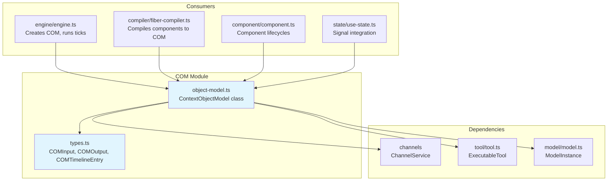
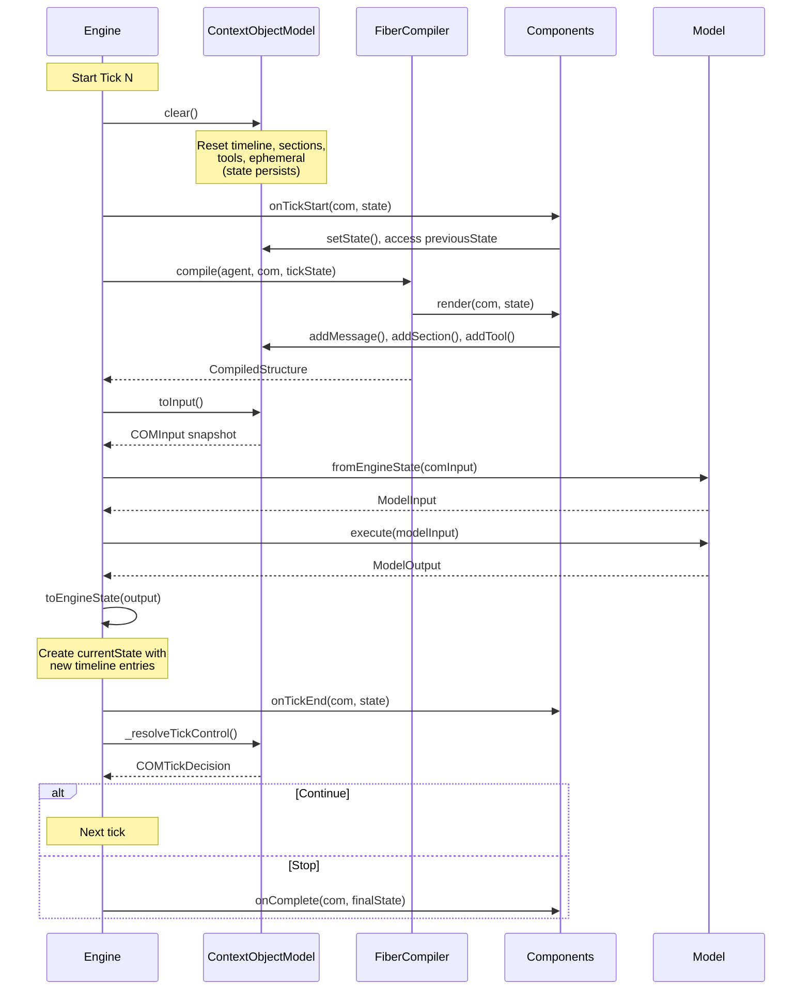
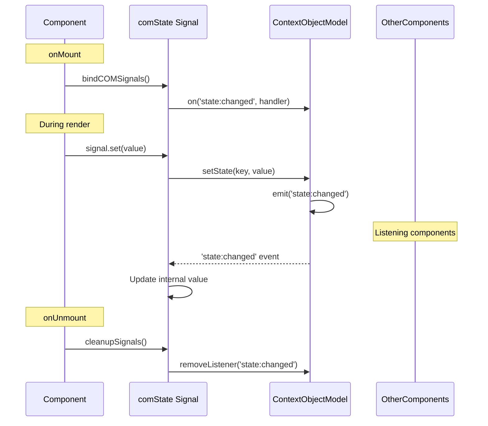

# aidk-core/com Architecture

> **The Context Object Model - shared state tree for agent execution**

The COM (Context Object Model) is the central data structure that components use to build the context sent to AI models. It's analogous to the DOM in web browsers - components declaratively manipulate the COM, and the engine "paints" it to the model.

---

## Table of Contents

1. [Overview](#overview)
2. [Module Structure](#module-structure)
3. [Core Concepts](#core-concepts)
4. [The COM Tree](#the-com-tree)
5. [API Reference](#api-reference)
6. [Data Flow](#data-flow)
7. [Integration with Signals/State](#integration-with-signalsstate)
8. [Timeline Management](#timeline-management)
9. [Message and Content Blocks](#message-and-content-blocks)
10. [Usage Examples](#usage-examples)
11. [Design Notes](#design-notes)

---

## Overview

### What This Module Does

The COM module provides:

- **Shared State Tree** - A mutable tree structure that components populate during render
- **Timeline Management** - Conversation history with messages, tool calls, and events
- **System Messages** - Declarative system prompts rebuilt fresh each tick
- **Sections** - Named content blocks that can be merged and formatted
- **Ephemeral Content** - Transient context that is not persisted across ticks
- **Tool Registration** - Dynamic tool availability per execution
- **State Sharing** - Key-value state shared across components
- **Tick Control** - Components can request stop/continue decisions
- **Event System** - Reactive notifications for all mutations

### Why It Exists

AIDK components need a shared data structure that:

1. **Enables composition** - Multiple components contribute to the same context
2. **Maintains conversation history** - Timeline persists across ticks
3. **Supports declarative rendering** - System messages/sections rebuilt each tick
4. **Provides reactivity** - Changes trigger events for signal synchronization
5. **Manages execution flow** - Components can influence when to stop

### Design Principles

- **DOM-like semantics** - Components manipulate the tree, engine renders to model
- **Declarative + Imperative** - Timeline is persistent, sections are declarative
- **Event-driven** - All mutations emit events for reactive binding
- **Separation of concerns** - Timeline (history) vs system (instructions) vs ephemeral (context)

---

## Module Structure



### File Overview

| File              | Size       | Purpose                                          |
| ----------------- | ---------- | ------------------------------------------------ |
| `object-model.ts` | 1134 lines | ContextObjectModel class - the shared state tree |
| `types.ts`        | 227 lines  | Type definitions for COM structures              |

---

## Core Concepts

### 1. The COM Lifecycle

The COM is created by the Engine and passed to all components during execution:

```
┌─────────────────────────────────────────────────────────────────┐
│                    COM Lifecycle per Execution                  │
├─────────────────────────────────────────────────────────────────┤
│                                                                 │
│  1. Engine creates COM with initial state + userInput           │
│     └─► new ContextObjectModel(initial, userInput, channels)    │
│                                                                 │
│  2. Components mount and register resources                     │
│     └─► onMount(com) - register tools, set initial state        │
│                                                                 │
│  3. For each tick:                                              │
│     ┌─► com.clear() - reset timeline, sections, tools           │
│     │                 (state persists, refs persist)            │
│     │                                                           │
│     ├─► onTickStart(com, state) - components prepare state      │
│     │                                                           │
│     ├─► render(com, state) - components populate COM            │
│     │   └─► addMessage(), addSection(), addTool(), etc.         │
│     │                                                           │
│     ├─► com.toInput() - snapshot for model                      │
│     │                                                           │
│     ├─► Model execution - send to AI, get response              │
│     │                                                           │
│     └─► onTickEnd(com, state) - process results                 │
│                                                                 │
│  4. onComplete(com, finalState) - execution finished            │
│                                                                 │
│  5. Components unmount                                          │
│     └─► onUnmount(com) - cleanup resources                      │
│                                                                 │
└─────────────────────────────────────────────────────────────────┘
```

### 2. Persistent vs Declarative Data

The COM manages two categories of data with different persistence semantics:

```
┌─────────────────────────────────────────────────────────────────┐
│                    Data Persistence Model                       │
├─────────────────────────────────────────────────────────────────┤
│                                                                 │
│  PERSISTENT (across ticks, via component state):                │
│  ─────────────────────────────────────────────────              │
│  • Timeline entries (messages, tool calls, events)              │
│  • COM state (key-value via getState/setState)                  │
│  • Component refs                                               │
│                                                                 │
│  Note: Timeline is managed BY COMPONENTS using comState         │
│  or by re-rendering from previousState each tick.               │
│                                                                 │
│  DECLARATIVE (rebuilt each tick):                               │
│  ─────────────────────────────────────────────────              │
│  • Sections (system prompt pieces)                              │
│  • System messages (consolidated from sections)                 │
│  • Ephemeral content (current context for model)                │
│  • Tools (available tools for this tick)                        │
│  • Metadata                                                     │
│                                                                 │
│  Cleared on com.clear() before each render phase.               │
│                                                                 │
└─────────────────────────────────────────────────────────────────┘
```

### 3. Event System

The COM extends `EventEmitter` to notify subscribers of mutations:

```typescript
interface COMEventMap {
  "message:added": [message: Message, options: {...}];
  "timeline:modified": [entry: COMTimelineEntry, action: "add" | "remove"];
  "tool:registered": [tool: ExecutableTool];
  "tool:added": [toolName: string];
  "tool:removed": [toolName: string];
  "state:changed": [key: string, value: unknown, previousValue: unknown];
  "state:cleared": [];
  "model:changed": [model: ModelInstance | string | undefined];
  "model:unset": [];
  "section:updated": [section: COMSection, action: "add" | "update"];
  "metadata:changed": [key: string, value: unknown, previousValue: unknown];
  "execution:message": [message: ExecutionMessage];
}
```

This event system enables the signal integration - `comState()` signals subscribe to `state:changed` events to stay synchronized.

---

## The COM Tree

The COM tree structure organizes different types of content:

```mermaid
graph TB
    COM[ContextObjectModel]

    subgraph "Persistent"
        STATE[State<br/>Record&lt;string, unknown&gt;]
        REFS[Refs<br/>Map&lt;string, Component&gt;]
    end

    subgraph "Declarative (rebuilt each tick)"
        TL[Timeline<br/>COMTimelineEntry[]]
        SYS[System Messages<br/>COMTimelineEntry[]]
        SEC[Sections<br/>Map&lt;string, COMSection&gt;]
        EPH[Ephemeral<br/>EphemeralEntry[]]
        TOOLS[Tools<br/>Map&lt;string, ExecutableTool&gt;]
        META[Metadata<br/>Record&lt;string, unknown&gt;]
    end

    subgraph "Execution Control"
        MODEL[Model<br/>ModelInstance | string]
        PROC[Process<br/>COMProcess]
        CHAN[Channels<br/>ChannelService]
        CTRL[Control Requests<br/>stop/continue]
    end

    COM --> STATE
    COM --> REFS
    COM --> TL
    COM --> SYS
    COM --> SEC
    COM --> EPH
    COM --> TOOLS
    COM --> META
    COM --> MODEL
    COM --> PROC
    COM --> CHAN
    COM --> CTRL

    style COM fill:#1565c0,color:#fff
    style STATE fill:#4caf50,color:#fff
    style REFS fill:#4caf50,color:#fff
```

### Node Types

#### COMTimelineEntry

A timeline entry wraps a message with metadata:

```typescript
interface COMTimelineEntry {
  kind: "message";
  message: Message & {
    content: SemanticContentBlock[];
  };
  tags?: TimelineTag[];
  visibility?: TimelineVisibility; // 'model' | 'observer' | 'log'
  metadata?: Record<string, unknown>;
  renderer?: ContentRenderer;
}
```

#### COMSection

Named content blocks that merge when sharing the same ID:

```typescript
interface COMSection {
  id: string;
  title?: string;
  content: SemanticContentBlock[] | string | unknown;
  formattedContent?: ContentBlock[]; // Cached formatted output
  formattedWith?: string; // Renderer ID for cache invalidation
  visibility?: TimelineVisibility;
  audience?: "model" | "human" | "system";
  tags?: TimelineTag[];
  metadata?: Record<string, unknown>;
  renderer?: ContentRenderer;
}
```

#### EphemeralEntry

Transient content positioned in the message stream:

```typescript
interface EphemeralEntry {
  type?: string; // Semantic categorization
  content: ContentBlock[]; // Content to include
  position: EphemeralPosition; // Where to place it
  order?: number; // Secondary sort order
  metadata?: Record<string, unknown>;
  id?: string; // For debugging
  tags?: string[];
}

type EphemeralPosition =
  | "start" // After system message
  | "end" // Before current user message
  | "before-user" // Immediately before last user message
  | "after-system" // Immediately after system message
  | "flow"; // In timeline flow (historical context)
```

---

## API Reference

### Construction

```typescript
const com = new ContextObjectModel(
  initial?: Partial<COMInput>,      // Initial state
  userInput?: EngineInput,          // Original user input
  channelService?: ChannelService,  // For bidirectional communication
  process?: COMProcess              // For fork/spawn operations
);
```

### Timeline Methods

```typescript
// Add a message (routes system messages to separate array)
com.addMessage(message: Message, options?: {
  tags?: TimelineTag[];
  visibility?: TimelineVisibility;
  metadata?: Record<string, unknown>;
}): void;

// Add raw timeline entry (for events or custom entries)
com.addTimelineEntry(entry: COMTimelineEntry): void;

// Get timeline entries
com.getTimeline(): COMTimelineEntry[];

// System messages (separate from timeline, rebuilt each tick)
com.addSystemMessage(message: Message): void;
com.getSystemMessages(): COMTimelineEntry[];
```

### Section Methods

```typescript
// Add/merge a section (same ID = content combined)
com.addSection(section: COMSection): void;

// Get section by ID
com.getSection(id: string): COMSection | undefined;

// Get all sections
com.getSections(): Record<string, COMSection>;
```

### Tool Methods

```typescript
// Register executable tool
com.addTool(tool: ExecutableTool): void;

// Add tool definition (client tools)
com.addToolDefinition(definition: ToolDefinition): void;

// Remove tool
com.removeTool(name: string): void;

// Get tools
com.getTool(name: string): ExecutableTool | undefined;
com.getTools(): ExecutableTool[];
com.getToolDefinition(name: string): ToolDefinition | undefined;
```

### State Methods

```typescript
// COM state (shared across components, persists across ticks)
com.getState<T>(key: string): T | undefined;
com.setState(key: string, value: unknown): void;
com.setStatePartial(partial: Record<string, unknown>): void;
com.getStateAll(): Record<string, unknown>;
```

### Ephemeral Methods

```typescript
// Add transient context content
com.addEphemeral(
  content: ContentBlock[],
  position?: EphemeralPosition,
  order?: number,
  metadata?: Record<string, unknown>,
  id?: string,
  tags?: string[],
  type?: string
): void;

// Get ephemeral entries
com.getEphemeral(): EphemeralEntry[];
```

### Model Methods

```typescript
// Set/get current model
com.setModel(model: ModelInstance | string | undefined): void;
com.getModel(): ModelInstance | string | undefined;
com.unsetModel(): void;

// Model options
com.setModelOptions(options: Partial<ModelConfig>): void;
com.getModelOptions(): ModelConfig | undefined;
```

### Component Ref Methods

```typescript
// Get component reference
com.getRef<T>(refName: string): T | undefined;

// Get all refs
com.getRefs(): Record<string, any>;

// Internal (called by compiler)
com._setRef(refName: string, instance: any): void;
com._removeRef(refName: string): void;
```

### Tick Control Methods

```typescript
// Request execution stop
com.requestStop(details?: {
  ownerId?: string | object;
  priority?: number;
  reason?: string;
  terminationReason?: string;
  status?: 'continue' | 'completed' | 'aborted';
  metadata?: Record<string, unknown>;
}): void;

// Request execution continue (overrides default stops)
com.requestContinue(details?: {
  ownerId?: string | object;
  priority?: number;
  reason?: string;
  metadata?: Record<string, unknown>;
}): void;

// Internal: resolve tick control decision
com._resolveTickControl(
  defaultStatus: COMTickStatus,
  defaultReason?: string,
  tickNumber?: number
): COMTickDecision;
```

### Recompile Methods

```typescript
// Request recompilation (for onAfterCompile)
com.requestRecompile(reason?: string): void;

// Internal
com._wasRecompileRequested(): boolean;
com._getRecompileReasons(): string[];
com._resetRecompileRequest(): void;
```

### Message Queue Methods

```typescript
// For execution messages
com.queueMessage(message: ExecutionMessage): void;
com.getQueuedMessages(): ExecutionMessage[];
com.clearQueuedMessages(): void;
```

### Abort Control

```typescript
// Request immediate abort (from onMessage)
com.abort(reason?: string): void;

// Check abort state
com.shouldAbort: boolean;
com.abortReason: string | undefined;

// Internal
com._resetAbortState(): void;
```

### Rendering

```typescript
// Clear for new render pass
com.clear(): void;

// Snapshot for model
com.toInput(): COMInput;
```

### Accessors

```typescript
// Original user input
com.getUserInput(): EngineInput | undefined;

// Channel service
com.getChannelService(): ChannelService | undefined;
com.channels: ChannelService | undefined;  // Shorthand

// Process operations
com.process: COMProcess | undefined;
```

---

## Data Flow

### Tick Execution Flow



### State Synchronization with Signals



---

## Integration with Signals/State

The COM integrates with the signals system via `comState()` and `watchComState()`:

### comState() - Bidirectional Binding

```typescript
class TimelineManager extends Component {
  // Declared as property - auto-bound to COM in onMount
  private timeline = comState<COMTimelineEntry[]>('timeline', []);

  onTickStart(com, state) {
    // Merge new entries from model output
    if (state.currentState?.timeline) {
      this.timeline.update(t => [...t, ...state.currentState.timeline]);
    }
  }

  render() {
    // Render from signal (auto-synced with COM)
    return (
      <Timeline>
        {this.timeline().map(entry => (
          <Message role={entry.message.role} content={entry.message.content} />
        ))}
      </Timeline>
    );
  }
}
```

### watch() - Read-Only Observation

```typescript
class TokenCounter extends Component {
  // Watch state owned by another component
  private timeline = watch<COMTimelineEntry[]>('timeline');

  // Computed value from watched state
  private tokenCount = computed(() =>
    this.timeline()?.reduce((sum, e) => sum + estimateTokens(e), 0) ?? 0
  );

  render() {
    if (this.tokenCount() > 3500) {
      return <Section id="warning" content="Approaching token limit!" />;
    }
    return null;
  }
}
```

### Automatic Binding Flow

```
┌─────────────────────────────────────────────────────────────────┐
│                  Signal Binding in onMount                       │
├─────────────────────────────────────────────────────────────────┤
│                                                                 │
│  1. Component declares: private data = comState('key', []);     │
│     └─► Creates placeholder signal marked with COM_SIGNAL_SYMBOL│
│                                                                 │
│  2. Compiler calls: bindCOMSignals(instance, com)               │
│     └─► Scans instance properties for COM_SIGNAL_SYMBOL         │
│                                                                 │
│  3. For each comState signal:                                   │
│     a. Get current COM value: com.getState('key')               │
│     b. Replace placeholder with real COMStateSignal             │
│     c. Subscribe to 'state:changed' events                      │
│     d. Set up bidirectional sync                                │
│                                                                 │
│  4. On signal.set(value):                                       │
│     └─► com.setState('key', value) + emit 'state:changed'       │
│                                                                 │
│  5. On 'state:changed' event (from other component):            │
│     └─► Update signal internal value                            │
│                                                                 │
└─────────────────────────────────────────────────────────────────┘
```

---

## Timeline Management

### Message Routing

The `addMessage()` method routes messages based on role:

```typescript
com.addMessage(message, options);
// If role === 'system':
//   → addSystemMessage() → systemMessages array
//   → NOT in timeline (rebuilt each tick)
// Else:
//   → addTimelineEntry() → timeline array
//   → Persisted via component state
```

### Timeline vs System Messages

```
┌─────────────────────────────────────────────────────────────────┐
│               Timeline vs System Messages                        │
├─────────────────────────────────────────────────────────────────┤
│                                                                 │
│  TIMELINE (conversation history):                               │
│  ─────────────────────────────────                              │
│  • User messages, assistant responses, tool calls/results       │
│  • Managed by components (comState or manual re-render)         │
│  • Persisted in previousState → currentState flow               │
│  • Sent to model as the message history                         │
│                                                                 │
│  SYSTEM MESSAGES (instructions):                                │
│  ─────────────────────────────────                              │
│  • System role messages, section content                        │
│  • Rebuilt fresh each tick (declarative)                        │
│  • NOT in previousState (prevents duplication)                  │
│  • Consolidated into single system message for model            │
│                                                                 │
│  Why separate?                                                  │
│  • Sections may change each tick (dynamic instructions)         │
│  • Prevents system message duplication across ticks             │
│  • Maintains declarative "what should be" semantics             │
│                                                                 │
└─────────────────────────────────────────────────────────────────┘
```

### Common Timeline Patterns

#### Pattern 1: Render from previousState + currentState

```typescript
class ConversationAgent extends Component {
  render(com, state) {
    // Combine previous and current entries
    const previousEntries = state.previousState?.timeline ?? [];
    const currentEntries = state.currentState?.timeline ?? [];

    return (
      <Fragment>
        <Section id="instructions" content="You are helpful." />

        {/* Re-render all previous messages */}
        {previousEntries.map(entry => (
          <Message role={entry.message.role} content={entry.message.content} />
        ))}

        {/* Render new messages from model */}
        {currentEntries.map(entry => (
          <Message role={entry.message.role} content={entry.message.content} />
        ))}
      </Fragment>
    );
  }
}
```

#### Pattern 2: Use comState for timeline

```typescript
class StatefulAgent extends Component {
  private timeline = comState<COMTimelineEntry[]>('timeline', []);

  onTickStart(com, state) {
    // On first tick, seed from userInput
    if (state.tick === 1 && state.currentState?.timeline) {
      this.timeline.set(state.currentState.timeline);
    }
    // On subsequent ticks, merge new entries
    else if (state.currentState?.timeline) {
      this.timeline.update(t => [...t, ...state.currentState.timeline]);
    }
  }

  render() {
    return (
      <Fragment>
        <Section id="instructions" content="You are helpful." />
        {this.timeline().map(entry => (
          <Message role={entry.message.role} content={entry.message.content} />
        ))}
      </Fragment>
    );
  }
}
```

---

## Message and Content Blocks

### Message Structure

Messages in the COM use `SemanticContentBlock` arrays:

```typescript
interface Message {
  role: "system" | "user" | "assistant" | "tool";
  content: SemanticContentBlock[];
}

// SemanticContentBlock types include:
type SemanticContentBlock =
  | { type: "text"; text: string }
  | { type: "code"; text: string; language?: string }
  | { type: "image"; source: ImageSource }
  | { type: "tool_use"; id: string; name: string; input: unknown }
  | { type: "tool_result"; toolUseId: string; content: ContentBlock[] };
// ... and more
```

### Content Block Flow

```
┌─────────────────────────────────────────────────────────────────┐
│                 Content Block Transformation                     │
├─────────────────────────────────────────────────────────────────┤
│                                                                 │
│  1. JSX Components create SemanticContentBlocks                 │
│     <Message role="user">                                       │
│       <Text>Hello</Text>                                        │
│       <Code language="ts">const x = 1;</Code>                   │
│     </Message>                                                  │
│     └─► { role: 'user', content: [                              │
│           { type: 'text', text: 'Hello' },                      │
│           { type: 'code', language: 'ts', text: 'const x = 1;' }│
│         ]}                                                      │
│                                                                 │
│  2. COM stores as-is (format-agnostic)                          │
│                                                                 │
│  3. fromEngineState() transforms for model                      │
│     └─► Applies ContentRenderer if needed                       │
│     └─► Converts to model-specific format                       │
│                                                                 │
│  4. Model returns ContentBlocks                                 │
│                                                                 │
│  5. toEngineState() normalizes back to SemanticContentBlocks    │
│                                                                 │
└─────────────────────────────────────────────────────────────────┘
```

---

## Usage Examples

### Basic Agent with Sections and Messages

```typescript
class SimpleAgent extends Component {
  render(com, state) {
    return (
      <Fragment>
        {/* System instructions (rebuilt each tick) */}
        <Section id="role" content="You are a helpful assistant." />
        <Section id="context" content={`Today is ${new Date().toDateString()}`} />

        {/* Conversation history */}
        {(state.previousState?.timeline ?? []).map(entry => (
          <Message role={entry.message.role} content={entry.message.content} />
        ))}

        {/* New messages from this tick */}
        {(state.currentState?.timeline ?? []).map(entry => (
          <Message role={entry.message.role} content={entry.message.content} />
        ))}
      </Fragment>
    );
  }
}
```

### Using Ephemeral Content

```typescript
class ContextAwareAgent extends Component {
  onTickStart(com) {
    // Add current state as ephemeral (not persisted)
    com.addEphemeral(
      [{ type: 'text', text: `Current balance: $${this.getBalance()}` }],
      'before-user',  // Position before user's message
      10              // Order (lower = earlier)
    );

    // Add inventory context
    com.addEphemeral(
      [{ type: 'text', text: `Available items: ${this.getItems().join(', ')}` }],
      'before-user',
      20
    );
  }

  render(com, state) {
    return (
      <Fragment>
        <Section id="instructions" content="Help the user manage their account." />
        {/* Timeline rendering... */}
      </Fragment>
    );
  }
}
```

### Dynamic Tool Registration

```typescript
class ToolProvider extends Component {
  onMount(com) {
    // Register base tools
    com.addTool(this.searchTool);
    com.addTool(this.calculateTool);
  }

  render(com, state) {
    // Conditionally add tools based on state
    if (this.userHasAdminRole()) {
      com.addTool(this.adminTool);
    }

    if (state.currentState?.toolCalls?.length > 0) {
      // Add debug tool after first tool use
      com.addTool(this.debugTool);
    }

    return null;
  }
}
```

### Tick Control

```typescript
class ResponseVerifier extends Component {
  render(com, state) {
    const lastResponse = state.currentState?.timeline?.find(
      (e) => e.message.role === "assistant",
    );

    if (lastResponse && this.isComplete(lastResponse)) {
      // Signal completion
      com.requestStop({
        reason: "response-complete",
        status: "completed",
      });
    }

    if (this.needsAnotherRound(state)) {
      // Override default stop
      com.requestContinue({
        reason: "needs-more-processing",
        priority: 10,
      });
    }

    return null;
  }
}
```

### Event Listening

```typescript
class ToolMonitor extends Component {
  onMount(com) {
    // Listen for tool registrations
    com.on("tool:registered", (tool) => {
      console.log(`Tool registered: ${tool.metadata.name}`);
    });

    // Listen for state changes
    com.on("state:changed", (key, value, prev) => {
      console.log(`State changed: ${key} = ${value} (was ${prev})`);
    });

    // Listen for messages
    com.on("message:added", (message, options) => {
      console.log(`Message added: ${message.role}`);
    });
  }

  onUnmount(com) {
    // Clean up listeners
    com.removeAllListeners("tool:registered");
    com.removeAllListeners("state:changed");
    com.removeAllListeners("message:added");
  }

  render() {
    return null;
  }
}
```

### Using Process Operations (Fork/Spawn)

```typescript
class OrchestratorAgent extends Component {
  render(com, state) {
    // Spawn a sub-agent for a subtask
    const handle = com.process?.spawn(
      { timeline: [{ message: { role: 'user', content: 'Analyze this data' } }] },
      DataAnalyzerAgent,
      { engineConfig: { maxTicks: 5 } }
    );

    // Fork with inherited state
    const forkHandle = com.process?.fork(
      { timeline: state.previousState?.timeline ?? [] },
      SummarizerAgent,
      { inherit: { timeline: true, state: true } }
    );

    return (
      <Fragment>
        <Section id="instructions" content="Orchestrate sub-tasks." />
        {/* ... */}
      </Fragment>
    );
  }
}
```

---

## Design Notes

### Why Separate System Messages from Timeline?

System messages are kept separate because:

1. **Declarative semantics** - Sections are "what should be", not "what was said"
2. **Prevents duplication** - Without separation, system messages would accumulate each tick
3. **Clean previousState** - Components render from previousState without filtering system messages
4. **Model optimization** - Single consolidated system message is more efficient

### Why Events Instead of Direct Observation?

The event system (EventEmitter) provides:

1. **Loose coupling** - Components don't need references to each other
2. **Synchronous delivery** - Events fire immediately during mutation
3. **Integration point** - Signals can subscribe to events
4. **Debugging** - Easy to log all mutations

### Why Persist State but Clear Sections?

Different data has different lifecycles:

- **State** persists because it's application data (user preferences, accumulated results)
- **Sections** clear because they're context (instructions may change based on state)
- **Timeline** is managed by components because they know what to keep/discard

### Section Merging Behavior

When multiple sections share the same ID:

```typescript
// String content: concatenate with newline
section1.content = "First";
section2.content = "Second";
// Result: "First\nSecond"

// Array content: concatenate
section1.content = [block1];
section2.content = [block2];
// Result: [block1, block2]

// Object content: merge (shallow)
section1.content = { a: 1 };
section2.content = { b: 2 };
// Result: { a: 1, b: 2 }

// Mixed types: convert to array
section1.content = "text";
section2.content = [block];
// Result: ["text", block]
```

---

## Summary

The Context Object Model (COM) is the shared state tree for AIDK agent execution:

- **ContextObjectModel** - The mutable tree that components populate
- **Timeline** - Conversation history (user, assistant, tool messages)
- **System Messages** - Declarative instructions rebuilt each tick
- **Sections** - Named content blocks that merge by ID
- **Ephemeral** - Transient context not persisted across ticks
- **State** - Shared key-value storage persisted across ticks
- **Events** - Reactive notifications for signal integration
- **Tick Control** - Components influence execution flow

Components render to the COM each tick, and the engine transforms the COM to model input via `fromEngineState()`. This DOM-like architecture enables declarative composition of complex agent behaviors.
