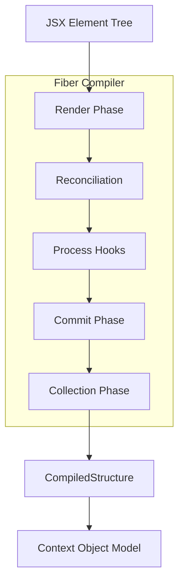

# aidk-core Compiler Architecture

> **The Fiber Compiler - Transforms JSX elements into Context Object Model structures**

The compiler module is the heart of AIDK's rendering pipeline. Like React's Fiber reconciler transforms JSX into DOM updates, the Fiber Compiler transforms AIDK JSX into `CompiledStructure` - the format-agnostic intermediate representation that gets applied to the Context Object Model (COM).

---

## Table of Contents

1. [Overview](#overview)
2. [Module Structure](#module-structure)
3. [Core Concepts](#core-concepts)
4. [Fiber Architecture](#fiber-architecture)
5. [Compilation Pipeline](#compilation-pipeline)
6. [Component Lifecycle Integration](#component-lifecycle-integration)
7. [Hooks System](#hooks-system)
8. [Reconciliation Process](#reconciliation-process)
9. [Content Block Registry](#content-block-registry)
10. [API Reference](#api-reference)
11. [Usage Examples](#usage-examples)
12. [React Comparison](#react-comparison)

---

## Overview

### What This Module Does

The compiler module provides:

- **Fiber-based Reconciliation** - Efficient tree diffing and updates between renders
- **Component Instance Management** - Mounting, updating, and unmounting class/function components
- **Hooks Runtime** - React-style hooks (`useState`, `useEffect`, etc.) for function components
- **JSX to Structure Transformation** - Converts JSX tree into `CompiledStructure`
- **Compile Stabilization** - Iteratively recompiles until components stop requesting changes
- **Lifecycle Orchestration** - Coordinates component lifecycle across tick phases
- **Content Block Mapping** - Transforms JSX content components into semantic content blocks

### Why It Exists

AIDK agents are defined declaratively using JSX, but AI models consume structured data (messages, tools, sections). The compiler bridges this gap:

1. **Declarative to Imperative** - Transform `<User>Hello</User>` into `{ role: 'user', content: [...] }`
2. **Component Composition** - Combine reusable components into a single context
3. **State Management** - Persist component state across ticks
4. **Reactive Updates** - Recompile when state changes

### Design Principles

- **Async-First** - All lifecycle methods and effects can be async (no UI thread to freeze)
- **Tick-Based** - Operates within engine tick phases, not continuous renders
- **Double Buffering** - Work-in-progress fiber tree for safe updates
- **Format Agnostic** - Outputs `CompiledStructure`, not formatted text
- **React-Inspired** - Familiar patterns for React developers

---

## Module Structure

```
compiler/
├── fiber-compiler.ts        # Main FiberCompiler class
├── fiber.ts                 # Fiber node creation and tree utilities
├── types.ts                 # Type definitions for fibers, hooks, effects
├── content-block-registry.ts # JSX-to-ContentBlock mappers
├── extractors.ts            # Semantic node extraction from JSX
├── structure-renderer.ts    # Transforms CompiledStructure to formatted output
├── index.ts                 # Public exports (re-exports hooks from ../state)
├── DESIGN.md                # Design philosophy document
└── ARCHITECTURE.md          # This file

state/
├── hooks.ts                 # React-style hooks implementation
├── signal.ts                # Signal/reactive state primitives
├── use-state.ts             # State hook utilities
└── index.ts                 # Public exports
```

> **Note:** Hooks are implemented in `state/hooks.ts` but re-exported from `compiler/index.ts` for convenience. This separation keeps reactive primitives together while maintaining the compiler's public API.

### File Overview

| File                        | Lines | Purpose                                                       |
| --------------------------- | ----- | ------------------------------------------------------------- |
| `fiber-compiler.ts`         | ~1800 | Main compiler with fiber reconciliation, lifecycle management |
| `fiber.ts`                  | ~310  | Fiber node creation, cloning, tree traversal utilities        |
| `types.ts`                  | ~520  | FiberNode, HookState, Effect, ComponentInstance types         |
| `content-block-registry.ts` | ~320  | Maps JSX components to SemanticContentBlock                   |
| `extractors.ts`             | ~500  | Extracts semantic trees from JSX elements                     |
| `structure-renderer.ts`     | ~400  | Transforms CompiledStructure to model-ready format            |
| `state/hooks.ts`            | ~800  | All hook implementations (useState, useEffect, etc.)          |
| `state/signal.ts`           | ~700  | Signal, ComputedSignal, COMStateSignal implementations        |

---

## Core Concepts

### 1. Fiber Nodes

A `FiberNode` is the internal representation of a component in the tree:

```typescript
interface FiberNode {
  // Identity
  type: ComponentType; // Function, class, string, or symbol
  key: string | number | null; // React-style key for reconciliation

  // Props
  props: Record<string, unknown>;
  pendingProps: Record<string, unknown> | null;

  // State
  stateNode: ComponentInstance | null; // Class component instance
  memoizedState: HookState | null; // Hook state linked list

  // Tree Structure
  parent: FiberNode | null;
  child: FiberNode | null;
  sibling: FiberNode | null;
  index: number;

  // Work Tracking
  flags: number; // Placement, Update, Deletion
  subtreeFlags: number;
  deletions: FiberNode[] | null;

  // Double Buffering
  alternate: FiberNode | null; // Previous/current fiber pair

  // Rendering Context
  renderer: ContentRenderer | null;
  ref: string | null;
}
```

### 2. Fiber Flags

Track what work needs to be done on a fiber:

```typescript
const FiberFlags = {
  NoFlags: 0b00000000,
  Placement: 0b00000001, // New fiber, needs mount
  Update: 0b00000010, // Props/state changed
  Deletion: 0b00000100, // Needs unmount
  ChildDeletion: 0b00001000, // Has children to unmount
  HasEffect: 0b00010000, // Has effects to run
  Ref: 0b00100000, // Has ref to update
};
```

### 3. Hook Tags

Identify the type of hook for each hook state entry:

```typescript
const HookTag = {
  // State hooks
  State: 0,
  Reducer: 1,
  ComState: 2,
  WatchState: 3,
  Signal: 4,

  // Effect hooks
  Effect: 10,
  TickStart: 11,
  TickEnd: 12,
  AfterCompile: 13,
  Mount: 14,
  Unmount: 15,
  OnMessage: 16,

  // Memoization hooks
  Memo: 20,
  Callback: 21,

  // Ref hooks
  Ref: 30,
  COMRef: 31,

  // Async hooks
  Async: 40,
  CachedAsync: 41,
};
```

### 4. Effect Phases

When effects run in the tick lifecycle:

```typescript
const EffectPhase = {
  TickStart: "tick-start", // Before render
  AfterCompile: "after-compile", // After compile, can request recompile
  TickEnd: "tick-end", // After model execution
  Commit: "commit", // General effect, after commit
  Mount: "mount", // Once when component mounts
  Unmount: "unmount", // Once when component unmounts
  OnMessage: "on-message", // Immediately when message received
};
```

---

## Fiber Architecture

### Double Buffering

The compiler maintains two fiber trees for safe updates:

```
┌─────────────────────────────────────────────────────────────────────────────┐
│                       DOUBLE BUFFERING                                       │
├─────────────────────────────────────────────────────────────────────────────┤
│                                                                              │
│   CURRENT TREE                    WORK-IN-PROGRESS TREE                      │
│   (committed state)               (being built)                              │
│                                                                              │
│   ┌─────────┐                     ┌─────────┐                                │
│   │  Root   │ ←─── alternate ───→ │  Root   │                                │
│   └────┬────┘                     └────┬────┘                                │
│        │                               │                                     │
│   ┌────┴────┐                     ┌────┴────┐                                │
│   │ Agent   │ ←─── alternate ───→ │ Agent   │                                │
│   └────┬────┘                     └────┬────┘                                │
│        │                               │                                     │
│  ┌─────┴─────┐                   ┌─────┴─────┐                               │
│  ↓     ↓     ↓                   ↓     ↓     ↓                               │
│ Sys  User  Tool                 Sys  User  Tool                              │
│                                                                              │
│  After commit:                                                               │
│  - WIP becomes CURRENT                                                       │
│  - Old CURRENT becomes next WIP (reused via alternate)                       │
│                                                                              │
└─────────────────────────────────────────────────────────────────────────────┘
```

### Fiber Tree Structure

Fibers form a tree using child/sibling pointers:

```
            ┌───────────────┐
            │  ChatAgent    │ (root fiber)
            │  stateNode:   │
            │  instance     │
            └───────┬───────┘
                    │ child
                    ↓
            ┌───────────────┐      sibling     ┌───────────────┐
            │    Section    │ ───────────────→ │   Timeline    │
            │   id="system" │                  │               │
            └───────┬───────┘                  └───────┬───────┘
                    │ child                            │ child
                    ↓                                  ↓
            ┌───────────────┐              ┌───────────────────┐
            │     Text      │              │  Entry (message)  │
            │ "You are..."  │              │  role: "user"     │
            └───────────────┘              └───────────────────┘
```

---

## Compilation Pipeline

### High-Level Flow



### Detailed Compilation Flow

```
┌─────────────────────────────────────────────────────────────────────────────┐
│                        COMPILATION PIPELINE                                  │
├─────────────────────────────────────────────────────────────────────────────┤
│                                                                              │
│  1. RENDER PHASE                                                             │
│  ───────────────                                                             │
│  ┌──────────────────────────────────────────────────────────────────────┐   │
│  │  beginWork(fiber, element)                                            │   │
│  │    │                                                                  │   │
│  │    ├─► Function Component                                             │   │
│  │    │   ├─ Set up RenderContext (for hooks)                            │   │
│  │    │   ├─ Call component(props, com, state)                           │   │
│  │    │   ├─ Collect effects from hooks                                  │   │
│  │    │   └─ Reconcile returned children                                 │   │
│  │    │                                                                  │   │
│  │    ├─► Class Component                                                │   │
│  │    │   ├─ Mount: new ComponentClass(props), call onMount              │   │
│  │    │   ├─ Update: update props signals                                │   │
│  │    │   ├─ Call render(com, state)                                     │   │
│  │    │   └─ Reconcile returned children                                 │   │
│  │    │                                                                  │   │
│  │    ├─► Fragment                                                       │   │
│  │    │   └─ Reconcile children directly                                 │   │
│  │    │                                                                  │   │
│  │    └─► Host Primitive (Section, Entry, etc.)                          │   │
│  │        └─ Reconcile props.children                                    │   │
│  └──────────────────────────────────────────────────────────────────────┘   │
│                                                                              │
│  2. RECONCILIATION                                                           │
│  ─────────────────                                                           │
│  ┌──────────────────────────────────────────────────────────────────────┐   │
│  │  reconcileChildren(parent, children)                                  │   │
│  │    │                                                                  │   │
│  │    ├─ For each child:                                                 │   │
│  │    │   ├─ Find old fiber by key/index                                 │   │
│  │    │   ├─ canReuse? → createWorkInProgress (clone + update)           │   │
│  │    │   └─ Can't reuse? → createFiber (new) + mark old for deletion    │   │
│  │    │                                                                  │   │
│  │    └─ Link fibers via child/sibling pointers                          │   │
│  └──────────────────────────────────────────────────────────────────────┘   │
│                                                                              │
│  3. COMMIT PHASE                                                             │
│  ───────────────                                                             │
│  ┌──────────────────────────────────────────────────────────────────────┐   │
│  │  commitWork()                                                         │   │
│  │    │                                                                  │   │
│  │    ├─ Process deletions (unmount old fibers)                          │   │
│  │    │   └─ Call cleanup effects, onUnmount                             │   │
│  │    │                                                                  │   │
│  │    ├─ Run mount effects (EffectPhase.Mount)                           │   │
│  │    │                                                                  │   │
│  │    └─ Run commit effects (EffectPhase.Commit)                         │   │
│  └──────────────────────────────────────────────────────────────────────┘   │
│                                                                              │
│  4. COLLECTION PHASE                                                         │
│  ──────────────────                                                          │
│  ┌──────────────────────────────────────────────────────────────────────┐   │
│  │  collectStructures(fiber)                                             │   │
│  │    │                                                                  │   │
│  │    ├─ traverseAndCollect()                                            │   │
│  │    │   ├─ Section → collected.sections                                │   │
│  │    │   ├─ Entry (message) → collected.timelineEntries                 │   │
│  │    │   ├─ Ephemeral → collected.ephemeral                             │   │
│  │    │   ├─ Tool → collected.tools                                      │   │
│  │    │   └─ Content types → systemMessageItems                          │   │
│  │    │                                                                  │   │
│  │    └─ Return CompiledStructure                                        │   │
│  └──────────────────────────────────────────────────────────────────────┘   │
│                                                                              │
└─────────────────────────────────────────────────────────────────────────────┘
```

### Compile Stabilization Loop

Components can request recompilation during `onAfterCompile`:

```
┌─────────────────────────────────────────────────────────────────────────────┐
│                    COMPILE STABILIZATION LOOP                                │
├─────────────────────────────────────────────────────────────────────────────┤
│                                                                              │
│  compileUntilStable(element, state, { maxIterations: 10 })                   │
│                                                                              │
│  ┌────────────────────────────────────────────────────────────────────────┐ │
│  │                                                                        │ │
│  │   ┌─────────┐                                                          │ │
│  │   │ Compile │ ←──────────────────────────────────────────────┐         │ │
│  │   └────┬────┘                                                │         │ │
│  │        │                                                     │         │ │
│  │        ▼                                                     │         │ │
│  │   ┌────────────────┐                                         │         │ │
│  │   │ AfterCompile   │                                         │         │ │
│  │   │ Callbacks      │                                         │         │ │
│  │   └────────┬───────┘                                         │         │ │
│  │            │                                                 │         │ │
│  │            ▼                                                 │         │ │
│  │   ┌────────────────────────────┐                             │         │ │
│  │   │ notifyAfterCompile()       │                             │         │ │
│  │   │ - Class: onAfterCompile()  │                             │         │ │
│  │   │ - Hooks: useAfterCompile() │                             │         │ │
│  │   └────────┬───────────────────┘                             │         │ │
│  │            │                                                 │         │ │
│  │            ▼                                                 │         │ │
│  │   ┌────────────────────────┐     Yes     ┌─────────────────┐ │         │ │
│  │   │ wasRecompileRequested? │─────────────│ iterations < max │────┐     │ │
│  │   └────────┬───────────────┘             └─────────────────┘    │     │ │
│  │            │ No                                                  │     │ │
│  │            ▼                                                     │     │ │
│  │   ┌────────────────┐                                             │     │ │
│  │   │ Return Result  │ ←───────────────────────────────────────────┘     │ │
│  │   │ { compiled,    │  (forcedStable if maxIterations reached)          │ │
│  │   │   iterations,  │                                                   │ │
│  │   │   ... }        │                                                   │ │
│  │   └────────────────┘                                                   │ │
│  │                                                                        │ │
│  └────────────────────────────────────────────────────────────────────────┘ │
│                                                                              │
└─────────────────────────────────────────────────────────────────────────────┘
```

---

## Component Lifecycle Integration

### Lifecycle Methods Across Phases

```
┌─────────────────────────────────────────────────────────────────────────────┐
│                    COMPONENT LIFECYCLE IN TICK                               │
├─────────────────────────────────────────────────────────────────────────────┤
│                                                                              │
│  ENGINE                    COMPILER                     COMPONENTS           │
│  ──────                    ────────                     ──────────           │
│                                                                              │
│  tick.start()                                                                │
│      │                                                                       │
│      ├──────────────────► notifyTickStart(state)                             │
│      │                         │                                             │
│      │                         ├──────────────────► useTickStart effects     │
│      │                         │                                             │
│      │                         └──────────────────► onTickStart(com, state)  │
│      │                                                                       │
│      ├──────────────────► compile(element, state)                            │
│      │                         │                                             │
│      │                         ├─ Mount new components ──► onMount(com)      │
│      │                         │                                             │
│      │                         ├─ Render all ──────────► render(com, state)  │
│      │                         │                                             │
│      │                         └─ Commit effects ──────► useEffect callbacks │
│      │                                                                       │
│      ├──────────────────► compileUntilStable (loop)                          │
│      │                         │                                             │
│      │                         └──────────────────► onAfterCompile(...)      │
│      │                                             useAfterCompile(...)      │
│      │                                                                       │
│  [Model Execution]                                                           │
│      │                                                                       │
│      ├──────────────────► notifyTickEnd(state)                               │
│      │                         │                                             │
│      │                         ├──────────────────► useTickEnd effects       │
│      │                         │                                             │
│      │                         └──────────────────► onTickEnd(com, state)    │
│      │                                                                       │
│  [Next tick or complete]                                                     │
│      │                                                                       │
│      ├──────────────────► notifyComplete(finalState)                         │
│      │                         │                                             │
│      │                         └──────────────────► onComplete(com, final)   │
│      │                                                                       │
│      └──────────────────► unmount()                                          │
│                                │                                             │
│                                └──────────────────► onUnmount(com)           │
│                                                     useEffect cleanup        │
│                                                                              │
└─────────────────────────────────────────────────────────────────────────────┘
```

### Message Handling

Messages can arrive at any time during execution:

```
┌─────────────────────────────────────────────────────────────────────────────┐
│                       MESSAGE NOTIFICATION FLOW                              │
├─────────────────────────────────────────────────────────────────────────────┤
│                                                                              │
│  Message arrives via:                                                        │
│  - ExecutionHandle.send()                                                    │
│  - CompileSession.sendMessage()                                              │
│  - Channel event with type='message'                                         │
│                                                                              │
│       │                                                                      │
│       ▼                                                                      │
│  ┌──────────────────────────────────────┐                                    │
│  │ compiler.notifyOnMessage(message, state)                                  │
│  └──────────────────┬───────────────────┘                                    │
│                     │                                                        │
│                     ▼                                                        │
│  ┌──────────────────────────────────────┐                                    │
│  │ traverseFiber(current, async (fiber) => {                                 │
│  │   // Class components                                                     │
│  │   if (fiber.stateNode?.onMessage) {                                       │
│  │     await fiber.stateNode.onMessage(com, message, state);                 │
│  │   }                                                                       │
│  │                                                                           │
│  │   // Function component hooks                                             │
│  │   let hook = fiber.memoizedState;                                         │
│  │   while (hook) {                                                          │
│  │     if (hook.tag === HookTag.OnMessage) {                                 │
│  │       await hook.memoizedState(com, message, state);                      │
│  │     }                                                                     │
│  │     hook = hook.next;                                                     │
│  │   }                                                                       │
│  │ })                                                                        │
│  └──────────────────────────────────────┘                                    │
│                                                                              │
└─────────────────────────────────────────────────────────────────────────────┘
```

---

## Hooks System

### Hook State Storage

Function component state is stored in a linked list on the fiber:

```
┌─────────────────────────────────────────────────────────────────────────────┐
│                       HOOK STATE LINKED LIST                                 │
├─────────────────────────────────────────────────────────────────────────────┤
│                                                                              │
│  FiberNode                                                                   │
│  ┌────────────────────────────────────────────────┐                          │
│  │  memoizedState ─────┐                          │                          │
│  └─────────────────────┼──────────────────────────┘                          │
│                        │                                                     │
│                        ▼                                                     │
│              ┌─────────────────────┐                                         │
│              │ HookState #0        │                                         │
│              │ tag: State          │   (from useState)                       │
│              │ memoizedState: 0    │   (current value)                       │
│              │ queue: UpdateQueue  │   (pending updates)                     │
│              │ next ───────────────┼───┐                                     │
│              └─────────────────────┘   │                                     │
│                                        ▼                                     │
│              ┌─────────────────────┐                                         │
│              │ HookState #1        │                                         │
│              │ tag: Effect         │   (from useEffect)                      │
│              │ effect: Effect      │   (effect object)                       │
│              │ next ───────────────┼───┐                                     │
│              └─────────────────────┘   │                                     │
│                                        ▼                                     │
│              ┌─────────────────────┐                                         │
│              │ HookState #2        │                                         │
│              │ tag: ComState       │   (from useComState)                    │
│              │ memoizedState: sig  │   (COMStateSignal)                      │
│              │ next: null          │                                         │
│              └─────────────────────┘                                         │
│                                                                              │
└─────────────────────────────────────────────────────────────────────────────┘
```

### Hook Categories

#### State Hooks

```typescript
// Local component state (deprecated - use useSignal)
const [value, setValue] = useState<T>(initial);

// Reducer pattern
const [state, dispatch] = useReducer(reducer, initialState);

// Signal-based state (recommended)
const count = useSignal(0);
count.set(10); // or count.update(n => n + 1)

// COM-bound shared state
const timeline = useComState<Message[]>("timeline", []);

// Read-only COM state observation
const status = useWatch<string>("agentStatus", "idle");
```

#### Effect Hooks

```typescript
// General side effect (runs after commit)
useEffect(() => {
  // setup (CAN be async in AIDK!)
  return () => {
    /* cleanup */
  };
}, [deps]);

// Lifecycle effects
useOnMount((com) => {
  /* once on mount */
});
useOnUnmount((com) => {
  /* once on unmount */
});

// Tick phase effects
useTickStart((com, state) => {
  /* before render */
});
useTickEnd((com, state) => {
  /* after model execution */
});
useAfterCompile((com, compiled, state) => {
  // inspect compiled output
  // optionally: com.requestRecompile(reason);
});

// Message handling
useOnMessage((com, message, state) => {
  if (message.type === "stop") com.abort();
});

// Blocking initialization (runs during render)
await useInit(async (com, state) => {
  const data = await loadData();
  // ...
});
```

#### Memoization Hooks

```typescript
// Memoize expensive computation
const expensive = useMemo(() => compute(deps), [deps]);

// Memoize callback (stable reference)
const handler = useCallback(() => {
  /* ... */
}, [deps]);

// Reactive computed signal (persists across renders)
const recentMessages = useComputed(() => timeline().slice(-10), []);
```

#### Ref Hooks

```typescript
// Mutable ref
const ref = useRef<MyType>(initialValue);

// Access COM component ref
const myAgent = useCOMRef<MyAgent>("myAgentRef");
```

### Render Context

During render, a global context tracks the current fiber for hooks:

```typescript
let renderContext: RenderContext | null = null;

interface RenderContext {
  fiber: FiberNode; // Current fiber being rendered
  com: COM; // COM instance
  tickState: TickState; // Current tick state
  currentHook: HookState | null; // From previous render
  workInProgressHook: HookState | null; // Being built
  abortSignal?: AbortSignal;
}
```

### AsyncLocalStorage Isolation

The compiler uses `AsyncLocalStorage` for thread-safe operation:

```typescript
const compilerContext = new AsyncLocalStorage<FiberCompiler>();

// During compile, run within context
async compile(element, state) {
  return compilerContext.run(this, async () => {
    // Hooks can access compiler via getActiveCompiler()
    // ...
  });
}

// Used by signals to request recompile
export function getActiveCompiler(): FiberCompiler | null {
  return compilerContext.getStore() ?? null;
}
```

---

## Reconciliation Process

### Key-Based Matching

```typescript
function reconcileChildren(parent: FiberNode, children: NormalizedChild[]) {
  const oldChildren = getChildFibers(parent.alternate);

  for (let i = 0; i < children.length; i++) {
    const child = children[i];
    const oldFiber = oldChildren[i] ?? null;

    if (child.kind === "element") {
      if (oldFiber && canReuse(oldFiber, child.element)) {
        // Reuse: clone old fiber, update props
        newFiber = createWorkInProgress(oldFiber, child.element.props);
      } else {
        // Create new fiber
        newFiber = createFiber(
          child.element.type,
          child.element.props,
          child.element.key,
        );
        newFiber.flags |= FiberFlags.Placement;
      }
    }

    // Link into tree...
  }

  // Mark remaining old fibers for deletion
  for (let i = children.length; i < oldChildren.length; i++) {
    markForDeletion(parent, oldChildren[i]);
  }
}

function canReuse(oldFiber: FiberNode, element: JSX.Element): boolean {
  return (
    oldFiber.type === element.type && oldFiber.key === (element.key ?? null)
  );
}
```

### Child Normalization

```typescript
function normalizeChildren(children: unknown): NormalizedChild[] {
  // Handle: null, undefined, false → []
  // Handle: JSX.Element → [{ kind: 'element', element }]
  // Handle: ContentBlock → [{ kind: 'content-block', block }]
  // Handle: string/number → [{ kind: 'text', text }]
  // Handle: Array → flatten and normalize each
}

type NormalizedChild =
  | { kind: "element"; element: JSX.Element }
  | { kind: "content-block"; block: ContentBlock }
  | { kind: "text"; text: string };
```

---

## Content Block Registry

### JSX to ContentBlock Mapping

The registry maps JSX component types to `SemanticContentBlock` converters:

```typescript
type ContentBlockMapper = (
  element: JSX.Element,
  currentRenderer?: ContentRenderer,
) => SemanticContentBlock | null;

// Registration during initialization
register(
  Text,
  (el, renderer) => {
    const semanticNode = extractSemanticNodeFromElement(el, renderer);
    return { type: "text", text: "", semanticNode };
  },
  "text",
);

register(
  Image,
  (el) => ({
    type: "image",
    source: el.props.source,
    mimeType: el.props.mimeType,
    altText: el.props.altText,
  }),
  "image",
);

// Semantic primitives
register(
  H1,
  (el, renderer) => ({
    type: "text",
    text: "",
    semanticNode: extractSemanticNodeFromElement(el, renderer),
    semantic: { type: "heading", level: 1 },
  }),
  "h1",
);
```

### Semantic Node Extraction

Builds a semantic tree from nested JSX:

```typescript
// Input:
<Text>Hello <strong>world</strong> with <code>code</code></Text>

// Output:
{
  children: [
    { text: 'Hello ' },
    { semantic: 'strong', children: [{ text: 'world' }] },
    { text: ' with ' },
    { semantic: 'code', children: [{ text: 'code' }] }
  ]
}
```

---

## API Reference

### FiberCompiler

```typescript
class FiberCompiler {
  constructor(
    com: COM,
    hookRegistry?: ComponentHookRegistry,
    config?: FiberCompilerConfig,
  );

  // Compilation
  compile(element: JSX.Element, state: TickState): Promise<CompiledStructure>;
  compileUntilStable(
    element: JSX.Element,
    state: TickState,
    options?: {
      maxIterations?: number;
    },
  ): Promise<CompileResult>;

  // Lifecycle notifications
  notifyStart(): Promise<void>;
  notifyTickStart(state: TickState): Promise<void>;
  notifyTickEnd(state: TickState): Promise<void>;
  notifyAfterCompile(compiled, state, ctx): Promise<void>;
  notifyComplete(finalState: unknown): Promise<void>;
  notifyError(state: TickState): Promise<RecoveryAction | null>;
  notifyOnMessage(message: ExecutionMessage, state: TickState): Promise<void>;

  // Cleanup
  unmount(): Promise<void>;

  // State queries
  isRenderingNow(): boolean;
  isInTickStart(): boolean;
  isInTickEnd(): boolean;
  shouldSkipRecompile(): boolean;
}
```

### Fiber Utilities

```typescript
// Creation
createFiber(type, props, key): FiberNode;
createWorkInProgress(current, pendingProps): FiberNode;
cloneFiber(fiber, overrides?): FiberNode;

// Traversal
getChildFibers(fiber): FiberNode[];
findFiberByKey(firstChild, key): FiberNode | null;
traverseFiber(fiber, callback): Promise<void>;
traverseFiberBottomUp(fiber, callback): Promise<void>;

// Hook helpers
getHookCount(fiber): number;
getHookAtIndex(fiber, index): HookState | null;

// Debugging
fiberToDebugString(fiber): string;
fiberTreeToDebugString(fiber, indent?): string;

// Renderer
findNearestRenderer(fiber): ContentRenderer | null;
setFiberRenderer(fiber, renderer): void;
```

### Compiled Output

```typescript
interface CompiledStructure {
  sections: Map<string, CompiledSection>;
  timelineEntries: CompiledTimelineEntry[];
  systemMessageItems: SystemMessageItem[];
  tools: Array<{ name: string; tool: ExecutableTool }>;
  ephemeral: CompiledEphemeral[];
  metadata: Record<string, unknown>;
}

interface CompileResult {
  compiled: CompiledStructure;
  iterations: number;
  forcedStable: boolean;
  recompileReasons: string[];
}
```

---

## Usage Examples

### Function Component with Hooks

```tsx
function ChatAgent({ maxTurns }: { maxTurns: number }) {
  const count = useSignal(0);
  const timeline = useComState<Message[]>("timeline", []);

  useTickStart((com, state) => {
    if (state.current?.timeline) {
      timeline.update((t) => [...t, ...state.current.timeline]);
      count.update((c) => c + 1);
    }
  });

  useTickEnd((com, state) => {
    if (count() >= maxTurns) {
      state.stop("max turns reached");
    }
  });

  useEffect(async () => {
    await logToServer({ turns: count(), messages: timeline().length });
  }, [count()]);

  return (
    <>
      <Section id="system">
        <Text>You are a helpful assistant.</Text>
      </Section>
      <Timeline>
        {timeline().map((msg, i) => (
          <Message key={i} role={msg.role}>
            {msg.content}
          </Message>
        ))}
      </Timeline>
    </>
  );
}
```

### Class Component with Signals

```tsx
class StatefulAgent extends Component<
  { model: Model },
  { messageCount: number }
> {
  private timeline = comState<Message[]>("timeline", []);

  static tags = ["chat", "agent"];

  async onMount(com: COM) {
    const history = await loadHistory();
    this.timeline.set(history);
  }

  async onTickStart(com: COM, state: TickState) {
    if (state.current?.timeline) {
      this.timeline.update((t) => [...t, ...state.current.timeline]);
    }
  }

  render(com: COM, state: TickState): JSX.Element {
    return (
      <Fragment>
        <Model model={this.props.model} />
        <Section id="system">
          <Text>You are helpful. Message count: {this.timeline().length}</Text>
        </Section>
        {this.timeline().map((msg, i) => (
          <Message key={i} role={msg.role}>
            {msg.content}
          </Message>
        ))}
      </Fragment>
    );
  }
}
```

### Non-Rendering Controller Component

```tsx
function ExecutionController({ maxTurns }: { maxTurns: number }) {
  const turns = useSignal(0);

  useTickEnd((com, state) => {
    turns.update((t) => t + 1);
    if (turns() >= maxTurns) {
      state.stop("max turns reached");
    }
  });

  return null; // No output - just manages execution
}
```

### Using Compile Stabilization

```tsx
class DynamicAgent extends Component {
  async onAfterCompile(
    com: COM,
    compiled: CompiledStructure,
    state: TickState,
    ctx: AfterCompileContext,
  ) {
    // Inspect compiled output
    if (compiled.timelineEntries.length > 100) {
      // Modify state
      com.setState("truncateTimeline", true);
      // Request recompile to apply changes
      com.requestRecompile("timeline too long");
    }
  }

  render(com: COM, state: TickState) {
    const shouldTruncate = com.getState<boolean>("truncateTimeline");
    const timeline = this.timeline();
    const visible = shouldTruncate ? timeline.slice(-50) : timeline;

    return (
      <Timeline>
        {visible.map((msg, i) => (
          <Message key={i} role={msg.role}>
            {msg.content}
          </Message>
        ))}
      </Timeline>
    );
  }
}
```

---

## React Comparison

### Similarities

| Feature                     | React | AIDK Compiler |
| --------------------------- | ----- | ------------- |
| Fiber nodes                 | Yes   | Yes           |
| Double buffering            | Yes   | Yes           |
| Hooks (useState, useEffect) | Yes   | Yes           |
| Reconciliation by key       | Yes   | Yes           |
| Component lifecycle         | Yes   | Yes           |
| Fragment support            | Yes   | Yes           |

### Key Differences

| Aspect              | React                     | AIDK Compiler                    |
| ------------------- | ------------------------- | -------------------------------- |
| **Async**           | Effects after paint       | All phases can be async          |
| **Suspense**        | Throw promise pattern     | Not needed - we can wait         |
| **Concurrent mode** | Time-slicing for 60fps    | Not needed - no UI thread        |
| **Output**          | DOM mutations             | CompiledStructure data           |
| **Tick model**      | Continuous event-driven   | Discrete tick phases             |
| **Effect timing**   | After paint, before paint | TickStart, AfterCompile, TickEnd |
| **State scope**     | Component local + Context | Component + COM (shared)         |

### Why No Concurrent Mode?

React's concurrent mode solves UI problems AIDK doesn't have:

```
React's Problems:               AIDK's Situation:
─────────────────               ─────────────────
Long renders freeze UI    →     No UI to freeze
Need to prioritize input  →     No user input during tick
Time-slice for 60fps      →     No fps requirement
Interruptible rendering   →     We WANT to complete
```

What AIDK uses instead:

- **AbortController** for cancellation
- **Compile stabilization** for recompile loops
- **Async phases** for waiting on async work

---

## Summary

The Fiber Compiler is the bridge between declarative JSX and AI model consumption:

- **Fiber tree** provides efficient reconciliation and state management
- **Double buffering** enables safe concurrent updates
- **Hooks system** brings React-style state and effects to function components
- **Compile stabilization** handles dynamic component updates
- **Content block registry** transforms JSX to semantic structures
- **Lifecycle orchestration** integrates with engine tick phases

The async-first, tick-based design aligns with AI agent execution patterns while maintaining familiar React-like patterns for developers.
