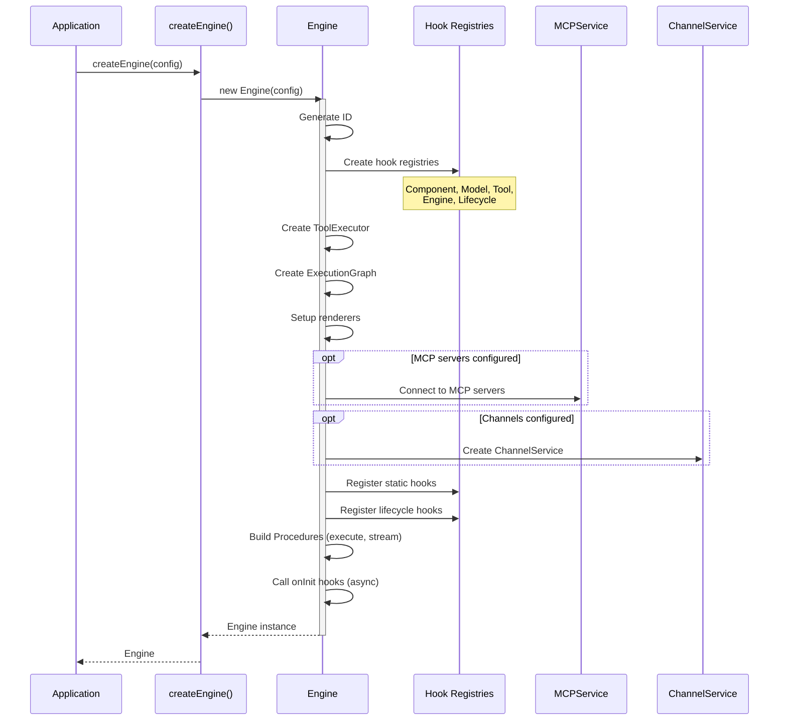
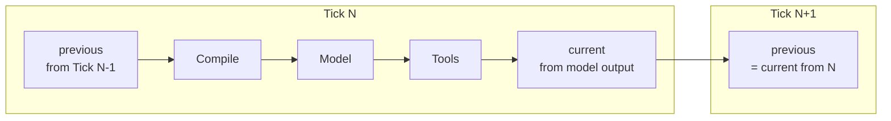
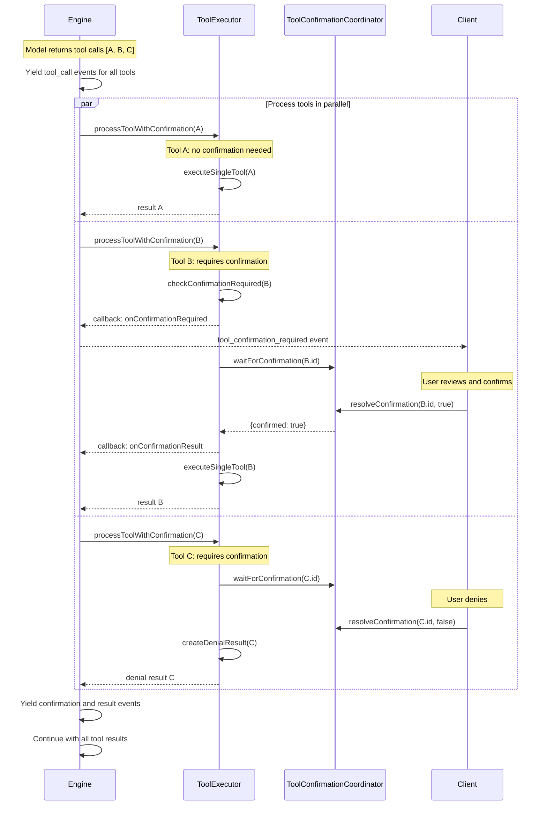
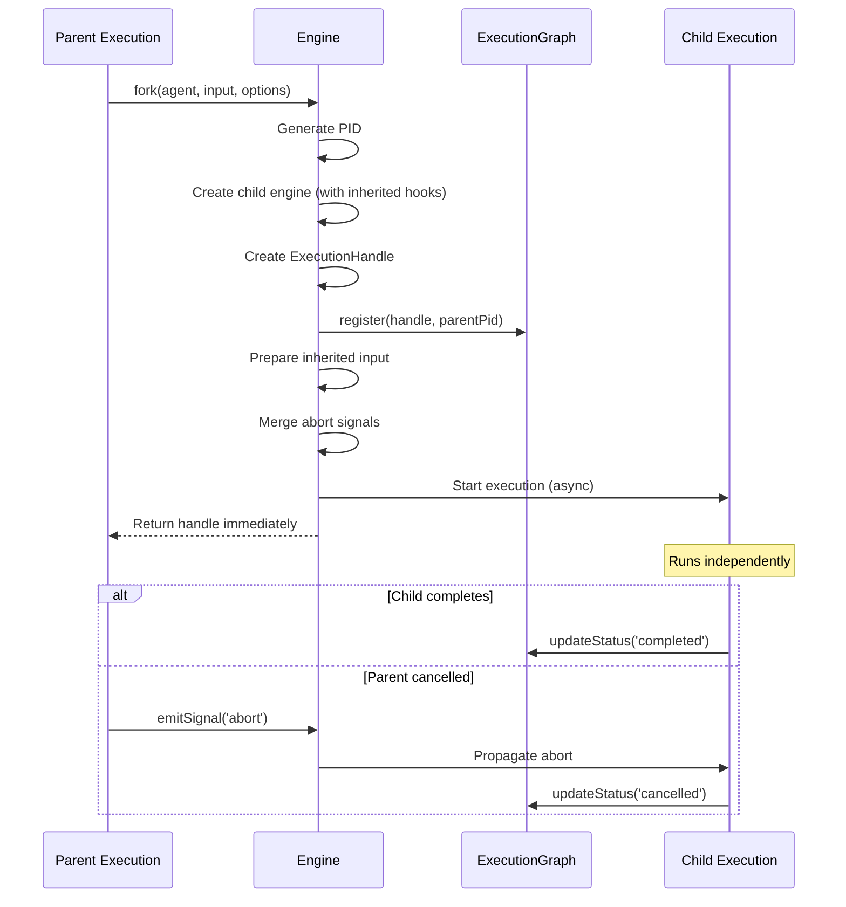

# Engine Module Architecture

> **The Execution Orchestrator - The heart of AIDK that coordinates compilation, model calls, and tool execution**

The Engine is the central orchestrator of AIDK. It manages the complete lifecycle of agent execution: creating execution contexts, running the tick loop, coordinating between the compiler (JSX to COM), model adapters (AI calls), and tool executors (function calls). Every agent execution flows through the Engine.

---

## Table of Contents

1. [Overview](#overview)
2. [Module Structure](#module-structure)
3. [Core Concepts](#core-concepts)
4. [Engine Lifecycle](#engine-lifecycle)
5. [Tick Execution Phases](#tick-execution-phases)
6. [Process Management](#process-management)
7. [Streaming and Events](#streaming-and-events)
8. [Hook System](#hook-system)
9. [Error Handling and Recovery](#error-handling-and-recovery)
10. [API Reference](#api-reference)
11. [Usage Examples](#usage-examples)
12. [Integration Points](#integration-points)

---

## Overview

### What This Module Does

The Engine module provides:

- **Execution Orchestration** - Coordinates compiler, model, and tool execution in a tick loop
- **Procedure-Based API** - `execute()` and `stream()` are Kernel Procedures with full middleware support
- **Process Management** - Fork and spawn child executions with state inheritance
- **Execution Handles** - Track execution status, metrics, cancellation, and signals
- **Lifecycle Hooks** - Engine-level hooks for initialization, shutdown, and execution events
- **Tool Execution** - Routes tool calls to server, client, provider, or MCP endpoints
- **State Persistence** - Optional persistence for crash recovery and long-running executions

### Why It Exists

AIDK separates concerns across multiple modules (compiler, model, tools, COM). The Engine:

1. **Orchestrates the tick loop** - Each tick: compile → model call → tool execution → state update
2. **Manages execution lifecycle** - Create, start, pause, cancel, complete
3. **Provides observability** - Events, metrics, procedure graphs
4. **Enables concurrency** - Fork/spawn for parallel agent execution
5. **Handles errors gracefully** - Component recovery, abort handling, state persistence

### Design Principles

- **Procedure-first** - All operations are Kernel Procedures for tracking and middleware
- **Event-driven** - Stream events for real-time UI updates
- **Compositional** - Engines can spawn child engines with inherited state
- **Resilient** - Abort handling, error recovery, state persistence

---

## Module Structure

```
engine/
├── engine.ts                    # Main Engine class (2652 lines)
├── execution-handle.ts          # ExecutionHandleImpl class
├── execution-types.ts           # Type definitions (ExecutionHandle, SignalEvent, etc.)
├── execution-graph.ts           # Parent-child execution tracking
├── engine-events.ts             # Stream event type definitions
├── engine-response.ts           # Model response structure
├── engine-hooks.ts              # Engine operation hook registry
├── engine-lifecycle-hooks.ts    # Engine lifecycle hook registry
├── tool-executor.ts             # Tool routing and execution
├── client-tool-coordinator.ts   # Client tool result coordination
├── tool-confirmation-coordinator.ts  # Tool confirmation coordination
├── factory.ts                   # createEngine() factory function
└── index.ts                     # Public exports
```

```mermaid
graph TB
    subgraph "Engine Core"
        ENG[engine.ts<br/>Engine class]
        FAC[factory.ts<br/>createEngine()]
    end

    subgraph "Execution Management"
        EH[execution-handle.ts<br/>ExecutionHandleImpl]
        ET[execution-types.ts<br/>ExecutionHandle, SignalEvent]
        EG[execution-graph.ts<br/>ExecutionGraph]
    end

    subgraph "Hooks & Events"
        HK[engine-hooks.ts<br/>EngineHookRegistry]
        LH[engine-lifecycle-hooks.ts<br/>LifecycleHookRegistry]
        EV[engine-events.ts<br/>EngineStreamEvent]
        ER[engine-response.ts<br/>EngineResponse]
    end

    subgraph "Tool Execution"
        TE[tool-executor.ts<br/>ToolExecutor]
        CT[client-tool-coordinator.ts<br/>ClientToolCoordinator]
    end

    subgraph "Dependencies"
        COM[com/object-model.ts]
        COMP[compiler/fiber-compiler.ts]
        MOD[model/model.ts]
        TOOL[tool/tool.ts]
        KERN[kernel]
    end

    FAC --> ENG
    ENG --> EH
    ENG --> EG
    ENG --> TE
    ENG --> HK
    ENG --> LH
    EH --> ET
    EH --> EG
    TE --> CT

    ENG --> COM
    ENG --> COMP
    ENG --> MOD
    ENG --> TOOL
    ENG --> KERN

    style ENG fill:#1565c0,color:#fff
    style EH fill:#4caf50,color:#fff
    style EG fill:#4caf50,color:#fff
```

### File Overview

| File                               | Lines | Purpose                                   |
| ---------------------------------- | ----- | ----------------------------------------- |
| `engine.ts`                        | 2652  | Main Engine class, tick loop, fork/spawn  |
| `execution-handle.ts`              | 776   | ExecutionHandle implementation, signals   |
| `execution-types.ts`               | 359   | Type definitions for executions           |
| `execution-graph.ts`               | 328   | Parent-child execution tracking           |
| `tool-executor.ts`                 | 560   | Tool routing, execution, and confirmation |
| `client-tool-coordinator.ts`       | 139   | Client tool result coordination           |
| `tool-confirmation-coordinator.ts` | 140   | Tool confirmation coordination            |
| `engine-lifecycle-hooks.ts`        | 91    | Lifecycle hook registry                   |
| `engine-hooks.ts`                  | 84    | Operation hook registry                   |
| `engine-response.ts`               | 55    | Model response structure                  |
| `factory.ts`                       | 33    | createEngine() factory                    |
| `engine-events.ts`                 | 23    | Stream event types                        |

---

## Core Concepts

### 1. Engine Configuration

The `EngineConfig` controls all aspects of engine behavior:

```typescript
interface EngineConfig {
  // Identity
  id?: string; // Auto-generated if not provided
  name?: string; // Human-readable name

  // Model & Tools
  model?: ModelInstance | string; // Default model (can be overridden by <Model> component)
  tools?: (ToolClass | ExecutableTool | string)[]; // Available tools

  // Execution Control
  maxTicks?: number; // Maximum ticks before forced stop (default: 10)
  root?: JSX.Element | ComponentDefinition; // Default agent component

  // Services
  mcpServers?: Record<string, MCPServerConfig>; // MCP server connections
  channels?: ChannelServiceConfig | ChannelService; // Bidirectional communication
  renderers?: Record<string, Renderer>; // Content renderers (markdown, xml, etc.)

  // Tool Execution
  toolExecution?: ToolExecutionOptions; // Parallel execution, timeouts, etc.

  // Persistence
  persistExecutionState?: (state: ExecutionState) => Promise<void>;
  loadExecutionState?: (pid: string) => Promise<ExecutionState | undefined>;

  // Hooks
  hooks?: EngineStaticHooks; // Static middleware hooks
  lifecycleHooks?: EngineLifecycleHooks; // Lifecycle event hooks
}
```

### 2. Execution Handle

Every execution gets an `ExecutionHandle` - the control interface for managing that execution:

```
┌─────────────────────────────────────────────────────────────────────────────┐
│                          ExecutionHandle                                     │
├─────────────────────────────────────────────────────────────────────────────┤
│                                                                              │
│  Identity:                                                                   │
│  ├── pid: string           Unique process ID (e.g., "root_abc123")           │
│  ├── parentPid?: string    Parent PID (for fork/spawn)                       │
│  ├── rootPid: string       Root execution PID                                │
│  └── type: ExecutionType   'root' | 'fork' | 'spawn'                         │
│                                                                              │
│  Status:                                                                     │
│  ├── status: ExecutionStatus   'running' | 'completed' | 'failed' | 'cancelled'
│  ├── startedAt: Date           When execution started                        │
│  └── completedAt?: Date        When execution ended (if ended)               │
│                                                                              │
│  Control Methods:                                                            │
│  ├── waitForCompletion()       Wait for execution to finish                  │
│  ├── cancel(reason?)           Trigger abort signal                          │
│  ├── send(message)             Send message to running execution             │
│  ├── emitSignal(type, reason)  Emit signal (abort, interrupt, etc.)          │
│  └── onShutdown(handler)       Register shutdown hook                        │
│                                                                              │
│  Data Access:                                                                │
│  ├── getResult()               Get final COMInput (if completed)             │
│  ├── stream()                  Get stream iterator (for streaming mode)      │
│  ├── getMetrics()              Get execution metrics                         │
│  ├── getDuration()             Get execution duration in ms                  │
│  ├── getProcedureGraph()       Get procedure execution graph                 │
│  └── getProcedureMetrics()     Get aggregated procedure metrics              │
│                                                                              │
│  Kernel Compatibility:                                                       │
│  ├── result: Promise<COMInput>  Promise that resolves when complete          │
│  ├── events: EventEmitter       Event bus for signals                        │
│  └── traceId: string            Distributed tracing ID                       │
│                                                                              │
└─────────────────────────────────────────────────────────────────────────────┘
```

### 3. Execution Graph

The `ExecutionGraph` tracks parent-child relationships between executions:

```
┌─────────────────────────────────────────────────────────────────────────────┐
│                          Execution Graph                                     │
├─────────────────────────────────────────────────────────────────────────────┤
│                                                                              │
│                     root_abc123 (status: completed)                          │
│                            │                                                 │
│              ┌─────────────┼─────────────┐                                   │
│              │             │             │                                   │
│              ▼             ▼             ▼                                   │
│     fork_def456      fork_ghi789    spawn_jkl012                             │
│     (completed)       (running)      (running)                               │
│         │                                                                    │
│         ▼                                                                    │
│     fork_mno345                                                              │
│     (cancelled)                                                              │
│                                                                              │
│  Features:                                                                   │
│  • register(handle, parentPid)  - Add execution to graph                     │
│  • getChildren(parentPid)       - Get child executions                       │
│  • getOutstandingForks(pid)     - Get running children                       │
│  • getOrphanedForks()           - Get children whose parent completed        │
│  • getExecutionTree(rootPid)    - Build tree for visualization               │
│  • updateStatus(pid, status)    - Update execution status                    │
│                                                                              │
└─────────────────────────────────────────────────────────────────────────────┘
```

### 4. Signal System

Signals enable inter-execution communication and lifecycle control:

```typescript
type SignalType =
  | "abort" // Immediate abort (like SIGKILL)
  | "interrupt" // Graceful interrupt (like SIGTERM)
  | "pause" // Pause execution
  | "resume" // Resume execution
  | "shutdown" // Engine-level shutdown
  | string; // Custom signals

interface SignalEvent {
  type: SignalType;
  source: "engine" | "execution" | "parent" | "external";
  pid?: string; // Execution PID (if execution-specific)
  parentPid?: string; // Parent PID (if child execution)
  reason?: string; // Reason for signal
  timestamp: number;
  metadata?: Record<string, any>;
}
```

**Signal Propagation:**

- `abort`, `interrupt`, `shutdown` propagate from parent to children (forks only, not spawns)
- Spawns are independent - they don't receive parent signals
- Forks inherit parent's abort signal, so cancelling parent cancels all forks

---

## Engine Lifecycle

### Initialization



### Shutdown

```typescript
// Graceful shutdown sequence
await engine.shutdown("Server restarting");

// Internally:
// 1. Emit 'shutdown' signal to all listeners
// 2. Call all onShutdown lifecycle hooks
// 3. Cancel all active executions
// 4. Wait for executions to complete (with timeout)
```

### Destruction

```typescript
// Full cleanup
engine.destroy();

// Internally:
// 1. Call onDestroy lifecycle hooks
// 2. Destroy ChannelService (cleanup connections)
// 3. Clear ExecutionGraph
```

---

## Tick Execution Phases

The tick loop is the core execution model. Each tick:

```
┌─────────────────────────────────────────────────────────────────────────────┐
│                          TICK EXECUTION PHASES                               │
├─────────────────────────────────────────────────────────────────────────────┤
│                                                                              │
│  ┌─────────────────────────────────────────────────────────────────────────┐│
│  │ PHASE 0: TICK START                                                     ││
│  ├─────────────────────────────────────────────────────────────────────────┤│
│  │ • Check abort flag                                                      ││
│  │ • Emit 'tick_start' event                                               ││
│  │ • Call onTickStart lifecycle hooks                                      ││
│  └─────────────────────────────────────────────────────────────────────────┘│
│                               │                                              │
│                               ▼                                              │
│  ┌─────────────────────────────────────────────────────────────────────────┐│
│  │ PHASE 1: COMPILATION (via CompileSession)                               ││
│  ├─────────────────────────────────────────────────────────────────────────┤│
│  │ 1. Clear COM (reset sections, tools, ephemeral)                         ││
│  │ 2. Notify component onTickStart hooks                                   ││
│  │ 3. Compile JSX to CompiledStructure (with stabilization loop)           ││
│  │ 4. Notify component onAfterCompile hooks                                ││
│  │ 5. Format structure via StructureRenderer                               ││
│  │ 6. Check for early stop (from TickState.stop())                         ││
│  │                                                                         ││
│  │ Output: formatted COMInput, modelInput, model                           ││
│  └─────────────────────────────────────────────────────────────────────────┘│
│                               │                                              │
│                               ▼                                              │
│  ┌─────────────────────────────────────────────────────────────────────────┐│
│  │ PHASE 2: MODEL EXECUTION (Engine's responsibility)                      ││
│  ├─────────────────────────────────────────────────────────────────────────┤│
│  │ 1. Get wrapped model (with hooks applied)                               ││
│  │ 2. Call model.fromEngineState(formatted) → ModelInput                   ││
│  │ 3. Execute model:                                                       ││
│  │    • Streaming: model.stream(input) → yield chunks                      ││
│  │    • Non-streaming: model.generate(input)                               ││
│  │ 4. Call model.toEngineState(output) → EngineResponse                    ││
│  │                                                                         ││
│  │ Output: EngineResponse with messages, toolCalls, shouldStop             ││
│  └─────────────────────────────────────────────────────────────────────────┘│
│                               │                                              │
│                               ▼                                              │
│  ┌─────────────────────────────────────────────────────────────────────────┐│
│  │ PHASE 3: TOOL EXECUTION (Engine's responsibility)                       ││
│  ├─────────────────────────────────────────────────────────────────────────┤│
│  │ 1. Process already-executed tools (from provider/adapter)               ││
│  │ 2. Emit tool_call events for all pending tools                          ││
│  │ 3. Execute all tool calls in parallel via ToolExecutor:                 ││
│  │    • Check if confirmation required (boolean or function)               ││
│  │    • If yes: emit confirmation_required, wait for client response       ││
│  │    • If confirmed: execute tool (SERVER/CLIENT/MCP)                     ││
│  │    • If denied: create denial result                                    ││
│  │    • CLIENT tools: wait for client response (if requiresResponse)       ││
│  │ 4. Collect tool results as they complete (parallel)                     ││
│  │ 5. Emit confirmation events and tool_result events                      ││
│  │                                                                         ││
│  │ Output: AgentToolResult[]                                               ││
│  └─────────────────────────────────────────────────────────────────────────┘│
│                               │                                              │
│                               ▼                                              │
│  ┌─────────────────────────────────────────────────────────────────────────┐│
│  │ PHASE 4: STATE INJECTION (via CompileSession)                           ││
│  ├─────────────────────────────────────────────────────────────────────────┤│
│  │ 1. Build current from response + toolResults                       ││
│  │ 2. Notify component onTickEnd hooks                                     ││
│  │ 3. Resolve tick control (stop/continue from components)                 ││
│  │ 4. Call onTickEnd lifecycle hooks                                       ││
│  │                                                                         ││
│  │ Output: shouldContinue boolean, updated TickState                       ││
│  └─────────────────────────────────────────────────────────────────────────┘│
│                               │                                              │
│                               ▼                                              │
│  ┌─────────────────────────────────────────────────────────────────────────┐│
│  │ PHASE 5: TICK END                                                       ││
│  ├─────────────────────────────────────────────────────────────────────────┤│
│  │ • Emit 'tick_end' event                                                 ││
│  │ • Check abort flag                                                      ││
│  │ • Advance tick counter                                                  ││
│  │ • Persist execution state (if configured)                               ││
│  │ • Check shouldContinue to decide next iteration                         ││
│  └─────────────────────────────────────────────────────────────────────────┘│
│                               │                                              │
│                 ┌─────────────┴─────────────┐                                │
│                 │                           │                                │
│           shouldContinue              shouldStop                             │
│                 │                           │                                │
│                 ▼                           ▼                                │
│           Next Tick              Completion Phase                            │
│                                                                              │
└─────────────────────────────────────────────────────────────────────────────┘
```

### Tick State Flow



### Compile Stabilization

Components can request recompilation during `onAfterCompile`:

```
compile() → onAfterCompile() → recompile requested?
    │                               │
    │                               ▼ Yes
    │                           compile()
    │                               │
    │                               ▼
    ├── No (or max iterations) ←────┘
    │
    ▼
Continue to model execution
```

### Tool Confirmation Flow

Tools with `requiresConfirmation` are processed in parallel with confirmation handling:



**Key behaviors:**

- **Parallel execution**: All tools start processing simultaneously
- **Independent waiting**: Each tool waits for its own confirmation independently
- **Early completion**: Tools without confirmation complete immediately
- **Order preservation**: Results are yielded in original tool call order
- **Denial handling**: Denied tools return a failure result (not an error)

---

## Process Management

### Fork vs Spawn

```
┌─────────────────────────────────────────────────────────────────────────────┐
│                          FORK vs SPAWN                                       │
├─────────────────────────────────────────────────────────────────────────────┤
│                                                                              │
│  FORK                                     SPAWN                              │
│  ────                                     ─────                              │
│                                                                              │
│  • Child of parent execution              • Independent execution            │
│  • Inherits parent's abort signal         • Does NOT inherit abort signal    │
│  • Can inherit state (timeline, sections) • Fresh state only                 │
│  • Can inherit hooks                      • No hook inheritance              │
│  • Can inherit context (traceId, user)    • Fresh context                    │
│  • Parent cancellation cancels forks      • Parent has no control            │
│  • Tracked in parent's execution tree     • Separate execution tree          │
│                                                                              │
│  Use for:                                 Use for:                           │
│  • Parallel sub-tasks                     • Independent agents               │
│  • Retry with modified state              • Fire-and-forget operations       │
│  • Exploration branches                   • Long-running background tasks    │
│                                                                              │
└─────────────────────────────────────────────────────────────────────────────┘
```

### Fork Inheritance Options

```typescript
interface ForkInheritanceOptions {
  timeline?: "copy" | "reference"; // How to inherit timeline
  sections?: "copy" | "reference"; // How to inherit sections
  tools?: "share"; // Tools are always shared
  channels?: boolean; // Inherit channel service
  traceId?: boolean; // Inherit trace ID
  context?: boolean; // Inherit context properties
  hooks?: boolean; // Inherit hooks (default: true)
}
```

### Fork/Spawn Flow



### Process Operations from Components

Components can spawn/fork via COM:

```typescript
class OrchestratorAgent extends Component {
  render(com, state) {
    // Spawn independent agent
    const handle = com.process?.spawn(
      { timeline: [...] },
      DataAnalyzer,
      { engineConfig: { maxTicks: 5 } }
    );

    // Fork with inherited state
    const forkHandle = com.process?.fork(
      { timeline: state.previous?.timeline ?? [] },
      SummarizerAgent,
      { inherit: { timeline: true, context: true } }
    );

    // Signal a running execution
    com.process?.signal('fork_abc123', 'interrupt', 'Low priority task');

    // Kill an execution
    com.process?.kill('fork_abc123', 'No longer needed');

    // List outstanding forks
    const outstanding = com.process?.list();

    // Get specific handle
    const handle = com.process?.get('fork_abc123');
  }
}
```

---

## Streaming and Events

### Stream Event Types

```typescript
// All events include base fields: id, tick, timestamp, raw?

type EngineStreamEvent =
  // Execution lifecycle
  | { type: "execution_start"; executionId: string; threadId: string; ... }
  | { type: "execution_end"; executionId: string; threadId: string; output: unknown; ... }

  // Tick lifecycle
  | { type: "tick_start"; tick: number; ... }
  | { type: "tick_end"; tick: number; usage?: TokenUsage; ... }

  // Message lifecycle (from model)
  | { type: "message_start"; role: "assistant"; ... }
  | { type: "message_end"; stopReason: StopReason; usage?: TokenUsage; ... }

  // Content streaming (from model)
  | { type: "content_start"; blockType: BlockType; blockIndex: number; ... }
  | { type: "content_delta"; blockType: BlockType; blockIndex: number; delta: string; ... }
  | { type: "content_end"; blockType: BlockType; blockIndex: number; ... }

  // Reasoning streaming (from model)
  | { type: "reasoning_start"; blockIndex: number; ... }
  | { type: "reasoning_delta"; blockIndex: number; delta: string; ... }
  | { type: "reasoning_end"; blockIndex: number; ... }

  // Tool events
  | { type: "tool_call"; callId: string; name: string; input: Record<string, unknown>; ... }
  | { type: "tool_result"; callId: string; name: string; result: unknown; isError?: boolean; executedBy: ToolExecutor; ... }
  | { type: "tool_confirmation_required"; callId: string; name: string; message: string; ... }
  | { type: "tool_confirmation_result"; callId: string; confirmed: boolean; ... }

  // Errors
  | { type: "error"; error: { message: string; code?: string }; ... }  // Stream error
  | { type: "engine_error"; error: { message: string; code?: string }; ... };  // Engine error
```

### Streaming Flow

```
┌─────────────────────────────────────────────────────────────────────────────┐
│                          STREAMING EXECUTION                                 │
├─────────────────────────────────────────────────────────────────────────────┤
│                                                                              │
│  const { handle, result } = engine.stream.withHandle().call(input, agent);   │
│                                                                              │
│  // Iterate events as they happen                                            │
│  for await (const event of handle.stream()) {                                │
│    switch (event.type) {                                                     │
│      case 'execution_start':                                                 │
│        console.log('Execution started:', event.executionId);                 │
│        break;                                                                │
│      case 'tick_start':                                                      │
│        console.log('Tick', event.tick, 'started');                           │
│        break;                                                                │
│      case 'content_delta':                                                   │
│        // Stream text to client                                              │
│        process.stdout.write(event.delta);                                    │
│        break;                                                                │
│      case 'tool_call':                                                       │
│        console.log('Tool called:', event.name);                              │
│        break;                                                                │
│      case 'tool_result':                                                     │
│        console.log('Tool result:', event.name);                              │
│        break;                                                                │
│      case 'tick_end':                                                        │
│        console.log('Tick', event.tick, 'ended');                             │
│        break;                                                                │
│      case 'execution_end':                                                   │
│        console.log('Execution completed');                                   │
│        break;                                                                │
│      case 'engine_error':                                                    │
│        console.error('Error:', event.error.message);                         │
│        break;                                                                │
│    }                                                                         │
│  }                                                                           │
│                                                                              │
│  // Final result                                                             │
│  const output = await result;                                                │
│                                                                              │
└─────────────────────────────────────────────────────────────────────────────┘
```

### EngineResponse Structure

The model returns an `EngineResponse` that drives the tick loop:

```typescript
interface EngineResponse {
  // New timeline entries to append
  newTimelineEntries?: COMTimelineEntry[];

  // Sections to update or add
  updatedSections?: COMSection[];

  // Tool calls that need execution by Engine
  toolCalls?: AgentToolCall[];

  // Tool results from provider or adapter-executed tools
  executedToolResults?: AgentToolResult[];

  // Whether the engine should stop the tick loop
  shouldStop: boolean;

  // Structured stop reason information
  stopReason?: StopReasonInfo;

  // Usage statistics (tokens, cost, etc.)
  usage?: any;
}
```

---

## Hook System

### Engine Hooks

Operation-level hooks that wrap `execute()` and `stream()`:

```typescript
type EngineHookName = "execute" | "stream";

// Register hooks
engine.engineHooks.register("execute", async (args, envelope, next) => {
  const [input, agent] = args;
  console.log("Before execute:", input);
  const start = Date.now();

  const result = await next();

  console.log("Execute completed in", Date.now() - start, "ms");
  return result;
});
```

### Lifecycle Hooks

Lifecycle hooks for engine events:

```typescript
type EngineLifecycleHookName =
  | "onInit" // Engine initialized
  | "onShutdown" // Engine shutting down
  | "onDestroy" // Engine destroyed
  | "onExecutionStart" // Execution started
  | "onExecutionEnd" // Execution completed
  | "onExecutionError" // Execution failed
  | "onTickStart" // Tick started
  | "onTickEnd" // Tick ended
  | "onAfterCompile" // After compilation
  | "onToolConfirmation" // Tool confirmation resolved
  | "onClientToolResult"; // Client tool result received

// Registration patterns
engine.onInit(async (engine) => {
  console.log("Engine initialized:", engine.id);
});

engine.onExecutionStart(async (input, agent, handle) => {
  console.log("Execution started:", handle?.pid);
});

engine.onTickEnd(async (tick, state, response, handle) => {
  console.log(
    "Tick",
    tick,
    "ended with",
    response.newTimelineEntries?.length,
    "entries",
  );
});
```

### Hook Composition

```
┌─────────────────────────────────────────────────────────────────────────────┐
│                          HOOK COMPOSITION                                    │
├─────────────────────────────────────────────────────────────────────────────┤
│                                                                              │
│  1. Static Hooks (class-level)                                               │
│     class MyEngine extends Engine {                                          │
│       static hooks = { execute: [myMiddleware] };                            │
│       static lifecycle = { onInit: [initHook] };                             │
│     }                                                                        │
│                                                                              │
│  2. Config Hooks (constructor)                                               │
│     new Engine({                                                             │
│       hooks: { execute: [...], model: { generate: [...] } },                 │
│       lifecycleHooks: { onExecutionStart: [...] }                            │
│     });                                                                      │
│                                                                              │
│  3. Global Hooks (configureEngine)                                           │
│     configureEngine({                                                        │
│       hooks: { engine: { execute: [...] } }                                  │
│     });                                                                      │
│                                                                              │
│  4. Instance Hooks (runtime)                                                 │
│     engine.engineHooks.register('execute', middleware);                      │
│     engine.onExecutionStart(handler);                                        │
│                                                                              │
│  Execution Order:                                                            │
│  Global → Static → Config → Instance                                         │
│                                                                              │
└─────────────────────────────────────────────────────────────────────────────┘
```

---

## Error Handling and Recovery

### Error Classification

```typescript
// ToolExecutor classifies errors for better recovery:
function classifyError(error): string {
  // Network errors - usually recoverable
  "NETWORK_ERROR"; // ETIMEDOUT, ECONNRESET, ENOTFOUND

  // Rate limiting - recoverable with backoff
  "RATE_LIMIT_ERROR"; // status 429

  // Auth errors - not recoverable
  "AUTH_ERROR"; // status 401, 403

  // Validation errors - not recoverable
  "VALIDATION_ERROR"; // ZodError, ValidationError

  // Timeout errors
  "TIMEOUT_ERROR";

  // Generic application errors
  "APPLICATION_ERROR";

  // Unknown
  "UNKNOWN_ERROR";
}
```

### Component Error Recovery

Components can handle errors and request recovery:

```typescript
class ResilientAgent extends Component {
  async onError(
    com: COM,
    error: EngineError,
    state: TickState,
  ): Promise<RecoveryAction | null> {
    if (error.phase === "model_execution" && this.isRecoverable(error)) {
      // Retry the tick
      return { continue: true, retryTick: true };
    }

    if (error.phase === "tool_execution") {
      // Skip failed tool and continue
      return { continue: true };
    }

    // Let error propagate
    return null;
  }
}
```

### Abort Handling

```
┌─────────────────────────────────────────────────────────────────────────────┐
│                          ABORT HANDLING                                      │
├─────────────────────────────────────────────────────────────────────────────┤
│                                                                              │
│  Abort Sources:                                                              │
│  1. handle.cancel(reason)          - Direct cancellation                     │
│  2. handle.emitSignal('abort')     - Signal-based abort                      │
│  3. AbortController.abort()        - External abort signal                   │
│  4. com.abort(reason)              - Component-triggered abort               │
│  5. Parent cancellation            - Fork inherits parent abort              │
│                                                                              │
│  Abort Detection:                                                            │
│  • shouldAbort flag checked at each phase boundary                           │
│  • AbortSignal listeners on handle and context                               │
│  • com.shouldAbort checked in tick loop                                      │
│                                                                              │
│  Abort Response:                                                             │
│  1. Persist partial state (if configured)                                    │
│  2. Throw AbortError                                                         │
│  3. Update execution status to 'cancelled'                                   │
│  4. Emit 'error' event with AbortError                                       │
│  5. Call onExecutionError lifecycle hooks                                    │
│  6. Cleanup (unmount components, remove listeners)                           │
│                                                                              │
└─────────────────────────────────────────────────────────────────────────────┘
```

### State Persistence

```typescript
const engine = createEngine({
  persistExecutionState: async (state: ExecutionState) => {
    // Save to database
    await db.executions.upsert({
      pid: state.pid,
      status: state.status,
      tick: state.currentTick,
      previous: state.previous,
      input: state.input,
      component: serialize(state.component),
      error: state.error,
    });
  },

  loadExecutionState: async (pid: string) => {
    const record = await db.executions.findOne({ pid });
    if (!record) return undefined;

    return {
      pid: record.pid,
      status: record.status,
      currentTick: record.tick,
      previous: record.previous,
      input: record.input,
      component: deserialize(record.component),
    };
  },
});

// Resume interrupted execution
const state = await engine.config.loadExecutionState("root_abc123");
if (state && state.status === "running") {
  const handle = await engine.resumeExecution(state);
}
```

---

## API Reference

### Engine Class

```typescript
class Engine extends EventEmitter {
  // Identity
  readonly id: string;

  // Accessors
  get model(): ModelInstance | undefined;
  get tools(): (ToolClass | ExecutableTool)[];
  get channels(): ChannelService | undefined;

  // Hook Registries
  get hooks(): EngineHookRegistry & { components; models; tools };
  get componentHooks(): ComponentHookRegistry;
  get modelHooks(): ModelHookRegistry;
  get toolHooks(): ToolHookRegistry;
  get engineHooks(): EngineHookRegistry;
  get lifecycleHooks(): EngineLifecycleHookRegistry;

  // Core Operations (Procedures)
  get execute(): Procedure<
    (input: EngineInput, agent?: ComponentDefinition) => Promise<COMInput>
  >;
  get stream(): Procedure<
    (
      input: EngineInput,
      agent?: ComponentDefinition,
    ) => AsyncIterable<EngineStreamEvent>
  >;

  // Process Management
  fork(agent, input, options?): ExecutionHandle;
  spawn(agent, input, options?): ExecutionHandle;

  // Lifecycle
  shutdown(reason?: string): Promise<void>;
  destroy(): void;

  // Lifecycle Hook Registration
  onInit(handler): () => void;
  onShutdown(handler): () => void;
  onDestroy(handler): () => void;
  onExecutionStart(handler): () => void;
  onExecutionEnd(handler): () => void;
  onExecutionError(handler): () => void;
  onTickStart(handler): () => void;
  onTickEnd(handler): () => void;
  onAfterCompile(handler): () => void;

  // Signal Handling
  onSignal(
    signal: SignalType,
    handler: (event: SignalEvent) => void,
  ): () => void;

  // Metrics & Introspection
  getMetrics(): EngineMetrics;
  getExecutionTree(rootPid: string): ExecutionTreeNode | undefined;
  getOutstandingForks(parentPid: string): ExecutionHandle[];
  getOrphanedForks(): ExecutionHandle[];
  getExecutionHandle(pid: string): ExecutionHandle | undefined;
  getToolExecutor(): ToolExecutor;

  // Renderers
  addRenderer(name: string, renderer: Renderer): void;
  getRenderers(): Record<string, Renderer>;

  // Context Running
  run<T>(task: (context: EngineContext) => Promise<T>, options?): Promise<T>;

  // Persistence
  resumeExecution(state: ExecutionState): Promise<ExecutionHandle>;
  getRecoverableExecutions(): Promise<ExecutionState[]>;
}
```

### ExecutionHandle Interface

```typescript
interface ExecutionHandle extends EventEmitter {
  // Identity
  pid: string;
  parentPid?: string;
  rootPid: string;
  type: ExecutionType;

  // Status
  status: ExecutionStatus;
  startedAt: Date;
  completedAt?: Date;

  // Control
  waitForCompletion(options?: { timeout?: number }): Promise<COMInput>;
  cancel(reason?: string): void;
  emitSignal(
    signal: SignalType,
    reason?: string,
    metadata?: Record<string, any>,
  ): void;
  onShutdown(handler: () => Promise<void> | void): () => void;

  // Communication
  send(message: Omit<ExecutionMessage, "id" | "timestamp">): Promise<void>;

  // Data Access
  getResult(): COMInput | undefined;
  stream(): AsyncIterable<EngineStreamEvent>;
  getMetrics(): ExecutionMetrics;
  getDuration(): number;
  getCancelSignal(): AbortSignal | undefined;

  // Procedure Graph
  getProcedureGraph(): ProcedureGraph | undefined;
  getProcedureMetrics(): Record<string, number>;
}
```

### ToolExecutor Class

```typescript
class ToolExecutor {
  // Execute tool calls
  executeToolCalls(
    toolCalls: AgentToolCall[],
    com: COM,
    parallel?: boolean,
    configTools?: ExecutableTool[],
  ): Promise<AgentToolResult[]>;

  // Execute single tool (without confirmation handling)
  executeSingleTool(
    call: AgentToolCall,
    com: COM,
    configTools?: ExecutableTool[],
  ): Promise<AgentToolResult>;

  // Process tool with full confirmation flow
  processToolWithConfirmation(
    call: AgentToolCall,
    com: COM,
    configTools?: ExecutableTool[],
    callbacks?: {
      onConfirmationRequired?: (call: AgentToolCall, message: string) => void;
      onConfirmationResult?: (
        confirmation: ToolConfirmationResult,
        call: AgentToolCall,
      ) => void;
    },
  ): Promise<{
    result: AgentToolResult;
    confirmCheck: ConfirmationCheckResult | null;
    confirmation: ToolConfirmationResult | null;
  }>;

  // Check if a tool requires confirmation
  checkConfirmationRequired(
    call: AgentToolCall,
    com: COM,
    configTools?: ExecutableTool[],
  ): Promise<ConfirmationCheckResult | null>;

  // Wait for confirmation response from client
  waitForConfirmation(call: AgentToolCall): Promise<ToolConfirmationResult>;

  // Create denial result for when user denies execution
  createDenialResult(call: AgentToolCall): AgentToolResult;

  // Coordinator access
  getClientToolCoordinator(): ClientToolCoordinator;
  getConfirmationCoordinator(): ToolConfirmationCoordinator;
}
```

### ToolConfirmationCoordinator Class

```typescript
class ToolConfirmationCoordinator {
  // Wait for confirmation (called by engine during tool processing)
  waitForConfirmation(
    toolUseId: string,
    toolName: string,
  ): Promise<ToolConfirmationResult>;

  // Resolve a pending confirmation (called by HTTP endpoint)
  resolveConfirmation(
    toolUseId: string,
    confirmed: boolean,
    always?: boolean,
  ): ToolConfirmationResult | null;

  // Check if confirmation is pending
  hasPendingConfirmation(toolUseId: string): boolean;

  // Get count of pending confirmations
  getPendingCount(): number;

  // Cancel a specific confirmation
  cancelConfirmation(toolUseId: string): void;

  // Cancel all pending confirmations
  cancelAll(): void;
}
```

### ClientToolCoordinator Class

```typescript
class ClientToolCoordinator {
  // Wait for client to send result
  waitForResult(
    toolUseId: string,
    defaultResult: AgentToolResult,
    requiresResponse: boolean,
    timeout?: number,
  ): Promise<AgentToolResult>;

  // Resolve pending result (called by HTTP endpoint)
  resolveResult(toolUseId: string, result: AgentToolResult): boolean;

  // Cancel operations
  cancelExecution(toolUseId: string): void;
  cancelAll(): void;
}
```

---

## Usage Examples

### Basic Execution

```typescript
import { createEngine } from "aidk";
import { createAiSdkModel } from "aidk/adapters/ai-sdk";
import { openai } from "@ai-sdk/openai";

// Create engine
const engine = createEngine({
  model: createAiSdkModel({ model: openai("gpt-4o") }),
  maxTicks: 5,
});

// Execute agent
const result = await engine.execute(
  {
    timeline: [{ role: "user", content: [{ type: "text", text: "Hello!" }] }],
  },
  MyAgent,
);

console.log("Final output:", result);
```

### Streaming Execution

```typescript
// Get handle for control + events
const { handle, result } = engine.stream.withHandle().call(
  { timeline: [...] },
  ChatAgent
);

// Stream events to client
for await (const event of handle.stream()) {
  if (event.type === 'content_delta') {
    res.write(`data: ${JSON.stringify({ delta: event.delta })}\n\n`);
  }
}

// Final result
const output = await result;
```

### Fork and Wait

```typescript
class ParallelAgent extends Component {
  async onMount(com) {
    // Fork multiple analyses
    const handles = [
      com.process?.fork({ timeline: [...] }, SentimentAnalyzer),
      com.process?.fork({ timeline: [...] }, TopicExtractor),
      com.process?.fork({ timeline: [...] }, EntityRecognizer),
    ].filter(Boolean);

    // Wait for all to complete
    const results = await Promise.all(
      handles.map(h => h.waitForCompletion())
    );

    // Merge results into state
    this.analysisResults.set(results);
  }
}
```

### Engine with Lifecycle Hooks

```typescript
const engine = createEngine({
  model: myModel,

  lifecycleHooks: {
    onInit: [
      async (engine) => {
        console.log("Engine initialized:", engine.id);
        await warmupCaches();
      },
    ],

    onExecutionStart: [
      async (input, agent, handle) => {
        await metrics.recordExecutionStart(handle?.pid);
      },
    ],

    onExecutionEnd: [
      async (output, handle) => {
        await metrics.recordExecutionEnd(handle?.pid, "success");
      },
    ],

    onExecutionError: [
      async (error, handle) => {
        await metrics.recordExecutionEnd(handle?.pid, "error");
        await alerting.sendAlert(error);
      },
    ],
  },
});
```

### Custom Engine Subclass

```typescript
class InstrumentedEngine extends Engine {
  static hooks = {
    execute: [
      async (args, envelope, next) => {
        const span = tracer.startSpan("engine.execute");
        try {
          return await next();
        } finally {
          span.end();
        }
      },
    ],
  };

  static lifecycle = {
    onTickStart: [
      async (tick, state, handle) => {
        metrics.gauge("engine.tick", tick, { pid: handle?.pid });
      },
    ],
  };
}

const engine = new InstrumentedEngine({ model: myModel });
```

### Abort Handling

```typescript
const { handle, result } = engine.stream.withHandle().call(input, agent);

// Abort after 30 seconds
const timeout = setTimeout(() => {
  handle.cancel("Timeout exceeded");
}, 30000);

try {
  for await (const event of handle.stream()) {
    // Process events...
  }
  await result;
  clearTimeout(timeout);
} catch (error) {
  if (error.name === "AbortError") {
    console.log("Execution was cancelled");
  } else {
    throw error;
  }
}
```

---

## Integration Points

### How Other Modules Use Engine

| Module              | Uses                        | For                          |
| ------------------- | --------------------------- | ---------------------------- |
| `aidk-server`       | `Engine`, `ExecutionHandle` | HTTP request handling        |
| `aidk-client`       | `EngineStreamEvent` types   | Client-side event processing |
| `CompileJSXService` | `Engine` config             | Session creation             |
| Components          | `com.process`               | Fork/spawn operations        |
| Model Adapters      | `EngineResponse`            | Response formatting          |
| Tool Module         | `ToolExecutor`              | Tool execution               |

### Context Flow

```
┌─────────────────────────────────────────────────────────────────────────────┐
│                          CONTEXT FLOW                                        │
├─────────────────────────────────────────────────────────────────────────────┤
│                                                                              │
│  Engine creates EngineContext (extends KernelContext):                       │
│                                                                              │
│  EngineContext {                                                             │
│    // From Kernel                                                            │
│    requestId, traceId, user, metadata, metrics, events, signal               │
│    channels, procedureGraph, procedurePid, procedureNode, origin             │
│                                                                              │
│    // Engine-specific (module augmentation)                                  │
│    executionHandle: ExecutionHandleImpl    // Current execution              │
│    executionType: 'root' | 'fork' | 'spawn'                                  │
│    parentPid?: string                      // Parent for forks               │
│    parentHandle?: ExecutionHandle          // Parent handle reference        │
│  }                                                                           │
│                                                                              │
│  Context flows through:                                                      │
│  Engine → CompileSession → Compiler → Components → Tools → Model            │
│                                                                              │
│  All can access via Context.get()                                            │
│                                                                              │
└─────────────────────────────────────────────────────────────────────────────┘
```

### Extension Points

1. **Custom Engine Subclass** - Override methods, add static hooks
2. **Lifecycle Hooks** - React to engine/execution events
3. **Operation Hooks** - Wrap execute/stream with middleware
4. **Custom Renderers** - Add new content renderers
5. **Persistence** - Implement state persistence for recovery
6. **Channel Integration** - Connect external systems via channels

---

## Summary

The Engine module is the orchestration heart of AIDK:

- **`Engine`** - The main class that coordinates compilation, model calls, and tool execution
- **`execute()` / `stream()`** - Procedure-based entry points with full middleware support
- **`ExecutionHandle`** - Control interface for managing execution lifecycle
- **`ExecutionGraph`** - Tracks parent-child relationships between executions
- **`fork()` / `spawn()`** - Create child executions with inheritance options
- **`ToolExecutor`** - Routes tool calls to server, client, provider, or MCP
- **Lifecycle Hooks** - React to engine and execution events
- **Error Recovery** - Component-level error handling and state persistence

The Engine transforms declarative JSX agent definitions into executing AI interactions, managing the complex dance between compilation, model inference, and tool execution across multiple ticks and concurrent executions.
