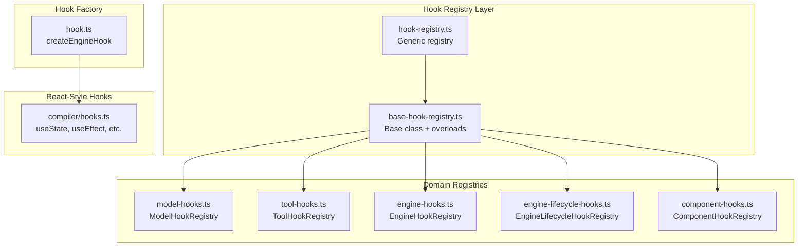
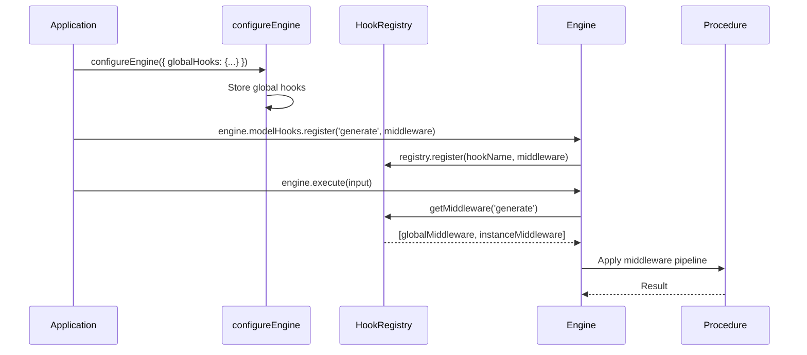
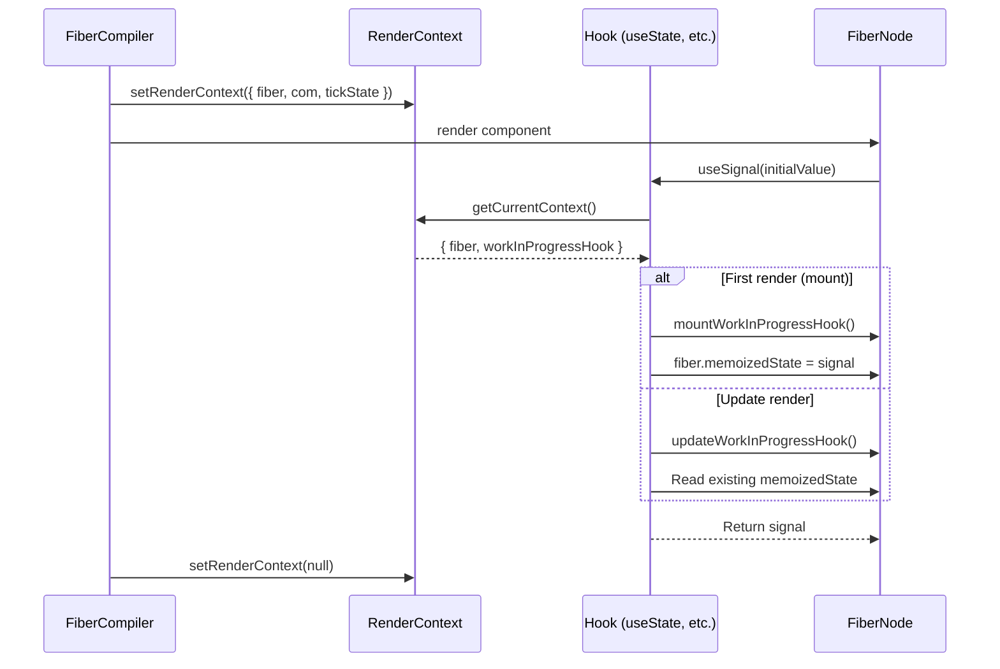

# aidk-core Hooks Architecture

> **React-inspired hooks and middleware registration for AIDK agents**

The hooks module provides two complementary systems: React-style hooks for function components in the compiler/fiber system, and a registry-based hook system for middleware injection at the engine, model, and tool levels.

---

## Table of Contents

1. [Overview](#overview)
2. [Module Structure](#module-structure)
3. [Core Concepts](#core-concepts)
4. [Hook Registry System](#hook-registry-system)
5. [React-Style Hooks](#react-style-hooks)
6. [API Reference](#api-reference)
7. [Data Flow](#data-flow)
8. [Usage Examples](#usage-examples)
9. [Integration Points](#integration-points)

---

## Overview

### What This Module Does

The hooks module provides two distinct but complementary patterns:

1. **Hook Registry System** - Register middleware for engine, model, tool, and component operations
2. **React-Style Hooks** - State and lifecycle management for function components

### Why It Exists

AIDK agents need:

1. **Cross-cutting concerns** - Logging, telemetry, validation across all operations
2. **Component state** - Local and shared state for function components
3. **Lifecycle management** - Mount/unmount, tick boundaries, message handling
4. **Extensibility** - Plugin points for custom behavior without modifying core code

### Design Principles

- **React-inspired** - Familiar patterns for React developers
- **Async-first** - Unlike React, all hooks support async operations
- **Middleware-based** - Hook registries use kernel middleware for maximum flexibility
- **Hierarchical** - Global hooks, instance hooks, and component-defined hooks

---

## Module Structure



### File Overview

| File                                  | Purpose                                           |
| ------------------------------------- | ------------------------------------------------- |
| `hook.ts`                             | Factory for creating hooks with engine middleware |
| `hook-registry.ts`                    | Generic typed registry for hook middleware        |
| `base-hook-registry.ts`               | Base class with overloaded register methods       |
| `../model/model-hooks.ts`             | Model operation hooks (generate, stream)          |
| `../tool/tool-hooks.ts`               | Tool operation hooks (run)                        |
| `../engine/engine-hooks.ts`           | Engine operation hooks (execute, stream)          |
| `../engine/engine-lifecycle-hooks.ts` | Engine lifecycle hooks (onInit, onDestroy)        |
| `../component/component-hooks.ts`     | Component lifecycle hooks (onMount, render)       |
| `../compiler/hooks.ts`                | React-style hooks (useState, useEffect, etc.)     |

---

## Core Concepts

### 1. Two Hook Systems

AIDK has two distinct hook systems that serve different purposes:

```
┌─────────────────────────────────────────────────────────────────────────┐
│                          AIDK Hook Systems                               │
├─────────────────────────────────┬───────────────────────────────────────┤
│       Hook Registry System      │        React-Style Hooks              │
├─────────────────────────────────┼───────────────────────────────────────┤
│ • Middleware injection          │ • Component state management          │
│ • Engine/Model/Tool operations  │ • Lifecycle effects                   │
│ • Global and instance scoping   │ • Fiber-based persistence             │
│ • Uses kernel Middleware type   │ • Uses render context                 │
│                                 │                                       │
│ ModelHookRegistry               │ useState, useSignal                   │
│ ToolHookRegistry                │ useEffect, useInit                    │
│ EngineHookRegistry              │ useComState, useWatch                 │
│ ComponentHookRegistry           │ useTickStart, useTickEnd              │
└─────────────────────────────────┴───────────────────────────────────────┘
```

### 2. Hook Registry

The `HookRegistry` is a generic registry that maps hook names to middleware arrays, optionally scoped by selectors:

```typescript
HookRegistry<THookName, TSelector, THookMiddleware>;
```

- **THookName** - String union of hook names (e.g., `'generate' | 'stream'`)
- **TSelector** - Type for scoping hooks (e.g., component name, undefined for global)
- **THookMiddleware** - The middleware type (kernel `Middleware<TArgs>`)

### 3. Middleware vs Callbacks

Hook registries use **middleware** (transformation pipeline), not callbacks:

```typescript
// Middleware - can transform input/output
type Middleware<TArgs> = (
  args: TArgs,
  envelope: ProcedureEnvelope,
  next: (transformedArgs?: TArgs) => Promise<any>,
) => Promise<any>;

// vs Callback - side effect only (NOT used for registries)
type Callback = (data: any) => void;
```

### 4. React-Style Hooks (Fiber Context)

React-style hooks use fiber-based state storage and a render context:

```typescript
// Render context set by compiler during component render
interface RenderContext {
  fiber: FiberNode; // Current fiber being rendered
  com: ContextObjectModel; // Shared state container
  tickState: TickState; // Current tick information
  currentHook: HookState | null;
  workInProgressHook: HookState | null;
  abortSignal?: AbortSignal;
}
```

---

## Hook Registry System

### BaseHookRegistry

Abstract base class providing overloaded `register()` methods:

```typescript
abstract class BaseHookRegistry<THookName, TSelector, THookMiddleware> {
  // Register for specific hook + selector
  register(hookName: THookName, selector: TSelector, middleware: THookMiddleware): void;

  // Register for specific hook, global selector
  register(hookName: THookName, middleware: THookMiddleware): void;

  // Register for all hooks, specific selector
  register(selector: TSelector, middleware: THookMiddleware): void;

  // Register for all hooks, global selector
  register(middleware: THookMiddleware): void;

  // Copy hooks from another registry (for inheritance)
  copyHooksFrom(sourceRegistry: BaseHookRegistry<...>): void;
}
```

### Domain-Specific Registries

Each domain extends `BaseHookRegistry` with typed hook names:

```
┌─────────────────────────────────────────────────────────────────────────┐
│                        Hook Registry Hierarchy                           │
├─────────────────────────────────────────────────────────────────────────┤
│                                                                          │
│  BaseHookRegistry<THookName, TSelector, THookMiddleware>                 │
│           │                                                              │
│           ├── ModelHookRegistry                                          │
│           │     hookNames: 'fromEngineState' | 'generate' |              │
│           │                'stream' | 'toEngineState'                    │
│           │                                                              │
│           ├── ToolHookRegistry                                           │
│           │     hookNames: 'run' | ComponentHookName                     │
│           │                                                              │
│           ├── EngineHookRegistry                                         │
│           │     hookNames: 'execute' | 'stream'                          │
│           │                                                              │
│           ├── EngineLifecycleHookRegistry                                │
│           │     hookNames: 'onInit' | 'onShutdown' | 'onDestroy' |       │
│           │                'onExecutionStart' | 'onExecutionEnd' |       │
│           │                'onExecutionError' | 'onTickStart' |          │
│           │                'onTickEnd' | 'onAfterCompile'                │
│           │                                                              │
│           └── ComponentHookRegistry                                      │
│                 hookNames: 'onMount' | 'onUnmount' | 'onStart' |         │
│                           'onTickStart' | 'render' | 'onAfterCompile' |  │
│                           'onTickEnd' | 'onMessage' | 'onComplete' |     │
│                           'onError'                                      │
│                                                                          │
└─────────────────────────────────────────────────────────────────────────┘
```

### Hook Resolution Order

Hooks are retrieved in specificity order:

```
┌─────────────────────────────────────────────────────────────────────────┐
│                    Hook Resolution Order                                 │
├─────────────────────────────────────────────────────────────────────────┤
│                                                                          │
│  1. Global hooks (from configureEngine)        ←── Applied first         │
│  2. Instance hooks (from registry.register)                              │
│  3. Component-defined hooks (from ComponentClass.hooks)                  │
│                                                                          │
│  For ComponentHookRegistry, additional selector specificity:             │
│  1. Class/Function reference-based hooks       ←── Most specific         │
│  2. Tag-based hooks                                                      │
│  3. Name-based hooks                                                     │
│  4. Global hooks (undefined selector)          ←── Least specific        │
│                                                                          │
└─────────────────────────────────────────────────────────────────────────┘
```

---

## React-Style Hooks

### Comparison with React

| Aspect        | React Hooks              | AIDK Hooks                     |
| ------------- | ------------------------ | ------------------------------ |
| Async support | No (needs Suspense)      | Yes (async-first)              |
| State storage | Fiber memoizedState      | Fiber memoizedState (same)     |
| Effects       | useEffect (after commit) | useEffect + tick hooks         |
| Context       | useContext               | useComState (COM-based)        |
| Refs          | useRef                   | useRef + useCOMRef             |
| Dependencies  | Array of values          | Array (signals auto-unwrapped) |

### Hook Categories

```
┌─────────────────────────────────────────────────────────────────────────┐
│                       React-Style Hook Categories                        │
├─────────────────────────────────────────────────────────────────────────┤
│                                                                          │
│  STATE HOOKS                                                             │
│  ├── useState(initial)           - Local component state (deprecated)   │
│  ├── useReducer(reducer, init)   - Reducer pattern state                │
│  ├── useSignal(initial)          - Signal-based state (recommended)     │
│  ├── useComState(key, initial)   - COM-bound shared state               │
│  ├── useWatch(key, default)      - Read-only COM state observation      │
│  └── useInput(propKey, default)  - Reactive prop access                 │
│                                                                          │
│  EFFECT HOOKS                                                            │
│  ├── useEffect(callback, deps)   - Side effect after commit             │
│  ├── useInit(callback)           - One-time initialization (blocking)   │
│  ├── useOnMount(callback)        - Mount effect (non-blocking)          │
│  ├── useOnUnmount(callback)      - Unmount cleanup                      │
│  ├── useTickStart(callback)      - Before each tick                     │
│  ├── useTickEnd(callback)        - After each tick                      │
│  ├── useAfterCompile(callback)   - After compile, can request recompile │
│  └── useOnMessage(callback)      - Handle execution messages            │
│                                                                          │
│  MEMOIZATION HOOKS                                                       │
│  ├── useMemo(factory, deps)      - Memoize expensive computation        │
│  ├── useComputed(fn, deps)       - Reactive computed signal             │
│  └── useCallback(fn, deps)       - Memoize callback                     │
│                                                                          │
│  REF HOOKS                                                               │
│  ├── useRef(initial)             - Mutable ref across renders           │
│  └── useCOMRef(name)             - Get ref from COM                     │
│                                                                          │
│  UTILITY HOOKS                                                           │
│  ├── useAsync(asyncFn, deps)     - Async data fetching                  │
│  ├── usePrevious(value)          - Track previous value                 │
│  ├── useToggle(initial)          - Boolean toggle                       │
│  ├── useCounter(initial)         - Numeric counter                      │
│  ├── useAbortSignal()            - Get abort signal                     │
│  └── useDebugValue(value)        - Debug display (dev only)             │
│                                                                          │
└─────────────────────────────────────────────────────────────────────────┘
```

### Rules of Hooks

Same as React, with AIDK-specific additions:

1. **Only call hooks at the top level** - No conditionals or loops
2. **Only call hooks from function components** - Or custom hooks
3. **Call hooks in the same order every render** - Hook order must be stable
4. **Async hooks can be awaited** - Unlike React, `useInit` is async

---

## API Reference

### hook.ts

#### `createEngineHook`

Factory that wraps functions as procedures with engine middleware:

```typescript
const createEngineHook = wrapHook([
  telemetryMiddleware,
  errorMiddleware,
  ...(getGlobalMiddleware() || []),
]);

// Usage
const myHook = createEngineHook(async (input: string) => {
  // Hook logic
});
```

---

### hook-registry.ts

#### `HookRegistry<THookName, TSelector, THookMiddleware>`

Generic registry for hook middleware:

```typescript
class HookRegistry<THookName, TSelector, THookMiddleware> {
  // Register middleware
  register(hookName, selector, middleware): void;
  register(hookName, middleware): void;

  // Get middleware for a hook
  getMiddleware(
    hookName: THookName,
    resolveSelectors: (hookMap) => TSelector[],
  ): THookMiddleware[];

  // Introspection
  getHookMap(hookName): Map<TSelector, THookMiddleware[]> | undefined;

  // Cleanup
  clearHook(hookName): void;
  clear(): void;
}
```

---

### base-hook-registry.ts

#### `BaseHookRegistry<THookName, TSelector, THookMiddleware>`

Abstract base with overloaded registration:

```typescript
abstract class BaseHookRegistry<THookName, TSelector, THookMiddleware> {
  // Must implement
  protected abstract getAllHookNames(): readonly THookName[];

  // Optional override
  protected isHookName(value: any): value is THookName;

  // Registration overloads
  register(hookName, selector, middleware): void;
  register(hookName, middleware): void;
  register(selector, middleware): void;
  register(middleware): void;

  // Copy from another registry
  copyHooksFrom(source: BaseHookRegistry<...>): void;
}
```

---

### compiler/hooks.ts (React-Style)

#### State Hooks

```typescript
// Signal-based state (recommended)
function useSignal<T>(initialValue: T): Signal<T>;

// COM-bound shared state
function useComState<T>(key: string, initialValue: T): Signal<T>;

// Read-only COM state
function useWatch<T>(
  key: string,
  defaultValue?: T,
): ReadonlySignal<T | undefined>;

// Deprecated - use useSignal
function useState<S>(
  initialState: S | (() => S),
): [S, (action: S | ((prev: S) => S)) => void];

// Reducer pattern
function useReducer<S, A>(
  reducer: (state: S, action: A) => S,
  initialArg: S,
  init?: (arg: S) => S,
): [S, (action: A) => void];
```

#### Effect Hooks

```typescript
// Side effect after commit (can be async)
function useEffect(create: EffectCallback, deps?: unknown[]): void;

// One-time initialization (blocking, awaitable)
async function useInit(
  callback: (com: ContextObjectModel, state: TickState) => void | Promise<void>,
): Promise<void>;

// Mount/unmount effects
function useOnMount(
  callback: (com: ContextObjectModel) => void | Promise<void>,
): void;
function useOnUnmount(
  callback: (com: ContextObjectModel) => void | Promise<void>,
): void;

// Tick lifecycle
function useTickStart(
  callback: (com: ContextObjectModel, state: TickState) => void | Promise<void>,
): void;
function useTickEnd(
  callback: (com: ContextObjectModel, state: TickState) => void | Promise<void>,
): void;

// After compile
function useAfterCompile(
  callback: (
    com: ContextObjectModel,
    compiled: CompiledStructure,
    state: TickState,
  ) => void,
): void;

// Message handling
function useOnMessage(
  callback: (
    com: ContextObjectModel,
    message: ExecutionMessage,
    state: TickState,
  ) => void | Promise<void>,
): void;
```

#### Memoization Hooks

```typescript
// Memoize value
function useMemo<T>(factory: () => T, deps: unknown[]): T;

// Memoize as reactive computed signal
function useComputed<T>(
  computation: () => T,
  deps: unknown[],
): ComputedSignal<T>;

// Memoize callback
function useCallback<T extends (...args: unknown[]) => unknown>(
  callback: T,
  deps: unknown[],
): T;
```

#### Ref Hooks

```typescript
// Mutable ref
function useRef<T>(initialValue: T): RefObject<T>;

// COM-stored ref
function useCOMRef<T>(refName: string): T | undefined;
```

#### Async Hook

```typescript
interface AsyncResult<T> {
  data: T | undefined;
  loading: boolean;
  error: Error | undefined;
}

function useAsync<T>(
  asyncFn: () => Promise<T>,
  deps: unknown[],
): AsyncResult<T>;
```

---

## Data Flow

### Hook Registry Flow



### React-Style Hook Flow



### Effect Execution Flow

```
┌─────────────────────────────────────────────────────────────────────────┐
│                      Effect Execution Phases                             │
├─────────────────────────────────────────────────────────────────────────┤
│                                                                          │
│  TICK START                                                              │
│  └── useTickStart effects run                                            │
│                                                                          │
│  RENDER PHASE                                                            │
│  ├── useInit (awaited, blocking)                                         │
│  ├── useState/useSignal state reads                                      │
│  └── useMemo/useComputed computation                                     │
│                                                                          │
│  AFTER COMPILE                                                           │
│  └── useAfterCompile callbacks                                           │
│                                                                          │
│  COMMIT PHASE                                                            │
│  └── useEffect callbacks (non-blocking)                                  │
│                                                                          │
│  TICK END                                                                │
│  └── useTickEnd effects run                                              │
│                                                                          │
│  MESSAGE ARRIVAL (anytime)                                               │
│  └── useOnMessage handlers (immediate)                                   │
│                                                                          │
│  UNMOUNT                                                                 │
│  ├── useEffect cleanup functions                                         │
│  └── useOnUnmount callbacks                                              │
│                                                                          │
└─────────────────────────────────────────────────────────────────────────┘
```

---

## Usage Examples

### Registering Model Hooks

```typescript
import { Engine } from "aidk";

const engine = new Engine({ model: myModel });

// Register for all model operations
engine.modelHooks.register(async (args, envelope, next) => {
  console.log(`Model operation: ${envelope.operationName}`);
  return await next();
});

// Register for specific operation
engine.modelHooks.register("generate", async (args, envelope, next) => {
  console.log("Before generate");
  const result = await next();
  console.log("After generate");
  return result;
});
```

### Registering Tool Hooks

```typescript
// Register hook for tool execution
engine.toolHooks.register("run", async (args, envelope, next) => {
  const [input] = args;
  console.log("Tool input:", input);

  const result = await next();

  console.log("Tool output:", result);
  return result;
});
```

### Global Hook Configuration

```typescript
import { configureEngine } from "aidk";

configureEngine({
  globalMiddleware: [loggingMiddleware],
  globalHooks: {
    engine: {
      execute: [
        async (args, envelope, next) => {
          console.log("Global engine execute");
          return await next();
        },
      ],
    },
    model: {
      generate: [telemetryMiddleware],
      stream: [telemetryMiddleware],
    },
  },
});
```

### Function Component with Hooks

```tsx
import {
  useSignal,
  useComState,
  useEffect,
  useInit,
  useTickEnd,
  useOnMessage,
} from "aidk";

function ChatAgent() {
  // Local state
  const messageCount = useSignal(0);

  // Shared state (persisted in COM)
  const messages = useComState("messages", []);

  // One-time initialization
  await useInit(async (com, state) => {
    const history = await loadChatHistory();
    messages.set(history);
  });

  // Side effect on state change
  useEffect(() => {
    console.log("Messages updated:", messages().length);
  }, [messages]);

  // Handle incoming messages
  useOnMessage((com, message, state) => {
    if (message.type === "user") {
      messages.update((m) => [...m, message.content]);
    }
  });

  // End of tick logging
  useTickEnd((com, state) => {
    console.log(`Tick ${state.tick} completed`);
  });

  return (
    <Timeline>
      {messages().map((msg, i) => (
        <User key={i}>{msg}</User>
      ))}
    </Timeline>
  );
}
```

### Custom Hook

```tsx
import { useSignal, useEffect, useCallback } from "aidk";

// Custom hook for debounced state
function useDebouncedValue<T>(value: T, delay: number): T {
  const debouncedValue = useSignal(value);

  useEffect(() => {
    const timer = setTimeout(() => {
      debouncedValue.set(value);
    }, delay);

    return () => clearTimeout(timer);
  }, [value, delay]);

  return debouncedValue();
}

// Usage
function SearchComponent() {
  const query = useSignal("");
  const debouncedQuery = useDebouncedValue(query(), 300);

  useEffect(() => {
    if (debouncedQuery) {
      performSearch(debouncedQuery);
    }
  }, [debouncedQuery]);

  return <Input value={query()} onChange={(v) => query.set(v)} />;
}
```

### Component Lifecycle Hooks

```tsx
import { useOnMount, useOnUnmount, useTickStart, useTickEnd } from "aidk";

function MonitoredComponent() {
  useOnMount((com) => {
    console.log("Component mounted");
    // Non-blocking - use useInit for blocking initialization
  });

  useOnUnmount((com) => {
    console.log("Component unmounting");
    // Cleanup resources
  });

  useTickStart((com, state) => {
    console.log(`Starting tick ${state.tick}`);
  });

  useTickEnd((com, state) => {
    console.log(`Completed tick ${state.tick}`);
  });

  return <Section>Monitored content</Section>;
}
```

---

## Integration Points

### Kernel Dependencies

The hooks module builds on kernel primitives:

| Kernel Primitive | Used By              | Purpose                             |
| ---------------- | -------------------- | ----------------------------------- |
| `Middleware`     | All hook registries  | Transformation pipeline type        |
| `wrapHook`       | `createEngineHook`   | Factory with pre-applied middleware |
| `Procedure`      | Lifecycle hooks      | Trackable execution unit            |
| `Context`        | Telemetry middleware | Access kernel context               |
| `Telemetry`      | Error middleware     | Record errors                       |

### Engine Integration

```typescript
class Engine {
  private modelHooksRegistry: ModelHookRegistry;
  private toolHooksRegistry: ToolHookRegistry;
  private engineHooksRegistry: EngineHookRegistry;

  get modelHooks(): ModelHookRegistry {
    return this.modelHooksRegistry;
  }
  get toolHooks(): ToolHookRegistry {
    return this.toolHooksRegistry;
  }
  get engineHooks(): EngineHookRegistry {
    return this.engineHooksRegistry;
  }
}
```

### Compiler Integration

The fiber compiler manages React-style hook context:

```typescript
// During render
setRenderContext({ fiber, com, tickState, ... });
const result = component(props);
setRenderContext(null);
```

### Extension Points

1. **Custom Hook Registries** - Extend `BaseHookRegistry` for new domains
2. **Custom React-Style Hooks** - Compose existing hooks into custom hooks
3. **Global Configuration** - Use `configureEngine` for app-wide hooks
4. **Component-Defined Hooks** - Static `.hooks` property on components

---

## Summary

The hooks module provides two complementary systems:

1. **Hook Registry System** - Middleware-based injection for engine/model/tool operations
   - `HookRegistry` - Generic typed registry
   - `BaseHookRegistry` - Overloaded registration methods
   - Domain registries - `ModelHookRegistry`, `ToolHookRegistry`, etc.

2. **React-Style Hooks** - State and lifecycle for function components
   - State: `useSignal`, `useComState`, `useWatch`
   - Effects: `useEffect`, `useInit`, `useOnMount`, `useTickStart`, `useOnMessage`
   - Memoization: `useMemo`, `useComputed`, `useCallback`
   - Refs: `useRef`, `useCOMRef`

Both systems integrate with the kernel's middleware and context infrastructure, providing familiar patterns for React developers while supporting AIDK's async-first, tick-based execution model.
