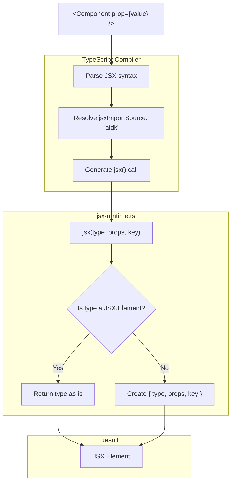

# aidk/core JSX Architecture

> **The JSX runtime that transforms React-style syntax into AIDK agent definitions**

The JSX module provides a custom JSX implementation that enables developers to define AI agents using familiar React-like syntax. Instead of rendering to the DOM, AIDK JSX elements become agent components, timeline entries, content blocks, and configuration primitives.

---

## Table of Contents

1. [Overview](#overview)
2. [Module Structure](#module-structure)
3. [JSX Transformation Pipeline](#jsx-transformation-pipeline)
4. [Core Concepts](#core-concepts)
5. [Component Categories](#component-categories)
6. [TypeScript Configuration](#typescript-configuration)
7. [Usage Examples](#usage-examples)
8. [Integration Points](#integration-points)

---

## Overview

### What This Module Does

The JSX module provides:

- **Custom JSX Runtime** - `jsx`, `jsxs`, `jsxDEV`, and `createElement` functions compatible with React 17+ automatic JSX transform
- **JSX.Element Type System** - Type definitions for all AIDK elements including intrinsic elements and component classes
- **Component Primitives** - Pre-built components for messages, timelines, sections, content blocks, and more
- **Fragment Support** - Symbol-based Fragment for grouping elements without extra wrappers
- **Async Component Support** - Unlike React, AIDK JSX supports `async` function components

### Why It Exists

JSX provides a declarative, composable syntax for defining AI agents:

```tsx
// Instead of imperative code...
const agent = new Agent();
agent.addMessage({ role: "system", content: "You are helpful" });
agent.addMessage({ role: "user", content: userInput });
agent.setModel(myModel);

// ...write declarative JSX
const agent = (
  <Fragment>
    <Model model={myModel} />
    <System>You are helpful</System>
    <User>{userInput}</User>
  </Fragment>
);
```

### Design Principles

- **React Compatibility** - Uses React 17+ automatic JSX transform (`jsx`, `jsxs`)
- **DOM-less Rendering** - Elements become agent definitions, not DOM nodes
- **Async-First** - Function components can be `async` since there's no UI rendering constraint
- **Type Safety** - Full TypeScript support with intrinsic element types and component props inference
- **Compositional** - Components can be nested, combined, and reused like React components

---

## Module Structure

```
jsx/
├── jsx-runtime.ts           # Core JSX functions and types
├── jsx-types.ts             # Base component prop types
└── components/
    ├── index.ts             # Component exports
    ├── primitives.ts        # Timeline, Entry, Section, Message, Tool
    ├── messages.tsx         # Role-specific: User, Assistant, System, Event, etc.
    ├── content.tsx          # Content blocks: Text, Image, Code, Document, etc.
    ├── semantic.tsx         # Semantic: H1, H2, Paragraph, List, Table, etc.
    ├── model.tsx            # Model, ModelOptions configuration
    ├── fork.tsx             # Fork execution component
    ├── spawn.tsx            # Spawn execution component
    ├── fork-spawn-helpers.ts # Helper functions for Fork/Spawn
    ├── renderer.tsx         # Renderer wrapper component
    ├── markdown.tsx         # Markdown renderer wrapper
    └── xml.tsx              # XML renderer wrapper
```

### File Overview

| File             | Purpose                                                                                                            |
| ---------------- | ------------------------------------------------------------------------------------------------------------------ |
| `jsx-runtime.ts` | Core `jsx`/`jsxs`/`jsxDEV`/`createElement` functions, `JSX` namespace, `Fragment` symbol                           |
| `jsx-types.ts`   | `ComponentBaseProps` with `ref` and `key` props                                                                    |
| `primitives.ts`  | Foundation primitives: `Timeline`, `Entry`, `Section`, `Message`, `Tool`                                           |
| `messages.tsx`   | Role-specific message components: `User`, `Assistant`, `System`, `ToolResult`, `Event`, `Ephemeral`, `Grounding`   |
| `content.tsx`    | Content block components: `Text`, `Image`, `Document`, `Audio`, `Video`, `Code`, `Json`                            |
| `semantic.tsx`   | Semantic structure: `H1-H3`, `Header`, `Paragraph`, `List` (with task lists), `ListItem`, `Table`, `Row`, `Column` |
| `model.tsx`      | Configuration: `Model`, `ModelOptions` for setting model adapter and options                                       |
| `fork.tsx`       | `Fork` component for creating child executions with inherited state                                                |
| `spawn.tsx`      | `Spawn` component for creating independent executions                                                              |
| `renderer.tsx`   | `Renderer` wrapper for applying content renderers                                                                  |
| `markdown.tsx`   | `Markdown` renderer wrapper                                                                                        |
| `xml.tsx`        | `XML` renderer wrapper                                                                                             |

---

## JSX Transformation Pipeline

### How JSX Becomes Agent Components

```
┌─────────────────────────────────────────────────────────────────────────┐
│                        JSX Transformation Pipeline                       │
└─────────────────────────────────────────────────────────────────────────┘

  Source Code (TSX)                    TypeScript Compiler
  ─────────────────                    ──────────────────
  <User>Hello</User>        ──────▶    jsx(User, { children: "Hello" })
                                                    │
                                                    ▼
                            ┌───────────────────────────────────────────┐
                            │           jsx-runtime.ts                   │
                            ├───────────────────────────────────────────┤
                            │  jsx(type, props, key) {                  │
                            │    return {                               │
                            │      type: User,        // Function ref   │
                            │      props: { children: "Hello" },        │
                            │      key: null                            │
                            │    };                                     │
                            │  }                                        │
                            └───────────────────────────────────────────┘
                                                    │
                                                    ▼
                            ┌───────────────────────────────────────────┐
                            │            JSX.Element                     │
                            ├───────────────────────────────────────────┤
                            │  {                                        │
                            │    type: User,                            │
                            │    props: { children: "Hello" },          │
                            │    key: null                              │
                            │  }                                        │
                            └───────────────────────────────────────────┘
                                                    │
                                                    ▼
                            ┌───────────────────────────────────────────┐
                            │         Fiber Compiler                     │
                            ├───────────────────────────────────────────┤
                            │  - Instantiates component                 │
                            │  - Calls render() method                  │
                            │  - Collects timeline entries              │
                            │  - Processes children recursively         │
                            └───────────────────────────────────────────┘
                                                    │
                                                    ▼
                            ┌───────────────────────────────────────────┐
                            │      ContextObjectModel (COM)              │
                            ├───────────────────────────────────────────┤
                            │  timeline: [                              │
                            │    { kind: 'message',                     │
                            │      message: { role: 'user',             │
                            │                 content: [{ type: 'text', │
                            │                            text: 'Hello' }│
                            │                         ] } }             │
                            │  ]                                        │
                            └───────────────────────────────────────────┘
```

### JSX Function Resolution



---

## Core Concepts

### 1. JSX.Element

The fundamental type for all JSX expressions:

```typescript
namespace JSX {
  interface Element {
    type: any; // Component function, class, or string (intrinsic)
    props: any; // Properties passed to the component
    key: string | number | null; // React-style key for reconciliation
  }
}
```

### 2. JSX Functions

AIDK implements the React 17+ automatic JSX transform:

```typescript
// Single child element
jsx(type, props, key?): JSX.Element

// Multiple children (static)
jsxs(type, props, key?): JSX.Element

// Development mode (with source info)
jsxDEV(type, props, key?, isStaticChildren?, source?, self?): JSX.Element

// Legacy transform / explicit usage
createElement(type, props, ...children): JSX.Element
```

All functions normalize to the same output structure. The `jsxs` and `jsxDEV` functions delegate to `jsx` internally.

### 3. Fragment

Fragments group elements without adding extra wrapper nodes:

```typescript
// Symbol-based Fragment (not a string or function)
export const Fragment: any = Symbol.for('aidk.fragment');

// Usage
<Fragment>
  <Message role="user">Hello</Message>
  <Message role="assistant">Hi!</Message>
</Fragment>

// Or shorthand
<>
  <Message role="user">Hello</Message>
  <Message role="assistant">Hi!</Message>
</>
```

### 4. Intrinsic Elements

Lowercase elements map to built-in primitives:

```typescript
namespace JSX {
  interface IntrinsicElements {
    // Structure
    section: { id?: string; audience?: 'user' | 'model' | 'all'; ... };
    timeline: { children?: any };
    message: { role: MessageRoles; content?: string | ContentBlock[]; ... };
    tool: { definition: ToolClass | ExecutableTool | string };

    // Content blocks
    text: { text?: string; children?: any };
    image: { source: MediaSource; mimeType?: string; altText?: string };
    document: { source: MediaSource; ... };

    // Semantic
    h1: { children?: any };
    h2: { children?: any };
    // ... etc.

    // Inline formatting
    strong: { children?: any };
    em: { children?: any };
    code: { children?: any };
    // ... etc.

    // Catch-all for custom XML tags
    [tagName: string]: { children?: any; [prop: string]: any };
  }
}
```

### 5. Component Types

AIDK JSX supports multiple component types:

```typescript
// Function component (can be async!)
function MyComponent(props: MyProps): JSX.Element {
  return <Message role="user">{props.content}</Message>;
}

// Async function component (unique to AIDK)
async function AsyncComponent(props: Props): Promise<JSX.Element> {
  const data = await fetchData();
  return <Text>{data}</Text>;
}

// Class component (extends Component<P>)
class MyAgent extends Component<AgentProps> {
  render(com: COM): JSX.Element {
    return <Fragment>...</Fragment>;
  }
}
```

### 6. Element Detection

Utility functions for working with elements:

```typescript
// Type guard
isElement(node: any): node is JSX.Element

// Normalize to element
ensureElement(element: any, props?: any, children?: any[]): JSX.Element
```

---

## Component Categories

### Structural Primitives

Foundation components for building agent structure:

```tsx
// Timeline - wrapper for message sequences
<Timeline>
  <Message role="user" content="Hello" />
  <Message role="assistant" content="Hi!" />
</Timeline>

// Entry - low-level discriminated union primitive
<Entry kind="message" message={{ role: 'user', content: [...] }} />
<Entry kind="event" event={{ type: 'user_action', data: {...} }} />

// Section - content grouping with metadata
<Section id="context" audience="model">
  <Text>Important context here</Text>
</Section>
```

### Message Components

Role-specific message components (syntactic sugar over Message):

```tsx
// User message
<User>What's the weather?</User>

// Assistant message
<Assistant>It's sunny today!</Assistant>

// System message
<System>You are a helpful assistant.</System>

// Tool result
<ToolResult toolCallId="call_123" name="weather">
  {"temperature": 72, "condition": "sunny"}
</ToolResult>

// Event (persisted)
<Event>
  <UserAction action="checkout" actor="user">
    User initiated checkout
  </UserAction>
</Event>

// Ephemeral (not persisted, current state)
<Ephemeral type="balance" position="before-user">
  Current balance: ${balance}
</Ephemeral>

// Grounding (semantic wrapper for Ephemeral)
<Grounding type="preferences" position="start">
  User preferences: {prefs}
</Grounding>
```

### Content Components

Build message content with typed blocks:

```tsx
<Message role="assistant">
  <Text>Here's the code:</Text>
  <Code language="typescript">const x = 1;</Code>
  <Image source={{ type: "url", url: "https://..." }} altText="Chart" />
</Message>

// Available content components:
// Text, Image, Document, Audio, Video, Code, Json
```

### Semantic Components

Structure content with semantic meaning:

```tsx
<Markdown>
  <H1>Documentation</H1>
  <Paragraph>Introduction text here.</Paragraph>

  <H2>Features</H2>
  <List>
    <ListItem>Feature one</ListItem>
    <ListItem>Feature two</ListItem>
  </List>

  <H2>Task List</H2>
  <List task>
    <ListItem checked>Completed task</ListItem>
    <ListItem checked={false}>Pending task</ListItem>
    <ListItem>Also pending (defaults to unchecked)</ListItem>
  </List>

  <Table>
    <Row header>
      <Column>Name</Column>
      <Column>Value</Column>
    </Row>
    <Row>
      <Column>Key</Column>
      <Column>123</Column>
    </Row>
  </Table>
</Markdown>
```

### Configuration Components

Configure model and execution options:

```tsx
// Set the model adapter
<Model model={myModel} />
<Model model="gpt-4" />  // From registry

// Configure model options
<ModelOptions
  temperature={0.7}
  maxTokens={1000}
  messageTransformation={{
    roleMapping: { event: 'user', ephemeral: 'user' },
    delimiters: { event: '[Event]', useDelimiters: true }
  }}
/>
```

### Execution Components

Create child executions:

```tsx
// Fork - inherits parent state
<Fork
  ref="myFork"
  input={forkInput}
  waitUntilComplete={true}
  onComplete={(result) => handleResult(result)}
>
  <Model model={myModel} />
  <User>Process this data</User>
</Fork>

// Spawn - independent execution
<Spawn
  ref="backgroundTask"
  input={spawnInput}
  onComplete={(result) => console.log(result)}
>
  <Model model={myModel} />
  <User>Run independently</User>
</Spawn>
```

### Renderer Components

Apply content renderers:

```tsx
// Markdown rendering
<Markdown flavor="github">
  <H1>Title</H1>
  <Text>Content with **formatting**</Text>
</Markdown>

// XML rendering
<XML>
  <H1>Title</H1>
  <Text>Content in XML format</Text>
</XML>

// Custom renderer
<Renderer instance={new MyCustomRenderer()}>
  <Message>Content</Message>
</Renderer>
```

---

## TypeScript Configuration

### Required tsconfig.json Settings

```json
{
  "compilerOptions": {
    "jsx": "react-jsx",
    "jsxImportSource": "aidk"
  }
}
```

### How It Works

1. **`jsx: "react-jsx"`** - Uses React 17+ automatic transform (not classic `React.createElement`)
2. **`jsxImportSource: "aidk"`** - TypeScript imports `jsx` from `aidk/jsx-runtime`

```typescript
// TypeScript sees:
<User>Hello</User>

// Compiles to:
import { jsx } from "aidk/jsx-runtime";
jsx(User, { children: "Hello" });
```

### Path Mapping (optional)

For development or monorepo setups:

```json
{
  "compilerOptions": {
    "paths": {
      "aidk/jsx-runtime": ["./packages/core/src/jsx/jsx-runtime.ts"]
    }
  }
}
```

---

## Usage Examples

### Basic Agent Definition

```tsx
import { Fragment, Model, User, Assistant, System } from "aidk";

const ChatAgent = () => (
  <Fragment>
    <Model model={gpt4} />
    <System>You are a helpful assistant.</System>
    <User>{userInput}</User>
  </Fragment>
);

// Execute with Engine
const result = await engine.execute.call({ timeline: [] }, <ChatAgent />);
```

### Async Components

```tsx
// AIDK supports async function components
async function DataFetchingComponent() {
  const data = await fetchExternalData();

  return (
    <Message role="user">
      <Text>Here's the data:</Text>
      <Json data={data} />
    </Message>
  );
}
```

### Conditional Rendering

```tsx
function ConditionalAgent({ includeContext }: { includeContext: boolean }) {
  return (
    <Fragment>
      <Model model={myModel} />

      {includeContext && (
        <Grounding type="context">
          Current state: {JSON.stringify(state)}
        </Grounding>
      )}

      <User>{userMessage}</User>
    </Fragment>
  );
}
```

### Component Composition

```tsx
// Reusable system prompt component
function SystemPrompt() {
  return (
    <System>
      You are a helpful AI assistant. Always be polite and professional.
    </System>
  );
}

// Reusable context component
function UserContext({ user }: { user: User }) {
  return (
    <Grounding type="user_info" position="start">
      User: {user.name}
      Preferences: {JSON.stringify(user.preferences)}
    </Grounding>
  );
}

// Composed agent
function CustomerServiceAgent({ user, query }: Props) {
  return (
    <Fragment>
      <Model model={myModel} />
      <SystemPrompt />
      <UserContext user={user} />
      <User>{query}</User>
    </Fragment>
  );
}
```

### Class Components

```tsx
class StatefulAgent extends Component<{ topic: string }> {
  private conversationCount = 0;

  async onMount(com: COM) {
    this.conversationCount = await loadConversationCount();
  }

  render(com: COM): JSX.Element {
    return (
      <Fragment>
        <Model model={myModel} />
        <Grounding>
          Conversation #{this.conversationCount}
          Topic: {this.props.topic}
        </Grounding>
        {com.timeline.map((entry) => (
          <Entry key={entry.id} {...entry} />
        ))}
      </Fragment>
    );
  }
}
```

### Using Refs

```tsx
function ForkingAgent() {
  return (
    <Fragment>
      <Model model={myModel} />

      <Fork ref="analysis" input={{ timeline: [] }} waitUntilComplete={true}>
        <Model model={analysisModel} />
        <User>Analyze this data...</User>
      </Fork>

      {/* Access fork result via com.getRef() */}
      <User>Based on the analysis, what should we do?</User>
    </Fragment>
  );
}
```

---

## Integration Points

### With Engine

The Engine uses the Fiber Compiler to process JSX elements:

```typescript
import { createEngine } from 'aidk';

const engine = createEngine({ model: myModel });

// JSX is compiled by FiberCompiler during execution
const result = await engine.execute.call(
  { timeline: [] },
  <MyAgent />
);
```

### With Compiler

The Fiber Compiler processes JSX.Element trees:

1. Detects element type (function, class, intrinsic)
2. Instantiates/calls component
3. Recursively processes children
4. Collects results into ContextObjectModel

### With Content Block Registry

Custom JSX components can be registered as content block handlers:

```typescript
// Register custom block type
registry.register(MyCustomBlock, (props) => ({
  type: "my_custom",
  ...props,
}));
```

### Exports

From `aidk`:

```typescript
// JSX runtime
export { jsx, jsxs, jsxDEV, createElement, Fragment, isElement, ensureElement };
export type { JSX };

// Components
export {
  Timeline,
  Entry,
  Section,
  Message,
  Tool,
  User,
  Assistant,
  System,
  ToolResult,
  Event,
  Ephemeral,
  Grounding,
  Text,
  Image,
  Document,
  Audio,
  Video,
  Code,
  Json,
  H1,
  H2,
  H3,
  Header,
  Paragraph,
  List,
  ListItem,
  Table,
  Row,
  Column,
  Model,
  ModelOptions,
  Fork,
  Spawn,
  Markdown,
  XML,
  Renderer,
};
```

---

## Summary

The JSX module enables declarative agent definition using React-style syntax:

- **`jsx-runtime.ts`** provides the core transformation functions (`jsx`, `jsxs`, `createElement`, `Fragment`)
- **Components** provide semantic building blocks for agents (messages, content, configuration)
- **TypeScript integration** via `jsxImportSource: "aidk"` enables full type safety
- **Async components** are supported since AIDK doesn't have UI rendering constraints
- **Fiber Compiler** processes JSX trees into ContextObjectModel updates

This allows developers to write AI agents with the same declarative, compositional patterns they use for React UIs.
