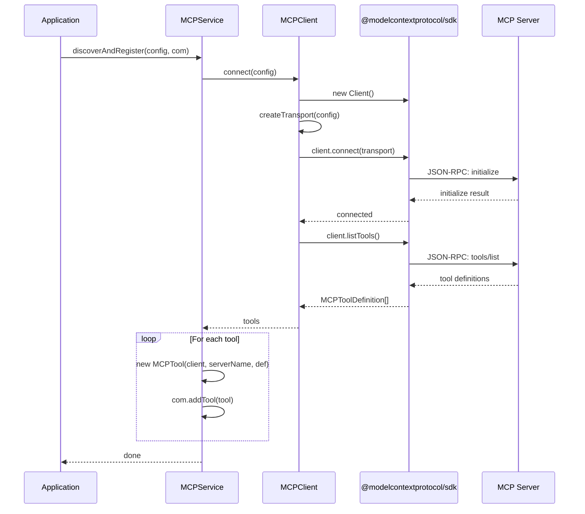
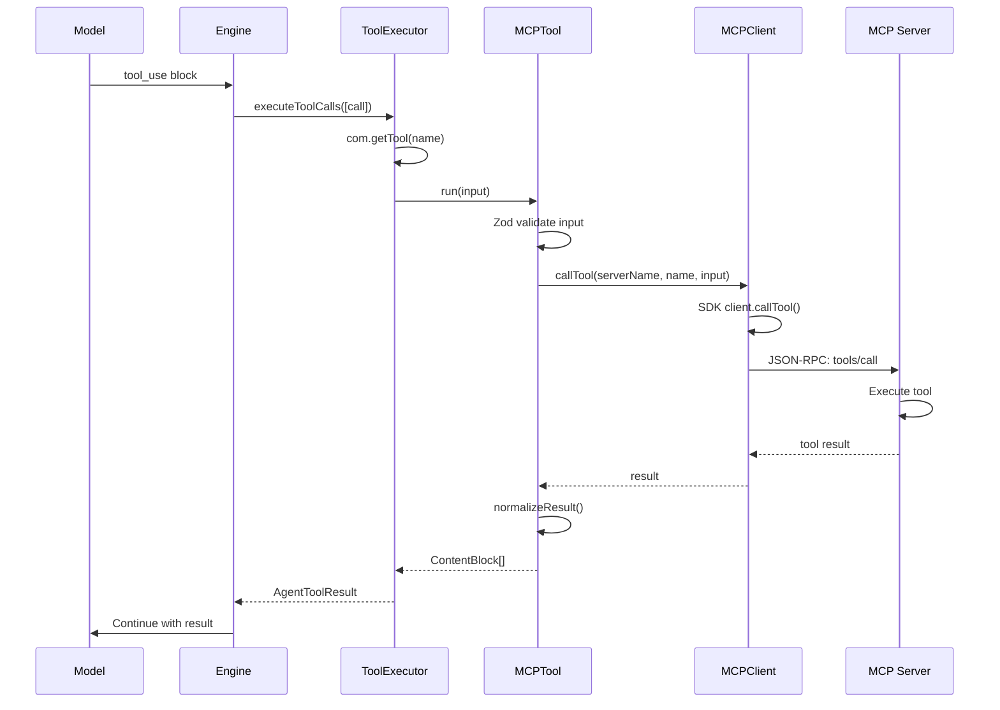

# MCP Module Architecture

> **Model Context Protocol integration for external tool services**

The MCP module provides AIDK integration with the [Model Context Protocol](https://modelcontextprotocol.io/) (MCP), an open standard for connecting AI models to external data sources and tools. MCP tools are discovered at runtime and execute on external servers while appearing as native AIDK tools to the Engine.

---

## Table of Contents

1. [Overview](#overview)
2. [Module Structure](#module-structure)
3. [Core Concepts](#core-concepts)
4. [API Reference](#api-reference)
5. [Data Flow](#data-flow)
6. [Usage Examples](#usage-examples)
7. [Integration Points](#integration-points)

---

## Overview

### What is MCP?

The Model Context Protocol (MCP) is an open standard that enables AI applications to connect to external tools and data sources. Key characteristics:

- **Server-based execution** - Tools run on MCP servers, not in the client
- **Transport-agnostic** - Supports stdio, SSE, and HTTP Streamable transports
- **Schema-driven** - Tools define JSON Schema inputs that get validated
- **Language-agnostic** - Any language can implement MCP servers

### What This Module Does

The MCP module provides:

- **Connection Management** - Connect to multiple MCP servers via different transports
- **Tool Discovery** - Automatically discover tools exposed by MCP servers
- **Schema Conversion** - Convert MCP JSON Schema to Zod schemas for AIDK compatibility
- **Tool Wrapping** - Wrap MCP tools as `ExecutableTool` instances
- **JSX Integration** - Declarative MCP tool registration via components

### Why It Exists

MCP enables AIDK agents to use tools that:

1. **Run externally** - File systems, databases, APIs on separate servers
2. **Are dynamically discovered** - No compile-time tool definitions needed
3. **Follow a standard** - Any MCP-compatible server works with AIDK
4. **Isolate concerns** - Tool implementation separate from agent logic

### Design Principles

- **SDK-first** - Uses official `@modelcontextprotocol/sdk` for protocol compliance
- **Transparent integration** - MCP tools work identically to native tools
- **Flexible configuration** - Cursor-style shorthand or full MCPConfig
- **Runtime-friendly** - Support for dynamic auth tokens and configuration

---

## Module Structure

```
┌─────────────────────────────────────────────────────────────────┐
│                           mcp/                                   │
├─────────────────────────────────────────────────────────────────┤
│                                                                 │
│  ┌────────────────┐       ┌────────────────┐                    │
│  │    types.ts    │       │   client.ts    │                    │
│  │ ─────────────  │       │ ─────────────  │                    │
│  │ MCPConfig      │◀──────│ MCPClient      │                    │
│  │ MCPServerConfig│       │ (SDK wrapper)  │                    │
│  │ MCPTransport   │       │                │                    │
│  │ MCPToolDef     │       └───────┬────────┘                    │
│  └────────────────┘               │                             │
│                                   │ uses                        │
│                                   ▼                             │
│  ┌────────────────┐       ┌────────────────┐                    │
│  │    tool.ts     │◀──────│  service.ts    │                    │
│  │ ─────────────  │       │ ─────────────  │                    │
│  │ MCPTool        │       │ MCPService     │                    │
│  │ mcpSchemaToZod │       │ (discovery &   │                    │
│  │ normalizeResult│       │  registration) │                    │
│  └───────┬────────┘       └────────────────┘                    │
│          │                                                      │
│          │ implements ExecutableTool                            │
│          ▼                                                      │
│  ┌────────────────────────────────────────────────────────┐     │
│  │                  create-mcp-tool.ts                     │     │
│  │ ────────────────────────────────────────────────────── │     │
│  │ createMCPTool()            - Component factory for JSX  │     │
│  │ createMCPToolFromDefinition() - Direct tool creation    │     │
│  │ discoverMCPTools()         - Batch discovery            │     │
│  └────────────────────────────────────────────────────────┘     │
│          │                                                      │
│          ▼                                                      │
│  ┌────────────────────────────────────────────────────────┐     │
│  │                   component.tsx                         │     │
│  │ ────────────────────────────────────────────────────── │     │
│  │ MCPToolComponent - JSX component for tool registration  │     │
│  │ MCPTool()        - JSX factory function                 │     │
│  └────────────────────────────────────────────────────────┘     │
│                                                                 │
└─────────────────────────────────────────────────────────────────┘
```

### File Overview

| File                 | Lines | Purpose                                    |
| -------------------- | ----- | ------------------------------------------ |
| `types.ts`           | 82    | Configuration and definition types         |
| `client.ts`          | 170   | SDK wrapper for MCP server connections     |
| `service.ts`         | 114   | Tool discovery and COM registration        |
| `tool.ts`            | 160   | MCP tool as ExecutableTool implementation  |
| `create-mcp-tool.ts` | 332   | Factory functions for tool creation        |
| `component.tsx`      | 255   | JSX component for declarative registration |
| `index.ts`           | 23    | Public exports                             |

---

## Core Concepts

### 1. MCP Transport Types

MCP supports three transport mechanisms for client-server communication:

```
┌─────────────────────────────────────────────────────────────────┐
│                       MCP Transports                             │
├─────────────────────────────────────────────────────────────────┤
│                                                                 │
│  stdio                    SSE                     WebSocket     │
│  ┌──────────────┐         ┌──────────────┐        ┌──────────┐  │
│  │ Spawn child  │         │ HTTP Server  │        │ HTTP     │  │
│  │ process with │         │ with SSE     │        │Streamable│  │
│  │ stdin/stdout │         │ endpoint     │        │ endpoint │  │
│  └──────────────┘         └──────────────┘        └──────────┘  │
│        │                        │                      │        │
│        ▼                        ▼                      ▼        │
│  Local process           Remote server          Remote server   │
│  (npx, python)           (HTTP + SSE)           (HTTP Stream)   │
│                                                                 │
│  Use for:                Use for:               Use for:        │
│  - Local tools           - Simple APIs          - Bidirectional │
│  - Dev servers           - One-way streaming    - Low latency   │
│                                                                 │
└─────────────────────────────────────────────────────────────────┘
```

| Transport   | SDK Class                       | Use Case                    |
| ----------- | ------------------------------- | --------------------------- |
| `stdio`     | `StdioClientTransport`          | Local process (npx, python) |
| `sse`       | `SSEClientTransport`            | Remote server with SSE      |
| `websocket` | `StreamableHTTPClientTransport` | Modern HTTP streaming       |

### 2. Configuration Formats

Two configuration styles are supported:

**Cursor-style (simplified):**

```typescript
// Used in EngineConfig.mcpServers
const config: MCPServerConfig = {
  command: "npx",
  args: ["-y", "@modelcontextprotocol/server-filesystem", "/path"],
  env: { API_KEY: "secret" },
};
```

**Full MCPConfig:**

```typescript
const config: MCPConfig = {
  serverName: "filesystem",
  transport: "stdio",
  connection: {
    command: "npx",
    args: ["-y", "@modelcontextprotocol/server-filesystem", "/path"],
  },
  auth: {
    type: "bearer",
    token: "user-token",
  },
};
```

The `normalizeMCPConfig()` function converts Cursor-style to full MCPConfig.

### 3. Tool Discovery and Schema Conversion

MCP servers expose tools via `listTools()`. AIDK converts these to native tools:

```
┌─────────────────────────────────────────────────────────────────┐
│                    Schema Conversion Flow                        │
├─────────────────────────────────────────────────────────────────┤
│                                                                 │
│  MCP Server                                                     │
│      │                                                          │
│      ▼ listTools()                                              │
│  ┌────────────────────────────────────────────────────────────┐ │
│  │ MCPToolDefinition                                          │ │
│  │ {                                                          │ │
│  │   name: 'read_file',                                       │ │
│  │   description: 'Read contents of a file',                  │ │
│  │   inputSchema: {                                           │ │
│  │     type: 'object',                                        │ │
│  │     properties: {                                          │ │
│  │       path: { type: 'string', description: 'File path' }   │ │
│  │     },                                                     │ │
│  │     required: ['path']                                     │ │
│  │   }                                                        │ │
│  │ }                                                          │ │
│  └────────────────────────────────────────────────────────────┘ │
│      │                                                          │
│      ▼ mcpSchemaToZod()                                         │
│  ┌────────────────────────────────────────────────────────────┐ │
│  │ Zod Schema                                                 │ │
│  │                                                            │ │
│  │ z.object({                                                 │ │
│  │   path: z.string().describe('File path')                   │ │
│  │ })                                                         │ │
│  └────────────────────────────────────────────────────────────┘ │
│      │                                                          │
│      ▼ MCPTool constructor                                      │
│  ┌────────────────────────────────────────────────────────────┐ │
│  │ ExecutableTool                                             │ │
│  │ {                                                          │ │
│  │   metadata: {                                              │ │
│  │     name: 'read_file',                                     │ │
│  │     description: 'Read contents of a file',                │ │
│  │     parameters: zodSchema,                                 │ │
│  │     type: ToolExecutionType.MCP,                           │ │
│  │     mcpConfig: { serverName, transport, ... }              │ │
│  │   },                                                       │ │
│  │   run: Procedure<handler>                                  │ │
│  │ }                                                          │ │
│  └────────────────────────────────────────────────────────────┘ │
│                                                                 │
└─────────────────────────────────────────────────────────────────┘
```

### 4. Tool Execution Flow

When a model calls an MCP tool:

```
┌─────────────────────────────────────────────────────────────────┐
│                    MCP Tool Execution                            │
├─────────────────────────────────────────────────────────────────┤
│                                                                 │
│  Model                                                          │
│    │ tool_use: { name: 'read_file', input: { path: '...' } }   │
│    ▼                                                            │
│  ToolExecutor                                                   │
│    │ com.getTool('read_file') → MCPTool                        │
│    │ tool.metadata.type === 'mcp'                               │
│    ▼                                                            │
│  MCPTool.run(input)                                             │
│    │ Zod validation                                             │
│    │ createEngineProcedure() wrapper                            │
│    ▼                                                            │
│  MCPClient.callTool(serverName, toolName, input)                │
│    │                                                            │
│    ▼                                                            │
│  SDK client.callTool({                                          │
│    name: 'read_file',                                           │
│    arguments: { path: '...' }                                   │
│  })                                                             │
│    │                                                            │
│    ▼ JSON-RPC over transport                                    │
│  ┌─────────────────────────────────────────┐                    │
│  │           MCP Server                     │                    │
│  │  ┌─────────────────────────────────────┐ │                    │
│  │  │ Execute tool implementation         │ │                    │
│  │  │ return { content: [...] }           │ │                    │
│  │  └─────────────────────────────────────┘ │                    │
│  └─────────────────────────────────────────┘                    │
│    │                                                            │
│    ▼ JSON-RPC response                                          │
│  normalizeResult(result) → ContentBlock[]                       │
│    │                                                            │
│    ▼                                                            │
│  Engine adds to conversation context                            │
│                                                                 │
└─────────────────────────────────────────────────────────────────┘
```

### 5. Three Usage Patterns

MCP tools can be used in three ways:

```
┌─────────────────────────────────────────────────────────────────┐
│                    MCP Tool Usage Patterns                       │
├─────────────────────────────────────────────────────────────────┤
│                                                                 │
│  1. EngineConfig (Automatic)                                    │
│  ───────────────────────────                                    │
│  const engine = new Engine({                                    │
│    mcpServers: {                                                │
│      postgres: { command: 'npx', args: [...] }                  │
│    }                                                            │
│  });                                                            │
│  // Tools auto-discovered at execution start                    │
│                                                                 │
│  2. JSX Component (Declarative)                                 │
│  ──────────────────────────────                                 │
│  <MCPTool                                                       │
│    server="postgres"                                            │
│    config={{ command: 'npx', args: [...] }}                     │
│    runtimeConfig={{ auth: { token } }}                          │
│    include={['query']}                                          │
│  />                                                             │
│  // Tools registered on component mount                         │
│                                                                 │
│  3. Programmatic (Manual)                                       │
│  ─────────────────────────                                      │
│  const tools = await discoverMCPTools({ config });              │
│  engine.execute({ tools });                                     │
│  // Or: tools.forEach(t => com.addTool(t))                      │
│                                                                 │
└─────────────────────────────────────────────────────────────────┘
```

---

## API Reference

### types.ts

#### `MCPServerConfig` (Cursor-style)

Simplified configuration for stdio-based MCP servers:

```typescript
interface MCPServerConfig {
  command: string; // Command to spawn (e.g., 'npx')
  args?: string[]; // Command arguments
  env?: Record<string, string>; // Environment variables
}
```

#### `MCPConfig` (Full)

Complete MCP server configuration:

```typescript
interface MCPConfig {
  serverName: string; // Unique identifier
  transport: MCPTransport; // 'stdio' | 'sse' | 'websocket'
  connection: {
    command?: string; // For stdio
    args?: string[]; // For stdio
    url?: string; // For SSE/websocket
    [key: string]: any; // Transport-specific options
  };
  auth?: {
    type: "bearer" | "api_key" | "custom";
    token?: string;
    [key: string]: any;
  };
}
```

#### `MCPToolDefinition`

Tool definition returned by MCP server:

```typescript
interface MCPToolDefinition {
  name: string;
  description: string;
  inputSchema: {
    type: "object";
    properties: Record<string, any>;
    required?: string[];
  };
}
```

---

### client.ts

#### `MCPClient`

Manages connections to MCP servers using the official SDK:

```typescript
class MCPClient {
  // Connect to an MCP server
  async connect(config: MCPConfig): Promise<Client>;

  // Get existing connection
  getClient(serverName: string): Client | undefined;

  // List tools from a connected server
  async listTools(serverName: string): Promise<MCPToolDefinition[]>;

  // Call a tool on an MCP server
  async callTool(
    serverName: string,
    toolName: string,
    input: any,
  ): Promise<any>;

  // Disconnect from a server
  async disconnect(serverName: string): Promise<void>;

  // Disconnect from all servers
  async disconnectAll(): Promise<void>;
}
```

---

### service.ts

#### `MCPService`

High-level service for tool discovery and registration:

```typescript
class MCPService {
  constructor(mcpClient: MCPClient);

  // Connect to a server
  async connect(config: MCPConfig): Promise<Client>;

  // Connect and discover tools
  async connectAndDiscover(config: MCPConfig): Promise<MCPToolDefinition[]>;

  // Discover and register tools with COM
  async discoverAndRegister(
    config: MCPConfig,
    com: COM,
  ): Promise<void>;

  // Register a single tool
  registerMCPTool(
    config: MCPConfig,
    def: MCPToolDefinition,
    com: COM,
  ): void;

  // List tools from a server
  async listTools(serverName: string): Promise<MCPToolDefinition[]>;

  // Disconnect from a server
  async disconnect(serverName: string): Promise<void>;
  async disconnectAll(): Promise<void>;
}
```

---

### tool.ts

#### `mcpSchemaToZod(schema)`

Converts MCP JSON Schema to Zod schema:

```typescript
function mcpSchemaToZod(schema: MCPToolDefinition["inputSchema"]): z.ZodSchema;
```

Supports: `string`, `number`, `integer`, `boolean`, `array`, `object`. Optional properties are marked with `.optional()`.

#### `normalizeResult(result)`

Converts MCP tool results to `ContentBlock[]`:

```typescript
function normalizeResult(result: any): ContentBlock[];

// String → [{ type: 'text', text: result }]
// { content: [...] } → content as ContentBlock[]
// Object → [{ type: 'text', text: JSON.stringify(result) }]
```

#### `MCPTool`

Wraps an MCP tool as an `ExecutableTool`:

```typescript
class MCPTool<
  THandler extends ToolHandler,
> implements ExecutableTool<THandler> {
  readonly metadata: ToolMetadata<Parameters<THandler>[0]>;
  readonly run: Procedure<THandler>;

  constructor(
    mcpClient: MCPClient,
    serverName: string,
    mcpToolDefinition: MCPToolDefinition,
    mcpConfig?: MCPToolConfig,
  );
}
```

---

### create-mcp-tool.ts

#### `normalizeMCPConfig(serverName, config)`

Converts Cursor-style config to full MCPConfig:

```typescript
function normalizeMCPConfig(
  serverName: string,
  config: MCPServerConfig | MCPConfig,
): MCPConfig;
```

#### `mergeMCPConfig(base, runtime)`

Merges base config with runtime overrides:

```typescript
function mergeMCPConfig(
  base: MCPConfig,
  runtime?: Partial<MCPConfig>,
): MCPConfig;
```

#### `createMCPTool(options)`

Creates a JSX component factory for MCP tools:

```typescript
function createMCPTool(options: CreateMCPToolOptions): ComponentClass;

interface CreateMCPToolOptions {
  server: string; // Server name
  config: MCPServerConfig | MCPConfig; // Base configuration
  toolName?: string; // Specific tool to discover
  client?: MCPClient; // Shared client
  toolPrefix?: string; // Name prefix
  runtimeConfig?: Partial<MCPConfig>; // Runtime overrides
  // Component lifecycle hooks...
  onMount?: (com: COM) => Promise<void>;
  onUnmount?: (com: COM) => Promise<void>;
  // etc.
}
```

#### `createMCPToolFromDefinition(options)`

Creates an `ExecutableTool` from a known definition:

```typescript
function createMCPToolFromDefinition(
  options: CreateMCPToolFromDefinitionOptions,
): ExecutableTool;

interface CreateMCPToolFromDefinitionOptions {
  client: MCPClient; // Active client
  config: MCPConfig; // Server config
  definition: MCPToolDefinition; // Tool definition
  name?: string; // Override name
}
```

#### `discoverMCPTools(options)`

Batch discovers all tools from an MCP server:

```typescript
async function discoverMCPTools(
  options: DiscoverMCPToolsOptions,
): Promise<ExecutableTool[]>;

interface DiscoverMCPToolsOptions {
  config: MCPConfig; // Server config
  client?: MCPClient; // Shared client
  toolPrefix?: string; // Name prefix
  include?: string[]; // Whitelist
  exclude?: string[]; // Blacklist
}
```

---

### component.tsx

#### `MCPToolComponent`

JSX component that connects to MCP server and registers tools:

```typescript
class MCPToolComponent extends Component<MCPToolComponentProps> {
  // Lifecycle
  async onMount(com: COM): Promise<void>;
  async onUnmount(com: COM): Promise<void>;

  // Runtime updates
  async updateRuntimeConfig(
    com: COM,
    runtimeConfig: Partial<MCPConfig>,
  ): Promise<void>;
}

interface MCPToolComponentProps {
  server: string; // Server identifier
  config: MCPServerConfig | MCPConfig; // Base configuration
  runtimeConfig?: Partial<MCPConfig>; // Runtime overrides
  include?: string[]; // Tool whitelist
  exclude?: string[]; // Tool blacklist
  mcpClient?: MCPClient; // Shared client
  toolPrefix?: string; // Name prefix
  // Component lifecycle hooks...
}
```

#### `MCPTool(props)` (JSX Factory)

Factory function for JSX usage:

```typescript
function MCPTool(props: MCPToolComponentProps): JSX.Element;
```

---

## Data Flow

### Connection and Discovery Flow



### Tool Execution Flow



### Runtime Configuration Merge

```
┌─────────────────────────────────────────────────────────────────┐
│                  Configuration Merging                           │
├─────────────────────────────────────────────────────────────────┤
│                                                                 │
│  Base Config (static)          Runtime Config (dynamic)         │
│  ┌─────────────────────┐       ┌─────────────────────┐          │
│  │ transport: 'stdio'  │       │                     │          │
│  │ connection: {       │   +   │ auth: {             │          │
│  │   command: 'npx'    │       │   type: 'bearer'    │          │
│  │   args: [...]       │       │   token: userToken  │          │
│  │ }                   │       │ }                   │          │
│  └─────────────────────┘       └─────────────────────┘          │
│              │                           │                      │
│              └───────────┬───────────────┘                      │
│                          ▼                                      │
│            mergeMCPConfig(base, runtime)                        │
│                          │                                      │
│                          ▼                                      │
│  ┌─────────────────────────────────────────────────────────┐    │
│  │ Effective Config                                        │    │
│  │ {                                                       │    │
│  │   transport: 'stdio',                                   │    │
│  │   connection: { command: 'npx', args: [...] },          │    │
│  │   auth: { type: 'bearer', token: userToken }  ← merged  │    │
│  │ }                                                       │    │
│  └─────────────────────────────────────────────────────────┘    │
│                                                                 │
└─────────────────────────────────────────────────────────────────┘
```

---

## Usage Examples

### EngineConfig (Automatic Discovery)

```typescript
import { Engine } from "aidk";
import { OpenAIAdapter } from "aidk-openai";

const engine = new Engine({
  model: new OpenAIAdapter({ model: "gpt-4" }),
  mcpServers: {
    filesystem: {
      command: "npx",
      args: ["-y", "@modelcontextprotocol/server-filesystem", "/safe/path"],
    },
    postgres: {
      command: "npx",
      args: [
        "-y",
        "@modelcontextprotocol/server-postgres",
        "postgresql://localhost/db",
      ],
    },
  },
});

// MCP tools automatically discovered and available
const result = await engine.execute({
  messages: [{ role: "user", content: "List files in the current directory" }],
});
```

### JSX Component (Declarative)

```tsx
import { Engine, MCPTool, Model } from "aidk";

function MyAgent({ userToken }: { userToken: string }) {
  return (
    <>
      {/* Local filesystem MCP server */}
      <MCPTool
        server="filesystem"
        config={{
          command: "npx",
          args: ["-y", "@modelcontextprotocol/server-filesystem", "/docs"],
        }}
        include={["read_file", "list_directory"]} // Only safe tools
        toolPrefix="fs_" // fs_read_file, fs_list_directory
      />

      {/* Remote API with user auth */}
      <MCPTool
        server="api"
        config={{
          transport: "sse",
          connection: { url: "https://api.example.com/mcp" },
        }}
        runtimeConfig={{
          auth: { type: "bearer", token: userToken },
        }}
        exclude={["admin_delete"]} // Filter dangerous tools
      />

      <Model />
    </>
  );
}

await engine.execute(input, <MyAgent userToken={session.token} />);
```

### Programmatic Discovery

```typescript
import { MCPClient, MCPService, discoverMCPTools } from 'aidk';

// Option 1: Using discoverMCPTools()
const tools = await discoverMCPTools({
  config: {
    serverName: 'filesystem',
    transport: 'stdio',
    connection: { command: 'npx', args: ['-y', '@mcp/server-filesystem', '/'] },
  },
  include: ['read_file', 'write_file'],
  toolPrefix: 'fs_',
});

// Pass to engine
const result = await engine.execute({ tools });

// Option 2: Manual with MCPService
const client = new MCPClient();
const service = new MCPService(client);

const config: MCPConfig = {
  serverName: 'postgres',
  transport: 'stdio',
  connection: { command: 'npx', args: [...] },
};

// Discover and filter
const allTools = await service.connectAndDiscover(config);
const safeTools = allTools.filter(t => !t.name.includes('delete'));

// Register with COM
for (const def of safeTools) {
  service.registerMCPTool(config, def, com);
}
```

### Component Factory Pattern

```tsx
import { createMCPTool } from "aidk";

// Create reusable MCP tool component
const ReadFile = createMCPTool({
  server: "filesystem",
  config: {
    command: "npx",
    args: ["-y", "@modelcontextprotocol/server-filesystem", "/allowed"],
  },
  toolName: "read_file", // Only this tool
});

// Use in agents
function CodeReviewAgent() {
  return (
    <>
      <ReadFile />
      <Model />
    </>
  );
}
```

### Shared Client (Connection Pooling)

```tsx
import { MCPClient, MCPTool } from 'aidk';

// Single client for all MCP connections
const sharedClient = new MCPClient();

function MultiServerAgent() {
  return (
    <>
      <MCPTool
        server="postgres"
        config={{ command: 'npx', args: [...] }}
        mcpClient={sharedClient}
      />
      <MCPTool
        server="filesystem"
        config={{ command: 'npx', args: [...] }}
        mcpClient={sharedClient}
      />
      <Model />
    </>
  );
}
```

---

## Integration Points

### How MCP Integrates with AIDK

| Component          | Integration Point                           |
| ------------------ | ------------------------------------------- |
| Engine             | `mcpServers` config for automatic discovery |
| ContextObjectModel | `addTool()` registers MCP tools             |
| ToolExecutor       | Executes MCP tools via `tool.run()`         |
| Model Adapters     | MCP tools appear in tool definitions        |
| JSX Runtime        | `MCPToolComponent` registers on mount       |

### Tool System Integration

MCP tools implement `ExecutableTool` and work identically to native tools:

```
┌─────────────────────────────────────────────────────────────────┐
│                    Tool System Unified View                      │
├─────────────────────────────────────────────────────────────────┤
│                                                                 │
│  Native Tool          MCP Tool              Provider Tool       │
│  ┌─────────────┐      ┌─────────────┐       ┌─────────────┐     │
│  │ type:SERVER │      │ type: MCP   │       │type:PROVIDER│     │
│  │ run:Procedure│      │ run:Procedure│       │ (no run)   │     │
│  │ metadata:   │      │ metadata:   │       │ metadata:   │     │
│  │  - name     │      │  - name     │       │  - name     │     │
│  │  - params   │      │  - params   │       │  - params   │     │
│  │  - desc     │      │  - desc     │       │  - desc     │     │
│  │             │      │  - mcpConfig│       │  - provider │     │
│  └──────┬──────┘      └──────┬──────┘       └──────┬──────┘     │
│         │                    │                     │            │
│         └────────────────────┼─────────────────────┘            │
│                              ▼                                  │
│                    ToolExecutor.execute()                       │
│                              │                                  │
│         ┌────────────────────┼────────────────────┐             │
│         ▼                    ▼                    ▼             │
│   Execute locally      Forward to MCP      Skip (provider)     │
│   (tool.run)           (mcpClient.callTool) (let LLM handle)   │
│                                                                 │
└─────────────────────────────────────────────────────────────────┘
```

### Extension Points

1. **Custom Transports** - Extend `MCPClient.createTransport()` for custom protocols
2. **Schema Enhancement** - Extend `mcpSchemaToZod()` for complex schema types
3. **Result Transformation** - Override `normalizeResult()` for custom result handling
4. **Tool Filtering** - Use `include`/`exclude` or custom logic before registration
5. **Name Transformation** - Use `toolPrefix` or transform names in custom code

### Limitations

| Limitation                 | Workaround                                        |
| -------------------------- | ------------------------------------------------- |
| Tool names from MCP server | Use `toolPrefix` or transform before registration |
| No lazy loading            | Use JSX components for conditional loading        |
| Schema conversion limited  | Complex schemas become `z.any()`                  |
| No automatic reconnection  | Handle `onclose`/`onerror` events manually        |

---

## Summary

The MCP module enables AIDK to connect to any MCP-compatible server and use its tools as native Engine tools:

- **`MCPClient`** - Manages connections using the official SDK
- **`MCPService`** - Handles discovery and registration
- **`MCPTool`** - Wraps MCP tools as `ExecutableTool` instances
- **`MCPToolComponent`** - JSX component for declarative tool registration
- **Factory functions** - `createMCPTool()`, `discoverMCPTools()` for different patterns

MCP tools integrate seamlessly with AIDK's tool system, appearing identical to native tools from the Engine and model perspective. The module supports flexible configuration, runtime auth, tool filtering, and both programmatic and declarative usage patterns.

For more information on the Model Context Protocol, see the [MCP Specification](https://modelcontextprotocol.io/specification).
