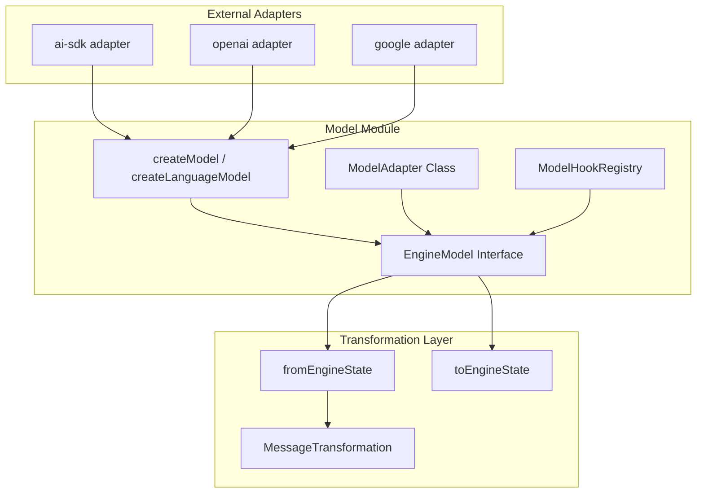
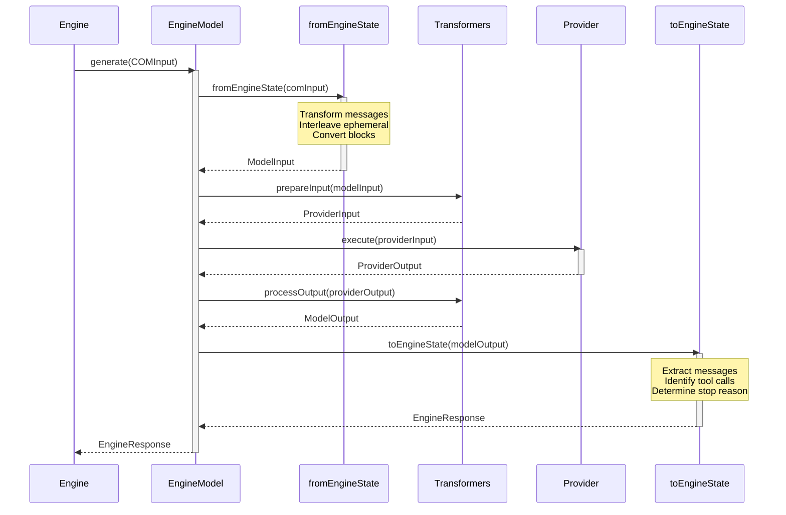
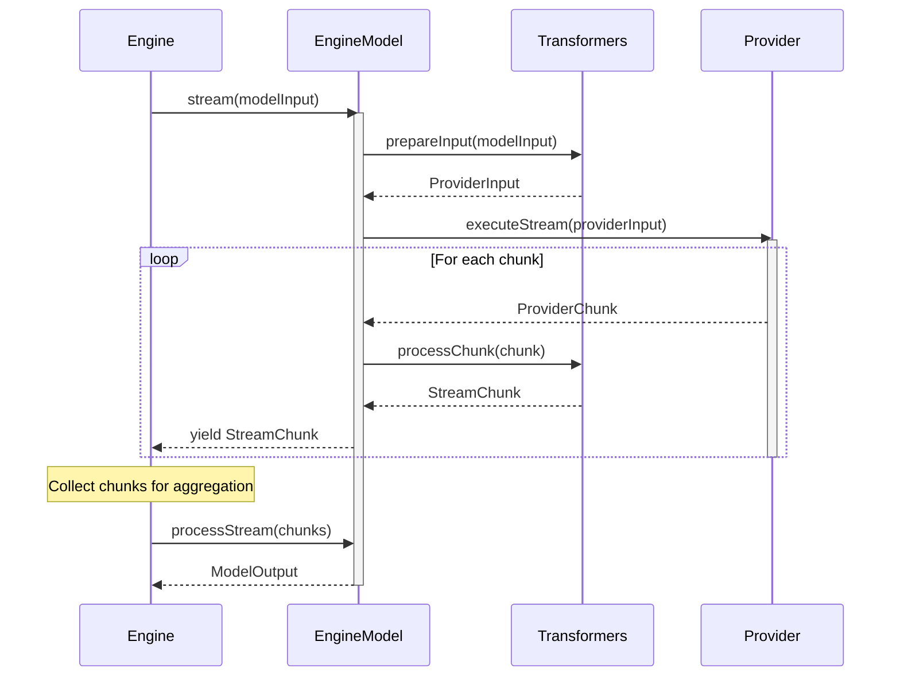
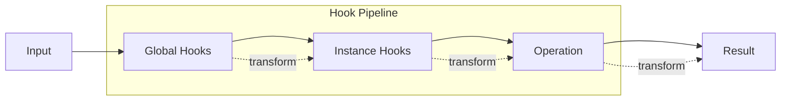

# Model Module Architecture

> **The AI model integration layer for AIDK**

The model module provides the abstraction layer for integrating AI language models (LLMs) into AIDK. It defines a unified interface for model operations, supports multiple providers through adapters, and handles the transformation between engine state and model-specific formats.

---

## Table of Contents

1. [Overview](#overview)
2. [Module Structure](#module-structure)
3. [Core Concepts](#core-concepts)
4. [API Reference](#api-reference)
5. [Data Flow](#data-flow)
6. [Usage Examples](#usage-examples)
7. [Provider Adapters](#provider-adapters)

---

## Overview

### What This Module Does

The model module provides:

- **Unified Model Interface** - `EngineModel` defines a consistent API for all AI models
- **Adapter Pattern** - Transform between AIDK's format and provider-specific formats
- **Generation Operations** - Both streaming and non-streaming generation
- **State Transformation** - Convert between engine state (COMInput) and model input/output
- **Hook System** - Middleware for intercepting and modifying model operations
- **Message Transformation** - Handle special message types (events, ephemeral) for model consumption

### Why It Exists

AIDK needs to work with multiple AI providers (OpenAI, Anthropic, Google, etc.) while maintaining a consistent internal representation. The model module:

1. **Abstracts provider differences** - Each provider has different APIs, message formats, and capabilities
2. **Normalizes input/output** - Converts AIDK's rich content types to model-understandable formats
3. **Enables composability** - Models work seamlessly with the engine's component system
4. **Supports extensibility** - New providers can be added through the adapter pattern

### Design Principles

- **Provider agnostic** - Core engine code never depends on specific providers
- **Procedure-based execution** - All model operations are wrapped in kernel procedures for tracking
- **Transformation pipeline** - Clear separation between engine format and provider format
- **Progressive adoption** - Use `createModel()` for simple cases, `ModelAdapter` for complex adapters

---

## Module Structure

```
model/
├── model.ts              # Core interfaces, createModel(), ModelAdapter
├── model-hooks.ts        # Hook registry for model operations
├── index.ts              # Public exports
└── utils/
    ├── language-model.ts # fromEngineState/toEngineState transformers
    └── index.ts          # Utils exports
```



### File Overview

| File                      | Size      | Purpose                                          |
| ------------------------- | --------- | ------------------------------------------------ |
| `model.ts`                | 822 lines | Core interfaces, factory functions, ModelAdapter |
| `model-hooks.ts`          | 95 lines  | Hook middleware registry for model operations    |
| `utils/language-model.ts` | 767 lines | Engine state transformation utilities            |

---

## Core Concepts

### 1. EngineModel Interface

The primary interface that all models must implement:

```typescript
interface EngineModel<TModelInput = ModelInput, TModelOutput = ModelOutput> {
  /** Model metadata (id, description, capabilities, etc.) */
  metadata: ModelMetadata;

  /** Generate a response (non-streaming) */
  generate: Procedure<(input: TModelInput) => Promise<TModelOutput>>;

  /** Generate a streaming response */
  stream?: Procedure<(input: TModelInput) => AsyncIterable<StreamChunk>>;

  /** Convert engine state (COMInput) to model input */
  fromEngineState?: (input: COMInput) => Promise<TModelInput>;

  /** Convert model output to engine response */
  toEngineState?: (output: TModelOutput) => Promise<EngineResponse>;

  /** Aggregate stream chunks into final output */
  processStream?: (chunks: StreamChunk[]) => Promise<TModelOutput>;
}
```

**Key insight**: Both `generate` and `stream` are kernel Procedures, providing automatic tracking, middleware support, and telemetry.

### 2. Model Creation Patterns

AIDK provides two patterns for creating models:

#### Functional Pattern: `createModel()`

Best for simple adapters and one-off integrations:

```
┌─────────────────────────────────────────────────────────────────┐
│                    createModel(options)                         │
├─────────────────────────────────────────────────────────────────┤
│                                                                 │
│  CreateModelOptions:                                            │
│  ┌─────────────────────────────────────────────────────────┐    │
│  │ metadata:     ModelMetadata                              │    │
│  │ transformers: {                                          │    │
│  │   prepareInput:  ModelInput → ProviderInput              │    │
│  │   processOutput: ProviderOutput → ModelOutput            │    │
│  │   processChunk:  ProviderChunk → StreamChunk             │    │
│  │   processStream: StreamChunk[] → ModelOutput             │    │
│  │ }                                                        │    │
│  │ executors: {                                             │    │
│  │   execute:       ProviderInput → ProviderOutput          │    │
│  │   executeStream: ProviderInput → AsyncIterable<Chunk>    │    │
│  │ }                                                        │    │
│  └─────────────────────────────────────────────────────────┘    │
│                           │                                     │
│                           ▼                                     │
│                    EngineModel                                  │
│                                                                 │
└─────────────────────────────────────────────────────────────────┘
```

#### Class Pattern: `ModelAdapter`

Best for complex adapters with shared behavior:

```
┌─────────────────────────────────────────────────────────────────┐
│                    ModelAdapter (abstract)                       │
├─────────────────────────────────────────────────────────────────┤
│                                                                 │
│  Abstract methods (must implement):                             │
│  ├── prepareInput(input): ProviderInput                         │
│  ├── processOutput(output): ModelOutput                         │
│  ├── processChunk(chunk): StreamChunk                           │
│  ├── execute(input): ProviderOutput                             │
│  └── executeStream(input): AsyncIterable<Chunk>                 │
│                                                                 │
│  Provided implementations:                                      │
│  ├── generate: Procedure (lazy-initialized)                     │
│  ├── stream: Procedure (lazy-initialized)                       │
│  ├── fromEngineState(input): ModelInput                         │
│  ├── toEngineState(output): EngineResponse                      │
│  ├── processStream(chunks): ModelOutput                         │
│  └── Hook registration (static hooks, instance hooks)           │
│                                                                 │
└─────────────────────────────────────────────────────────────────┘
```

### 3. Message Transformation

The model module handles transformation of AIDK's rich message types to formats models understand:

```
┌─────────────────────────────────────────────────────────────────┐
│                Message Transformation Pipeline                   │
├─────────────────────────────────────────────────────────────────┤
│                                                                 │
│  COMInput                                                       │
│  ├── timeline: [system, user, assistant, event, tool...]       │
│  ├── ephemeral: [context entries with positions]                │
│  └── sections: {config, state, etc.}                           │
│                                                                 │
│                         │                                       │
│                         ▼                                       │
│  ┌─────────────────────────────────────────────────────────┐    │
│  │            MessageTransformationConfig                   │    │
│  │  ├── preferredRenderer: 'markdown' | 'xml'               │    │
│  │  ├── roleMapping:                                        │    │
│  │  │   ├── event: 'user' | 'developer' | 'system'          │    │
│  │  │   └── ephemeral: 'user' | 'developer' | 'system'      │    │
│  │  ├── delimiters:                                         │    │
│  │  │   ├── event: '[Event]' | { start, end }               │    │
│  │  │   └── ephemeral: '[Context]' | { start, end }         │    │
│  │  └── ephemeralPosition: 'flow' | 'start' | 'end' | ...   │    │
│  └─────────────────────────────────────────────────────────┘    │
│                         │                                       │
│                         ▼                                       │
│  ModelInput                                                     │
│  ├── messages: [system, user, assistant, user, tool...]        │
│  ├── tools: ToolDefinition[]                                   │
│  └── model config (temperature, maxTokens, etc.)               │
│                                                                 │
└─────────────────────────────────────────────────────────────────┘
```

**Transformations applied:**

- **Event messages** → Converted to user/developer role with optional delimiters
- **Ephemeral entries** → Interleaved at configured positions
- **Code/JSON blocks** → Converted to markdown text (models don't support code blocks natively)
- **System messages** → Consolidated from sections or timeline

### 4. Model Hooks

Hooks allow middleware to intercept model operations:

```typescript
type ModelHookName =
  | "fromEngineState" // Before converting COMInput → ModelInput
  | "generate" // Around non-streaming generation
  | "stream" // Around streaming generation
  | "toEngineState"; // After converting ModelOutput → EngineResponse
```

Hooks are middleware functions that can transform args/results:

```
┌─────────────────────────────────────────────────────────────────┐
│                      Hook Pipeline                               │
├─────────────────────────────────────────────────────────────────┤
│                                                                 │
│  model.generate(input)                                          │
│         │                                                       │
│         ▼                                                       │
│  ┌─────────────┐                                                │
│  │ Global Hook │──▶ transform input                             │
│  └─────────────┘                                                │
│         │                                                       │
│         ▼                                                       │
│  ┌──────────────┐                                               │
│  │ Instance Hook│──▶ transform input                            │
│  └──────────────┘                                               │
│         │                                                       │
│         ▼                                                       │
│  ┌──────────────┐                                               │
│  │ execute(input)│──▶ actual generation                         │
│  └──────────────┘                                               │
│         │                                                       │
│         ▼                                                       │
│  Hooks can also transform output on the way back                │
│                                                                 │
└─────────────────────────────────────────────────────────────────┘
```

### 5. ModelInput and ModelOutput

Normalized formats for model communication:

```typescript
interface ModelInput {
  messages: Message[];
  tools?: ModelToolReference[];
  model?: string;
  temperature?: number;
  maxTokens?: number;
  topP?: number;
  frequencyPenalty?: number;
  presencePenalty?: number;
  stop?: string[];
  providerOptions?: ProviderGenerationOptions;
  libraryOptions?: LibraryGenerationOptions;
  messageTransformation?: Partial<MessageTransformationConfig>;
}

interface ModelOutput {
  message?: Message;
  messages?: Message[];
  usage: {
    inputTokens: number;
    outputTokens: number;
    totalTokens: number;
  };
  toolCalls?: AgentToolCall[];
  stopReason: StopReason;
  model: string;
  createdAt: string;
  raw: any;
}
```

---

## API Reference

### model.ts

#### `createModel<...>(options)`

Factory function for creating models:

```typescript
const model = createModel({
  metadata: { id: 'my-model', type: 'language', capabilities: [...] },
  transformers: {
    prepareInput: (input) => providerFormat(input),
    processOutput: (output) => normalizedFormat(output),
    processChunk: (chunk) => streamChunk(chunk),
  },
  executors: {
    execute: (input) => provider.generate(input),
    executeStream: (input) => provider.stream(input),
  },
  fromEngineState: (comInput) => modelInput,
  toEngineState: (modelOutput) => engineResponse,
});
```

#### `createLanguageModel<...>(options)`

Convenience wrapper for language models with default fromEngineState/toEngineState:

```typescript
const model = createLanguageModel({
  metadata: { id: 'my-llm', capabilities: [...] },
  transformers: { ... },
  executors: { ... },
});
// fromEngineState and toEngineState provided automatically
```

#### `ModelAdapter` (abstract class)

Base class for provider adapters:

| Property/Method     | Description                                 |
| ------------------- | ------------------------------------------- |
| `metadata`          | Abstract - must define model metadata       |
| `generate`          | Procedure for non-streaming (lazy)          |
| `stream`            | Procedure for streaming (lazy)              |
| `hooks`             | ModelHookRegistry for this instance         |
| `prepareInput()`    | Abstract - convert ModelInput to provider   |
| `processOutput()`   | Abstract - convert provider output to Model |
| `processChunk()`    | Abstract - convert chunk to StreamChunk     |
| `execute()`         | Abstract - call provider generation         |
| `executeStream()`   | Abstract - call provider streaming          |
| `fromEngineState()` | Convert COMInput to ModelInput              |
| `toEngineState()`   | Convert ModelOutput to EngineResponse       |
| `processStream()`   | Aggregate chunks into ModelOutput           |

#### `isEngineModel(value)`

Type guard to check if a value implements EngineModel:

```typescript
if (isEngineModel(model)) {
  const output = await model.generate(input);
}
```

### model-hooks.ts

#### `ModelHookRegistry`

Registry for model operation middleware:

```typescript
const registry = new ModelHookRegistry();

// Register a hook
registry.register("generate", async (args, envelope, next) => {
  console.log("Before generate:", args);
  const result = await next();
  console.log("After generate:", result);
  return result;
});

// Get all middleware for a hook
const middleware = registry.getMiddleware("generate");
```

### utils/language-model.ts

#### `fromEngineState(input, modelOptions?, model?)`

Convert COMInput to ModelInput:

```typescript
const modelInput = await fromEngineState(comInput, {
  temperature: 0.7,
  maxTokens: 1000,
});
```

**Transformations performed:**

1. Extract timeline messages (filter kind='message')
2. Transform event messages based on transformation config
3. Interleave ephemeral entries at configured positions
4. Convert unsupported blocks (code, json) to text
5. Build system message from sections or timeline
6. Merge model options

#### `toEngineState(output)`

Convert ModelOutput to EngineResponse:

```typescript
const response = await toEngineState(modelOutput);
// response.newTimelineEntries - messages to add
// response.toolCalls - pending tool calls
// response.executedToolResults - provider-executed tools
// response.shouldStop - whether engine should stop
// response.stopReason - structured stop information
```

---

## Data Flow

### Model Request/Response Flow



### Streaming Flow



### Hook Execution Flow



---

## Usage Examples

### Creating a Simple Model

```typescript
import { createModel } from "aidk";
import { MyProviderSDK } from "my-provider";

const model = createModel({
  metadata: {
    id: "my-provider:gpt-4",
    provider: "my-provider",
    type: "language",
    capabilities: [{ stream: true, toolCalls: true }],
  },

  transformers: {
    prepareInput: (input) => ({
      model: input.model || "gpt-4",
      messages: input.messages.map((m) => ({
        role: m.role,
        content: m.content
          .map((b) => (b.type === "text" ? b.text : ""))
          .join(""),
      })),
      temperature: input.temperature,
    }),

    processOutput: (output) => ({
      message: {
        role: "assistant",
        content: [{ type: "text", text: output.text }],
      },
      usage: output.usage,
      stopReason: output.stop_reason,
      model: output.model,
      createdAt: new Date().toISOString(),
      raw: output,
    }),
  },

  executors: {
    execute: (input) => MyProviderSDK.generate(input),
    executeStream: (input) => MyProviderSDK.stream(input),
  },
});
```

### Using AI SDK Adapter

```typescript
import { createAiSdkModel } from "aidk/adapters/ai-sdk";
import { openai } from "@ai-sdk/openai";

const model = createAiSdkModel({
  model: openai("gpt-4o"),
  temperature: 0.7,
  maxTokens: 4096,
});

// Use with engine
const engine = createEngine({ model });
```

### Custom ModelAdapter Class

```typescript
import { ModelAdapter, ModelInput, ModelOutput } from 'aidk';

class MyCustomAdapter extends ModelAdapter<ModelInput, ModelOutput, ProviderInput, ProviderOutput, ProviderChunk> {
  metadata = {
    id: 'custom:model',
    provider: 'custom',
    type: 'language' as const,
    capabilities: [{ stream: true }],
  };

  protected prepareInput(input: ModelInput): ProviderInput {
    // Transform to provider format
    return { ... };
  }

  protected processOutput(output: ProviderOutput): ModelOutput {
    // Transform from provider format
    return { ... };
  }

  protected processChunk(chunk: ProviderChunk): StreamChunk {
    // Transform streaming chunk
    return { type: 'content_delta', delta: chunk.text };
  }

  protected async execute(input: ProviderInput): Promise<ProviderOutput> {
    return await this.client.generate(input);
  }

  protected async *executeStream(input: ProviderInput): AsyncIterable<ProviderChunk> {
    for await (const chunk of this.client.stream(input)) {
      yield chunk;
    }
  }
}
```

### Registering Model Hooks

```typescript
import { configureEngine } from "aidk";

// Global hooks via engine configuration
configureEngine({
  hooks: {
    model: {
      generate: [
        async (args, envelope, next) => {
          console.log(
            "Model generating with input:",
            args[0].messages.length,
            "messages",
          );
          const start = Date.now();
          const result = await next();
          console.log("Generation took:", Date.now() - start, "ms");
          return result;
        },
      ],
    },
  },
});

// Instance hooks on ModelAdapter
class MyAdapter extends ModelAdapter {
  static hooks = {
    generate: [myMiddleware],
    stream: [myStreamMiddleware],
  };
}
```

### Custom Message Transformation

```typescript
const model = createLanguageModel({
  metadata: {
    id: "my-model",
    capabilities: [
      {
        messageTransformation: (modelId, provider) => ({
          preferredRenderer: "markdown",
          roleMapping: {
            event: provider === "anthropic" ? "developer" : "user",
            ephemeral: "user",
          },
          delimiters: {
            useDelimiters: true,
            event: { start: "<!-- Event:", end: " -->" },
            ephemeral: "[Context]",
          },
          ephemeralPosition: "after-system",
        }),
      },
    ],
  },
  // ... rest of config
});
```

---

## Provider Adapters

AIDK provides official adapters for popular AI SDKs:

### ai-sdk Adapter

Wraps Vercel AI SDK models:

```typescript
import { createAiSdkModel } from "aidk/adapters/ai-sdk";
import { openai } from "@ai-sdk/openai";
import { anthropic } from "@ai-sdk/anthropic";

// OpenAI via AI SDK
const openaiModel = createAiSdkModel({
  model: openai("gpt-4o"),
});

// Anthropic via AI SDK
const claudeModel = createAiSdkModel({
  model: anthropic("claude-3-5-sonnet-20241022"),
});
```

### Adapter Responsibilities

Each adapter must handle:

1. **Input transformation** - Convert ModelInput to provider format
2. **Output transformation** - Convert provider response to ModelOutput
3. **Stream handling** - Transform provider chunks to StreamChunk
4. **Tool conversion** - Convert tool definitions to provider format
5. **Error mapping** - Map provider errors to AIDK errors
6. **Stop reason mapping** - Normalize finish reasons

### Creating New Adapters

1. **Use `createLanguageModel()`** for most cases - gets default transformers
2. **Extend `ModelAdapter`** when you need class-based organization
3. **Define messageTransformation** in capabilities for proper event/ephemeral handling
4. **Map all stop reasons** to StopReason enum values
5. **Handle streaming properly** - ensure chunks have correct types

---

## Summary

The model module provides:

- **`EngineModel`** - Unified interface for all AI models
- **`createModel()` / `createLanguageModel()`** - Factory functions for model creation
- **`ModelAdapter`** - Base class for complex provider adapters
- **`fromEngineState()` / `toEngineState()`** - Engine state transformation
- **`ModelHookRegistry`** - Middleware for model operations
- **Message transformation** - Handle events, ephemeral, and special content types

This abstraction layer enables AIDK to work with any AI provider while maintaining a consistent internal representation and providing automatic tracking, middleware support, and observability.
