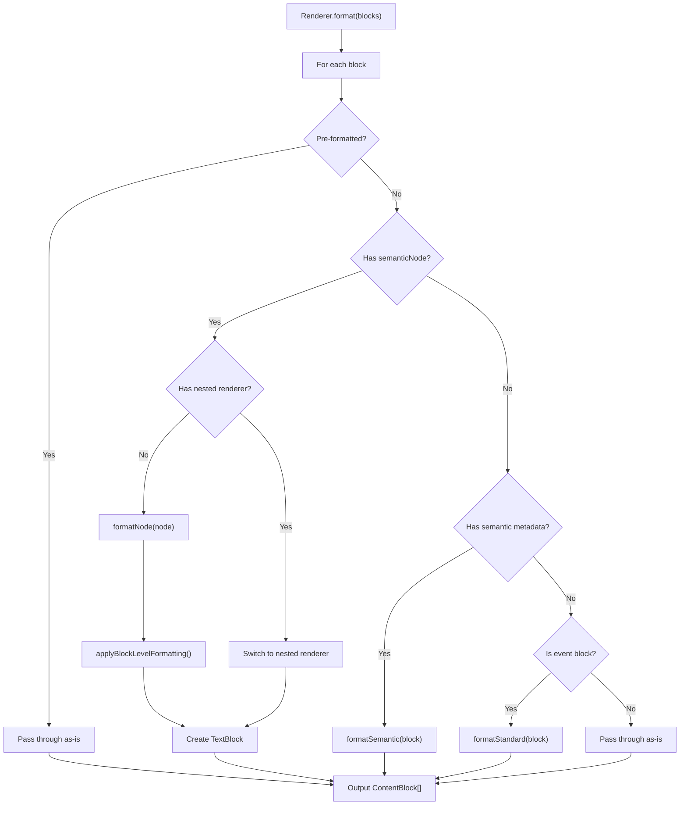

# aidk/core Renderers Architecture

> **Transform semantic content into formatted output for AI models**

The renderers module provides a pluggable system for converting semantic content blocks into formatted text representations. Renderers bridge the gap between AIDK's semantic JSX components and the text formats that AI models consume.

---

## Table of Contents

1. [Overview](#overview)
2. [Module Structure](#module-structure)
3. [Core Concepts](#core-concepts)
4. [Built-in Renderers](#built-in-renderers)
5. [Creating Custom Renderers](#creating-custom-renderers)
6. [JSX Integration](#jsx-integration)
7. [Data Flow](#data-flow)
8. [Usage Examples](#usage-examples)

---

## Overview

### What This Module Does

The renderers module provides:

- **Base Renderer Abstraction** - Abstract `Renderer` class that defines the contract for all content renderers
- **Semantic Node Processing** - Tree-based representation of formatted content with inline styles
- **Built-in Renderers** - `MarkdownRenderer` and `XMLRenderer` for common output formats
- **JSX Integration** - `<Markdown>`, `<XML>`, and `<Renderer>` wrapper components

### Why It Exists

AI models consume text in various formats. Renderers enable:

1. **Format Flexibility** - Same semantic content can be rendered as Markdown, XML, or custom formats
2. **Semantic Preservation** - Content meaning is captured in semantic nodes, not format-specific syntax
3. **Composability** - Renderers can be nested, switched, or customized per subtree
4. **Model Optimization** - Choose the format that works best for your target model

### Design Principles

- **Semantic-First** - Content is represented as semantic trees, not format-specific strings
- **Format Agnostic** - Same `SemanticContentBlock` renders to any output format
- **Structural vs Semantic** - Capitalized components (`<Image>`) create native blocks; lowercase (``) become semantic nodes
- **Pluggable** - Easy to add custom renderers for specialized output formats

---

## Module Structure

```
renderers/
├── index.ts        # Public exports
├── base.ts         # Renderer base class, SemanticNode, SemanticContentBlock types
├── markdown.ts     # MarkdownRenderer implementation
├── xml.ts          # XMLRenderer implementation
└── __tests__/
    └── semantic-rendering.spec.tsx  # Integration tests
```

### File Overview

| File          | Size      | Purpose                                   |
| ------------- | --------- | ----------------------------------------- |
| `base.ts`     | 185 lines | Abstract `Renderer` class, semantic types |
| `markdown.ts` | 452 lines | Markdown formatting (GFM, CommonMark)     |
| `xml.ts`      | 367 lines | XML/HTML formatting with proper escaping  |
| `index.ts`    | 5 lines   | Re-exports public API                     |

---

## Core Concepts

### 1. SemanticNode

A tree structure representing formatted content with semantic meaning:

```typescript
type SemanticNode = {
  /** Plain text content (leaf nodes) */
  text?: string;
  /** Semantic type for formatting (strong, em, code, etc.) */
  semantic?: SemanticType;
  /** Props for semantic nodes (e.g., src/alt for images, href for links) */
  props?: Record<string, any>;
  /** Child nodes (for nested formatting) */
  children?: SemanticNode[];
  /** Renderer to use for this subtree (enables nested renderer switching) */
  renderer?: ContentRenderer;
};
```

**Example semantic tree:**

```typescript
// <Text>Hello <strong>world</strong> with <inlineCode>code</inlineCode></Text>
{
  children: [
    { text: "Hello " },
    { semantic: "strong", children: [{ text: "world" }] },
    { text: " with " },
    { semantic: "code", children: [{ text: "code" }] },
  ];
}
```

### 2. SemanticType

Supported semantic formatting types:

```typescript
type SemanticType =
  // Inline formatting
  | "strong"
  | "em"
  | "mark"
  | "underline"
  | "strikethrough"
  | "subscript"
  | "superscript"
  | "small"
  | "code"
  // Block formatting
  | "heading"
  | "list"
  | "table"
  | "paragraph"
  | "blockquote"
  | "line-break"
  | "horizontal-rule"
  // Media (from lowercase HTML elements)
  | "image"
  | "audio"
  | "video"
  // Semantic elements
  | "link"
  | "quote"
  | "citation"
  | "keyboard"
  | "variable"
  | "list-item"
  // Custom
  | "custom"
  | "preformatted";
```

### 3. SemanticContentBlock

Extends `ContentBlock` with semantic metadata:

```typescript
type SemanticContentBlock = ContentBlock & {
  /** Semantic node tree representing structured content */
  semanticNode?: SemanticNode;

  /** Legacy semantic metadata */
  semantic?: {
    type: SemanticType;
    level?: number; // For headings (1-6)
    structure?: any; // For tables, lists
    href?: string; // For links
    preformatted?: boolean;
  };
};
```

### 4. Structural vs Semantic Components

AIDK distinguishes between two component styles:

| Component Style              | Example                        | Result                                |
| ---------------------------- | ------------------------------ | ------------------------------------- |
| **Structural** (capitalized) | `<Image>`, `<Audio>`, `<Code>` | Native `ContentBlock` passed to model |
| **Semantic** (lowercase)     | ``, `<audio>`, `<strong>` | `SemanticNode` converted to text      |

```tsx
// Structural: Creates native ImageBlock
<Image source={{ type: 'url', url: '...' }} altText="Photo" />

// Semantic: Converted to  by MarkdownRenderer
<Text>Check this: </Text>
```

---

## Built-in Renderers

### MarkdownRenderer

Formats semantic content as Markdown text.

```typescript
class MarkdownRenderer extends Renderer {
  constructor(flavor?: "github" | "commonmark" | "gfm");

  formatNode(node: SemanticNode): string;
  formatSemantic(block: SemanticContentBlock): ContentBlock | null;
  formatStandard(block: SemanticContentBlock): ContentBlock[];
}
```

**Formatting examples:**

| Semantic Type       | Output         |
| ------------------- | -------------- |
| `strong`            | `**text**`     |
| `em`                | `*text*`       |
| `code`              | `` `text` ``   |
| `strikethrough`     | `~~text~~`     |
| `heading` (level 2) | `## text`      |
| `blockquote`        | `> text`       |
| `link`              | `[text](href)` |
| `image`             | ``  |

**Table formatting:**

```typescript
// Input structure
{
  headers: ['Name', 'Value'],
  rows: [['Key', '123']],
  alignments: ['left', 'right']
}

// Output
| Name | Value |
| ---- | ----: |
| Key  |   123 |
```

**List formatting:**

```typescript
// Input structure
{
  ordered: true,
  items: ['First', 'Second', { text: 'Third', nested: { ordered: false, items: ['A', 'B'] } }]
}

// Output
1. First
2. Second
3. Third
   - A
   - B
```

**Task list formatting:**

```typescript
// Input structure
{
  ordered: false,
  task: true,
  items: [
    { text: 'Done task', checked: true },
    { text: 'Pending task', checked: false },
    { text: 'Also pending' }  // defaults to unchecked
  ]
}

// Output (GFM flavor)
- [x] Done task
- [ ] Pending task
- [ ] Also pending

// Output (CommonMark flavor)
- ✓ Done task
- ○ Pending task
- ○ Also pending
```

### XMLRenderer

Formats semantic content as XML/HTML.

```typescript
class XMLRenderer extends Renderer {
  constructor(rootTag?: string);

  formatNode(node: SemanticNode): string;
  formatSemantic(block: SemanticContentBlock): ContentBlock | null;
  formatStandard(block: SemanticContentBlock): ContentBlock[];
}
```

**Formatting examples:**

| Semantic Type       | Output                           |
| ------------------- | -------------------------------- |
| `strong`            | `<strong>text</strong>`          |
| `em`                | `<em>text</em>`                  |
| `code`              | `<code>text</code>`              |
| `strikethrough`     | `<s>text</s>`                    |
| `heading` (level 2) | `<h2>text</h2>`                  |
| `paragraph`         | `<p>text</p>`                    |
| `link`              | `<a href="...">text</a>`         |
| `image`             | ``    |
| `list`              | `<ul>/<ol>` with `<li>`          |
| `table`             | `<table>` with `<thead>/<tbody>` |

**List formatting:**

```typescript
// Input structure
{
  ordered: false,
  items: ['First', 'Second', 'Third']
}

// Output
<ul>
  <li>First</li>
  <li>Second</li>
  <li>Third</li>
</ul>
```

**Task list formatting:**

```typescript
// Input structure
{
  ordered: false,
  task: true,
  items: [
    { text: 'Done task', checked: true },
    { text: 'Pending task', checked: false }
  ]
}

// Output
<ul class="task-list">
  <li class="task-list-item"><input type="checkbox" checked disabled />Done task</li>
  <li class="task-list-item"><input type="checkbox" disabled />Pending task</li>
</ul>
```

**Table formatting:**

```typescript
// Input structure
{
  headers: ['Name', 'Value'],
  rows: [['Key', '123']],
  alignments: ['left', 'right']
}

// Output
<table>
  <thead>
    <tr>
      <th>Name</th>
      <th style="text-align: right">Value</th>
    </tr>
  </thead>
  <tbody>
    <tr>
      <td>Key</td>
      <td style="text-align: right">123</td>
    </tr>
  </tbody>
</table>
```

**XML escaping:**

XMLRenderer automatically escapes special characters:

```typescript
// Input: <Text>A & B < C > D "quoted"</Text>
// Output: A &amp; B &lt; C &gt; D &quot;quoted&quot;
```

---

## Creating Custom Renderers

### Step 1: Extend the Base Class

```typescript
import { Renderer, type SemanticContentBlock, type SemanticNode } from "aidk";
import type { ContentBlock, TextBlock } from "aidk-shared";

export class PlainTextRenderer extends Renderer {
  /**
   * Format a semantic node tree into plain text.
   * Called for SemanticContentBlocks with semanticNode.
   */
  formatNode(node: SemanticNode): string {
    // Process children recursively
    const childTexts: string[] = [];

    if (node.children?.length) {
      for (const child of node.children) {
        childTexts.push(this.formatNode(child));
      }
    } else if (node.text !== undefined) {
      childTexts.push(node.text);
    }

    return childTexts.join("");
  }

  /**
   * Format legacy semantic blocks.
   * Called for blocks with semantic metadata but no semanticNode.
   */
  formatSemantic(block: SemanticContentBlock): ContentBlock | null {
    const { semantic } = block;
    if (!semantic) return null;

    // Extract text and return as plain text block
    const text = extractText([block]);
    return { type: "text", text } as TextBlock;
  }

  /**
   * Format standard ContentBlocks.
   * Called for blocks without semantic metadata.
   */
  formatStandard(block: SemanticContentBlock): ContentBlock[] {
    switch (block.type) {
      case "text":
        return [block];
      case "code":
        return [{ type: "text", text: (block as any).text }];
      default:
        return [block];
    }
  }

  /**
   * Apply block-level formatting after node formatting.
   */
  protected applyBlockLevelFormatting(
    block: SemanticContentBlock,
    formattedText: string,
  ): string {
    return formattedText;
  }
}
```

### Step 2: Use with JSX

```tsx
import { Renderer } from "aidk";

function MyAgent() {
  return (
    <Renderer instance={new PlainTextRenderer()}>
      <H1>Title</H1>
      <Text>
        Content with <strong>formatting</strong> stripped
      </Text>
    </Renderer>
  );
}
```

### Step 3: Create a Wrapper Component (Optional)

```tsx
import { createElement, type JSX } from "aidk";
import { Renderer, type ComponentBaseProps } from "aidk";

interface PlainTextProps extends ComponentBaseProps {
  children?: any;
}

export function PlainText(props: PlainTextProps): JSX.Element {
  return createElement(Renderer, {
    instance: new PlainTextRenderer(),
    children: props.children,
  });
}

// Usage
<PlainText>
  <Text>
    Formatting <strong>will be</strong> removed
  </Text>
</PlainText>;
```

---

## JSX Integration

### Renderer Component

The base `<Renderer>` component wraps children with a specific renderer:

```tsx
import { Renderer } from "aidk";

<Renderer instance={new MarkdownRenderer("gfm")}>
  <H1>GitHub Flavored</H1>
  <Text>With ~~strikethrough~~</Text>
</Renderer>;
```

### Markdown Component

Convenience wrapper for `MarkdownRenderer`:

```tsx
import { Markdown } from "aidk";

<Markdown flavor="github">
  <H1>Title</H1>
  <Text>Content with **bold** and *italic*</Text>
</Markdown>;
```

**Props:**

| Prop       | Type                                | Description                                             |
| ---------- | ----------------------------------- | ------------------------------------------------------- |
| `flavor`   | `'github' \| 'commonmark' \| 'gfm'` | Markdown dialect (affects task list checkbox rendering) |
| `children` | `any`                               | Content to render                                       |

**Flavor differences:**

| Feature         | `github` / `gfm`       | `commonmark`        |
| --------------- | ---------------------- | ------------------- |
| Task checkboxes | `[x]` / `[ ]` (native) | `✓` / `○` (unicode) |
| Strikethrough   | `~~text~~`             | `~~text~~`          |

### XML Component

Convenience wrapper for `XMLRenderer`:

```tsx
import { XML } from "aidk";

<XML>
  <H1>Title</H1>
  <Text>
    Content with <strong>bold</strong>
  </Text>
</XML>;
```

### Nested Renderer Switching

Renderers can be nested to switch formats within a document:

```tsx
<Markdown>
  <H1>Markdown Document</H1>
  <Text>This is **markdown**.</Text>

  <XML>
    <Text>
      This section uses <strong>XML</strong> format.
    </Text>
  </XML>

  <Text>Back to **markdown**.</Text>
</Markdown>
```

The `SemanticNode.renderer` property enables this switching at the node level.

---

## Data Flow

### Rendering Pipeline

```
┌─────────────────────────────────────────────────────────────────────────┐
│                         Rendering Pipeline                               │
└─────────────────────────────────────────────────────────────────────────┘

  JSX Components                    Content Block Registry
  ──────────────                    ──────────────────────
  <Text>Hello <strong>world</strong></Text>
                │
                ▼
  ┌───────────────────────────────────────────────────────────────────────┐
  │                    Content Block Mapper                                │
  │  Converts JSX element to SemanticContentBlock with semantic tree      │
  └───────────────────────────────────────────────────────────────────────┘
                │
                ▼
  ┌───────────────────────────────────────────────────────────────────────┐
  │                    SemanticContentBlock                                │
  │  {                                                                     │
  │    type: 'text',                                                       │
  │    semanticNode: {                                                     │
  │      children: [                                                       │
  │        { text: 'Hello ' },                                             │
  │        { semantic: 'strong', children: [{ text: 'world' }] }           │
  │      ]                                                                 │
  │    }                                                                   │
  │  }                                                                     │
  └───────────────────────────────────────────────────────────────────────┘
                │
                ▼
  ┌───────────────────────────────────────────────────────────────────────┐
  │                    Renderer.format(blocks)                             │
  │  Transforms SemanticContentBlocks to formatted ContentBlocks          │
  └───────────────────────────────────────────────────────────────────────┘
                │
        ┌───────┴───────┐
        ▼               ▼
  MarkdownRenderer   XMLRenderer
        │               │
        ▼               ▼
  "Hello **world**"  "Hello <strong>world</strong>"
```

### Format Method Flow



---

## Usage Examples

### Basic Markdown Rendering

```tsx
import { Markdown, H1, H2, Text, List, ListItem } from "aidk";

function DocumentAgent() {
  return (
    <Markdown>
      <H1>Getting Started</H1>
      <Text>
        Welcome to the <strong>documentation</strong>.
      </Text>

      <H2>Features</H2>
      <List>
        <ListItem>Easy to use</ListItem>
        <ListItem>Highly configurable</ListItem>
        <ListItem>Well documented</ListItem>
      </List>
    </Markdown>
  );
}

// Output:
// # Getting Started
// Welcome to the **documentation**.
// ## Features
// - Easy to use
// - Highly configurable
// - Well documented
```

### XML for Structured Prompts

```tsx
import { XML, H1, Text, System } from "aidk";

function StructuredPrompt() {
  return (
    <System>
      <XML>
        <section id="instructions">
          <H1>Instructions</H1>
          <Text>Follow these steps carefully.</Text>
        </section>
        <section id="constraints">
          <H1>Constraints</H1>
          <Text>
            Do not use <em>external</em> resources.
          </Text>
        </section>
      </XML>
    </System>
  );
}

// Output:
// <section id="instructions">
//   <h1>Instructions</h1>
//   Follow these steps carefully.
// </section>
// <section id="constraints">
//   <h1>Constraints</h1>
//   Do not use <em>external</em> resources.
// </section>
```

### Mixed Inline Formatting

```tsx
import { Markdown, Text } from "aidk";

function CodeExample() {
  return (
    <Markdown>
      <Text>
        Use the <inlineCode>scratchpad</inlineCode> tool to take notes. You can{" "}
        <strong>emphasize</strong> important points or add
        <em>subtle emphasis</em> where needed.
      </Text>
    </Markdown>
  );
}

// Output:
// Use the `scratchpad` tool to take notes. You can **emphasize**
// important points or add *subtle emphasis* where needed.
```

### Handling Media Content

```tsx
import { Markdown, Text, Image } from "aidk";

function MediaExample() {
  return (
    <Markdown>
      {/* Structural: Native ImageBlock passed to model */}
      <Image
        source={{ type: "url", url: "https://example.com/chart.png" }}
        altText="Sales chart"
      />

      {/* Semantic: Converted to markdown inline */}
      <Text>
        See the diagram:{" "}
        
      </Text>
    </Markdown>
  );
}

// Image block: passed through as native ContentBlock
// Text block: "See the diagram: "
```

### Event Block Formatting

```tsx
import { Markdown, Event, UserAction } from "aidk";

function EventExample() {
  return (
    <Markdown>
      <Event>
        <UserAction action="checkout" actor="user" target="cart">
          User initiated checkout
        </UserAction>
      </Event>
    </Markdown>
  );
}

// Markdown output: "User checkout on cart"
// XML output: <user-action actor="user" action="checkout" target="cart">User initiated checkout</user-action>
```

### Direct Renderer Usage

```typescript
import { MarkdownRenderer, XMLRenderer, type SemanticContentBlock } from "aidk";

const blocks: SemanticContentBlock[] = [
  {
    type: "text",
    semanticNode: {
      children: [
        { text: "Hello " },
        { semantic: "strong", children: [{ text: "world" }] },
      ],
    },
  },
];

const markdownRenderer = new MarkdownRenderer("github");
const xmlRenderer = new XMLRenderer();

const markdownOutput = markdownRenderer.format(blocks);
// [{ type: 'text', text: 'Hello **world**' }]

const xmlOutput = xmlRenderer.format(blocks);
// [{ type: 'text', text: 'Hello <strong>world</strong>' }]
```

---

## Summary

The renderers module enables format-flexible content output:

- **`Renderer`** abstract base class defines the rendering contract
- **`SemanticNode`** trees represent formatted content with semantic meaning
- **`MarkdownRenderer`** formats content as Markdown (GFM, CommonMark)
- **`XMLRenderer`** formats content as XML/HTML with proper escaping
- **JSX components** (`<Markdown>`, `<XML>`, `<Renderer>`) integrate with the agent definition system
- **Custom renderers** extend the base class to support additional output formats

This semantic-first approach enables the same content to be rendered in any format, optimized for the target AI model's preferences.
