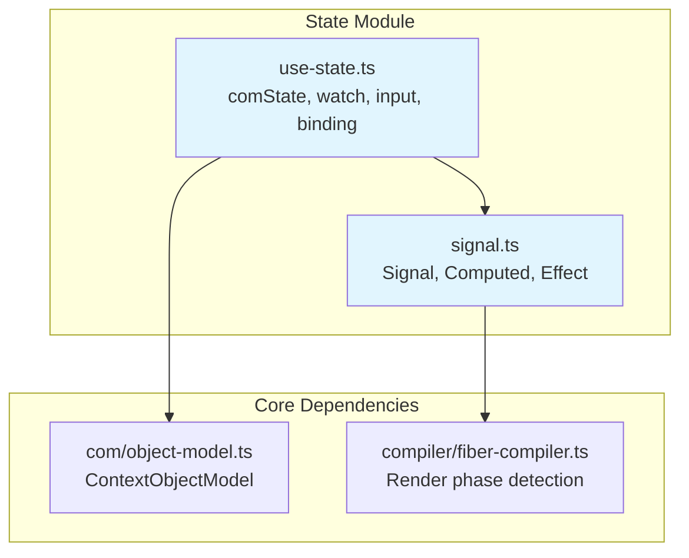
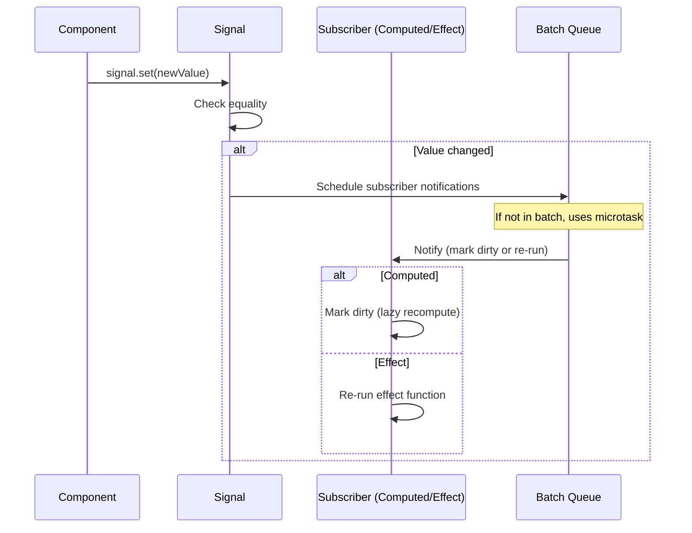
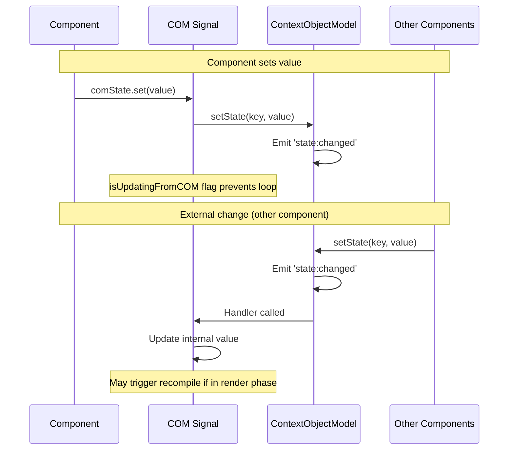
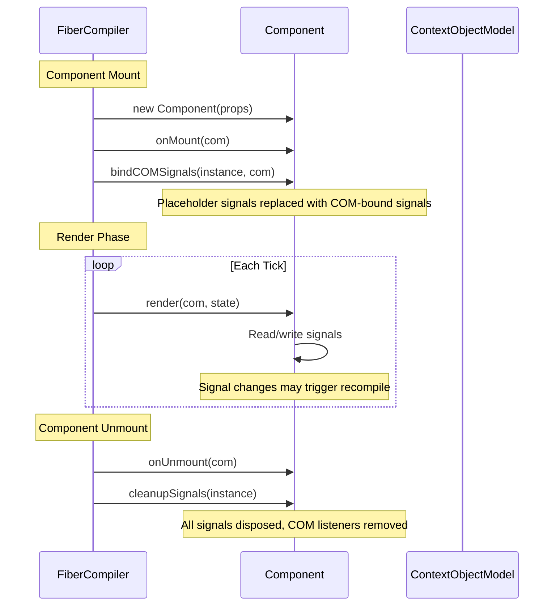

# aidk-core/state Architecture

> **Reactive state management for AIDK components**

The state module provides a signals-based reactive state system for AIDK components. It enables fine-grained reactivity, shared state across components via the Context Object Model (COM), and automatic cleanup on component unmount.

---

## Table of Contents

1. [Overview](#overview)
2. [Module Structure](#module-structure)
3. [Core Concepts](#core-concepts)
4. [API Reference](#api-reference)
5. [State Flow](#state-flow)
6. [Usage Examples](#usage-examples)
7. [Integration Points](#integration-points)
8. [Design Notes](#design-notes)

---

## Overview

### What This Module Does

The state module provides:

- **Signals** - Reactive primitives for fine-grained state updates (similar to SolidJS/Angular signals)
- **Computed Signals** - Derived values that automatically recompute when dependencies change
- **Effects** - Side-effect handlers that re-run when dependencies change
- **COM State** - Shared state bound to the Context Object Model, persisted across ticks
- **Prop Signals** - Read-only signals bound to component props, updated by the compiler

### Why It Exists

AIDK components need reactive state that:

1. **Works across ticks** - State persists between render cycles (ticks)
2. **Supports sharing** - Multiple components can read/write shared state via COM
3. **Is memory-safe** - Automatic cleanup prevents leaks when components unmount
4. **Triggers recompilation** - State changes during render trigger automatic recompilation

### Design Principles

- **Class components only** - Signals work in `Component` classes, not pure function components (which re-execute on every render)
- **Automatic binding** - COM signals are auto-bound in `onMount`, no manual wiring needed
- **Lazy evaluation** - Computed signals only recompute when read after a dependency changes
- **Batched updates** - Multiple signal updates in a batch only trigger effects once

---

## Module Structure



### File Overview

| File           | Size      | Purpose                                            |
| -------------- | --------- | -------------------------------------------------- |
| `signal.ts`    | 827 lines | Core reactive primitives: signal, computed, effect |
| `use-state.ts` | 387 lines | COM integration, prop signals, lifecycle binding   |

---

## Core Concepts

### 1. Signal

A signal is a reactive container for a value. When the value changes, all subscribers are notified.

```
┌─────────────────────────────────────────────────────────────────┐
│                           Signal<T>                              │
├─────────────────────────────────────────────────────────────────┤
│                                                                 │
│  ┌─────────────┐     ┌─────────────────────────────────────┐    │
│  │   Value     │     │           Subscriptions             │    │
│  │  (current)  │     │  Set<{ notify, dispose }>           │    │
│  └─────────────┘     └─────────────────────────────────────┘    │
│        │                           │                            │
│        │  set(newValue)            │  on change                 │
│        ▼                           ▼                            │
│  ┌─────────────┐     ┌─────────────────────────────────────┐    │
│  │  Equality   │     │   Notify all subscribers            │    │
│  │   Check     │────▶│   (scheduled via microtask/batch)   │    │
│  └─────────────┘     └─────────────────────────────────────┘    │
│                                                                 │
│  Reading: signal() tracks dependency if inside computed/effect  │
│                                                                 │
└─────────────────────────────────────────────────────────────────┘
```

**Key characteristics:**

- **Callable** - `signal()` returns current value
- **Settable** - `signal.set(value)` or `signal.update(fn)`
- **Trackable** - Reading inside computed/effect creates a dependency
- **Disposable** - `signal.dispose()` clears all subscriptions

### 2. Computed

A computed signal derives its value from other signals. It's lazy (only recomputes when read) and memoized.

```
┌─────────────────────────────────────────────────────────────────┐
│                       Computed<T>                                │
├─────────────────────────────────────────────────────────────────┤
│                                                                 │
│  ┌─────────────┐     ┌─────────────────────────────────────┐    │
│  │ Cached Value│     │      Dependency Subscriptions       │    │
│  │  (memoized) │     │  (signals this computed reads)      │    │
│  └─────────────┘     └─────────────────────────────────────┘    │
│        │                           │                            │
│        │  isDirty?                 │  dependency changed        │
│        ▼                           ▼                            │
│  ┌─────────────────────────────────────────────────────────┐    │
│  │                    Recompute                            │    │
│  │  1. Clear old dependencies                              │    │
│  │  2. Push tracking context                               │    │
│  │  3. Run computation (dependencies auto-tracked)         │    │
│  │  4. Pop tracking context                                │    │
│  │  5. Cache new value                                     │    │
│  └─────────────────────────────────────────────────────────┘    │
│                                                                 │
│  Circular dependency detection via isComputing flag             │
│                                                                 │
└─────────────────────────────────────────────────────────────────┘
```

### 3. Effect

An effect runs a function whenever its dependencies change. Use sparingly - prefer computed for derived values.

```
┌─────────────────────────────────────────────────────────────────┐
│                         Effect                                   │
├─────────────────────────────────────────────────────────────────┤
│                                                                 │
│  ┌─────────────────────────────────────────────────────────┐    │
│  │                   Effect Function                       │    │
│  │  fn(onCleanup) => void | CleanupFn                      │    │
│  └─────────────────────────────────────────────────────────┘    │
│                           │                                     │
│  ┌────────────────────────┼────────────────────────────────┐    │
│  │                        ▼                                │    │
│  │  1. Run cleanup from previous execution                 │    │
│  │  2. Clear old dependencies                              │    │
│  │  3. Push tracking context                               │    │
│  │  4. Run effect (dependencies auto-tracked)              │    │
│  │  5. Pop tracking context                                │    │
│  │  6. Store cleanup for next run                          │    │
│  └─────────────────────────────────────────────────────────┘    │
│                                                                 │
│  Re-runs automatically when any dependency changes              │
│  Runs immediately on creation (not deferred)                    │
│                                                                 │
└─────────────────────────────────────────────────────────────────┘
```

### 4. COM State

COM state is shared across all components and persists across ticks. It's bidirectionally synced with the Context Object Model.

```
┌─────────────────────────────────────────────────────────────────┐
│                    COM State Signal                              │
├─────────────────────────────────────────────────────────────────┤
│                                                                 │
│  Component                              ContextObjectModel       │
│  ┌─────────────┐                        ┌─────────────────┐     │
│  │ comState()  │◀───── bidirectional ──▶│ state[key]      │     │
│  │   signal    │        sync            │                 │     │
│  └─────────────┘                        └─────────────────┘     │
│        │                                       │                │
│        │  set(value)                           │  setState()    │
│        ▼                                       ▼                │
│  ┌─────────────────────────────────────────────────────────┐    │
│  │              Synchronization Logic                      │    │
│  │  - isUpdatingFromCOM flag prevents circular updates     │    │
│  │  - Updates in either direction propagate to other       │    │
│  │  - COM 'state:changed' event triggers signal update     │    │
│  │  - Signal set() triggers COM setState()                 │    │
│  └─────────────────────────────────────────────────────────┘    │
│                                                                 │
│  Recompilation: Signal changes during render trigger recompile  │
│                                                                 │
└─────────────────────────────────────────────────────────────────┘
```

### 5. Batching

Multiple signal updates can be batched to prevent redundant effect executions.

```
┌─────────────────────────────────────────────────────────────────┐
│                        Batching                                  │
├─────────────────────────────────────────────────────────────────┤
│                                                                 │
│  batch(() => {                                                  │
│    count.set(1);      // No effect yet                         │
│    name.set('Alice'); // No effect yet                         │
│  });                  // Effects run once here                  │
│                                                                 │
│  ┌─────────────────────────────────────────────────────────┐    │
│  │  batchDepth++                                           │    │
│  │  try { fn() } finally { batchDepth-- }                  │    │
│  │  if (batchDepth === 0) flushPendingEffects()            │    │
│  └─────────────────────────────────────────────────────────┘    │
│                                                                 │
│  Without batch: effects scheduled via queueMicrotask            │
│                                                                 │
└─────────────────────────────────────────────────────────────────┘
```

### 6. Dependency Tracking

Automatic dependency tracking via a context stack.

```
┌─────────────────────────────────────────────────────────────────┐
│                   Tracking Context Stack                         │
├─────────────────────────────────────────────────────────────────┤
│                                                                 │
│  trackingStack: TrackingContext[]                               │
│                                                                 │
│  computed(() => {           // Push context 1                   │
│    const a = signalA();     // Tracked by context 1             │
│    const b = computed(() => // Push context 2 (nested)          │
│      signalB()              // Tracked by context 2             │
│    );                       // Pop context 2                    │
│    return a + b();                                              │
│  });                        // Pop context 1                    │
│                                                                 │
│  ┌─────────────────────────────────────────────────────────┐    │
│  │  TrackingContext = {                                    │    │
│  │    onDependency: (source: ReactiveSource) => void       │    │
│  │  }                                                      │    │
│  │                                                         │    │
│  │  Signal/Computed read → check context → call onDep      │    │
│  └─────────────────────────────────────────────────────────┘    │
│                                                                 │
└─────────────────────────────────────────────────────────────────┘
```

---

## API Reference

### signal.ts

#### `signal<T>(initialValue, options?): Signal<T>`

Creates a writable signal.

```typescript
const count = signal(0);
count(); // 0 (read)
count.set(10); // set to 10
count.update((n) => n + 1); // increment
count.value; // 11 (property access)
count.dispose(); // cleanup
```

**Options:**

- `equal?: (a, b) => boolean` - Custom equality function (default: `Object.is`)
- `name?: string` - Debug name

#### `computed<T>(fn, options?): ComputedSignal<T>`

Creates a derived signal.

```typescript
const count = signal(5);
const doubled = computed(() => count() * 2);
doubled(); // 10
count.set(10);
doubled(); // 20 (recomputed)
```

#### `effect(fn): EffectRef`

Runs a function with automatic dependency tracking.

```typescript
const count = signal(0);

const ref = effect(() => {
  console.log("Count:", count());
  return () => console.log("Cleanup"); // Optional cleanup
});

count.set(5); // logs "Cleanup", then "Count: 5"
ref.dispose(); // Stop the effect
```

#### `batch<T>(fn): T`

Batch multiple updates.

```typescript
batch(() => {
  count.set(1);
  name.set("Alice");
  // Effects run once after batch completes
});
```

#### `untracked<T>(fn): T`

Read signals without tracking.

```typescript
effect(() => {
  const user = currentUser(); // Tracked
  const count = untracked(() => counter()); // Not tracked
});
```

#### Type Guards

```typescript
isSignal(value): boolean
isComputed(value): boolean
isEffect(value): boolean
```

---

### use-state.ts

#### `comState<T>(key, initialValue): Signal<T>`

Creates a signal bound to COM state (shared across components).

```typescript
class MyComponent extends Component {
  private timeline = comState<Entry[]>("timeline", []);

  onTickStart(com, state) {
    this.timeline.update((t) => [...t, ...state.current.timeline]);
  }
}
```

#### `watchComState<T>(key, defaultValue?): ReadonlySignal<T | undefined>`

Creates a read-only signal watching COM state.

```typescript
class Observer extends Component {
  private status = watchComState<'idle' | 'loading'>('status', 'idle');

  render() {
    return <div>Status: {this.status()}</div>;
  }
}
```

#### `watch<T>(key, defaultValue?): ReadonlySignal<T | undefined>`

Alias for `watchComState`.

#### `input<T>(initialValue?, config?): ReadonlySignal<T | undefined>`

Creates a signal bound to a component prop.

```typescript
interface Props { title?: string; }

class MyComponent extends Component<Props> {
  title = input<string>('Default');

  render() {
    return <div>{this.title()}</div>;
  }
}
```

#### `bindCOMSignals(instance, com): void`

Binds all COM signals on a component instance. Called automatically by the compiler in `onMount`.

#### `cleanupSignals(instance): void`

Disposes all signals on a component instance. Called automatically by the compiler in `onUnmount`.

#### `disposeSignal(sig): void`

Manually dispose a single signal.

---

## State Flow

### Signal Update Flow



### COM State Synchronization



### Component Lifecycle Integration



---

## Usage Examples

### Local State with Signals

```typescript
class Counter extends Component {
  // Component-local state (not shared)
  private count = signal(0);

  onMount(com: ContextObjectModel) {
    effect(() => {
      console.log('Count changed:', this.count());
    });
  }

  render() {
    return (
      <Section id="counter">
        Count: {this.count()}
      </Section>
    );
  }

  increment() {
    this.count.update(n => n + 1);
  }
}
```

### Shared State with COM

```typescript
class TimelineManager extends Component {
  // Shared state (persisted, visible to all components)
  private timeline = comState<COMTimelineEntry[]>('timeline', []);

  onTickStart(com, state) {
    // Merge new timeline entries
    if (state.current?.timeline) {
      this.timeline.update(t => [...t, ...state.current.timeline]);
    }
  }

  render() {
    return (
      <Timeline>
        {this.timeline().map(entry => (
          <Entry key={entry.id}>{entry}</Entry>
        ))}
      </Timeline>
    );
  }
}

// Another component watching the same state
class TimelineDisplay extends Component {
  private timeline = watch<COMTimelineEntry[]>('timeline');
  private messageCount = computed(() => this.timeline()?.length ?? 0);

  render() {
    return <Section id="info">Messages: {this.messageCount()}</Section>;
  }
}
```

### Computed Values

```typescript
class TokenCounter extends Component {
  private messages = watch<Message[]>('messages');

  // Computed: auto-updates when messages change
  private tokenCount = computed(() => {
    const msgs = this.messages() ?? [];
    return msgs.reduce((sum, m) => sum + estimateTokens(m.content), 0);
  });

  private isNearLimit = computed(() => this.tokenCount() > 3500);

  render() {
    if (this.isNearLimit()) {
      return <Section id="warning">Approaching token limit!</Section>;
    }
    return null;
  }
}
```

### Props with Input Signals

```typescript
interface GreeterProps {
  name: string;
  greeting?: string;
}

class Greeter extends Component<GreeterProps> {
  name = input<string>();      // Required (from props interface)
  greeting = input<string>('Hello');  // Optional with default

  render() {
    return <Text>{this.greeting()} {this.name()}!</Text>;
  }
}

// Usage
<Greeter name="World" />
<Greeter name="Alice" greeting="Hi" />
```

### Batching Updates

```typescript
class FormProcessor extends Component {
  private firstName = signal("");
  private lastName = signal("");
  private fullName = computed(() =>
    `${this.firstName()} ${this.lastName()}`.trim(),
  );

  processForm(data: FormData) {
    // Effects run once after batch, not twice
    batch(() => {
      this.firstName.set(data.firstName);
      this.lastName.set(data.lastName);
    });
  }
}
```

---

## Integration Points

### How Other Modules Use State

| Module                    | Uses                                         | For                            |
| ------------------------- | -------------------------------------------- | ------------------------------ |
| `compiler/fiber-compiler` | `bindCOMSignals`, `cleanupSignals`           | Automatic lifecycle management |
| `compiler/fiber-compiler` | `isCompilerRendering`, `shouldSkipRecompile` | Render phase detection         |
| `component/component`     | Signal types                                 | Component state declarations   |
| `com/object-model`        | State change events                          | Bidirectional COM sync         |

### Compiler Integration

The FiberCompiler handles signal lifecycle automatically:

1. **Mount phase** - Calls `bindCOMSignals(instance, com)` to replace placeholder signals with COM-bound ones
2. **Render phase** - Detects via `isCompilerRendering()` when signals change during render
3. **Recompilation** - COM signals trigger `requestRecompile()` when changed during render
4. **Unmount phase** - Calls `cleanupSignals(instance)` to dispose all reactive primitives

### Render Phase Considerations

The state module integrates with the compiler to handle state changes during render:

```typescript
// In signal.ts - createCOMStateSignal
if (isCompilerRendering() && !shouldSkipRecompile()) {
  const compiler = getActiveCompiler();
  if (compiler && comObj.requestRecompile) {
    comObj.requestRecompile(`comState '${key}' changed during render`);
  }
}
```

**Phases where recompile is skipped:**

- `tickStart` - Render is about to happen anyway
- `tickEnd` - Current tick is done, next tick will see the update
- `complete` - Execution is complete
- `unmount` - Component is being removed

---

## Design Notes

### Why Signals Only Work in Class Components

Function components in AIDK re-execute on every render. Creating signals inside them would:

1. Create new signal instances each render
2. Lose previous state
3. Create memory leaks (signals never disposed)

```typescript
// WRONG - signals in function component
function BadComponent(props) {
  const count = signal(0);  // New signal every render!
  return <div>{count()}</div>;
}

// CORRECT - signals in class component
class GoodComponent extends Component {
  private count = signal(0);  // Created once, persists
  render() {
    return <div>{this.count()}</div>;
  }
}
```

### Memory Management

All reactive primitives implement `dispose()`:

- **Signals** - Clear subscriber set
- **Computed** - Unsubscribe from dependencies, clear dependents
- **Effects** - Unsubscribe from dependencies, run cleanup function
- **COM Signals** - Remove COM event listener, then dispose as signal

The `cleanupSignals()` function traverses all instance properties and disposes any reactive primitives found.

### Thread Safety

The state module is designed for single-threaded execution within a component tree. However, multiple engine instances can run concurrently. The `AsyncLocalStorage`-based compiler context ensures each engine's render phase detection is isolated.

### Potential Concerns

1. **Circular dependencies** - Computed signals detect and throw on circular reads
2. **Effect ordering** - Effects run in microtask order, which may differ from creation order
3. **Memory leaks** - If `cleanupSignals` is not called on unmount, signals can leak
4. **Stale closures** - Effects capture variables; use signal reads inside the effect body

---

## Summary

The state module provides a signals-based reactive system for AIDK components:

- **`signal()`** - Local reactive state with fine-grained updates
- **`computed()`** - Derived values with automatic dependency tracking
- **`effect()`** - Side effects that re-run when dependencies change
- **`comState()`** - Shared state bound to COM, persisted across ticks
- **`watch()`** - Read-only observation of COM state
- **`input()`** - Props as reactive signals

State is automatically bound on mount and cleaned up on unmount by the FiberCompiler. Changes during render trigger automatic recompilation to ensure consistency across the component tree.
