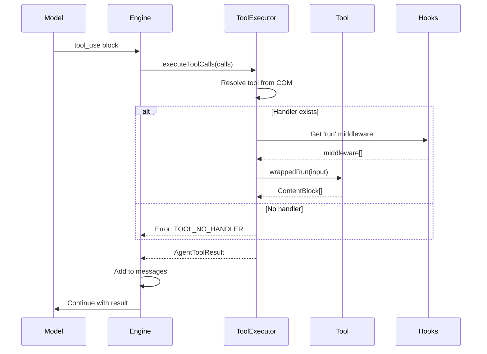
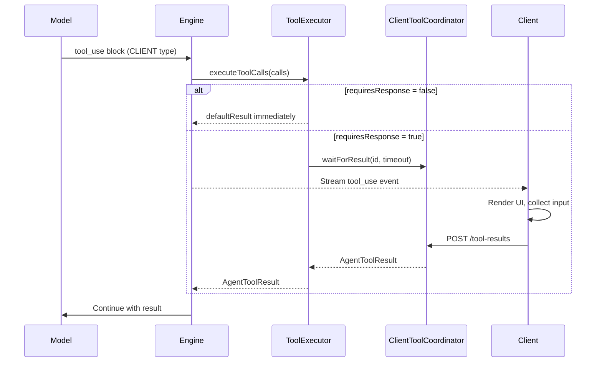

# Tool Module Architecture

> **Tool definition and execution for AIDK agents**

The tool module provides primitives for defining, validating, and executing tools that allow agents to interact with the outside world. Tools are the bridge between LLM reasoning and real-world actions.

---

## Table of Contents

1. [Overview](#overview)
2. [Module Structure](#module-structure)
3. [Core Concepts](#core-concepts)
4. [API Reference](#api-reference)
5. [Execution Flow](#execution-flow)
6. [Usage Examples](#usage-examples)
7. [Integration Points](#integration-points)

---

## Overview

### What This Module Does

The tool module provides:

- **Tool Definition** - Type-safe tool creation with Zod schema validation
- **Execution Routing** - Route tool calls to server, client, provider, or MCP
- **Hook System** - Middleware injection for cross-cutting concerns
- **JSX Integration** - Tools as components that register on mount
- **Client Coordination** - Async result collection from client-executed tools

### Why It Exists

LLMs become more powerful when they can take actions. The tool module:

1. **Standardizes tool creation** - Consistent patterns across server and client tools
2. **Handles execution routing** - Tools execute where they make sense (server, client, provider)
3. **Provides validation** - Zod schemas ensure type safety and runtime validation
4. **Enables composability** - Tools work with JSX component model

### Design Principles

- **Three usage patterns** - Pass to models, run directly, or use in JSX
- **Execution type classification** - SERVER, CLIENT, PROVIDER, MCP determine where tools run
- **Intent classification** - RENDER, ACTION, COMPUTE describe what tools do
- **Schema-first** - Zod schemas provide validation and JSON Schema generation

---

## Module Structure

```
┌─────────────────────────────────────────────────────────────────┐
│                          tool/                                   │
├─────────────────────────────────────────────────────────────────┤
│                                                                 │
│   ┌─────────────────┐          ┌─────────────────────┐          │
│   │    tool.ts      │          │   tool-hooks.ts     │          │
│   │  ─────────────  │          │  ─────────────────  │          │
│   │  createTool()   │          │  ToolHookRegistry   │          │
│   │  ToolClass      │◀────────▶│  ToolHookMiddleware │          │
│   │  ExecutableTool │          │  Hook registration  │          │
│   │  ToolMetadata   │          └─────────────────────┘          │
│   │  ToolDefinition │                                           │
│   └────────┬────────┘                                           │
│            │                                                    │
│            │ used by                                            │
│            ▼                                                    │
│   ┌─────────────────────────────────────────────────────┐       │
│   │            engine/tool-executor.ts                   │       │
│   │  ─────────────────────────────────────────────────  │       │
│   │  ToolExecutor - Routes and executes tool calls       │       │
│   │  ClientToolCoordinator - Manages client tool results │       │
│   └─────────────────────────────────────────────────────┘       │
│                                                                 │
└─────────────────────────────────────────────────────────────────┘
```

### File Overview

| File                                   | Lines | Purpose                             |
| -------------------------------------- | ----- | ----------------------------------- |
| `tool.ts`                              | 487   | Tool creation, types, and utilities |
| `tool-hooks.ts`                        | 86    | Hook registry for tool middleware   |
| `../engine/tool-executor.ts`           | 342   | Tool execution and error handling   |
| `../engine/client-tool-coordinator.ts` | 139   | Client tool result coordination     |

---

## Core Concepts

### 1. Tool Execution Types

Tools are classified by WHERE they execute:

```
┌─────────────────────────────────────────────────────────────────┐
│                    ToolExecutionType                            │
├─────────────────────────────────────────────────────────────────┤
│                                                                 │
│  SERVER              CLIENT              PROVIDER    MCP        │
│  ┌──────────┐        ┌──────────┐        ┌────────┐  ┌───────┐  │
│  │ Engine   │        │ Browser  │        │ OpenAI │  │ MCP   │  │
│  │ executes │        │ executes │        │ Google │  │Server │  │
│  │ tool.run │        │ via UI   │        │ etc.   │  │       │  │
│  └──────────┘        └──────────┘        └────────┘  └───────┘  │
│       │                   │                  │           │      │
│       ▼                   ▼                  ▼           ▼      │
│  Calculator          Form, Chart        Grounding    External   │
│  Database            Navigation         CodeInterp   Services   │
│                                                                 │
└─────────────────────────────────────────────────────────────────┘
```

| Type       | Description                             | Handler Required |
| ---------- | --------------------------------------- | ---------------- |
| `SERVER`   | Engine executes `tool.run` on server    | Yes              |
| `CLIENT`   | Client/browser executes via UI          | No               |
| `PROVIDER` | LLM provider executes (grounding, etc.) | No               |
| `MCP`      | Model Context Protocol server executes  | Yes              |

### 2. Tool Intent

Intent describes WHAT a tool does, helping clients render appropriately:

| Intent    | Purpose                            | Examples                 |
| --------- | ---------------------------------- | ------------------------ |
| `RENDER`  | Renders UI in client               | Chart, Form, Document    |
| `ACTION`  | Performs side-effect action        | Navigate, Copy, Notify   |
| `COMPUTE` | Computes/transforms data (default) | Calculate, Search, Query |

### 3. Tool Schema (Zod Integration)

Tools use Zod schemas for type-safe input validation:

```typescript
const Calculator = createTool({
  name: "calculator",
  description: "Performs arithmetic calculations",
  parameters: z.object({
    expression: z.string().describe("Math expression to evaluate"),
  }),
  handler: async ({ expression }) => {
    // TypeScript knows expression is string
    const result = eval(expression);
    return [{ type: "text", text: String(result) }];
  },
});
```

**Schema provides:**

- TypeScript inference for handler input type
- Runtime validation before handler execution
- JSON Schema generation for model tool definitions

### 4. Tool Result Handling

All tools return `ContentBlock[]`:

```typescript
// Text result
return [{ type: "text", text: "Result here" }];

// Multiple blocks
return [
  { type: "text", text: "Analysis complete" },
  { type: "json", text: JSON.stringify(data), data },
];

// Error result (success: false in AgentToolResult)
throw new Error("Tool failed"); // Caught and converted to error result
```

### 5. Client Tool Patterns

Client tools enable UI interactions without server-side execution:

**Non-blocking (render only):**

```typescript
const RenderChart = createTool({
  name: "render_chart",
  description: "Renders a chart in the UI",
  parameters: z.object({ type: z.string(), data: z.array(z.any()) }),
  type: ToolExecutionType.CLIENT,
  intent: ToolIntent.RENDER,
  requiresResponse: false, // Server continues immediately
  defaultResult: [{ type: "text", text: "[Chart rendered]" }],
});
```

**Blocking (requires response):**

```typescript
const UserForm = createTool({
  name: "user_form",
  description: "Collects user information",
  parameters: z.object({ fields: z.array(z.any()) }),
  type: ToolExecutionType.CLIENT,
  intent: ToolIntent.RENDER,
  requiresResponse: true, // Server waits for client response
  timeout: 60000, // 60 second timeout
});
```

### 6. Tool Confirmation

Tools can require user confirmation before execution. This is useful for dangerous operations, irreversible actions, or tools that may incur costs.

```
┌─────────────────────────────────────────────────────────────────┐
│                    Tool Confirmation Flow                        │
├─────────────────────────────────────────────────────────────────┤
│                                                                 │
│  Model calls tool ─▶ Check requiresConfirmation                 │
│                              │                                  │
│                   ┌──────────┴──────────┐                       │
│                   │                     │                       │
│                 false                 true/fn()                 │
│                   │                     │                       │
│                   ▼                     ▼                       │
│            Execute immediately   Emit confirmation_required     │
│                                        │                        │
│                                        ▼                        │
│                                  Wait for client                │
│                                        │                        │
│                             ┌──────────┴──────────┐             │
│                             │                     │             │
│                          confirmed              denied          │
│                             │                     │             │
│                             ▼                     ▼             │
│                       Execute tool         Return denial        │
│                             │                 result            │
│                             ▼                     │             │
│                       Return result              │              │
│                             │                     │             │
│                             └──────────┬──────────┘             │
│                                        ▼                        │
│                                  Continue execution             │
│                                                                 │
└─────────────────────────────────────────────────────────────────┘
```

**Static confirmation:**

```typescript
const DeleteFile = createTool({
  name: "delete_file",
  description: "Permanently deletes a file",
  parameters: z.object({ path: z.string() }),
  requiresConfirmation: true, // Always requires confirmation
  confirmationMessage: "Are you sure you want to delete this file?",
  handler: async ({ path }) => {
    await fs.unlink(path);
    return [{ type: "text", text: `Deleted ${path}` }];
  },
});
```

**Dynamic confirmation (based on input):**

```typescript
const RunCommand = createTool({
  name: "run_command",
  description: "Executes a shell command",
  parameters: z.object({ command: z.string() }),
  // Only require confirmation for dangerous commands
  requiresConfirmation: (input) => {
    const dangerous = ["rm", "delete", "drop", "truncate"];
    return dangerous.some((cmd) => input.command.includes(cmd));
  },
  confirmationMessage: (input) => `Execute "${input.command}"?`,
  handler: async ({ command }) => {
    const result = await exec(command);
    return [{ type: "text", text: result }];
  },
});
```

**Async confirmation check (e.g., based on user role):**

```typescript
const TransferFunds = createTool({
  name: "transfer_funds",
  description: "Transfer money between accounts",
  parameters: z.object({ amount: z.number(), to: z.string() }),
  // Check user permissions asynchronously
  requiresConfirmation: async (input) => {
    const ctx = Context.get();
    const user = await getUserFromContext(ctx);
    // Skip confirmation for admins or small amounts
    if (user.role === "admin" || input.amount < 100) {
      return false;
    }
    return true;
  },
  confirmationMessage: (input) =>
    `Transfer $${input.amount} to ${input.to}? This cannot be undone.`,
  handler: async ({ amount, to }) => {
    await bankApi.transfer(amount, to);
    return [{ type: "text", text: `Transferred $${amount} to ${to}` }];
  },
});
```

**Key features:**

- `requiresConfirmation` can be boolean or function (sync/async)
- Function receives tool input, enabling context-aware decisions
- `confirmationMessage` can be static string or function for dynamic messages
- Confirmation is handled in parallel - other tools can execute while waiting
- Denial creates a failure result that the model sees

---

## API Reference

### tool.ts

#### `createTool<TInput>(options)`

Creates a tool that can be passed to models, run directly, or used in JSX.

```typescript
function createTool<TInput>(
  options: CreateToolOptions<TInput>,
): ToolClass<TInput>;
```

#### `CreateToolOptions<TInput>`

| Field                   | Type                                                          | Description                                  |
| ----------------------- | ------------------------------------------------------------- | -------------------------------------------- |
| `name`                  | `string`                                                      | Tool name (used by model to call)            |
| `description`           | `string`                                                      | Description shown to the model               |
| `parameters`            | `z.ZodSchema<TInput>`                                         | Zod schema for input validation              |
| `handler?`              | `ToolHandler<TInput>`                                         | Handler function (optional for CLIENT tools) |
| `type?`                 | `ToolExecutionType`                                           | Execution type (default: SERVER)             |
| `intent?`               | `ToolIntent`                                                  | Tool intent (default: COMPUTE)               |
| `requiresResponse?`     | `boolean`                                                     | Wait for client response (CLIENT only)       |
| `timeout?`              | `number`                                                      | Response timeout in ms (default: 30000)      |
| `defaultResult?`        | `ContentBlock[]`                                              | Default result for non-blocking tools        |
| `middleware?`           | `Middleware[]`                                                | Middleware for handler execution             |
| `providerOptions?`      | `ProviderToolOptions`                                         | Provider-specific configuration              |
| `mcpConfig?`            | `object`                                                      | MCP server configuration                     |
| `requiresConfirmation?` | `boolean \| ((input: TInput) => boolean \| Promise<boolean>)` | Require user confirmation before execution   |
| `confirmationMessage?`  | `string \| ((input: TInput) => string)`                       | Custom confirmation prompt message           |

**Component lifecycle hooks (for JSX usage):**

| Hook             | When Called                         |
| ---------------- | ----------------------------------- |
| `onMount`        | When tool component mounts          |
| `onUnmount`      | When tool component unmounts        |
| `onStart`        | When agent execution starts         |
| `onTickStart`    | Before each model call              |
| `onTickEnd`      | After each model call               |
| `onComplete`     | When agent execution completes      |
| `onError`        | When error occurs (return recovery) |
| `render`         | Custom render function              |
| `onAfterCompile` | After JSX compilation               |

#### `ToolClass<TInput>`

The returned class from `createTool`:

```typescript
interface ToolClass<TInput> {
  metadata: ToolMetadata<TInput>; // Static tool metadata
  run?: Procedure<ToolHandler<TInput>>; // Static run procedure
  new (props?: ComponentBaseProps): EngineComponent; // Component constructor
}
```

#### `ToolMetadata<TInput>`

```typescript
interface ToolMetadata<TInput> {
  name: string;
  description: string;
  parameters: z.ZodSchema<TInput>;
  type?: ToolExecutionType;
  intent?: ToolIntent;
  requiresResponse?: boolean;
  timeout?: number;
  defaultResult?: ContentBlock[];
  providerOptions?: ProviderToolOptions;
  libraryOptions?: LibraryToolOptions;
  mcpConfig?: object;
  requiresConfirmation?:
    | boolean
    | ((input: TInput) => boolean | Promise<boolean>);
  confirmationMessage?: string | ((input: TInput) => string);
}
```

#### `ExecutableTool<THandler>`

Minimal interface for tool execution:

```typescript
interface ExecutableTool<THandler> {
  metadata: ToolMetadata<ExtractArgs<THandler>[0]>;
  run?: Procedure<THandler>;
}
```

#### Type Guards

```typescript
isToolClass(value: any): value is ToolClass
isExecutableTool(value: any): value is ExecutableTool
```

#### Utilities

```typescript
// Extract ExecutableTool from ToolClass
toExecutableTool(toolClass: ToolClass): ExecutableTool

// Convert client tool definition to full definition
clientToolToDefinition(clientTool: ClientToolDefinition): ToolDefinition
```

---

### tool-hooks.ts

#### `ToolHookRegistry`

Registry for tool execution hooks:

```typescript
class ToolHookRegistry {
  // Register middleware for a hook
  addMiddleware(
    hookName: ToolHookName | ComponentHookName,
    middleware: ToolHookMiddleware<typeof hookName>,
  ): void;

  // Get all middleware for a hook (global + instance)
  getMiddleware(
    hookName: ToolHookName | ComponentHookName,
  ): ToolHookMiddleware<typeof hookName>[];
}
```

#### Hook Names

**Tool hooks:**

- `run` - Applied to tool execution

**Component hooks (for JSX tools):**

- `onMount`, `onUnmount`, `onStart`, `onTickStart`, `render`, `onTickEnd`, `onComplete`, `onError`

---

## Execution Flow

### Server Tool Execution



### Client Tool Execution



### Tool Resolution Flow

```
┌─────────────────────────────────────────────────────────────────┐
│                     Tool Resolution                              │
├─────────────────────────────────────────────────────────────────┤
│                                                                 │
│  Model requests tool "calculator"                               │
│            │                                                    │
│            ▼                                                    │
│  ┌────────────────────────┐                                     │
│  │ 1. Check COM (Context  │                                     │
│  │    Object Model)       │ ──── Tools registered via JSX       │
│  └───────────┬────────────┘                                     │
│              │ not found                                        │
│              ▼                                                  │
│  ┌────────────────────────┐                                     │
│  │ 2. Check Engine config │ ──── Tools passed to Engine()       │
│  │    tools array         │                                     │
│  └───────────┬────────────┘                                     │
│              │ not found                                        │
│              ▼                                                  │
│  ┌────────────────────────┐                                     │
│  │ 3. Return error:       │                                     │
│  │    TOOL_NOT_FOUND      │                                     │
│  └────────────────────────┘                                     │
│                                                                 │
└─────────────────────────────────────────────────────────────────┘
```

---

## Usage Examples

### Basic Server Tool

```typescript
import { createTool } from 'aidk';
import { z } from 'zod';

const Calculator = createTool({
  name: 'calculator',
  description: 'Performs arithmetic calculations',
  parameters: z.object({
    expression: z.string().describe('Math expression to evaluate'),
  }),
  handler: async ({ expression }) => {
    const result = eval(expression);
    return [{ type: 'text', text: String(result) }];
  },
});

// Pattern 1: Pass to model
const engine = new Engine({ tools: [Calculator] });

// Pattern 2: Run directly
const result = await Calculator.run({ expression: '2 + 2' });

// Pattern 3: Use in JSX
function MyAgent() {
  return (
    <>
      <Calculator />
      <Model />
    </>
  );
}
```

### Client Render Tool (Non-blocking)

```typescript
import { createTool, ToolExecutionType, ToolIntent } from "aidk";
import { z } from "zod";

const RenderChart = createTool({
  name: "render_chart",
  description: "Renders a chart visualization in the UI",
  parameters: z.object({
    type: z.enum(["line", "bar", "pie"]).describe("Chart type"),
    data: z.array(
      z.object({
        label: z.string(),
        value: z.number(),
      }),
    ),
    title: z.string().optional(),
  }),
  type: ToolExecutionType.CLIENT,
  intent: ToolIntent.RENDER,
  requiresResponse: false,
  defaultResult: [{ type: "text", text: "[Chart rendered in UI]" }],
});
```

### Client Form Tool (Blocking)

```typescript
import { createTool, ToolExecutionType, ToolIntent } from "aidk";
import { z } from "zod";

const UserInfoForm = createTool({
  name: "user_info_form",
  description: "Collects user information via a form",
  parameters: z.object({
    fields: z.array(
      z.object({
        name: z.string(),
        type: z.enum(["text", "email", "number"]),
        required: z.boolean().optional(),
      }),
    ),
    title: z.string().optional(),
  }),
  type: ToolExecutionType.CLIENT,
  intent: ToolIntent.RENDER,
  requiresResponse: true, // Server waits for form submission
  timeout: 120000, // 2 minutes for user to fill form
});
```

### Tool with Hooks

```typescript
import { createTool } from "aidk";
import { z } from "zod";

const DatabaseQuery = createTool({
  name: "database_query",
  description: "Executes a database query",
  parameters: z.object({
    query: z.string(),
    params: z.array(z.any()).optional(),
  }),

  middleware: [
    // Logging middleware
    async (args, envelope, next) => {
      console.log(`Executing query: ${args[0].query}`);
      const start = Date.now();
      try {
        const result = await next();
        console.log(`Query completed in ${Date.now() - start}ms`);
        return result;
      } catch (error) {
        console.error(`Query failed:`, error);
        throw error;
      }
    },
  ],

  handler: async ({ query, params }) => {
    const result = await db.query(query, params);
    return [{ type: "json", text: JSON.stringify(result), data: result }];
  },
});
```

### Tool with Component Lifecycle

```typescript
import { createTool } from "aidk";
import { z } from "zod";

const WeatherTool = createTool({
  name: "get_weather",
  description: "Gets current weather for a location",
  parameters: z.object({
    location: z.string(),
  }),

  handler: async ({ location }) => {
    const weather = await fetchWeather(location);
    return [{ type: "text", text: `Weather in ${location}: ${weather}` }];
  },

  // Component lifecycle hooks
  onMount: async (com) => {
    console.log("Weather tool mounted");
    // Initialize API client, etc.
  },

  onUnmount: async (com) => {
    console.log("Weather tool unmounted");
    // Cleanup resources
  },

  onTickEnd: async (com, state) => {
    // Called after each model response
    const lastMessage = state.messages[state.messages.length - 1];
    console.log("Last response:", lastMessage);
  },
});
```

### Provider Tool (OpenAI Code Interpreter)

```typescript
import { createTool, ToolExecutionType, ToolIntent } from "aidk";
import { z } from "zod";

// Provider tools are executed by the LLM provider, not AIDK
const CodeInterpreter = createTool({
  name: "code_interpreter",
  description: "Executes Python code in a sandboxed environment",
  parameters: z.object({
    code: z.string(),
  }),
  type: ToolExecutionType.PROVIDER,
  intent: ToolIntent.COMPUTE,

  providerOptions: {
    openai: {
      type: "code_interpreter",
    },
  },

  // No handler - provider executes this
});
```

### MCP Tool

```typescript
import { createTool, ToolExecutionType } from "aidk";
import { z } from "zod";

const GitHubSearch = createTool({
  name: "github_search",
  description: "Searches GitHub repositories",
  parameters: z.object({
    query: z.string(),
    language: z.string().optional(),
  }),
  type: ToolExecutionType.MCP,

  mcpConfig: {
    serverName: "github-mcp",
    serverUrl: "http://localhost:3001",
    transport: "sse",
  },

  handler: async ({ query, language }) => {
    // MCP handler communicates with MCP server
    const results = await mcpClient.call("github_search", { query, language });
    return [{ type: "json", text: JSON.stringify(results), data: results }];
  },
});
```

### Tool with Confirmation

```typescript
import { createTool } from "aidk";
import { z } from "zod";
import { Context } from "aidk";

const DeployApplication = createTool({
  name: "deploy_application",
  description: "Deploys the application to a specified environment",
  parameters: z.object({
    environment: z.enum(["staging", "production"]),
    version: z.string(),
  }),

  // Only require confirmation for production deployments
  requiresConfirmation: (input) => input.environment === "production",

  // Dynamic message based on input
  confirmationMessage: (input) =>
    `Deploy version ${input.version} to ${input.environment}? ` +
    (input.environment === "production"
      ? "This will affect live users."
      : "This is a staging deployment."),

  handler: async ({ environment, version }) => {
    await deployService.deploy(environment, version);
    return [
      {
        type: "text",
        text: `Successfully deployed ${version} to ${environment}`,
      },
    ];
  },
});
```

---

## Integration Points

### How Other Modules Use Tools

| Module   | Uses                             | For                                  |
| -------- | -------------------------------- | ------------------------------------ |
| Engine   | `ToolExecutor`, `ExecutableTool` | Tool resolution and execution        |
| COM      | `ToolMetadata`, `ExecutableTool` | Tool registration from JSX           |
| Model    | `ToolDefinition`                 | Tool schema for model API            |
| Adapters | `ToolMetadata.providerOptions`   | Provider-specific tool configuration |
| Client   | `ClientToolDefinition`           | Client-side tool rendering           |

### Tool Definition Conversion

```
┌─────────────────────────────────────────────────────────────────┐
│                    Tool Definition Flow                          │
├─────────────────────────────────────────────────────────────────┤
│                                                                 │
│   ToolClass                 ToolMetadata              ToolDefinition
│   ┌──────────┐              ┌──────────┐              ┌──────────┐
│   │ metadata │─────────────▶│ Zod      │──────────────│ JSON     │
│   │ run      │              │ Schema   │   zodToJson  │ Schema   │
│   └──────────┘              └──────────┘              └──────────┘
│        │                                                   │
│        │                                                   │
│        ▼                                                   ▼
│   ExecutableTool                                   Model API call
│   (engine.execute)                                 (adapter.generate)
│                                                                 │
└─────────────────────────────────────────────────────────────────┘
```

### Extension Points

1. **Custom Execution Types** - Extend `ToolExecutionType` for new execution patterns
2. **Provider Options** - Add provider-specific configuration via `providerOptions`
3. **Library Options** - Add library-specific configuration via `libraryOptions`
4. **Middleware** - Inject cross-cutting concerns via tool hooks
5. **Component Hooks** - Control tool behavior in JSX context

---

## Summary

The tool module provides comprehensive tool support for AIDK:

- **`createTool()`** - Type-safe tool creation with three usage patterns
- **Execution Types** - SERVER, CLIENT, PROVIDER, MCP for flexible execution
- **Intent Classification** - RENDER, ACTION, COMPUTE for client rendering
- **Zod Integration** - Schema validation and JSON Schema generation
- **Hook System** - Middleware injection for logging, auth, caching, etc.
- **Client Coordination** - Async result collection for interactive tools

Tools bridge the gap between LLM reasoning and real-world actions, enabling agents to fetch data, render UI, execute code, and perform actions across server and client boundaries.
