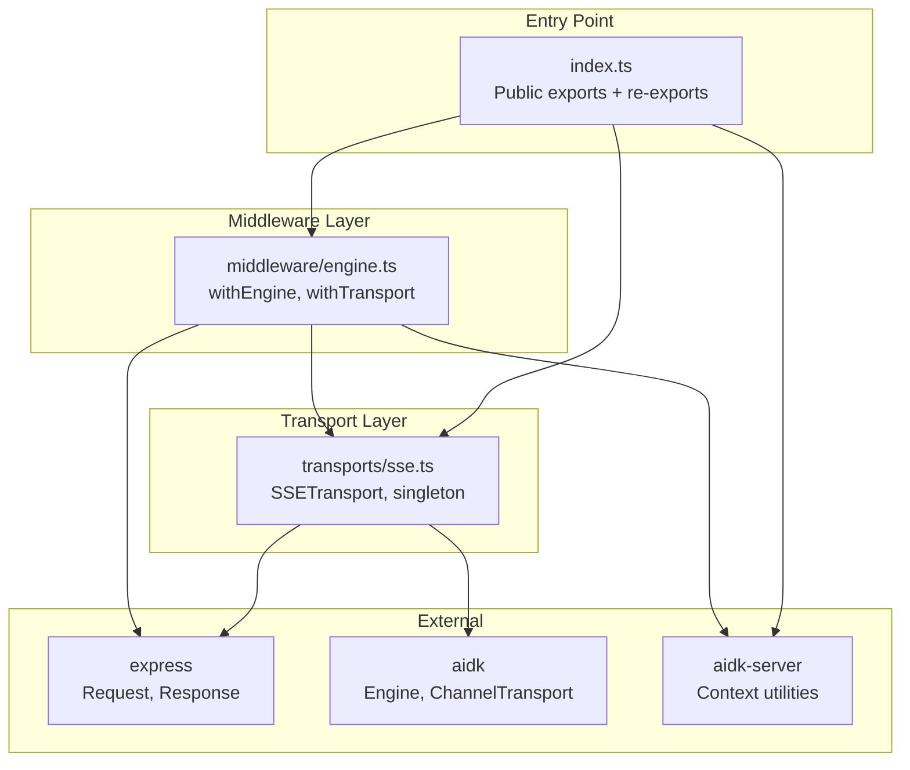
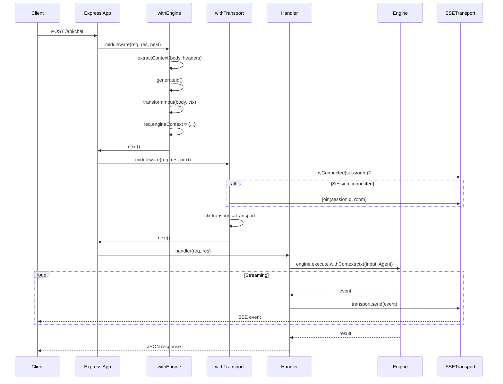
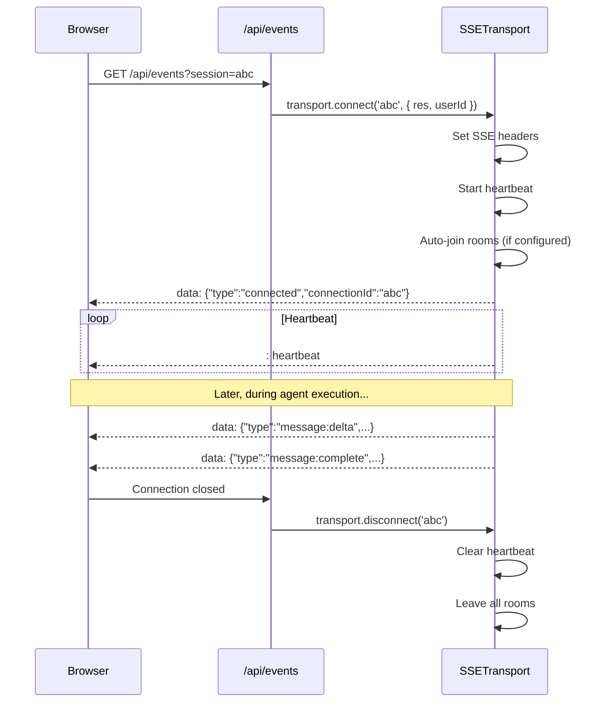
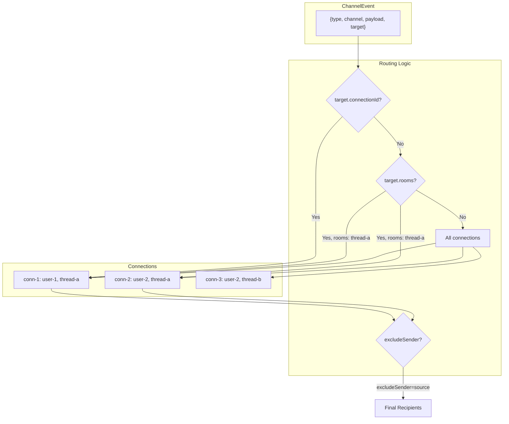

# aidk-express Architecture

> **Express.js integration for AIDK agents**

The express package provides Express.js-specific middleware, SSE transport, and streaming utilities for hosting AIDK agents. It builds on the framework-agnostic utilities from `aidk-server` to deliver a seamless Express integration.

---

## Table of Contents

1. [Overview](#overview)
2. [Module Structure](#module-structure)
3. [Core Concepts](#core-concepts)
4. [API Reference](#api-reference)
5. [Data Flow](#data-flow)
6. [Usage Examples](#usage-examples)
7. [Integration Points](#integration-points)

---

## Overview

### What This Package Does

The express package provides:

- **Engine Middleware** - Extract execution context from requests and attach to `req.engineContext`
- **SSE Transport** - Server-Sent Events implementation with room-based routing for real-time streaming
- **Transport Middleware** - Coordinate SSE connections with engine execution context
- **Streaming Helpers** - Utilities for setting up SSE responses and writing events

### Why It Exists

Express is a widely-used Node.js web framework. This package provides:

1. **Express-native patterns** - Middleware, request extension, proper error handling
2. **Real-time streaming** - SSE transport that integrates with AIDK's channel system
3. **Room-based routing** - Socket.io-style rooms for targeted event delivery
4. **Zero boilerplate** - Ready-to-use middleware that handles context extraction and transformation

### Design Principles

- **Builds on aidk-server** - Uses framework-agnostic utilities; only adds Express-specific wrappers
- **Middleware composition** - Separate middleware for engine and transport concerns
- **Singleton pattern** - SSE transport shared across the application
- **Type-safe requests** - `EngineRequest` type for handlers

---

## Module Structure



### File Overview

| File                   | Size      | Purpose                                 |
| ---------------------- | --------- | --------------------------------------- |
| `index.ts`             | 32 lines  | Public API exports and re-exports       |
| `middleware/engine.ts` | 280 lines | Engine context and transport middleware |
| `transports/sse.ts`    | 395 lines | SSE transport with room-based routing   |

---

## Core Concepts

### 1. Engine Middleware

The `withEngine` middleware extracts execution context from incoming requests and attaches it to `req.engineContext`:

```
┌─────────────────────────────────────────────────────────────────┐
│                    withEngine Middleware                         │
├─────────────────────────────────────────────────────────────────┤
│                                                                  │
│  HTTP Request                                                    │
│  ┌──────────────────────────────────────────────────────────┐   │
│  │  POST /api/chat                                          │   │
│  │  Headers: { x-session-id: 'sess-123' }                   │   │
│  │  Body: { messages: [...], threadId, userId }           │   │
│  └──────────────────────────────────────────────────────────┘   │
│                              │                                   │
│                              ▼                                   │
│  ┌──────────────────────────────────────────────────────────┐   │
│  │              extractContext()                             │   │
│  │  ────────────────────────                                │   │
│  │  From: aidk-server (defaultContextExtractor)             │   │
│  │  Returns: RequestContext                                 │   │
│  └──────────────────────────────────────────────────────────┘   │
│                              │                                   │
│                              ▼                                   │
│  ┌──────────────────────────────────────────────────────────┐   │
│  │              transformInput()                             │   │
│  │  ────────────────────────                                │   │
│  │  From: aidk-server (defaultInputTransformer)             │   │
│  │  Returns: EngineInput { timeline, metadata }             │   │
│  └──────────────────────────────────────────────────────────┘   │
│                              │                                   │
│                              ▼                                   │
│  ┌──────────────────────────────────────────────────────────┐   │
│  │              req.engineContext                            │   │
│  │  ─────────────────────────                               │   │
│  │  {                                                       │   │
│  │    engine: Engine,                                       │   │
│  │    executionId: 'exec-xyz',                             │   │
│  │    threadId: 'thread-abc',                              │   │
│  │    sessionId: 'sess-123',                               │   │
│  │    userId: 'user-1',                                    │   │
│  │    input: EngineInput,                                   │   │
│  │    withContext: { user, metadata }                       │   │
│  │  }                                                       │   │
│  └──────────────────────────────────────────────────────────┘   │
│                                                                  │
└─────────────────────────────────────────────────────────────────┘
```

### 2. SSE Transport

The `SSETransport` implements AIDK's `ChannelTransport` interface, enabling real-time communication between server and browser clients:

```
┌─────────────────────────────────────────────────────────────────┐
│                       SSETransport                               │
├─────────────────────────────────────────────────────────────────┤
│                                                                  │
│   Connections                       Rooms                        │
│   ───────────                       ─────                        │
│   ┌─────────────────┐               ┌─────────────────┐          │
│   │ conn-1          │───────────────│ thread:abc      │          │
│   │  res: Response  │        ┌──────│                 │          │
│   │  rooms: [abc]   │        │      └─────────────────┘          │
│   │  channels: [*]  │        │                                   │
│   └─────────────────┘        │      ┌─────────────────┐          │
│                              │      │ thread:xyz      │          │
│   ┌─────────────────┐        │      │                 │──────┐   │
│   │ conn-2          │────────┴──────│                 │      │   │
│   │  res: Response  │               └─────────────────┘      │   │
│   │  rooms: [abc,   │                                        │   │
│   │         xyz]    │               ┌─────────────────┐      │   │
│   │  channels: []   │               │ user:user-1     │──────┤   │
│   └─────────────────┘               └─────────────────┘      │   │
│                                                              │   │
│   ┌─────────────────┐                                        │   │
│   │ conn-3          │────────────────────────────────────────┘   │
│   │  res: Response  │                                            │
│   │  rooms: [xyz,   │                                            │
│   │         user-1] │                                            │
│   └─────────────────┘                                            │
│                                                                  │
│   Event Routing                                                  │
│   ─────────────                                                  │
│   • No target     → All connections                              │
│   • connectionId  → Specific connection                          │
│   • rooms: [...]  → Connections in those rooms                   │
│   • excludeSender → Skip source connection (broadcast)           │
│                                                                  │
└─────────────────────────────────────────────────────────────────┘
```

### 3. Transport Middleware

The `withTransport` middleware coordinates SSE connections with execution context:

```
┌─────────────────────────────────────────────────────────────────┐
│                  withTransport Flow                              │
├─────────────────────────────────────────────────────────────────┤
│                                                                  │
│  1. Check if session is connected                                │
│     ┌──────────────────────────────────────────────────────┐    │
│     │ transport.isConnected(ctx.sessionId)                │    │
│     └──────────────────────────────────────────────────────┘    │
│                              │                                   │
│                   ┌──────────┴──────────┐                        │
│                   ▼                     ▼                        │
│              Connected             Not Connected                 │
│                   │                     │                        │
│                   ▼                     ▼                        │
│  2. Join room based on pattern     Skip room join                │
│     ┌────────────────────────┐                                   │
│     │ transport.join(        │                                   │
│     │   sessionId,          │                                   │
│     │   `thread:${threadId}`│                                   │
│     │ )                      │                                   │
│     └────────────────────────┘                                   │
│                   │                                              │
│                   ▼                                              │
│  3. Attach transport to context                                  │
│     ┌────────────────────────────────────────────────────────┐   │
│     │ req.engineContext.transport = transport                │   │
│     └────────────────────────────────────────────────────────┘   │
│                                                                  │
└─────────────────────────────────────────────────────────────────┘
```

---

## API Reference

### index.ts

Re-exports from submodules plus all `aidk-server` exports:

```typescript
// SSE Transport
export {
  SSETransport,
  createSSETransport,
  getSSETransport,
  resetSSETransport,
} from "./transports/sse";
export type { SSETransportConfig } from "./transports/sse";

// Engine Middleware
export {
  withEngine,
  withTransport,
  setupStreamingResponse,
  writeSSEEvent,
  writeSSEEventSafe,
} from "./middleware/engine";
export type {
  EngineRequest,
  ExpressEngineConfig,
  TransportConfig,
} from "./middleware/engine";

// Re-export all from aidk-server
export * from "aidk-server";
```

---

### middleware/engine.ts

#### Types

##### `EngineRequest`

Extended Express request with engine context:

```typescript
interface EngineRequest extends Request {
  engineContext: {
    engine: Engine; // Engine instance
    executionId: string; // Unique execution ID
    threadId: string; // Thread/conversation ID
    sessionId?: string; // Session ID for channel routing
    userId: string; // User ID
    tenantId?: string; // Tenant ID
    input: EngineInput; // Transformed input for engine
    metadata?: Record<string, unknown>;
    transport?: SSETransport; // Transport (if withTransport used)
    withContext: { user; metadata }; // Pre-built for engine.execute.withContext()
  };
}
```

##### `ExpressEngineConfig<TBody>`

Configuration for `withEngine` middleware:

```typescript
interface ExpressEngineConfig<TBody> extends ExecutionContextConfig<TBody> {
  // Inherits: engine, extractContext?, transformInput?, generateId?
  // Future: Express-specific options
}
```

##### `TransportConfig`

Configuration for `withTransport` middleware:

```typescript
interface TransportConfig {
  transport: SSETransport;
  roomPattern?: (ctx: RequestContext & { executionId: string }) => string;
}
```

#### `withEngine(config)`

Creates middleware that extracts execution context from requests.

```typescript
function withEngine<TBody>(
  config: ExpressEngineConfig<TBody>,
): (req: Request, res: Response, next: NextFunction) => void;
```

**What it does:**

1. Gets engine instance (supports factory function or direct instance)
2. Extracts context using `extractContext` (defaults to `defaultContextExtractor`)
3. Attaches base `RequestContext` to request via `attachContext()` for guards/simple access
4. Generates execution ID using `generateId` (defaults to UUID v4)
5. Transforms input using `transformInput` (defaults to `defaultInputTransformer`)
6. Builds full context with `buildEngineContext`
7. Attaches everything to `req.engineContext`

**Accessing Context:**

The middleware provides two ways to access context:

```typescript
// Full context with engine, input, etc. (for handlers)
const { engine, input, withContext } = (req as EngineRequest).engineContext;

// Simple RequestContext (for guards, logging middleware)
import { getContext, requireContext } from "aidk-express";
const ctx = getContext(req); // { threadId, userId, tenantId, ... }
```

#### `withTransport(config)`

Creates middleware that coordinates SSE connections with execution context.

```typescript
function withTransport(
  config: TransportConfig,
): (req: Request, res: Response, next: NextFunction) => Promise<void>;
```

**What it does:**

1. Checks if session is connected to SSE transport
2. Joins room based on `roomPattern` (defaults to `thread:{threadId}`)
3. Attaches transport to `req.engineContext.transport`

**Requires:** `withEngine` middleware must be used first.

#### Streaming Helpers

```typescript
// Set SSE headers
function setupStreamingResponse(res: Response): void;

// Write SSE event
function writeSSEEvent(res: Response, data: unknown): void;

// Write SSE event with Error object serialization
function writeSSEEventSafe(res: Response, data: unknown): void;
```

---

### transports/sse.ts

#### `SSETransport`

Implements `ChannelTransport` for Server-Sent Events:

```typescript
class SSETransport implements ChannelTransport {
  name = "sse";

  // Configuration
  constructor(config?: SSETransportConfig);
  applyConfig(config: Partial<SSETransportConfig>): void;

  // Connection lifecycle
  connect(
    connectionId: string,
    metadata?: ConnectionMetadata & { res?: Response },
  ): Promise<void>;
  disconnect(connectionId?: string): Promise<void>;
  closeAll(): void; // Graceful shutdown

  // Room management
  join(connectionId: string, room: string): Promise<void>;
  leave(connectionId: string, room: string): Promise<void>;
  getConnectionRooms(connectionId: string): string[];
  getRoomConnections(room: string): string[];

  // Event handling
  send(event: ChannelEvent): Promise<void>;
  onReceive(handler: (event: ChannelEvent) => void): void;
  handleIncomingEvent(event: ChannelEvent): void;

  // Utilities
  addConnection(connectionId: string, res: Response, options?): void;
  isConnected(connectionId: string): boolean;
  getConnectedSessions(): string[];
  getConnectionMetadata(connectionId: string): ConnectionMetadata | undefined;
}
```

#### `SSETransportConfig`

```typescript
interface SSETransportConfig extends ChannelTransportConfig {
  heartbeatInterval?: number; // Default: 30000ms
  debug?: boolean; // Enable logging
  autoJoinRooms?: (metadata: ConnectionMetadata) => string[]; // Auto-join on connect
  maxConnections?: number; // Maximum total connections (default: unlimited)
  maxConnectionsPerUser?: number; // Maximum connections per userId (default: unlimited)
}
```

**Connection Limits:**

When `maxConnections` is reached, new connections receive a 503 response:

```json
{
  "error": "Too many connections",
  "message": "Server connection limit reached. Please try again later."
}
```

When `maxConnectionsPerUser` is reached for a user, they receive a 429 response:

```json
{
  "error": "Too many connections",
  "message": "You have too many active connections. Please close some and try again."
}
```

**Client Disconnect Detection:**

The transport listens for the HTTP response `close` event to properly detect when clients disconnect (browser tab closed, network disconnect, etc.). This ensures connections are cleaned up immediately rather than waiting for the next heartbeat failure.

#### Singleton Factory

```typescript
// Create or configure singleton
function createSSETransport(config?: SSETransportConfig): SSETransport;

// Get singleton (creates if needed)
function getSSETransport(): SSETransport;

// Reset singleton (for testing)
function resetSSETransport(): void;
```

---

## Data Flow

### Full Request Flow



### SSE Connection Flow



### Room-Based Event Routing



---

## Usage Examples

### Basic Setup

```typescript
import express from "express";
import { createEngine } from "aidk";
import { withEngine, getSSETransport, createSSETransport } from "aidk-express";

const app = express();
app.use(express.json());

// Initialize transport and engine
const transport = createSSETransport({ debug: true });
const engine = createEngine({ model: myModel });

// Apply middleware
app.use("/api/agent", withEngine({ engine }));
```

### SSE Connection Endpoint

```typescript
import { getSSETransport } from "aidk-express";

app.get("/api/events", (req, res) => {
  const sessionId = req.query.session as string;
  const userId = req.query.userId as string;

  const transport = getSSETransport();

  // Connect with metadata for auto-join
  transport.connect(sessionId, {
    res,
    userId,
    channels: ["ui:*", "agent:*"], // Optional: filter channels
  });

  // Handle disconnect
  req.on("close", () => {
    transport.disconnect(sessionId);
  });
});
```

### Streaming Agent Execution

```typescript
import {
  withEngine,
  withTransport,
  getSSETransport,
  setupStreamingResponse,
  writeSSEEventSafe,
  type EngineRequest
} from 'aidk-express';

const transport = getSSETransport();

app.post('/api/agent/stream',
  withEngine({ engine }),
  withTransport({ transport }),
  async (req: EngineRequest, res) => {
    const { engine, input, withContext } = req.engineContext;

    setupStreamingResponse(res);

    try {
      for await (const event of engine.stream.withContext(withContext)(
        input,
        <MyAgent />
      )) {
        writeSSEEventSafe(res, event);
      }

      res.write('data: {"type":"done"}\n\n');
    } catch (error) {
      writeSSEEventSafe(res, { type: 'error', error });
    } finally {
      res.end();
    }
  }
);
```

### Custom Context Extraction

```typescript
import { withEngine, createContextExtractor } from "aidk-express";

interface MyRequestBody {
  conversationId: string;
  auth: { userId: string; orgId: string };
  payload: { messages: any[] };
}

const myExtractor = createContextExtractor<MyRequestBody>({
  threadId: "conversationId",
  userId: (body) => body.auth.userId,
  tenantId: (body) => body.auth.orgId,
  sessionId: (body, headers) => headers?.["x-ws-session"],
});

app.use(
  "/api/chat",
  withEngine({
    engine,
    extractContext: myExtractor,
  }),
);
```

### Custom Room Pattern

```typescript
import { withTransport, getSSETransport } from "aidk-express";

app.use(
  withTransport({
    transport: getSSETransport(),
    roomPattern: (ctx) => `org:${ctx.tenantId}:user:${ctx.userId}`,
  }),
);
```

### Broadcasting to Room

```typescript
import { getSSETransport } from "aidk-express";

// In agent tool or middleware
async function notifyThread(threadId: string, message: string) {
  const transport = getSSETransport();

  await transport.send({
    type: "notification",
    channel: "ui:notifications",
    payload: { message },
    target: {
      rooms: [`thread:${threadId}`],
    },
  });
}
```

### Graceful Shutdown

```typescript
import { getSSETransport } from "aidk-express";

process.on("SIGTERM", () => {
  const transport = getSSETransport();
  transport.closeAll(); // Notifies clients and cleans up

  server.close(() => {
    process.exit(0);
  });
});
```

---

## Integration Points

### With AIDK Core

| Core Type          | Used By Express                          |
| ------------------ | ---------------------------------------- |
| `Engine`           | `ExpressEngineConfig.engine`             |
| `EngineInput`      | `EngineRequest.engineContext.input`      |
| `ChannelTransport` | `SSETransport` implements this interface |
| `ChannelEvent`     | Sent via `SSETransport.send()`           |

### With AIDK Server

The express package extends `aidk-server` utilities:

| Server Utility              | Express Extension                       |
| --------------------------- | --------------------------------------- |
| `resolveConfig()`           | Used by `withEngine`                    |
| `buildEngineContext()`      | Creates `req.engineContext.withContext` |
| `defaultContextExtractor()` | Default for `extractContext`            |
| `defaultInputTransformer()` | Default for `transformInput`            |
| All exports                 | Re-exported from `aidk-express`         |

### With Frontend Clients

```typescript
// Browser client connecting to SSE
const eventSource = new EventSource("/api/events?session=abc&userId=user-1");

eventSource.onmessage = (event) => {
  const data = JSON.parse(event.data);

  switch (data.type) {
    case "connected":
      console.log("Connected, rooms:", data.rooms);
      break;
    case "message:delta":
      // Handle streaming message
      break;
    case "server_shutdown":
      // Reconnect logic
      break;
  }
};
```

---

## Future Considerations

### Durable Streams (Roadmap)

The current SSE transport is stateless - if a connection drops, the client must reconnect and may miss events that occurred during the disconnect. A future enhancement would add **durable streams** support for reliable message delivery.

**Design philosophy:**

Rather than providing an opinionated buffering solution, AIDK should provide the **groundwork** that enables applications to implement their own durability layer using their preferred storage (Redis Streams, Kafka, PostgreSQL, in-memory, etc.):

1. **AIDK provides:**
   - Consistent event sequence IDs in engine streaming (monotonic per session/thread)
   - `Last-Event-ID` header extraction on SSE reconnect
   - Hooks/interface for replay integration (`DurableStreamAdapter` or similar)
   - Event metadata needed for ordering and deduplication

2. **Application provides:**
   - Buffer storage implementation (Redis, Kafka, database, etc.)
   - Replay logic suited to their storage
   - TTL/eviction policies
   - Delivery guarantee semantics (at-least-once, exactly-once, etc.)

**Future API sketch:**

```typescript
// AIDK provides the interface
interface DurableStreamAdapter {
  // Store event for potential replay
  store(
    sessionId: string,
    event: ChannelEvent & { sequenceId: string },
  ): Promise<void>;

  // Replay events after a given sequence ID
  replay(
    sessionId: string,
    afterSequenceId: string,
  ): AsyncIterable<ChannelEvent>;

  // Optional: cleanup old events
  prune?(sessionId: string, beforeSequenceId: string): Promise<void>;
}

// Application implements with their storage
class RedisStreamAdapter implements DurableStreamAdapter {
  // Redis Streams implementation
}

// SSE transport uses the adapter
const transport = createSSETransport({
  durableAdapter: new RedisStreamAdapter(redis),
});

// On reconnect with Last-Event-ID, transport calls adapter.replay()
```

**Prerequisites from AIDK:**

- Consistent sequence ID generation in engine streaming events
- SSE transport support for `Last-Event-ID` header parsing
- Reconnect event/hook for triggering replay
- Event schema includes sequence metadata

This approach follows AIDK's existing patterns (ChannelAdapter, PersistenceRepositories) where the framework provides interfaces and the application provides implementations.

---

## Summary

The `aidk-express` package provides Express.js integration for AIDK agents:

- **`withEngine` middleware** extracts execution context from requests and attaches to `req.engineContext`
- **`withTransport` middleware** coordinates SSE connections with room-based routing
- **`SSETransport`** implements `ChannelTransport` for real-time browser communication
- **Streaming helpers** simplify SSE response setup and event writing
- **Re-exports** all `aidk-server` utilities for one-stop imports

Use the middleware composition pattern for clean separation of concerns, and the singleton SSE transport for shared state across routes.
