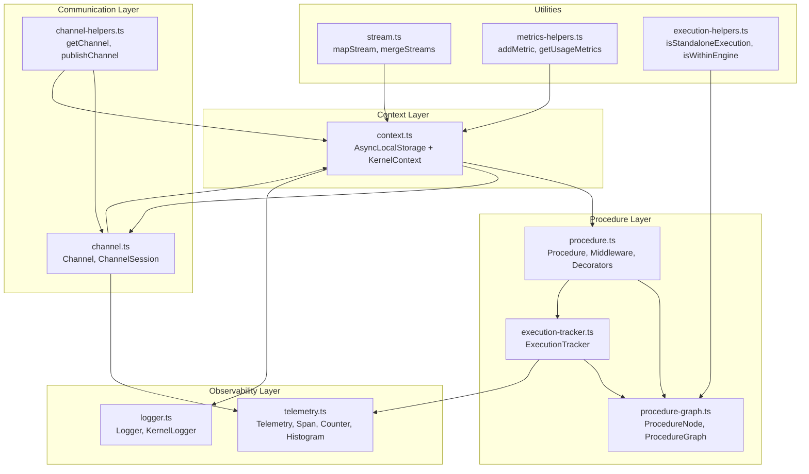
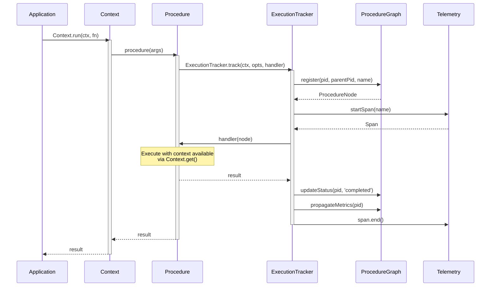
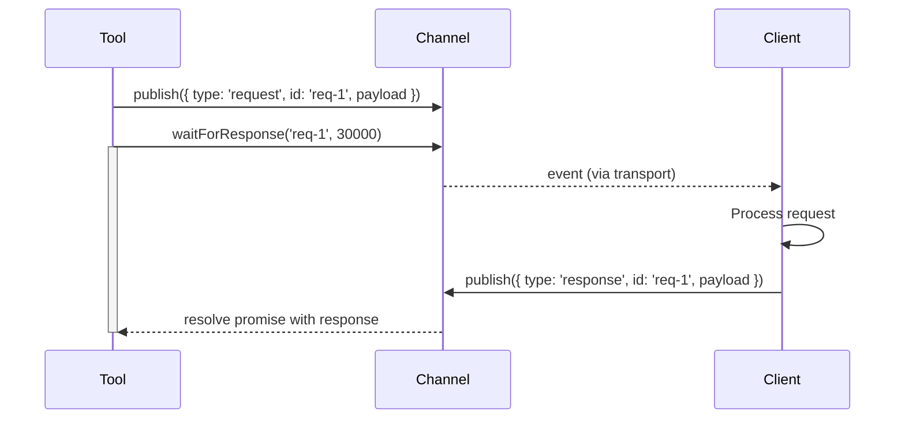

# aidk-kernel Architecture

> **The foundational execution primitives for AIDK**

<!--
  ⚠️ DOCUMENTATION SYNC REMINDER ⚠️

  When modifying kernel source code, ensure this ARCHITECTURE.md stays in sync:
  - New public APIs should be added to the API Reference section
  - Changed behavior should be reflected in Core Concepts
  - New patterns should have Usage Examples

  This applies to all ARCHITECTURE.md files across the codebase.
-->

The kernel package provides the low-level infrastructure that all other AIDK packages build upon. It handles execution context propagation, procedure lifecycle, telemetry, logging, and channel-based communication.

---

## Table of Contents

1. [Overview](#overview)
2. [Module Structure](#module-structure)
3. [Core Concepts](#core-concepts)
4. [API Reference](#api-reference)
5. [Data Flow](#data-flow)
6. [Usage Examples](#usage-examples)
7. [Integration Points](#integration-points)

---

## Overview

### What This Package Does

The kernel provides foundational primitives for:

- **Context Propagation** - Execution context flows automatically through async call chains via `AsyncLocalStorage`
- **Procedure Abstraction** - Wrap any function into a trackable, middleware-enabled, cancellable unit of work
- **Execution Tracking** - Automatic parent-child relationship tracking, metrics collection, and telemetry
- **Channel Communication** - Pub/sub primitives for bidirectional communication between components
- **Observability** - Pluggable telemetry and structured logging with automatic context injection

### Why It Exists

AIDK agents execute across multiple async boundaries - model calls, tool executions, nested agent invocations. The kernel ensures:

1. **Context is always available** - User info, trace IDs, abort signals follow execution automatically
2. **Execution is trackable** - Every procedure is part of a graph that can be inspected, cancelled, and metriced
3. **Observability is built-in** - Telemetry spans and structured logs are automatic, not opt-in
4. **Communication is decoupled** - Components communicate via channels, not direct coupling

### Design Principles

- **Zero external AIDK dependencies** - The kernel depends only on Node.js and `pino`
- **AsyncLocalStorage-first** - Context propagation uses Node's native mechanism
- **Immutable configuration** - Procedures return new instances when configured
- **Automatic tracking** - Metrics and telemetry happen without explicit instrumentation

---

## Module Structure



### File Overview

| File                   | Size       | Purpose                                        |
| ---------------------- | ---------- | ---------------------------------------------- |
| `context.ts`           | 186 lines  | Execution context with AsyncLocalStorage       |
| `procedure.ts`         | 1147 lines | Procedure abstraction with middleware pipeline |
| `procedure-graph.ts`   | 278 lines  | Parent-child procedure tracking                |
| `execution-tracker.ts` | 191 lines  | Automatic telemetry and metrics for procedures |
| `channel.ts`           | 326 lines  | Pub/sub channel primitives                     |
| `channel-helpers.ts`   | 69 lines   | Convenience functions for channel access       |
| `telemetry.ts`         | 86 lines   | Pluggable telemetry provider abstraction       |
| `logger.ts`            | 443 lines  | Pino-based structured logging                  |
| `stream.ts`            | 138 lines  | Async iterator utilities                       |
| `metrics-helpers.ts`   | 82 lines   | Metric accumulation helpers                    |
| `execution-helpers.ts` | 192 lines  | Execution hierarchy introspection              |

---

## Core Concepts

### 1. KernelContext

The `KernelContext` is a bag of execution state that flows through all async operations automatically.

```typescript
interface KernelContext {
  // Identity
  requestId: string; // Unique per request
  traceId: string; // Correlation ID for distributed tracing

  // User context
  user?: UserContext; // { id, tenantId?, roles?, ... }

  // Flexible storage
  metadata: ContextMetadata; // Application-specific data
  metrics: ContextMetrics; // Accumulated metrics

  // Event buses
  events: EventEmitter; // Global request bus
  executionHandle?: EventEmitter; // Operation-specific handle

  // Cancellation
  signal?: AbortSignal; // Cooperative cancellation

  // Channels (injected by Engine)
  channels?: ChannelServiceInterface;

  // Procedure tracking
  procedureGraph?: ProcedureGraph;
  procedurePid?: string;
  procedureNode?: ProcedureNode;
  origin?: ProcedureNode; // Root procedure of this chain
}
```

**Key insight**: Context uses `AsyncLocalStorage`, so it's available anywhere in the call chain without explicit passing.

### 2. Procedure

A `Procedure` wraps any async function with:

- **Middleware pipeline** - Transform args, intercept results, handle errors
- **Schema validation** - Zod-based input validation
- **Execution handles** - Get events and cancellation for long-running operations
- **Automatic tracking** - Every call is tracked in the procedure graph

```
┌─────────────────────────────────────────────────────────────────┐
│                         Procedure                               │
├─────────────────────────────────────────────────────────────────┤
│                                                                 │
│  ┌──────────┐   ┌──────────┐   ┌──────────┐   ┌──────────────┐  │
│  │ Validate │──▶│Middleware│──▶│Middleware│──▶│   Handler    │  │
│  │  (Zod)   │   │    1     │   │    N     │   │  (your fn)   │  │
│  └──────────┘   └──────────┘   └──────────┘   └──────────────┘  │
│       │                                              │          │
│       │         Context available throughout         │          │
│       └──────────────────────────────────────────────┘          │
│                                                                 │
│  Wrapped by ExecutionTracker:                                   │
│  - Creates ProcedureNode in graph                               │
│  - Starts telemetry span                                        │
│  - Collects metrics                                             │
│  - Propagates metrics to parent on completion                   │
│                                                                 │
└─────────────────────────────────────────────────────────────────┘
```

### 3. ProcedureGraph

Tracks parent-child relationships between procedures:

```
                    engine:execute (root)
                           │
              ┌────────────┼────────────┐
              ▼            ▼            ▼
         model:generate  tool:run   tool:run
              │
              ▼
         (nested call)
```

Each `ProcedureNode` contains:

- `pid` - Unique procedure ID
- `parentPid` - Parent's PID (undefined for root)
- `name` - Human-readable name
- `status` - running | completed | failed | cancelled
- `metrics` - Accumulated metrics for this procedure
- `startedAt` / `completedAt` - Timing

**Metric propagation**: When a child completes, its metrics are merged into the parent's metrics.

### 4. Channels

Channels provide typed pub/sub communication:

```
┌─────────────────────────────────────────────────────────────────┐
│                      ChannelSession                             │
│  (scoped to user + conversation)                                │
├─────────────────────────────────────────────────────────────────┤
│                                                                 │
│   ┌─────────────┐  ┌─────────────┐  ┌─────────────┐             │
│   │ Channel:    │  │ Channel:    │  │ Channel:    │             │
│   │ "ui:progress"│  │"tool:status"│  │"user:input" │             │
│   └──────┬──────┘  └──────┬──────┘  └──────┬──────┘             │
│          │                │                │                    │
│          ▼                ▼                ▼                    │
│   ┌─────────────────────────────────────────────────────────┐   │
│   │                   EventEmitter                          │   │
│   │  publish(event) ──▶ emit('event', event)                │   │
│   │  subscribe(handler) ──▶ on('event', handler)            │   │
│   └─────────────────────────────────────────────────────────┘   │
│                                                                 │
│   Request/Response pattern:                                     │
│   1. publish({ type: 'request', id: 'req-1', ... })            │
│   2. waitForResponse('req-1', timeoutMs)                        │
│   3. (client responds with { type: 'response', id: 'req-1' })   │
│   4. Promise resolves with response                             │
│                                                                 │
└─────────────────────────────────────────────────────────────────┘
```

### 5. Telemetry

Pluggable telemetry via `TelemetryProvider`:

```typescript
interface TelemetryProvider {
  startTrace(name: string): string;
  startSpan(name: string): Span;
  recordError(error: any): void;
  endTrace(): void;
  getCounter(name: string): Counter;
  getHistogram(name: string): Histogram;
}
```

Default is `NoOpProvider`. Replace with OpenTelemetry adapter for production:

```typescript
Telemetry.setProvider(new OTelProvider(tracerProvider));
```

### 6. Logger

Structured logging with automatic context injection:

```typescript
const log = Logger.get();
log.info("Processing request");
// Output includes: request_id, trace_id, procedure_id, etc.

const toolLog = Logger.for("CalculatorTool");
toolLog.debug("Executing", { expression: "2+2" });
// Output includes: component: 'CalculatorTool' + context fields
```

---

## API Reference

### context.ts

#### `Context` (static class)

| Method   | Signature                                                     | Description                                     |
| -------- | ------------------------------------------------------------- | ----------------------------------------------- |
| `create` | `(overrides?: Partial<KernelContext>) => KernelContext`       | Create new context with defaults                |
| `run`    | `<T>(ctx: KernelContext, fn: () => Promise<T>) => Promise<T>` | Run function with context                       |
| `get`    | `() => KernelContext`                                         | Get current context (throws if none)            |
| `tryGet` | `() => KernelContext \| undefined`                            | Get current context (returns undefined if none) |
| `child`  | `(overrides?: Partial<KernelContext>) => KernelContext`       | Create child context inheriting from current    |
| `fork`   | `<T>(overrides, fn: () => Promise<T>) => Promise<T>`          | Create child context and run function within it |
| `emit`   | `(type: string, payload: any, source?: string) => void`       | Emit event to context buses                     |

#### `context()` function

Brands an object as a context for deterministic detection:

```typescript
await myProcedure(input, context({ traceId: "custom-trace" }));
```

#### `isKernelContext(obj)`

Type guard to check if an object is a branded context.

---

### procedure.ts

#### `createProcedure<THandler>(handler)` / `createProcedure(options, handler)`

Create a procedure from a function:

```typescript
const myProc = createProcedure(async (input: string) => {
  return input.toUpperCase();
});

// With options
const validated = createProcedure(
  {
    name: "myProc",
    schema: z.string(),
    middleware: [loggingMiddleware],
    timeout: 5000, // Throws AbortError.timeout() if exceeded
  },
  async (input: string) => input.toUpperCase(),
);
```

#### `Procedure<THandler>` interface

| Method                | Description                                                                   |
| --------------------- | ----------------------------------------------------------------------------- |
| `(...args)`           | Direct call - returns `Promise<TOutput>`                                      |
| `.run(...args)`       | Same as direct call                                                           |
| `.use(...middleware)` | Add middleware, returns new Procedure                                         |
| `.withHandle()`       | Returns `ProcedureWithHandle` that gives `{ handle, result }`                 |
| `.withContext(ctx)`   | Merge context, returns new Procedure                                          |
| `.withMiddleware(mw)` | Add single middleware, returns new Procedure                                  |
| `.withTimeout(ms)`    | Set timeout, returns new Procedure. Throws `AbortError.timeout()` if exceeded |
| `.pipe(nextProc)`     | Chain procedures, returns new Procedure that pipes output to next             |

#### `ProcedureWithHandle<THandler>`

When you need to subscribe to events AND get the result:

```typescript
const { handle, result } = myProc.withHandle()("input");

handle.events.on("*", (event) => console.log(event));
const output = await result;
```

#### `Middleware<TArgs>`

```typescript
type Middleware<TArgs extends any[]> = (
  args: TArgs,
  envelope: ProcedureEnvelope<TArgs>,
  next: (transformedArgs?: TArgs) => Promise<any>,
) => Promise<any>;
```

Middleware can:

- Transform input args before passing to next
- Modify the result after next returns
- Short-circuit by not calling next
- Wrap errors

#### `createPipeline(middleware?)`

Bundle multiple middleware for reuse:

```typescript
const commonPipeline = createPipeline()
  .use(loggingMiddleware)
  .use(validationMiddleware);

const proc = createProcedure(handler).use(commonPipeline);
```

#### Decorators

```typescript
class MyClass {
  @procedure({ name: "myMethod" })
  async myMethod(input: string): Promise<string> {
    return input;
  }

  @hook()
  async myHook(data: any): Promise<void> {
    // hooks are procedures with sourceType: 'hook'
  }
}
```

#### `wrapProcedure(middleware[])` / `wrapHook(middleware[])`

Create a procedure factory with pre-applied middleware:

```typescript
const createEngineProcedure = wrapProcedure([
  telemetryMiddleware,
  loggingMiddleware,
]);

const myProc = createEngineProcedure(async (input) => input);
// Automatically has telemetry + logging middleware
```

#### `pipe(p1, p2, ...pN)`

Compose multiple procedures into a pipeline where the output of each becomes the input to the next:

```typescript
import { pipe, createProcedure } from "aidk-kernel";

const parse = createProcedure(async (json: string) => JSON.parse(json));
const validate = createProcedure(async (obj: unknown) => schema.parse(obj));
const transform = createProcedure(async (data: Data) => processData(data));

// Static function (2-5 procedures)
const pipeline = pipe(parse, validate, transform);
const result = await pipeline('{"name": "test"}');

// Instance method chaining
const samePipeline = parse.pipe(validate).pipe(transform);
```

The pipeline preserves context through all procedures and propagates errors immediately.

#### Procedure Timeout

Procedures can be configured with a timeout that throws `AbortError.timeout()` when exceeded:

```typescript
// Via options
const proc = createProcedure({ name: "slow", timeout: 5000 }, handler);

// Via withTimeout() (ad-hoc)
const timedProc = existingProc.withTimeout(5000);

// Timeout of 0 or undefined means no timeout
```

When a timeout is exceeded, the procedure throws `AbortError.timeout(ms)` from `aidk-shared`.

---

### procedure-graph.ts

#### `ProcedureNode`

```typescript
class ProcedureNode {
  readonly pid: string;
  readonly parentPid?: string;
  readonly name?: string;
  status: ProcedureStatus; // 'running' | 'completed' | 'failed' | 'cancelled'
  readonly startedAt: Date;
  completedAt?: Date;
  error?: Error;
  metrics: Record<string, number>;

  // Methods
  addMetric(key: string, value: number): void;
  setMetric(key: string, value: number): void;
  getMetric(key: string): number;
  mergeMetrics(source: Record<string, number>): void;
  complete(): void;
  fail(error: Error): void;
  cancel(): void;
  getParentNode(): ProcedureNode | undefined;
  getChildrenNodes(): ProcedureNode[];
  hasAncestor(predicate: (node: ProcedureNode) => boolean): boolean;
}
```

#### `ProcedureGraph`

```typescript
class ProcedureGraph {
  register(pid, parentPid?, name?, metadata?): ProcedureNode;
  get(pid: string): ProcedureNode | undefined;
  getParent(pid: string): string | undefined;
  getParentNode(pid: string): ProcedureNode | undefined;
  getChildren(parentPid: string): string[];
  getChildNodes(parentPid: string): ProcedureNode[];
  propagateMetrics(childPid: string): void;
  updateStatus(pid: string, status: ProcedureStatus, error?: Error): void;
  hasAncestor(
    pid: string,
    predicate: (node: ProcedureNode) => boolean,
  ): boolean;
  hasAncestorWithName(pid: string, name: string): boolean;
  getAllNodes(): ProcedureNode[];
  getCount(): number;
  clear(): void;

  // Root node access (O(1) lookup via cached rootPid)
  getRoot(): ProcedureNode | undefined;
  getRootPid(): string | undefined;
}
```

**Root Node Caching**: The graph caches the root node's PID for O(1) access. The root is identified when a node is registered with no `parentPid`. Use `getRoot()` to get the root node directly instead of searching the graph.

---

### execution-tracker.ts

#### `ExecutionTracker.track(ctx, options, fn)`

Wraps a function execution with automatic tracking:

```typescript
const result = await ExecutionTracker.track(
  ctx,
  { name: "model:generate", parentPid: ctx.procedurePid },
  async (node: ProcedureNode) => {
    // node is the ProcedureNode for this execution
    node.addMetric("tokens", 100);
    return await doWork();
  },
);
```

**What it does:**

1. Creates a `ProcedureNode` in the graph
2. Starts a telemetry span
3. Sets up metrics proxy on `ctx.metrics`
4. Checks abort signal before/after execution
5. Propagates metrics to parent on completion
6. Records errors to telemetry

---

### channel.ts

#### `Channel`

```typescript
class Channel {
  readonly name: string;

  publish(event: ChannelEvent): void;
  subscribe(handler: (event: ChannelEvent) => void): () => void; // Returns unsubscribe
  waitForResponse(requestId: string, timeoutMs?: number): Promise<ChannelEvent>;
  getSubscriberCount(): number;
  destroy(): void;
}
```

#### `ChannelEvent`

```typescript
interface ChannelEvent {
  type: string; // 'request', 'response', 'progress', etc.
  id?: string; // Correlation ID for request/response
  channel: string; // Channel name
  payload: any; // Event data
  metadata?: {
    timestamp?: number;
    source?: string; // 'tool', 'component', 'ui', 'system'
    executionId?: string;
    tick?: number;
    sourceConnectionId?: string;
    [key: string]: unknown;
  };
  target?: ChannelTarget; // Optional routing target
}
```

#### `ChannelSession`

Manages a collection of channels scoped to a user session:

```typescript
class ChannelSession {
  readonly id: string;
  readonly channels: Map<string, Channel>;

  getChannel(name: string): Channel;
  removeChannel(name: string): void;
  destroy(): void;

  static generateId(ctx: KernelContext): string; // user-id + conversation-id
}
```

#### `ChannelServiceInterface`

Interface that Engine's ChannelService implements:

```typescript
interface ChannelServiceInterface {
  getChannel(ctx: KernelContext, channelName: string): Channel;
  publish(
    ctx: KernelContext,
    channelName: string,
    event: Omit<ChannelEvent, "channel">,
  ): void;
  subscribe(
    ctx: KernelContext,
    channelName: string,
    handler: (event: ChannelEvent) => void,
  ): () => void;
  waitForResponse(
    ctx: KernelContext,
    channelName: string,
    requestId: string,
    timeoutMs?: number,
  ): Promise<ChannelEvent>;
}
```

---

### channel-helpers.ts

Convenience functions that use `Context.get()` internally:

```typescript
// Get a channel from current context
const channel = getChannel("ui:progress");

// Publish to a channel
publishChannel("ui:progress", { type: "update", payload: { percent: 50 } });

// Subscribe to a channel
const unsubscribe = subscribeChannel("tool:status", (event) => {
  console.log("Tool status:", event);
});

// Wait for a response
const response = await waitForChannelResponse("user:input", "req-123", 30000);

// Safe version that returns undefined if channels not available
const channel = tryGetChannel("ui:progress");
```

---

### telemetry.ts

#### `Telemetry` (static class)

```typescript
Telemetry.setProvider(provider: TelemetryProvider): void;
Telemetry.resetProvider(): void;  // Back to NoOpProvider

Telemetry.startTrace(name?: string): string;  // Returns trace ID
Telemetry.startSpan(name: string): Span;
Telemetry.recordError(error: any): void;
Telemetry.endTrace(): void;

Telemetry.getCounter(name: string, unit?: string, description?: string): Counter;
Telemetry.getHistogram(name: string, unit?: string, description?: string): Histogram;
```

#### `Span`

```typescript
interface Span {
  end(): void;
  setAttribute(key: string, value: any): void;
  recordError(error: any): void;
}
```

#### `Counter` / `Histogram`

```typescript
interface Counter {
  add(value: number, attributes?: MetricAttributes): void;
}

interface Histogram {
  record(value: number, attributes?: MetricAttributes): void;
}
```

---

### logger.ts

#### `Logger` (singleton)

```typescript
// Configure at app startup
Logger.configure({
  level: 'debug',
  transport: { target: 'pino-pretty', options: { colorize: true } },
  contextFields: (ctx) => ({
    request_id: ctx.requestId,
    userId: ctx.user?.id,
  }),
  replace: false,  // Optional: if true, replaces config instead of merging with defaults
});

// Get logger (context auto-injected)
const log = Logger.get();
log.info('Message');
log.debug({ extra: 'data' }, 'Message with data');

// Scoped logger for a component
const toolLog = Logger.for('MyTool');
const classLog = Logger.for(this);  // Uses constructor.name

// Child logger with bindings
const reqLog = Logger.child({ request_id: req.id });

// Standalone logger (doesn't affect global)
const auditLog = Logger.create({ level: 'info', ... });

// Runtime level control
Logger.setLevel('debug');
if (Logger.isLevelEnabled('trace')) { ... }
```

#### `KernelLogger` interface

```typescript
interface KernelLogger {
  trace: LogMethod;
  debug: LogMethod;
  info: LogMethod;
  warn: LogMethod;
  error: LogMethod;
  fatal: LogMethod;
  child(bindings: Record<string, unknown>): KernelLogger;
  level: LogLevel;
  isLevelEnabled(level: LogLevel): boolean;
}
```

#### `composeContextFields(...extractors)`

Combine multiple context field extractors:

```typescript
Logger.configure({
  contextFields: composeContextFields(
    defaultContextFields, // Core kernel fields
    (ctx) => ({
      // Custom fields
      tenantId: ctx.user?.tenantId,
      threadId: ctx.metadata?.threadId,
    }),
  ),
});
```

---

### stream.ts

#### `isAsyncIterable(obj)`

Type guard for async iterables.

#### `mapStream(stream, mapper)`

Transform items in an async stream:

```typescript
const uppercase = mapStream(inputStream, (item) => item.toUpperCase());
for await (const item of uppercase) {
  console.log(item);
}
```

#### `tapStream(stream, tapper)`

Side effects without modifying the stream:

```typescript
const logged = tapStream(inputStream, (item) => console.log("Got:", item));
```

#### `mergeStreams(streams)`

Merge multiple streams, yielding items as they arrive:

```typescript
// Array of streams
const merged = mergeStreams([stream1, stream2, stream3]);
for await (const item of merged) {
  console.log(item); // Items from any stream, in arrival order
}

// Tagged streams (Record)
const tagged = mergeStreams({ a: stream1, b: stream2 });
for await (const item of tagged) {
  console.log(item.source, item.value); // 'a' or 'b', plus the value
}
```

---

### metrics-helpers.ts

```typescript
// Accumulate a metric
addMetric(ctx, "tokens.input", 100);
addMetric(ctx, "tokens.input", 50); // Now 150

// Set a metric (overwrites)
setMetric(ctx, "latency_ms", 250);

// Get a metric
const tokens = getMetric(ctx, "tokens.input"); // 150

// Usage metrics (convenience for token counting)
addUsageMetrics(ctx, { inputTokens: 100, outputTokens: 50 });
const usage = getUsageMetrics(ctx);
// { inputTokens: 100, outputTokens: 50 }
```

---

### execution-helpers.ts

Utilities for understanding execution hierarchy:

```typescript
// Is this a root execution or nested?
if (isStandaloneExecution(ctx)) {
  // Create new execution record
} else {
  // Link to parent
}

// What originated this chain?
const origin = getOriginName(ctx); // 'engine:stream', 'model:generate', etc.

// Are we inside an engine execution?
if (isWithinEngine(ctx)) {
  // Engine handles top-level tracking
}

// Check for specific ancestor
if (hasAncestorNamed(ctx, "engine:stream")) {
  // Inside streaming execution
}

// Full execution info
const info = getExecutionInfo(ctx);
// {
//   pid: 'abc-123',
//   parentPid: 'def-456',
//   rootPid: 'ghi-789',
//   name: 'model:generate',
//   originName: 'engine:stream',
//   isStandalone: false,
//   isWithinEngine: true,
//   depth: 2
// }
```

---

## Data Flow

### Context Flow Through Execution



### Channel Communication Flow



### Metrics Propagation

```
┌─────────────────────────────────────────────────────────────┐
│                     engine:execute                          │
│                     metrics: {}                             │
├─────────────────────────────────────────────────────────────┤
│                           │                                 │
│              ┌────────────┴────────────┐                    │
│              ▼                         ▼                    │
│  ┌─────────────────────┐   ┌─────────────────────┐          │
│  │   model:generate    │   │     tool:run        │          │
│  │ metrics:            │   │ metrics:            │          │
│  │   tokens.input: 100 │   │   api_calls: 1      │          │
│  │   tokens.output: 50 │   │   latency_ms: 200   │          │
│  └──────────┬──────────┘   └──────────┬──────────┘          │
│             │ complete()              │ complete()          │
│             │                         │                     │
│             └────────────┬────────────┘                     │
│                          ▼                                  │
│  propagateMetrics() merges into parent:                     │
│  engine:execute.metrics = {                                 │
│    tokens.input: 100,                                       │
│    tokens.output: 50,                                       │
│    api_calls: 1,                                            │
│    latency_ms: 200                                          │
│  }                                                          │
└─────────────────────────────────────────────────────────────┘
```

---

## Usage Examples

### Basic Procedure

```typescript
import { createProcedure, Context } from "aidk-kernel";

// Create a simple procedure
const greet = createProcedure(async (name: string) => {
  const ctx = Context.get();
  console.log(`Request ${ctx.requestId}: Greeting ${name}`);
  return `Hello, ${name}!`;
});

// Execute with context
const ctx = Context.create({ user: { id: "user-1" } });
const result = await Context.run(ctx, () => greet("World"));
```

### Procedure with Middleware

```typescript
import { createProcedure, Middleware } from "aidk-kernel";

const loggingMiddleware: Middleware<[string]> = async (
  args,
  envelope,
  next,
) => {
  console.log(`${envelope.operationName} called with:`, args);
  const start = Date.now();
  try {
    const result = await next();
    console.log(
      `${envelope.operationName} completed in ${Date.now() - start}ms`,
    );
    return result;
  } catch (error) {
    console.error(`${envelope.operationName} failed:`, error);
    throw error;
  }
};

const myProc = createProcedure(async (input: string) =>
  input.toUpperCase(),
).use(loggingMiddleware);
```

### Procedure with Timeout

```typescript
import { createProcedure } from "aidk-kernel";
import { AbortError } from "aidk-shared";

// Timeout via options
const apiCall = createProcedure(
  { name: "api", timeout: 5000 },
  async (url: string) => {
    const response = await fetch(url);
    return response.json();
  },
);

// Timeout via withTimeout()
const quickCheck = existingProc.withTimeout(1000);

// Handle timeout errors
try {
  await apiCall("https://slow-api.example.com");
} catch (error) {
  if (error instanceof AbortError && error.code === "ABORT_TIMEOUT") {
    console.log("Request timed out");
  }
}
```

### Procedure Composition with Pipe

```typescript
import { createProcedure, pipe } from "aidk-kernel";

// Define transformation steps
const fetchUser = createProcedure(async (id: string) => {
  const res = await fetch(`/api/users/${id}`);
  return res.json();
});

const enrichWithPosts = createProcedure(async (user: User) => {
  const posts = await fetch(`/api/users/${user.id}/posts`).then((r) =>
    r.json(),
  );
  return { ...user, posts };
});

const formatForDisplay = createProcedure(async (user: UserWithPosts) => ({
  name: user.name,
  postCount: user.posts.length,
  latestPost: user.posts[0]?.title,
}));

// Compose into a pipeline
const getUserProfile = pipe(fetchUser, enrichWithPosts, formatForDisplay);

// Or use instance method chaining
const samePipeline = fetchUser.pipe(enrichWithPosts).pipe(formatForDisplay);

// Execute the pipeline
const profile = await getUserProfile("user-123");
```

### Procedure with Handle

```typescript
import { createProcedure } from "aidk-kernel";

const longRunning = createProcedure(async function* (count: number) {
  for (let i = 0; i < count; i++) {
    yield { progress: i / count };
    await new Promise((r) => setTimeout(r, 100));
  }
  return { done: true };
});

// Get handle for streaming
const { handle, result } = longRunning.withHandle()(10);

handle.events.on("stream:chunk", (e) => {
  console.log("Progress:", e.payload.value.progress);
});

const final = await result;
console.log("Final:", final);
```

### Channel Communication

```typescript
import { Context, publishChannel, waitForChannelResponse } from "aidk-kernel";

// In a tool
async function askUserConfirmation(message: string): Promise<boolean> {
  const requestId = crypto.randomUUID();

  publishChannel("user:input", {
    type: "request",
    id: requestId,
    payload: { message, type: "confirm" },
  });

  const response = await waitForChannelResponse("user:input", requestId, 60000);
  return response.payload.confirmed;
}
```

### Structured Logging

```typescript
import { Logger, Context } from "aidk-kernel";

// Configure at startup (merges with defaults)
Logger.configure({
  level: process.env.LOG_LEVEL ?? "info",
  contextFields: (ctx) => ({
    request_id: ctx.requestId,
    trace_id: ctx.traceId,
    userId: ctx.user?.id,
    tenantId: ctx.user?.tenantId,
  }),
});

// Or replace defaults entirely
Logger.configure({
  level: "warn",
  replace: true, // Ignores default config, uses only what's provided
});

// Use anywhere - context auto-injected
class MyTool {
  private log = Logger.for(this);

  async execute(input: string) {
    this.log.info("Executing tool", { input });
    // Logs include: component: 'MyTool', request_id, userId, etc.
  }
}
```

### Execution Hierarchy Introspection

```typescript
import { Context, getExecutionInfo, isWithinEngine } from "aidk-kernel";

async function handleModelCall() {
  const ctx = Context.get();

  if (isWithinEngine(ctx)) {
    // Engine is tracking this execution
    console.log("Inside engine execution");
  } else {
    // Standalone model call - need our own tracking
    console.log("Standalone call");
  }

  const info = getExecutionInfo(ctx);
  console.log(
    `Procedure: ${info.name}, depth: ${info.depth}, origin: ${info.originName}`,
  );
}
```

---

## Integration Points

### How Other Packages Use Kernel

| Package       | Uses                                       | For                                |
| ------------- | ------------------------------------------ | ---------------------------------- |
| `aidk` (core) | `Context`, `Procedure`, `ExecutionTracker` | Engine execution, model/tool calls |
| `aidk` (core) | `Channel`, `ChannelServiceInterface`       | Bidirectional communication        |
| `aidk` (core) | `Telemetry`, `Logger`                      | Observability                      |
| `aidk-server` | `Context`, `KernelContext`                 | Request handling                   |
| `aidk-client` | `ChannelEvent` types                       | Client-side channel handling       |
| All adapters  | `Procedure`, `Context`                     | Wrap model calls                   |

### Extension Points

1. **Custom TelemetryProvider** - Implement `TelemetryProvider` to send traces to your backend
2. **Custom ContextFieldsExtractor** - Add application-specific fields to all logs
3. **Middleware** - Inject cross-cutting concerns into any procedure
4. **HandleFactory** - Customize the handle returned by `.withHandle()`

### Context Flow Requirements

For context to flow correctly, async operations must:

1. Be called within a `Context.run()` block, OR
2. Be called from within a Procedure (which handles context automatically)

**Anti-pattern** (context lost):

```typescript
setTimeout(() => {
  const ctx = Context.get(); // THROWS - context not available
}, 100);
```

**Correct pattern**:

```typescript
const ctx = Context.get();
setTimeout(() => {
  Context.run(ctx, async () => {
    const ctx = Context.get(); // Works
  });
}, 100);
```

### Child Contexts and Forking

When running parallel operations that need isolated context state (e.g., different `procedurePid`, `metrics`), use `Context.child()` or `Context.fork()` to create isolated child contexts:

**Why this matters**: The `KernelContext` object is shared via `AsyncLocalStorage`. If parallel operations mutate it directly (e.g., setting `procedurePid`), they'll corrupt each other's state. Child contexts solve this by creating a new object that inherits from the parent.

**What's inherited vs isolated**:

- **Shared** (same reference): `events`, `procedureGraph`, `channels`, `signal` - these coordinate across the execution
- **Isolated** (copied): `procedurePid`, `procedureNode`, `origin`, `metrics` - these are per-procedure

**Using `Context.child()`**:

```typescript
// Create a child context with overrides
const childCtx = Context.child({
  procedurePid: "new-pid",
  metrics: {},
});

// Run in the child context
await Context.run(childCtx, async () => {
  // This context has its own procedurePid
  // but shares events, procedureGraph, etc. with parent
});
```

**Using `Context.fork()` (convenience method)**:

```typescript
// fork = child + run in one call
await Context.fork({ procedurePid: "new-pid" }, async () => {
  // Runs in isolated child context
});
```

**Parallel procedures (safe)**:

```typescript
// Each procedure gets its own context - no race conditions
const [result1, result2] = await Promise.all([
  Context.fork({ procedurePid: "proc-1" }, () => doWork1()),
  Context.fork({ procedurePid: "proc-2" }, () => doWork2()),
]);
```

> **Note**: `ExecutionTracker.track()` uses `Context.fork()` internally, so procedures automatically get isolated contexts.

---

## Summary

The kernel package provides the foundational primitives for AIDK:

- **Context** flows automatically through async operations
- **Procedures** wrap functions with middleware, validation, and tracking
- **ProcedureGraph** tracks parent-child relationships and propagates metrics
- **Channels** enable bidirectional communication between components
- **Telemetry** and **Logger** provide observability with automatic context injection

All other AIDK packages build on these primitives to implement higher-level functionality like the Engine, model adapters, and client/server communication.
