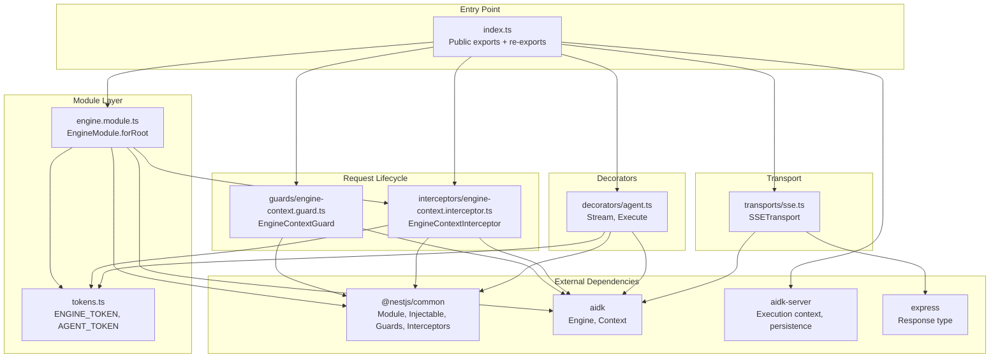
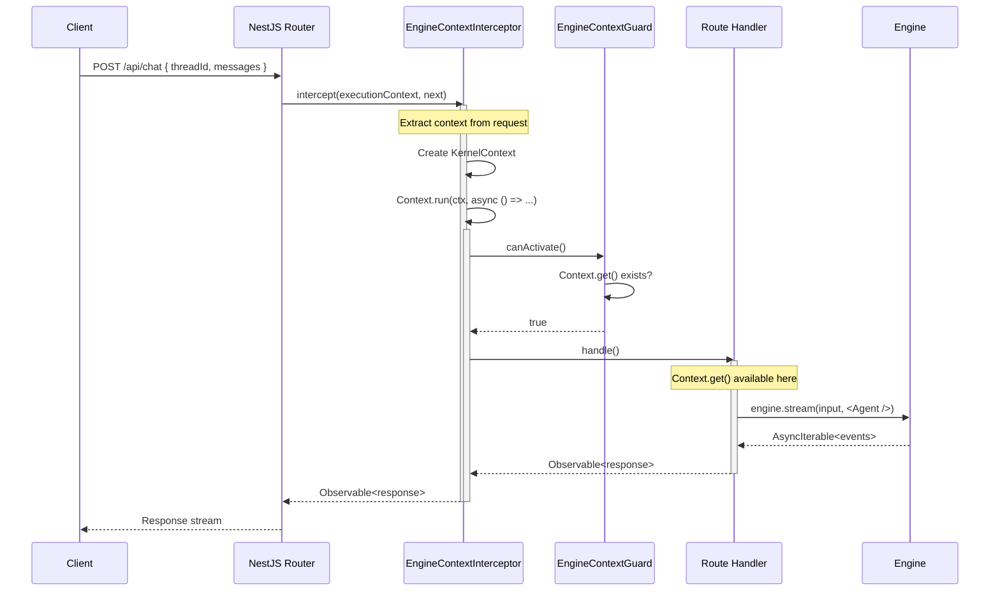
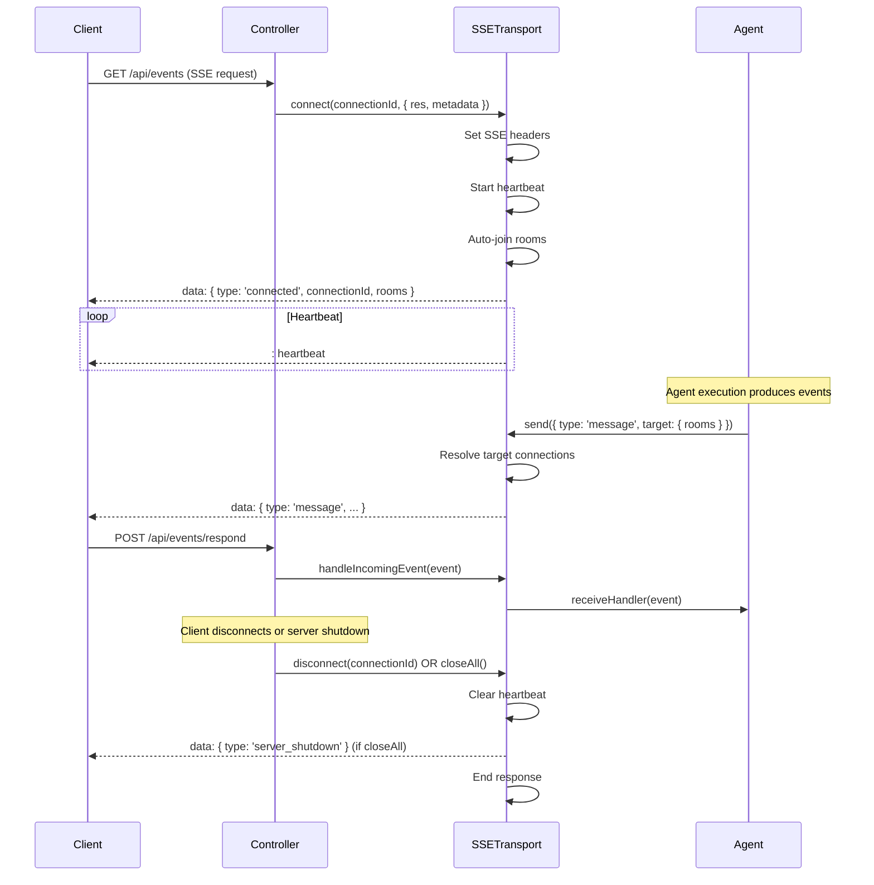

# aidk-nestjs Architecture

> **NestJS integration for AIDK agents**

The NestJS package provides first-class integration with the NestJS framework, offering a module system, guards, interceptors, decorators, and SSE transport for running AIDK agents in NestJS applications.

---

## Table of Contents

1. [Overview](#overview)
2. [Module Structure](#module-structure)
3. [Core Concepts](#core-concepts)
4. [API Reference](#api-reference)
5. [Data Flow](#data-flow)
6. [Usage Examples](#usage-examples)
7. [Integration Points](#integration-points)

---

## Overview

### What This Package Does

The NestJS package provides:

- **EngineModule** - Global NestJS module for engine registration and dependency injection
- **Context Interceptor** - Automatic kernel context propagation through NestJS request lifecycle
- **Context Guard** - Route protection based on context availability
- **Agent Decorators** - Declarative route handlers for streaming and executing agents
- **SSE Transport** - Server-Sent Events transport for real-time channel communication

### Why It Exists

NestJS applications need framework-idiomatic ways to:

1. **Register engines** - Use NestJS DI for engine instances
2. **Propagate context** - Bridge NestJS request lifecycle with AIDK's AsyncLocalStorage context
3. **Stream responses** - Handle SSE connections for real-time agent communication
4. **Declare agents** - Use decorators to bind agents to routes

### Design Principles

- **NestJS-idiomatic** - Uses modules, guards, interceptors, and decorators as NestJS developers expect
- **Minimal boilerplate** - One module import enables full integration
- **Re-exports server utilities** - Single import for both NestJS and server functionality
- **Compatible with Express** - SSE transport works with NestJS's underlying Express layer

---

## Module Structure



### File Overview

| File                                         | Size      | Purpose                                   |
| -------------------------------------------- | --------- | ----------------------------------------- |
| `index.ts`                                   | 54 lines  | Public API exports + server re-exports    |
| `engine.module.ts`                           | 28 lines  | Global NestJS module with engine provider |
| `tokens.ts`                                  | 4 lines   | DI tokens for engine and agent injection  |
| `guards/engine-context.guard.ts`             | 16 lines  | Route guard for context verification      |
| `interceptors/engine-context.interceptor.ts` | 64 lines  | Context setup for request lifecycle       |
| `decorators/agent.ts`                        | 21 lines  | Route decorators for agent binding        |
| `transports/sse.ts`                          | 348 lines | SSE transport for real-time channels      |

---

## Core Concepts

### 1. EngineModule

The `EngineModule` registers the AIDK engine as a global provider, making it available throughout your NestJS application via dependency injection.

```
┌─────────────────────────────────────────────────────────────────┐
│                     EngineModule.forRoot()                       │
├─────────────────────────────────────────────────────────────────┤
│                                                                  │
│  Input: EngineModuleOptions                                      │
│  ┌──────────────────────────────────────────────────────────┐   │
│  │  {                                                       │   │
│  │    engine: Engine   // Your configured engine instance   │   │
│  │  }                                                       │   │
│  └──────────────────────────────────────────────────────────┘   │
│                              │                                   │
│                              ▼                                   │
│  Creates DynamicModule:                                          │
│  ┌──────────────────────────────────────────────────────────┐   │
│  │  providers: [                                            │   │
│  │    { provide: ENGINE_TOKEN, useValue: engine },          │   │
│  │    EngineContextInterceptor,                             │   │
│  │  ]                                                       │   │
│  │  exports: [ENGINE_TOKEN, EngineContextInterceptor]       │   │
│  └──────────────────────────────────────────────────────────┘   │
│                                                                  │
│  @Global() ensures engine is available in all modules            │
│                                                                  │
└─────────────────────────────────────────────────────────────────┘
```

### 2. Context Propagation

The `EngineContextInterceptor` bridges NestJS's request handling with AIDK's kernel context system. It extracts context from requests and wraps handler execution in `Context.run()`.

```
┌─────────────────────────────────────────────────────────────────┐
│                  Request Context Extraction                      │
├─────────────────────────────────────────────────────────────────┤
│                                                                  │
│  HTTP Request                                                    │
│  ┌──────────────────────────────────────────────────────────┐   │
│  │  Headers:                        Body:                   │   │
│  │  x-thread-id: 'thr-123'         threadId: 'thr-123'    │   │
│  │  x-user-id: 'usr-456'           userId: 'usr-456'      │   │
│  │  x-tenant-id: 'ten-789'         tenantId: 'ten-789'    │   │
│  │  x-session-id: 'ses-abc'        sessionId: 'ses-abc'   │   │
│  └──────────────────────────────────────────────────────────┘   │
│                              │                                   │
│                              ▼                                   │
│  Priority: body > headers (x-prefix) > headers (no prefix)      │
│                              │                                   │
│                              ▼                                   │
│  ┌──────────────────────────────────────────────────────────┐   │
│  │  KernelContext.metadata = {                              │   │
│  │    threadId: 'thr-123',                                 │   │
│  │    userId: 'usr-456',                                   │   │
│  │    tenantId: 'ten-789',                                 │   │
│  │    sessionId: 'ses-abc',                                │   │
│  │  }                                                       │   │
│  └──────────────────────────────────────────────────────────┘   │
│                              │                                   │
│                              ▼                                   │
│  Context.run(kernelContext, () => handler())                     │
│                                                                  │
└─────────────────────────────────────────────────────────────────┘
```

### 3. Execution Decorators

Route decorators mark handlers for streaming or execution. The handler returns `EngineInput`, and the decorator specifies which root component to use.

```typescript
@Controller('api/run')
class RunController {
  @Post('stream')
  @Stream(<MyComponent />)  // Decorator binds component to route
  async stream(@Body() body: RequestBody) {
    return {
      timeline: messagesToTimeline(body.messages),
      metadata: { threadId: body.threadId },
    };
  }
}
```

### 4. SSE Transport

The `SSETransport` implements the AIDK `ChannelTransport` interface for Server-Sent Events, enabling real-time bidirectional communication between agents and clients.

```
┌─────────────────────────────────────────────────────────────────┐
│                      SSETransport                                │
├─────────────────────────────────────────────────────────────────┤
│                                                                  │
│  Connections (Map<connectionId, SSEConnection>)                  │
│  ┌────────────────────────────────────────────────────────────┐  │
│  │ conn-1: { res, metadata, rooms: ['user:u1'], channels }   │  │
│  │ conn-2: { res, metadata, rooms: ['user:u2'], channels }   │  │
│  │ conn-3: { res, metadata, rooms: ['user:u1'], channels }   │  │
│  └────────────────────────────────────────────────────────────┘  │
│                                                                  │
│  Room Index (Map<room, Set<connectionId>>)                       │
│  ┌────────────────────────────────────────────────────────────┐  │
│  │ 'user:u1': Set { 'conn-1', 'conn-3' }                     │  │
│  │ 'user:u2': Set { 'conn-2' }                               │  │
│  └────────────────────────────────────────────────────────────┘  │
│                                                                  │
│  Event Routing:                                                  │
│  ┌────────────────────────────────────────────────────────────┐  │
│  │ No target          → Broadcast to all connections          │  │
│  │ target.connectionId → Send to specific connection          │  │
│  │ target.rooms        → Send to connections in those rooms   │  │
│  │ target.excludeSender → Exclude source connection           │  │
│  └────────────────────────────────────────────────────────────┘  │
│                                                                  │
│  Features:                                                       │
│  - Automatic heartbeat (configurable interval)                   │
│  - Auto-join rooms based on metadata                             │
│  - Channel filtering per connection                              │
│  - Graceful shutdown with server_shutdown event                  │
│                                                                  │
└─────────────────────────────────────────────────────────────────┘
```

---

## API Reference

### engine.module.ts

#### `EngineModule.forRoot(options)`

Creates a global NestJS module with engine provider.

```typescript
interface EngineModuleOptions {
  engine: Engine; // Configured AIDK engine instance
}

// Usage
@Module({
  imports: [
    EngineModule.forRoot({
      engine: createEngine({ model: myModel }),
    }),
  ],
})
export class AppModule {}
```

**Provides:**

- `ENGINE_TOKEN` - Engine instance for injection
- `EngineContextInterceptor` - Context setup interceptor

---

### tokens.ts

#### `ENGINE_TOKEN`

Symbol token for engine dependency injection.

```typescript
@Injectable()
class MyService {
  constructor(@Inject(ENGINE_TOKEN) private engine: Engine) {}
}
```

#### `AGENT_TOKEN`

Symbol token for agent metadata (used by decorators).

---

### guards/engine-context.guard.ts

#### `EngineContextGuard`

Guard that verifies kernel context is available before handler execution.

```typescript
@Controller("api/chat")
@UseGuards(EngineContextGuard)
class ChatController {
  // All routes require context
}
```

| Method                 | Description                                       |
| ---------------------- | ------------------------------------------------- |
| `canActivate(context)` | Returns true if `Context.get()` returns a context |

---

### interceptors/engine-context.interceptor.ts

#### `EngineContextInterceptor`

Interceptor that extracts context from requests and runs handlers within `Context.run()`.

**Context Extraction Priority:**

| Field     | Body             | Header (x-prefix) | Header (no prefix) |
| --------- | ---------------- | ----------------- | ------------------ |
| threadId  | `body.threadId`  | `x-thread-id`     | `thread-id`        |
| userId    | `body.userId`    | `x-user-id`       | `user-id`          |
| tenantId  | `body.tenantId`  | `x-tenant-id`     | `tenant-id`        |
| sessionId | `body.sessionId` | `x-session-id`    | `session-id`       |

**Request Context Attachment:**

The interceptor attaches `RequestContext` to the request object using `attachContext()` from `aidk-server`. This enables access in guards, decorators, and other middleware:

```typescript
import { getContext, requireContext } from "aidk-nestjs";

// In a guard
@Injectable()
class AuthGuard implements CanActivate {
  canActivate(context: ExecutionContext): boolean {
    const request = context.switchToHttp().getRequest();
    const ctx = getContext(request);
    return ctx?.userId != null;
  }
}

// In a decorator
export const UserId = createParamDecorator(
  (data: unknown, ctx: ExecutionContext) => {
    const request = ctx.switchToHttp().getRequest();
    return requireContext(request).userId;
  },
);
```

**Usage:**

```typescript
// Applied globally (recommended)
app.useGlobalInterceptors(new EngineContextInterceptor(engine));

// Or per-controller
@Controller("api/chat")
@UseInterceptors(EngineContextInterceptor)
class ChatController {}
```

---

### decorators/agent.ts

#### `@Stream(root?)`

Marks a route for streaming execution. Handler returns `EngineInput`.

```typescript
@Post('stream')
@Stream(<MyComponent />)
async stream(@Body() body: RequestBody) {
  return { timeline: [...], metadata: {...} };
}
```

#### `@Execute(root?)`

Marks a route for non-streaming execution. Handler returns `EngineInput`.

```typescript
@Post('execute')
@Execute(<MyComponent />)
async execute(@Body() body: RequestBody) {
  return { timeline: [...], metadata: {...} };
}
```

---

### transports/sse.ts

#### `SSETransport`

Server-Sent Events implementation of `ChannelTransport`.

##### Constructor

```typescript
interface SSETransportConfig extends ChannelTransportConfig {
  heartbeatInterval?: number; // Default: 30000ms
  debug?: boolean; // Enable debug logging
  autoJoinRooms?: (metadata: ConnectionMetadata) => string[];
  maxConnections?: number; // Maximum total connections (default: unlimited)
  maxConnectionsPerUser?: number; // Maximum connections per userId (default: unlimited)
}

const transport = new SSETransport({
  heartbeatInterval: 15000,
  debug: true,
  autoJoinRooms: (meta) => [`user:${meta.userId}`, `tenant:${meta.tenantId}`],
  maxConnections: 10000, // Server-wide limit
  maxConnectionsPerUser: 5, // Per-user limit
});
```

**Connection Limits:**

When `maxConnections` is reached, new connections receive a 503 response:

```json
{
  "error": "Too many connections",
  "message": "Server connection limit reached. Please try again later."
}
```

When `maxConnectionsPerUser` is reached for a user, they receive a 429 response:

```json
{
  "error": "Too many connections",
  "message": "You have too many active connections. Please close some and try again."
}
```

**Client Disconnect Detection:**

The transport listens for the HTTP response `close` event to properly detect when clients disconnect (browser tab closed, network disconnect, etc.). This ensures connections are cleaned up immediately rather than waiting for the next heartbeat failure.

##### Methods

| Method                | Signature                                   | Description                      |
| --------------------- | ------------------------------------------- | -------------------------------- |
| `connect`             | `(connectionId, metadata) => Promise<void>` | Connect SSE client               |
| `disconnect`          | `(connectionId?) => Promise<void>`          | Disconnect client(s)             |
| `join`                | `(connectionId, room) => Promise<void>`     | Join a room                      |
| `leave`               | `(connectionId, room) => Promise<void>`     | Leave a room                     |
| `send`                | `(event: ChannelEvent) => Promise<void>`    | Send event to clients            |
| `onReceive`           | `(handler) => void`                         | Register incoming event handler  |
| `handleIncomingEvent` | `(event) => void`                           | Process incoming event from HTTP |
| `addConnection`       | `(id, res, options?) => void`               | Convenience method for routes    |
| `closeAll`            | `() => void`                                | Graceful shutdown                |

##### Convenience Methods

| Method                  | Signature                              | Description              |
| ----------------------- | -------------------------------------- | ------------------------ |
| `isConnected`           | `(connectionId) => boolean`            | Check if connected       |
| `getConnectedSessions`  | `() => string[]`                       | Get all connection IDs   |
| `getConnectionMetadata` | `(connectionId) => ConnectionMetadata` | Get connection metadata  |
| `getConnectionRooms`    | `(connectionId) => string[]`           | Get rooms for connection |
| `getRoomConnections`    | `(room) => string[]`                   | Get connections in room  |

---

## Data Flow

### Request Lifecycle with Context



### SSE Connection Lifecycle



### Event Routing in SSE

```
┌─────────────────────────────────────────────────────────────────┐
│                     Event Routing                                │
├─────────────────────────────────────────────────────────────────┤
│                                                                  │
│  Event: { type: 'update', target: {...}, payload: {...} }       │
│                              │                                   │
│                              ▼                                   │
│  ┌──────────────────────────────────────────────────────────┐   │
│  │ 1. Determine Target Connections                          │   │
│  │                                                          │   │
│  │    target.connectionId? ──▶ Single connection            │   │
│  │         │                                                │   │
│  │         └─ No ─▶ target.rooms? ──▶ Union of room members │   │
│  │                      │                                   │   │
│  │                      └─ No ──▶ All connections           │   │
│  └──────────────────────────────────────────────────────────┘   │
│                              │                                   │
│                              ▼                                   │
│  ┌──────────────────────────────────────────────────────────┐   │
│  │ 2. Apply Exclusions                                      │   │
│  │                                                          │   │
│  │    target.excludeSender? ──▶ Remove sourceConnectionId   │   │
│  └──────────────────────────────────────────────────────────┘   │
│                              │                                   │
│                              ▼                                   │
│  ┌──────────────────────────────────────────────────────────┐   │
│  │ 3. Apply Channel Filters                                 │   │
│  │                                                          │   │
│  │    connection.channels has event.channel? ──▶ Include    │   │
│  │    (or connection.channels empty ──▶ Include all)        │   │
│  └──────────────────────────────────────────────────────────┘   │
│                              │                                   │
│                              ▼                                   │
│  Send to remaining connections                                   │
│                                                                  │
└─────────────────────────────────────────────────────────────────┘
```

---

## Usage Examples

### Basic Application Setup

```typescript
// app.module.ts
import { Module } from "@nestjs/common";
import { EngineModule } from "aidk-nestjs";
import { createEngine } from "aidk";
import { ChatController } from "./chat.controller";

const engine = createEngine({
  model: openai("gpt-5.2"),
});

@Module({
  imports: [EngineModule.forRoot({ engine })],
  controllers: [ChatController],
})
export class AppModule {}
```

### Chat Controller with Context

```typescript
// chat.controller.ts
import { Controller, Post, Body, Inject, UseInterceptors } from '@nestjs/common';
import {
  ENGINE_TOKEN,
  EngineContextInterceptor,
  messagesToTimeline,
} from 'aidk-nestjs';
import type { Engine } from 'aidk';

@Controller('api/chat')
@UseInterceptors(EngineContextInterceptor)
export class ChatController {
  constructor(@Inject(ENGINE_TOKEN) private engine: Engine) {}

  @Post('stream')
  async *stream(@Body() body: { messages: any[]; threadId: string }) {
    const input = {
      timeline: messagesToTimeline(body.messages),
      metadata: { threadId: body.threadId },
    };

    for await (const event of this.engine.stream(input, <MyAgent />)) {
      yield event;
    }
  }
}
```

### SSE Endpoint with Transport

```typescript
// events.controller.ts
import { Controller, Get, Post, Res, Body, Req } from "@nestjs/common";
import { Response, Request } from "express";
import { SSETransport } from "aidk-nestjs";
import { v4 as uuid } from "uuid";

@Controller("api/events")
export class EventsController {
  private transport = new SSETransport({
    heartbeatInterval: 15000,
    autoJoinRooms: (meta) => [
      `user:${meta.userId}`,
      `session:${meta.sessionId}`,
    ],
  });

  @Get()
  subscribe(@Res() res: Response, @Req() req: Request) {
    const connectionId = uuid();
    const userId = req.headers["x-user-id"] as string;
    const sessionId = req.headers["x-session-id"] as string;

    this.transport.addConnection(connectionId, res, {
      metadata: { userId, sessionId },
    });

    req.on("close", () => {
      this.transport.disconnect(connectionId);
    });
  }

  @Post("respond")
  respond(@Body() event: any) {
    this.transport.handleIncomingEvent(event);
    return { success: true };
  }
}
```

### Using Execution Decorators

```typescript
// run.controller.ts
import { Controller, Post, Body } from '@nestjs/common';
import { Stream, Execute, messagesToTimeline } from 'aidk-nestjs';

const MyComponent = () => <Root name="my-component" tools={[myTool]} />;

@Controller('api/run')
export class RunController {
  @Post('stream')
  @Stream(<MyComponent />)
  stream(@Body() body: any) {
    return {
      timeline: messagesToTimeline(body.messages),
      metadata: { threadId: body.threadId },
    };
  }

  @Post('execute')
  @Execute(<MyComponent />)
  execute(@Body() body: any) {
    return {
      timeline: messagesToTimeline(body.messages),
      metadata: { threadId: body.threadId },
    };
  }
}
```

### Global Interceptor Setup

```typescript
// main.ts
import { NestFactory } from "@nestjs/core";
import { AppModule } from "./app.module";
import { EngineContextInterceptor } from "aidk-nestjs";

async function bootstrap() {
  const app = await NestFactory.create(AppModule);

  // Get the interceptor from DI (uses injected engine)
  const interceptor = app.get(EngineContextInterceptor);
  app.useGlobalInterceptors(interceptor);

  await app.listen(3000);
}
bootstrap();
```

### Graceful Shutdown

```typescript
// main.ts
import { NestFactory } from "@nestjs/core";
import { AppModule } from "./app.module";
import { SSETransport } from "aidk-nestjs";

async function bootstrap() {
  const app = await NestFactory.create(AppModule);

  // Get SSE transport from your service
  const sseTransport = app.get(EventsService).transport;

  // Handle shutdown signals
  const shutdown = async () => {
    console.log("Shutting down...");
    sseTransport.closeAll();
    await app.close();
  };

  process.on("SIGTERM", shutdown);
  process.on("SIGINT", shutdown);

  await app.listen(3000);
}
bootstrap();
```

---

## Integration Points

### With AIDK Core

| Core Type          | Used By NestJS Package                              |
| ------------------ | --------------------------------------------------- |
| `Engine`           | `EngineModule` provider, `EngineContextInterceptor` |
| `Context`          | `EngineContextGuard`, `EngineContextInterceptor`    |
| `ChannelTransport` | `SSETransport` implements                           |
| `ChannelEvent`     | `SSETransport.send()`, `handleIncomingEvent()`      |
| `JSX.Element`      | `Stream`, `Execute` decorators                      |

### With AIDK Server

The package re-exports everything from `aidk-server`:

```typescript
import {
  // NestJS-specific
  EngineModule,
  SSETransport,
  EngineContextGuard,

  // Re-exported from aidk-server
  messagesToTimeline,
  defaultContextExtractor,
  createInMemoryStore,
  createInMemoryRepositories,
} from "aidk-nestjs";
```

### With Express

The `SSETransport` uses Express `Response` objects directly, compatible with NestJS's underlying HTTP adapter:

```typescript
import type { Response } from 'express';

// Works with NestJS @Res() decorator
@Get('events')
subscribe(@Res() res: Response) {
  this.transport.addConnection(id, res, { metadata });
}
```

---

## Future Considerations

### Durable Streams (Roadmap)

The current SSE transport is stateless - if a connection drops, the client must reconnect and may miss events that occurred during the disconnect. A future enhancement would add **durable streams** support for reliable message delivery.

**Design philosophy:**

Rather than providing an opinionated buffering solution, AIDK should provide the **groundwork** that enables applications to implement their own durability layer using their preferred storage (Redis Streams, Kafka, PostgreSQL, in-memory, etc.):

1. **AIDK provides:**
   - Consistent event sequence IDs in engine streaming (monotonic per session/thread)
   - `Last-Event-ID` header extraction on SSE reconnect
   - Hooks/interface for replay integration (`DurableStreamAdapter` or similar)
   - Event metadata needed for ordering and deduplication

2. **Application provides:**
   - Buffer storage implementation (Redis, Kafka, database, etc.)
   - Replay logic suited to their storage
   - TTL/eviction policies
   - Delivery guarantee semantics (at-least-once, exactly-once, etc.)

**Future API sketch:**

```typescript
// AIDK provides the interface
interface DurableStreamAdapter {
  // Store event for potential replay
  store(
    sessionId: string,
    event: ChannelEvent & { sequenceId: string },
  ): Promise<void>;

  // Replay events after a given sequence ID
  replay(
    sessionId: string,
    afterSequenceId: string,
  ): AsyncIterable<ChannelEvent>;

  // Optional: cleanup old events
  prune?(sessionId: string, beforeSequenceId: string): Promise<void>;
}

// Application implements with their storage
class RedisStreamAdapter implements DurableStreamAdapter {
  // Redis Streams implementation
}

// SSE transport uses the adapter
const transport = new SSETransport({
  durableAdapter: new RedisStreamAdapter(redis),
});

// On reconnect with Last-Event-ID, transport calls adapter.replay()
```

**Prerequisites from AIDK:**

- Consistent sequence ID generation in engine streaming events
- SSE transport support for `Last-Event-ID` header parsing
- Reconnect event/hook for triggering replay
- Event schema includes sequence metadata

This approach follows AIDK's existing patterns (ChannelAdapter, PersistenceRepositories) where the framework provides interfaces and the application provides implementations.

---

## Summary

The `aidk-nestjs` package provides NestJS-idiomatic integration for AIDK:

- **EngineModule** registers the engine globally via NestJS DI
- **EngineContextInterceptor** bridges NestJS requests with kernel context
- **EngineContextGuard** protects routes requiring context
- **Stream/Execute** decorators bind components to routes
- **SSETransport** enables real-time channel communication

Use the module for engine registration, interceptor for context propagation, and SSE transport for real-time streaming. The package re-exports all `aidk-server` utilities for a single-import experience.
