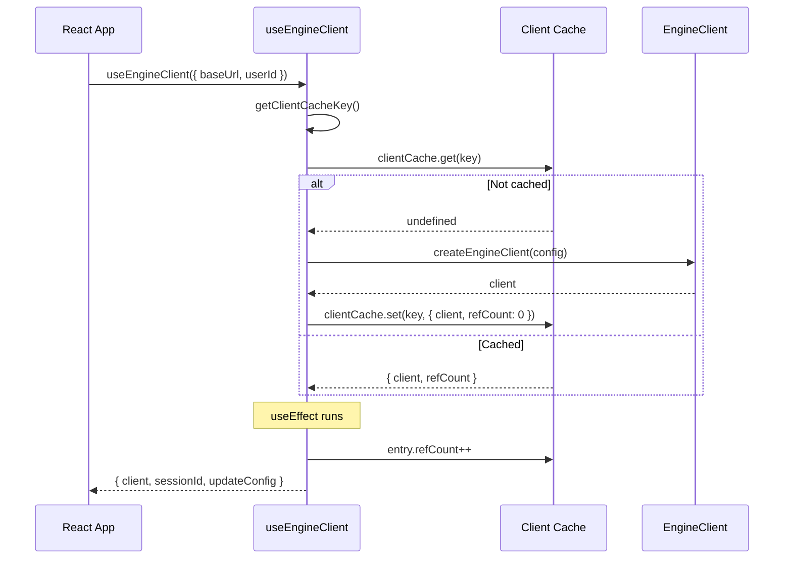
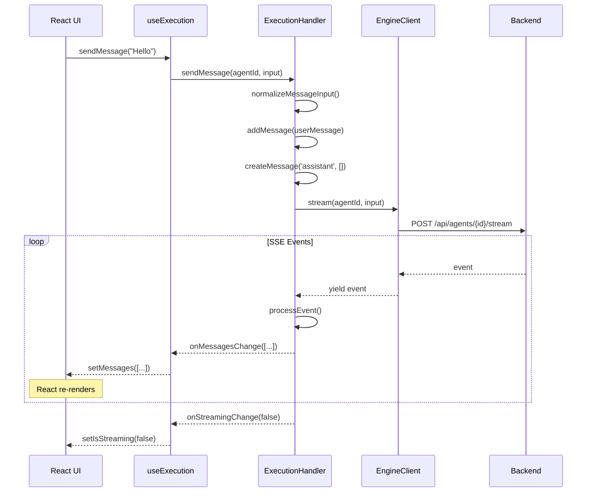
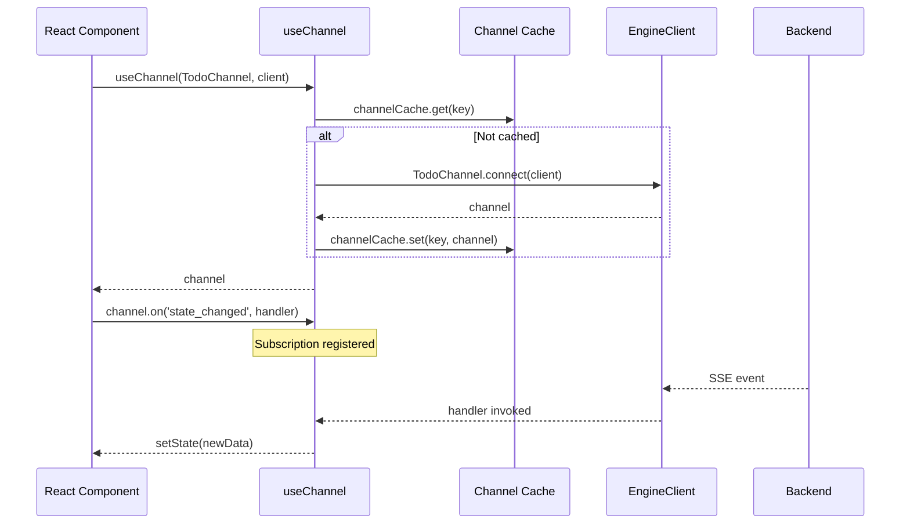

# aidk-react Architecture

> **React hooks and components for building AI-powered frontends with AIDK**

The React package provides React-specific bindings for the AIDK client, including hooks for agent execution, channel communication, and components for rendering AI-generated content blocks.

---

## Table of Contents

1. [Overview](#overview)
2. [Module Structure](#module-structure)
3. [Core Concepts](#core-concepts)
4. [API Reference](#api-reference)
5. [Data Flow](#data-flow)
6. [Usage Examples](#usage-examples)
7. [Integration Points](#integration-points)

---

## Overview

### What This Package Does

The React package provides:

- **React Hooks** - `useEngineClient`, `useExecution`, `useChannel` for managing client lifecycle and agent execution
- **Content Block Components** - Ready-to-use React components for rendering all AI content block types
- **StrictMode Compatibility** - Caching strategies that survive React's double-mount behavior
- **Type Safety** - Full TypeScript support with typed channel contracts

### Why It Exists

Building React applications with AIDK requires:

1. **Lifecycle Management** - Clients and channels need proper cleanup on unmount
2. **State Synchronization** - Stream events must update React state correctly
3. **Component Rendering** - AI content blocks need proper visual representation
4. **StrictMode Support** - Development mode double-mounting shouldn't break connections

### Design Principles

- **Thin wrapper** - Delegates to `aidk-client` for heavy lifting; hooks manage React lifecycle
- **Framework conventions** - Follows React patterns for hooks, refs, and effects
- **StrictMode-safe** - Module-level caching with ref-counting for proper resource management
- **Headless-first** - Components provide minimal styling; designed for customization

---

## Module Structure

```
┌─────────────────────────────────────────────────────────────────────────────┐
│                           React Application                                  │
└─────────────────────────────────────────────────────────────────────────────┘
                                    │
                                    ▼
┌─────────────────────────────────────────────────────────────────────────────┐
│                              aidk-react                                      │
│  ┌─────────────────────────────────────────────────────────────────────────┐│
│  │                              Hooks                                       ││
│  │  ┌─────────────────┐  ┌─────────────────┐  ┌─────────────────────────┐  ││
│  │  │ useEngineClient │  │  useExecution   │  │     useChannel          │  ││
│  │  │ Client lifecycle│  │  Agent execution│  │  Channel pub/sub        │  ││
│  │  └─────────────────┘  └─────────────────┘  └─────────────────────────┘  ││
│  └─────────────────────────────────────────────────────────────────────────┘│
│  ┌─────────────────────────────────────────────────────────────────────────┐│
│  │                          Block Components                                ││
│  │  ┌───────────────┐  ┌───────────────┐  ┌───────────────┐                ││
│  │  │ContentBlock   │  │ContentBlock   │  │  TextBlock    │                ││
│  │  │Renderer       │  │List           │  │  ImageBlock   │                ││
│  │  │               │  │               │  │  CodeBlock    │                ││
│  │  │               │  │               │  │  ToolUseBlock │                ││
│  │  │               │  │               │  │  ...          │                ││
│  │  └───────────────┘  └───────────────┘  └───────────────┘                ││
│  └─────────────────────────────────────────────────────────────────────────┘│
└─────────────────────────────────────────────────────────────────────────────┘
                                    │
                                    ▼
┌─────────────────────────────────────────────────────────────────────────────┐
│                              aidk-client                                     │
│        EngineClient, ExecutionHandler, SSETransport, defineChannel           │
└─────────────────────────────────────────────────────────────────────────────┘
```

### File Overview

| File                              | Size      | Purpose                                           |
| --------------------------------- | --------- | ------------------------------------------------- |
| `index.ts`                        | 81 lines  | Public exports and re-exports from client         |
| `hooks/useEngineClient.ts`        | 219 lines | Client lifecycle with StrictMode caching          |
| `hooks/useExecution.ts`           | 138 lines | Agent execution with message accumulation         |
| `hooks/useChannels.ts`            | 121 lines | Typed channel communication                       |
| `blocks/ContentBlockRenderer.tsx` | 92 lines  | Switch-based block type routing                   |
| `blocks/ContentBlockList.tsx`     | 36 lines  | Render list of blocks                             |
| `blocks/TextBlock.tsx`            | 90 lines  | Text rendering (plain text default, customizable) |
| `blocks/ReasoningBlock.tsx`       | 61 lines  | Collapsible reasoning display                     |
| `blocks/ToolUseBlock.tsx`         | 40 lines  | Tool call summary display                         |
| `blocks/ToolResultBlock.tsx`      | 32 lines  | Tool result status display                        |
| `blocks/ImageBlock.tsx`           | 36 lines  | Image rendering (URL/base64)                      |
| `blocks/CodeBlock.tsx`            | 40 lines  | Code with syntax highlighting                     |
| `blocks/PlaceholderBlock.tsx`     | 26 lines  | Fallback for unknown block types                  |

---

## Core Concepts

### 1. Client Caching (StrictMode Survival)

React 18's StrictMode mounts/unmounts components twice in development. Without caching, this would create duplicate connections and leave orphaned resources.

```
┌─────────────────────────────────────────────────────────────────────────────┐
│                       Module-Level Client Cache                              │
├─────────────────────────────────────────────────────────────────────────────┤
│                                                                              │
│   clientCache: Map<cacheKey, CachedClient>                                  │
│                                                                              │
│   ┌─────────────────────────────────────────────────────────────────────┐   │
│   │  CachedClient                                                        │   │
│   │  - client: EngineClient                                             │   │
│   │  - refCount: number                                                 │   │
│   │  - sessionId: string                                                │   │
│   └─────────────────────────────────────────────────────────────────────┘   │
│                                                                              │
│   Cache Key: `${baseUrl}:${sessionId}`                                      │
│                                                                              │
│   Lifecycle:                                                                 │
│   1. Mount: refCount++ (or create if first)                                 │
│   2. Unmount: refCount--                                                    │
│   3. If refCount <= 0, setTimeout(100ms) to check again                     │
│   4. If still <= 0, dispose client and remove from cache                    │
│                                                                              │
│   The 100ms delay survives StrictMode's rapid unmount/remount               │
│                                                                              │
└─────────────────────────────────────────────────────────────────────────────┘
```

### 2. Execution Handler Integration

`useExecution` wraps the client's `ExecutionHandler` class, connecting its callbacks to React state:

```
┌─────────────────────────────────────────────────────────────────────────────┐
│                            useExecution Hook                                 │
├─────────────────────────────────────────────────────────────────────────────┤
│                                                                              │
│   React State:                     ExecutionHandler Callbacks:              │
│   ┌──────────────────┐             ┌──────────────────────────────────┐     │
│   │ messages: []     │◀────────────│ onMessagesChange: setMessages    │     │
│   │ isStreaming: bool│◀────────────│ onStreamingChange: setIsStreaming│     │
│   │ threadId: string │◀────────────│ onThreadIdChange: setThreadId    │     │
│   │ error: Error     │◀────────────│ onErrorChange: setError          │     │
│   └──────────────────┘             └──────────────────────────────────┘     │
│                                                                              │
│   Callback refs for user callbacks:                                         │
│   ┌──────────────────────────────────────────────────────────────────────┐  │
│   │  callbacksRef.current = { onEvent, onComplete, onError }             │  │
│   │  ──▶ Updated on each render, referenced by handler                   │  │
│   │  ──▶ Avoids handler recreation on callback changes                   │  │
│   └──────────────────────────────────────────────────────────────────────┘  │
│                                                                              │
└─────────────────────────────────────────────────────────────────────────────┘
```

### 3. Channel Caching

Similar to client caching, channels are cached at module level with ref-counting:

```
┌─────────────────────────────────────────────────────────────────────────────┐
│                       Module-Level Channel Cache                             │
├─────────────────────────────────────────────────────────────────────────────┤
│                                                                              │
│   channelCache: Map<cacheKey, Channel>                                      │
│   channelRefCounts: Map<cacheKey, number>                                   │
│                                                                              │
│   Cache Key: `${sessionId}:${channelName}`                                  │
│                                                                              │
│   useChannel(TodoChannel, client):                                          │
│   1. Get sessionId from client                                              │
│   2. Look up channel in cache                                               │
│   3. If not cached: channelDef.connect(client)                              │
│   4. Manage refCount in useEffect                                           │
│   5. Cleanup with 100ms delay (StrictMode)                                  │
│                                                                              │
└─────────────────────────────────────────────────────────────────────────────┘
```

### 4. Content Block Rendering

The block components use a type-switch pattern to render different content block types:

```
┌─────────────────────────────────────────────────────────────────────────────┐
│                         ContentBlockRenderer                                 │
├─────────────────────────────────────────────────────────────────────────────┤
│                                                                              │
│   block.type ──▶ switch                                                     │
│                    │                                                        │
│       ┌────────────┼────────────┬────────────┬────────────┐                │
│       ▼            ▼            ▼            ▼            ▼                │
│   'text'      'reasoning'   'tool_use' 'tool_result'  'image'              │
│      │            │            │            │            │                 │
│      ▼            ▼            ▼            ▼            ▼                 │
│   TextBlock  ReasoningBlock ToolUseBlock ToolResultBlock ImageBlock        │
│                                                                              │
│   Additional mappings:                                                       │
│   - 'generated_image' ──▶ ImageBlock                                        │
│   - 'code' ──▶ CodeBlock                                                    │
│   - 'json' ──▶ CodeBlock (with language: JSON)                              │
│   - 'executable_code' ──▶ CodeBlock                                         │
│   - 'code_execution_result' ──▶ inline pre element                          │
│   - unknown ──▶ PlaceholderBlock                                            │
│                                                                              │
└─────────────────────────────────────────────────────────────────────────────┘
```

---

## API Reference

### hooks/useEngineClient.ts

#### `useEngineClient(options?)`

Creates or retrieves a cached `EngineClient` instance.

```typescript
interface UseEngineClientOptions extends EngineClientConfig {
  skipAutoConnect?: boolean; // Skip automatic channel connection
}

interface UseEngineClientReturn {
  client: EngineClient; // The client instance
  sessionId: string; // Current session ID
  isConnected: boolean; // Whether channels are connected
  updateConfig: (updates: Partial<EngineClientConfig>) => void;
}
```

**Behavior:**

- Creates client once per cache key (`baseUrl:sessionId`)
- Reuses cached client on remount (StrictMode compatible)
- Auto-updates `userId`, `tenantId`, `threadId` when they change
- Disposes client when all referencing components unmount

---

### hooks/useExecution.ts

#### `useExecution(options)`

Manages agent execution with message accumulation.

```typescript
interface UseExecutionOptions {
  client: EngineClient; // Required client instance
  agentId: string; // Agent to execute
  onEvent?: (event: EngineStreamEvent) => void; // Per-event callback
  onComplete?: (result: any) => void; // Completion callback
  onError?: (error: Error) => void; // Error callback
}

interface UseExecutionReturn {
  sendMessage: (input: MessageInput, threadId?: string) => Promise<void>;
  isStreaming: boolean; // Currently streaming?
  messages: Message[]; // Accumulated messages
  threadId: string | null; // Current thread ID
  error: Error | null; // Last error
  clearMessages: () => void; // Reset state
}
```

**Message Input Flexibility:**

- `string` - Converted to TextBlock in user message
- `ContentBlock` - Single block in user message
- `ContentBlock[]` - Array of blocks in user message
- `Message` - Full message with role
- `Message[]` - Multiple messages

---

### hooks/useChannels.ts

#### `useChannel(channelDef, client)`

Connects to a typed channel for pub/sub communication.

```typescript
function useChannel<TIn, TOut>(
  channelDef: ChannelDefinition<TIn, TOut>,
  client: EngineClient,
): Channel<TIn, TOut>;

interface Channel<TIn, TOut> {
  readonly name: string;
  readonly connected: boolean;

  on<K extends keyof TIn>(
    eventType: K,
    handler: (payload: TIn[K], event: ChannelEvent) => void,
  ): () => void;

  onAny(handler: (event: ChannelEvent) => void): () => void;

  send<K extends keyof TOut>(eventType: K, payload: TOut[K]): Promise<unknown>;

  disconnect(): void;
}
```

#### `clearChannelCache()`

Clears all cached channels. Useful for logout or testing.

---

### blocks/ContentBlockRenderer.tsx

#### `ContentBlockRenderer`

Renders a single content block based on its type.

```typescript
interface ContentBlockRendererProps {
  block: ContentBlock; // The block to render
  className?: string; // Optional CSS class
}
```

---

### blocks/ContentBlockList.tsx

#### `ContentBlockList`

Renders a list of content blocks.

```typescript
interface ContentBlockListProps {
  blocks: ContentBlock[]; // Blocks to render
  className?: string; // Container class
  blockClassName?: string; // Per-block class
  gap?: string | number; // Gap between blocks (default: 8px)
}
```

---

### Individual Block Components

All block components accept `{ block, className? }` props:

| Component          | Block Type                 | Features                                   |
| ------------------ | -------------------------- | ------------------------------------------ |
| `TextBlock`        | `text`, `reasoning`        | Plain text default, customizable rendering |
| `ReasoningBlock`   | `reasoning`                | Collapsible, handles redaction             |
| `ToolUseBlock`     | `tool_use`                 | Shows name, input summary, status          |
| `ToolResultBlock`  | `tool_result`              | Success/error status display               |
| `ImageBlock`       | `image`, `generated_image` | URL and base64 support                     |
| `CodeBlock`        | `code`                     | Language label, monospace display          |
| `PlaceholderBlock` | Any                        | Fallback for unknown types                 |

#### `TextBlock` Props

```typescript
interface TextBlockProps {
  block: TextBlock | ReasoningBlock;
  className?: string;
  /**
   * Custom render function for the text content.
   * If not provided, renders plain text.
   */
  renderText?: (text: string) => ReactNode;
  /**
   * Content to render instead of using renderText.
   * Useful for pre-rendered markdown or custom content.
   */
  children?: ReactNode;
}
```

**Design Decision**: TextBlock does NOT include built-in markdown rendering. This decoupled approach:

- Avoids XSS vulnerabilities from unsanitized HTML
- Lets users choose their preferred markdown library (react-markdown, marked, etc.)
- Gives full control over sanitization (DOMPurify, etc.)
- Reduces bundle size if markdown isn't needed

---

## Data Flow

### Hook Initialization Flow



### Message Send Flow



### Channel Communication Flow



### StrictMode Mount/Unmount Flow

```
┌─────────────────────────────────────────────────────────────────────────────┐
│                         React StrictMode Timeline                            │
├─────────────────────────────────────────────────────────────────────────────┤
│                                                                              │
│  Time ──────────────────────────────────────────────────────────────────▶   │
│                                                                              │
│  Mount 1:                                                                    │
│    │ useEngineClient() ──▶ Create client, refCount = 1                      │
│    │ useEffect() runs                                                        │
│    │                                                                         │
│  Unmount 1 (immediate):                                                      │
│    │ cleanup() ──▶ refCount = 0                                             │
│    │ setTimeout(100ms, checkDispose)                                        │
│    │                                                                         │
│  Mount 2 (~50ms later):                                                      │
│    │ useEngineClient() ──▶ Reuse cached client, refCount = 1                │
│    │ useEffect() runs                                                        │
│    │                                                                         │
│  100ms timer fires:                                                          │
│    │ Check refCount: 1 > 0 ──▶ Do NOT dispose                               │
│    │                                                                         │
│  Result: Client survives, connection maintained                              │
│                                                                              │
└─────────────────────────────────────────────────────────────────────────────┘
```

---

## Usage Examples

### Basic Chat Interface

```tsx
import { useEngineClient, useExecution, ContentBlockList } from "aidk-react";

function Chat() {
  const { client } = useEngineClient({
    baseUrl: "http://localhost:3001",
    userId: "user-123",
  });

  const { messages, sendMessage, isStreaming, error } = useExecution({
    client,
    agentId: "assistant",
  });

  const handleSubmit = (e: React.FormEvent<HTMLFormElement>) => {
    e.preventDefault();
    const input = e.currentTarget.elements.namedItem(
      "message",
    ) as HTMLInputElement;
    sendMessage(input.value);
    input.value = "";
  };

  return (
    <div>
      {messages.map((msg) => (
        <div key={msg.id} className={msg.role}>
          <ContentBlockList blocks={msg.content} />
        </div>
      ))}

      {error && <div className="error">{error.message}</div>}

      <form onSubmit={handleSubmit}>
        <input name="message" disabled={isStreaming} />
        <button type="submit" disabled={isStreaming}>
          {isStreaming ? "Sending..." : "Send"}
        </button>
      </form>
    </div>
  );
}
```

### Typed Channel Communication

```tsx
import { defineChannel, useEngineClient, useChannel } from "aidk-react";
import { useState, useEffect } from "react";

// Define channel contract
interface Task {
  id: string;
  title: string;
  completed: boolean;
}

const TodoChannel = defineChannel<
  { state_changed: { tasks: Task[] }; task_created: { task: Task } },
  { create_task: { title: string }; toggle_complete: { task_id: string } }
>("todo-list");

function TodoList() {
  const { client } = useEngineClient({ baseUrl: "http://localhost:3001" });
  const todo = useChannel(TodoChannel, client);
  const [tasks, setTasks] = useState<Task[]>([]);

  useEffect(() => {
    // Type-safe subscription
    return todo.on("state_changed", ({ tasks }) => setTasks(tasks));
  }, [todo]);

  useEffect(() => {
    return todo.on("task_created", ({ task }) => {
      setTasks((prev) => [...prev, task]);
    });
  }, [todo]);

  const createTask = async () => {
    // Type-safe publish
    await todo.send("create_task", { title: "New task" });
  };

  const toggleTask = async (taskId: string) => {
    await todo.send("toggle_complete", { task_id: taskId });
  };

  return (
    <div>
      <button onClick={createTask}>Add Task</button>
      <ul>
        {tasks.map((task) => (
          <li key={task.id} onClick={() => toggleTask(task.id)}>
            {task.completed ? "✅" : "⬜"} {task.title}
          </li>
        ))}
      </ul>
    </div>
  );
}
```

### Custom Block Rendering

```tsx
import { ContentBlockRenderer, ToolUseBlock } from "aidk-react";
import type {
  ContentBlock,
  ToolUseBlock as ToolUseBlockType,
} from "aidk-react";

// Custom tool block with expanded details
function CustomToolUseBlock({ block }: { block: ToolUseBlockType }) {
  return (
    <div className="my-tool-block">
      <div className="tool-name">{block.name}</div>
      <pre className="tool-input">{JSON.stringify(block.input, null, 2)}</pre>
    </div>
  );
}

// Custom renderer that overrides tool_use
function CustomBlockRenderer({ block }: { block: ContentBlock }) {
  if (block.type === "tool_use") {
    return <CustomToolUseBlock block={block} />;
  }
  return <ContentBlockRenderer block={block} />;
}
```

### Custom Markdown Rendering

The TextBlock component does not include built-in markdown rendering to avoid XSS vulnerabilities
and give you control over the rendering pipeline. Here are the recommended patterns:

```tsx
// Option 1: Using react-markdown (recommended for security)
import ReactMarkdown from "react-markdown";

function MarkdownText({ block }: { block: TextBlock }) {
  return (
    <TextBlock
      block={block}
      renderText={(text) => <ReactMarkdown>{text}</ReactMarkdown>}
    />
  );
}

// Option 2: Using marked with DOMPurify
import { marked } from "marked";
import DOMPurify from "dompurify";

function MarkdownText({ block }: { block: TextBlock }) {
  return (
    <TextBlock
      block={block}
      renderText={(text) => (
        <div
          className="aidk-markdown"
          dangerouslySetInnerHTML={{
            __html: DOMPurify.sanitize(marked.parse(text) as string),
          }}
        />
      )}
    />
  );
}

// Option 3: Using children for pre-rendered content
function MarkdownText({ block }: { block: TextBlock }) {
  return (
    <TextBlock block={block}>
      <MyCustomMarkdownComponent text={block.text} />
    </TextBlock>
  );
}
```

For styling markdown content, create your own CSS or use a library's default styles:

```css
/* Your custom markdown styles */
.aidk-markdown h1 {
  font-size: 1.5rem;
  margin-bottom: 0.5rem;
}
.aidk-markdown code {
  background: #f5f5f5;
  padding: 2px 4px;
}
.aidk-markdown pre {
  background: #1e1e1e;
  padding: 1rem;
  overflow-x: auto;
}
```

### Event Callbacks

```tsx
function ChatWithCallbacks() {
  const { client } = useEngineClient({ ... });

  const { sendMessage, messages } = useExecution({
    client,
    agentId: 'assistant',
    onEvent: (event) => {
      // Handle every stream event
      console.log('Event:', event.type);

      if (event.type === 'tool_call') {
        showToolIndicator(event.call.name);
      }
    },
    onComplete: (result) => {
      // Execution finished
      console.log('Complete:', result);
      analytics.track('chat_complete');
    },
    onError: (error) => {
      // Handle errors
      console.error('Error:', error);
      showErrorToast(error.message);
    },
  });

  // ...
}
```

---

## Integration Points

### How This Package Fits in AIDK

| Package        | Relationship | Description                                       |
| -------------- | ------------ | ------------------------------------------------- |
| `aidk-client`  | Dependency   | Provides EngineClient, ExecutionHandler, channels |
| `aidk-angular` | Sibling      | Alternative framework bindings                    |
| Application    | Consumer     | Imports hooks and components                      |

### Re-exports from aidk-client

For convenience, commonly used types and classes are re-exported:

```typescript
// Classes
export {
  EngineClient,
  createEngineClient,
  getEngineClient,
  defineChannel,
} from "aidk-client";
export { SSETransport, ChannelClient } from "aidk-client";

// Types
export type {
  EngineInput,
  ExecutionResult,
  EngineStreamEvent,
  ChannelEvent,
  Channel,
  ChannelDefinition,
  EngineClientConfig,
  EngineRoutes,
  ConnectionState,
  ConnectionInfo,
  Message,
  ContentBlock,
  TimelineEntry,
} from "aidk-client";
```

### Peer Dependencies

```json
{
  "peerDependencies": {
    "aidk-client": "workspace:*",
    "react": "^18.0.0"
  }
}
```

**Note**: `marked` is no longer a peer dependency. TextBlock renders plain text by default.
For markdown rendering, install your preferred library (react-markdown, marked + DOMPurify, etc.).

### Extension Points

1. **Custom Block Renderers** - Wrap or replace individual block components
2. **Custom Styling** - Override `.aidk-markdown` class or pass `className` props
3. **Custom Hooks** - Compose with `useEngineClient` for app-specific patterns
4. **Custom Transports** - Pass custom transport to `useEngineClient`

---

## Summary

The React package provides idiomatic React bindings for AIDK:

- **`useEngineClient`** - Lifecycle-managed client with StrictMode-safe caching
- **`useExecution`** - Agent execution with automatic message accumulation
- **`useChannel`** - Type-safe pub/sub for real-time communication
- **Block Components** - Ready-to-use renderers for all AI content types

The thin-wrapper approach delegates complex logic to `aidk-client` while handling React-specific concerns like state synchronization, cleanup, and StrictMode compatibility.
