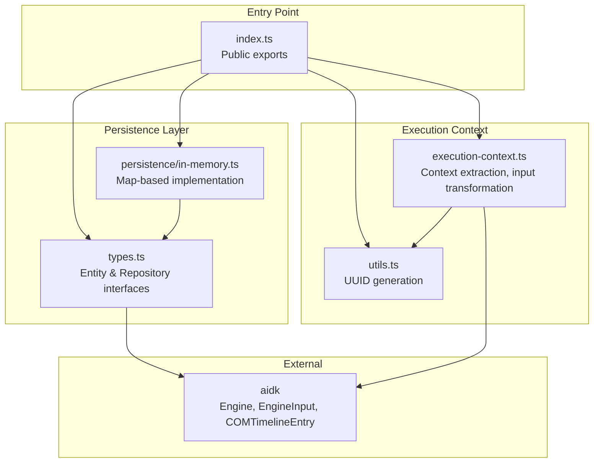
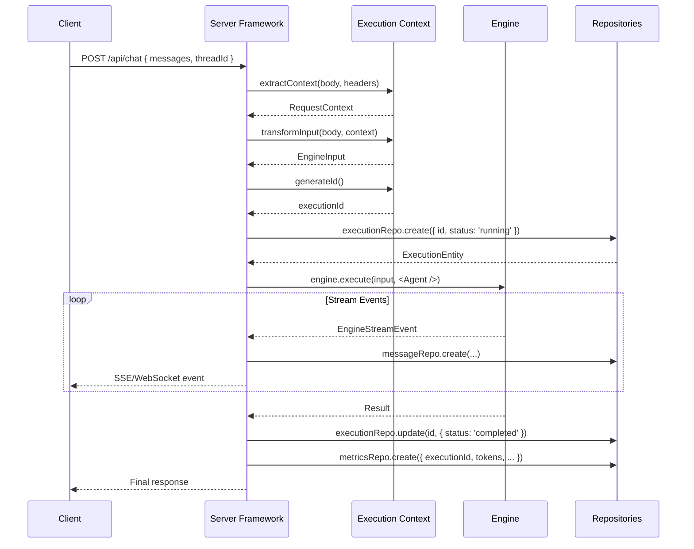
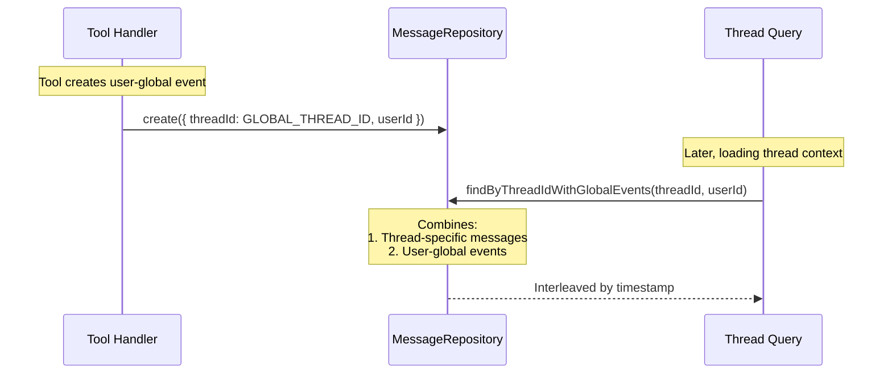

# aidk-server Architecture

> **Framework-agnostic server infrastructure for AIDK agents**

The server package provides backend utilities for running AIDK agents in any Node.js server framework. It offers persistence abstractions, execution context management, and request/response transformation - enabling Express, NestJS, Fastify, or any framework to host AIDK agents.

---

## Table of Contents

1. [Overview](#overview)
2. [Module Structure](#module-structure)
3. [Core Concepts](#core-concepts)
4. [API Reference](#api-reference)
5. [Data Flow](#data-flow)
6. [Usage Examples](#usage-examples)
7. [Integration Points](#integration-points)

---

## Overview

### What This Package Does

The server package provides:

- **Execution Context** - Request-to-engine context transformation with ID generation and input normalization
- **Persistence Layer** - Repository interfaces for storing executions, messages, metrics, and tool state
- **In-Memory Store** - Development/testing implementation of all repositories
- **Framework Agnostic** - Works with Express, NestJS, Fastify, Koa, Elysia, or any server framework

### Why It Exists

Running AIDK agents on a server requires:

1. **Request transformation** - Convert HTTP requests to Engine-compatible input
2. **Context extraction** - Pull user/tenant/thread info from requests
3. **State persistence** - Store execution history, messages, and metrics
4. **Framework independence** - Same logic works across different server frameworks

### Design Principles

- **Framework agnostic** - No Express/NestJS/Fastify dependencies; pure TypeScript utilities
- **Repository pattern** - Abstract persistence behind interfaces; swap implementations freely
- **Minimal dependencies** - Only depends on `aidk` core package
- **Composable factories** - Create custom extractors/transformers for different API conventions

---

## Module Structure



### File Overview

| File                       | Size      | Purpose                                       |
| -------------------------- | --------- | --------------------------------------------- |
| `index.ts`                 | 74 lines  | Public API exports                            |
| `types.ts`                 | 189 lines | Entity interfaces and repository contracts    |
| `execution-context.ts`     | 251 lines | Request context extraction and transformation |
| `utils.ts`                 | 16 lines  | UUID generation utility                       |
| `persistence/in-memory.ts` | 388 lines | In-memory repository implementations          |

---

## Core Concepts

### 1. Execution Context

The execution context bridges HTTP requests and the AIDK Engine. It extracts user identity, thread IDs, and transforms message formats.

```
┌─────────────────────────────────────────────────────────────────┐
│                     Request Flow                                 │
├─────────────────────────────────────────────────────────────────┤
│                                                                  │
│  HTTP Request                                                    │
│  ┌──────────────────────────────────────────────────────────┐   │
│  │  POST /api/chat                                          │   │
│  │  Headers: { x-session-id: 'sess-123' }                   │   │
│  │  Body: {                                                 │   │
│  │    messages: [{ role: 'user', content: [...] }],         │   │
│  │    threadId: 'thread-abc',                              │   │
│  │    userId: 'user-1'                                     │   │
│  │  }                                                       │   │
│  └──────────────────────────────────────────────────────────┘   │
│                              │                                   │
│                              ▼                                   │
│  ┌──────────────────────────────────────────────────────────┐   │
│  │              Context Extractor                            │   │
│  │  ────────────────────────────────                        │   │
│  │  Extracts: threadId, sessionId, userId, tenantId     │   │
│  │  Returns: RequestContext                                 │   │
│  └──────────────────────────────────────────────────────────┘   │
│                              │                                   │
│                              ▼                                   │
│  ┌──────────────────────────────────────────────────────────┐   │
│  │              Input Transformer                            │   │
│  │  ────────────────────────────                            │   │
│  │  Transforms messages to timeline format                  │   │
│  │  Returns: EngineInput { timeline, metadata }             │   │
│  └──────────────────────────────────────────────────────────┘   │
│                              │                                   │
│                              ▼                                   │
│  ┌──────────────────────────────────────────────────────────┐   │
│  │              Execution Context                            │   │
│  │  ────────────────────────                                │   │
│  │  {                                                       │   │
│  │    executionId: 'exec-xyz',                             │   │
│  │    threadId: 'thread-abc',                              │   │
│  │    userId: 'user-1',                                    │   │
│  │    engine: Engine,                                       │   │
│  │    input: EngineInput                                    │   │
│  │  }                                                       │   │
│  └──────────────────────────────────────────────────────────┘   │
│                                                                  │
└─────────────────────────────────────────────────────────────────┘
```

### 2. Entity Model

The persistence layer defines entities for tracking agent executions:

```
┌─────────────────────────────────────────────────────────────────┐
│                        Entity Model                              │
├─────────────────────────────────────────────────────────────────┤
│                                                                  │
│  ┌─────────────────┐         ┌─────────────────┐                 │
│  │   Execution     │◄────────│    Metrics      │                 │
│  │  ─────────────  │  1:1    │  ────────────   │                 │
│  │  id             │         │  inputTokens   │                 │
│  │  type           │         │  outputTokens  │                 │
│  │  status         │         │  cost           │                 │
│  │  root_id        │         │  llmCalls      │                 │
│  │  parent_id      │         │  tool_calls     │                 │
│  │  threadId      │         └─────────────────┘                 │
│  │  userId        │                                             │
│  │  tenantId      │                                             │
│  └────────┬────────┘                                             │
│           │ 1:N                                                  │
│           ▼                                                      │
│  ┌─────────────────┐         ┌─────────────────┐                 │
│  │    Message      │────────►│  MessageBlock   │                 │
│  │  ─────────────  │  1:N    │  ─────────────  │                 │
│  │  id             │         │  block_index    │                 │
│  │  role           │         │  block_type     │                 │
│  │  content (JSON) │         │  block_data     │                 │
│  │  threadId      │         └─────────────────┘                 │
│  │  executionId   │                                             │
│  └─────────────────┘                                             │
│                                                                  │
│  ┌─────────────────┐         ┌─────────────────┐                 │
│  │  Interaction    │         │   ToolState     │                 │
│  │  ─────────────  │         │  ─────────────  │                 │
│  │  id             │         │  tool_id        │                 │
│  │  type           │         │  threadId      │                 │
│  │  origin         │         │  userId        │                 │
│  │  threadId      │         │  state_data     │                 │
│  │  root_exec_id   │         └─────────────────┘                 │
│  └─────────────────┘                                             │
│                                                                  │
└─────────────────────────────────────────────────────────────────┘
```

### 3. Repository Pattern

Each entity has a corresponding repository interface for CRUD operations:

```typescript
// Abstract interface
interface ExecutionRepository {
  create(data: ExecutionEntity): Promise<ExecutionEntity>;
  update(
    id: string,
    updates: Partial<ExecutionEntity>,
  ): Promise<ExecutionEntity | null>;
  findById(id: string): Promise<ExecutionEntity | null>;
  findByThreadId(threadId: string): Promise<ExecutionEntity[]>;
  // ...
}

// Concrete implementation
class InMemoryExecutionRepository implements ExecutionRepository {
  constructor(private store: InMemoryStore) {}
  // Map-based implementation
}

// Swap for production (e.g., PostgreSQL, MongoDB)
class PostgresExecutionRepository implements ExecutionRepository {
  constructor(private db: PgPool) {}
  // SQL-based implementation
}
```

---

## API Reference

### execution-context.ts

#### Types

##### `RequestContext`

Extracted context from an incoming request:

```typescript
interface RequestContext {
  threadId: string; // Conversation ID
  sessionId?: string; // Real-time channel routing
  userId: string; // Authenticated user
  tenantId?: string; // Multi-tenant identifier
  metadata?: Record<string, unknown>;
}
```

##### `ExecutionContext`

Full context passed to handlers:

```typescript
interface ExecutionContext extends RequestContext {
  executionId: string; // Unique execution ID
  engine: Engine; // Engine instance
  input: EngineInput; // Transformed input
}
```

##### `StandardRequestBody`

Default request body convention:

```typescript
interface StandardRequestBody {
  messages?: Array<{
    role: string;
    content: Array<{
      type?: string;
      text?: string;
      imageUrl?: string;
    }>;
  }>;
  threadId?: string;
  sessionId?: string;
  userId?: string;
  tenantId?: string;
  metadata?: Record<string, unknown>;
}
```

#### ID Generators

```typescript
// Default UUID v4
const id = uuidV4Generator(); // 'a1b2c3d4-...'

// Prefixed IDs
const generator = createPrefixedIdGenerator("exec");
const id = generator(); // 'exec_a1b2c3d4-...'

// Custom generator (e.g., UUIDv7, DB sequence)
const generator = createIdGenerator(() => myCustomId());
```

#### Context Extractors

```typescript
// Default extractor (follows StandardRequestBody conventions)
const ctx = defaultContextExtractor(body, headers);

// Custom extractor for different API conventions
const extractor = createContextExtractor<MyBody>({
  threadId: "conversationId", // Map field name
  userId: (body) => body.auth?.userId, // Or use function
  tenantId: "organizationId",
});
```

#### Input Transformers

```typescript
// Transform messages to timeline
const timeline = messagesToTimeline(body.messages);
// Returns: COMTimelineEntry[]

// Default transformer
const input = defaultInputTransformer(body, context);
// Returns: { timeline: [...], metadata: {...} }

// Custom transformer
const transformer = createInputTransformer<MyBody>((body, ctx) => ({
  timeline: myTransformLogic(body),
  metadata: { threadId: ctx.threadId },
}));
```

#### Helpers

```typescript
// Build withContext options for engine execution
const engineContext = buildEngineContext({
  ...requestContext,
  executionId: "exec-123",
});
// Returns: { user: { id }, metadata: {...} }

// Resolve config with defaults
const config = resolveConfig({
  engine: myEngine,
  generateId: myIdGen, // optional
});
```

#### Request Context Attachment

These helpers enable storing and retrieving `RequestContext` on request objects across any framework (Express, NestJS, Fastify, etc.):

```typescript
import {
  attachContext,
  getContext,
  requireContext,
  AIDK_CONTEXT_KEY,
} from "aidk-server";

// Attach context to request (in middleware/interceptor)
const ctx = defaultContextExtractor(req.body, req.headers);
attachContext(req, ctx);

// Retrieve context (in handlers, guards, decorators)
const ctx = getContext(req); // Returns undefined if not attached
const ctx = requireContext(req); // Throws if not attached
```

| Function           | Signature                                         | Description                         |
| ------------------ | ------------------------------------------------- | ----------------------------------- |
| `attachContext`    | `(request: any, context: RequestContext) => void` | Store context on request            |
| `getContext`       | `(request: any) => RequestContext \| undefined`   | Retrieve context, returns undefined |
| `requireContext`   | `(request: any) => RequestContext`                | Retrieve context, throws if missing |
| `AIDK_CONTEXT_KEY` | `Symbol`                                          | Symbol key used for storage         |

**Why use these?**

- **Framework agnostic** - Works with any request object shape
- **Symbol key** - Avoids property name collisions
- **Type safe** - Returns properly typed `RequestContext`
- **Consistent pattern** - Same API across Express, NestJS, Fastify, etc.

---

### types.ts

#### Entity Interfaces

##### `ExecutionEntity`

```typescript
interface ExecutionEntity {
  id: string;
  type: "agent" | "model" | "tool";
  status: "running" | "completed" | "failed" | "cancelled";
  root_id?: string; // Root execution (for nested)
  parent_id?: string; // Parent execution
  threadId?: string; // Conversation
  userId?: string; // User
  tenantId: string; // Tenant (required)
  interaction_id?: string;
  startedAt: Date;
  completed_at?: Date;
  error?: string;
  metadata?: Record<string, unknown>;
}
```

##### `MetricsEntity`

```typescript
interface MetricsEntity {
  id: string;
  executionId: string;
  inputTokens: number;
  outputTokens: number;
  cachedTokens: number;
  cost: number;
  llmCalls: number;
  tool_calls: number;
  agentCalls: number;
  functionCalls: number;
  codeRuns: number;
  executions: number;
  requests: number;
  tenantId: string;
  userId?: string;
  threadId?: string;
}
```

##### `MessageEntity`

```typescript
interface MessageEntity {
  id: string;
  executionId: string;
  interaction_id?: string;
  threadId: string;
  userId?: string; // For user-global events
  role: MessageRoles; // 'user' | 'assistant' | 'system'
  content: string; // JSON string
  source?: string;
  createdAt: Date;
  metadata?: string;
}
```

##### `ToolStateEntity`

```typescript
interface ToolStateEntity {
  id: string;
  tool_id: string;
  threadId: string;
  userId: string;
  tenantId: string;
  state_data: string; // JSON string
  createdAt: Date;
  updatedAt: Date;
}
```

#### Repository Interfaces

| Repository               | Key Methods                                                  |
| ------------------------ | ------------------------------------------------------------ |
| `ExecutionRepository`    | `create`, `update`, `findById`, `findByThreadId`, `findAll`  |
| `MetricsRepository`      | `create`, `update`, `findByExecutionId`, `aggregate`         |
| `MessageRepository`      | `create`, `findByThreadId`, `findByThreadIdWithGlobalEvents` |
| `MessageBlockRepository` | `create`, `findByMessageId`                                  |
| `InteractionRepository`  | `create`, `update`, `findById`, `findByThreadId`             |
| `ToolStateRepository`    | `create`, `update`, `findByToolAndThread`, `upsert`          |

#### Constants

```typescript
// Nil UUID for user-global events (not tied to any thread)
const GLOBAL_THREAD_ID = "00000000-0000-0000-0000-000000000000";
```

---

### persistence/in-memory.ts

#### Store Factory

```typescript
// Create a store
const store = createInMemoryStore();
// Returns: {
//   executions: Map<string, ExecutionEntity>,
//   metrics: Map<string, MetricsEntity>,
//   messages: Map<string, MessageEntity>,
//   messageBlocks: Map<string, MessageBlockEntity>,
//   interactions: Map<string, InteractionEntity>,
//   toolState: Map<string, ToolStateEntity>
// }

// Clear all data
clearStore(store);
```

#### Repository Factory

```typescript
// Create all repositories at once
const repos = createInMemoryRepositories(store);
// Returns: PersistenceRepositories {
//   executionRepo, metricsRepo, messageRepo,
//   messageBlockRepo, interactionRepo, toolStateRepo
// }
```

#### Individual Repositories

```typescript
// Or create individually
const executionRepo = new InMemoryExecutionRepository(store);
const metricsRepo = new InMemoryMetricsRepository(store);
const messageRepo = new InMemoryMessageRepository(store);
const messageBlockRepo = new InMemoryMessageBlockRepository(store);
const interactionRepo = new InMemoryInteractionRepository(store);
const toolStateRepo = new InMemoryToolStateRepository(store);
```

---

## Data Flow

### Request-to-Execution Flow



### User-Global Events Flow

Messages can be scoped globally to a user (not tied to any thread):



---

## Usage Examples

### Basic Server Setup (Express)

```typescript
import express from 'express';
import { createEngine, Engine } from 'aidk';
import {
  defaultContextExtractor,
  defaultInputTransformer,
  buildEngineContext,
  uuidV4Generator,
  createInMemoryStore,
  createInMemoryRepositories,
} from 'aidk-server';
import { MyAgent } from './agents';

const app = express();
app.use(express.json());

// Create engine and persistence
const engine = createEngine({ model: myModel });
const store = createInMemoryStore();
const repos = createInMemoryRepositories(store);

app.post('/api/chat', async (req, res) => {
  // Extract context
  const requestContext = defaultContextExtractor(req.body, req.headers);
  const input = defaultInputTransformer(req.body, requestContext);
  const executionId = uuidV4Generator();

  // Create execution record
  await repos.executionRepo.create({
    id: executionId,
    type: 'agent',
    status: 'running',
    threadId: requestContext.threadId,
    userId: requestContext.userId,
    tenantId: requestContext.tenantId || 'default',
  });

  try {
    // Execute with context
    const result = await engine
      .withContext(buildEngineContext({ ...requestContext, executionId }))
      .execute(input, <MyAgent />);

    // Update execution status
    await repos.executionRepo.update(executionId, {
      status: 'completed',
      completed_at: new Date(),
    });

    res.json(result);
  } catch (error) {
    await repos.executionRepo.update(executionId, {
      status: 'failed',
      error: String(error),
      completed_at: new Date(),
    });
    res.status(500).json({ error: String(error) });
  }
});
```

### Custom Context Extractor

```typescript
import { createContextExtractor } from "aidk-server";

interface MyRequestBody {
  conversationId: string;
  auth: { userId: string; orgId: string };
  payload: { messages: any[] };
}

const myExtractor = createContextExtractor<MyRequestBody>({
  threadId: "conversationId",
  userId: (body) => body.auth.userId,
  tenantId: (body) => body.auth.orgId,
  sessionId: (body, headers) => headers?.["x-ws-session"],
});

// Usage
const ctx = myExtractor(req.body, req.headers);
```

### Streaming with Persistence

```typescript
import { createEngine } from 'aidk';
import {
  createInMemoryStore,
  createInMemoryRepositories,
  defaultContextExtractor,
  defaultInputTransformer,
  uuidV4Generator,
} from 'aidk-server';

const store = createInMemoryStore();
const repos = createInMemoryRepositories(store);

app.post('/api/chat/stream', async (req, res) => {
  res.setHeader('Content-Type', 'text/event-stream');

  const ctx = defaultContextExtractor(req.body, req.headers);
  const input = defaultInputTransformer(req.body, ctx);
  const executionId = uuidV4Generator();

  await repos.executionRepo.create({
    id: executionId,
    type: 'agent',
    status: 'running',
    threadId: ctx.threadId,
    userId: ctx.userId,
    tenantId: ctx.tenantId || 'default',
  });

  let messageId: string | undefined;

  for await (const event of engine.stream(input, <MyAgent />)) {
    // Persist message on message:start
    if (event.type === 'message:start') {
      const msg = await repos.messageRepo.create({
        id: event.message.id,
        executionId,
        threadId: ctx.threadId,
        role: event.message.role,
        content: JSON.stringify(event.message.content),
      });
      messageId = msg.id;
    }

    // Stream to client
    res.write(`data: ${JSON.stringify(event)}\n\n`);
  }

  await repos.executionRepo.update(executionId, {
    status: 'completed',
    completed_at: new Date(),
  });

  res.end();
});
```

### User-Global Events (Cross-Thread Context)

```typescript
import { GLOBAL_THREAD_ID } from "aidk-server";

// Tool that creates a user-global event
const NotificationTool = createTool({
  name: "notify",
  handler: async ({ message }, ctx) => {
    // Store as user-global event
    await repos.messageRepo.create({
      id: generateUUID(),
      executionId: ctx.executionId,
      threadId: GLOBAL_THREAD_ID, // Not tied to current thread
      userId: ctx.userId,
      role: "assistant",
      content: JSON.stringify([
        { type: "text", text: `Notification: ${message}` },
      ]),
      source: "notification",
    });

    return [{ type: "text", text: "Notification sent" }];
  },
});

// Later, loading thread with global events
const messages = await repos.messageRepo.findByThreadIdWithGlobalEvents(
  threadId,
  userId,
);
// Returns thread messages + any user-global events, sorted by timestamp
```

### Custom Persistence Implementation

```typescript
import type { ExecutionRepository, ExecutionEntity } from "aidk-server";
import { Pool } from "pg";

class PostgresExecutionRepository implements ExecutionRepository {
  constructor(private pool: Pool) {}

  async create(
    data: Omit<ExecutionEntity, "startedAt">,
  ): Promise<ExecutionEntity> {
    const result = await this.pool.query(
      `INSERT INTO executions (id, type, status, threadId, userId, tenantId)
       VALUES ($1, $2, $3, $4, $5, $6)
       RETURNING *`,
      [
        data.id,
        data.type,
        data.status,
        data.threadId,
        data.userId,
        data.tenantId,
      ],
    );
    return this.mapRow(result.rows[0]);
  }

  async findById(id: string): Promise<ExecutionEntity | null> {
    const result = await this.pool.query(
      "SELECT * FROM executions WHERE id = $1",
      [id],
    );
    return result.rows[0] ? this.mapRow(result.rows[0]) : null;
  }

  // ... other methods

  private mapRow(row: any): ExecutionEntity {
    return {
      id: row.id,
      type: row.type,
      status: row.status,
      startedAt: row.startedAt,
      completed_at: row.completed_at,
      // ...
    };
  }
}
```

---

## Integration Points

### With AIDK Core

The server package integrates with core package types:

| Core Type          | Used By Server                 |
| ------------------ | ------------------------------ |
| `Engine`           | `ExecutionContext.engine`      |
| `EngineInput`      | `InputTransformer` return type |
| `COMTimelineEntry` | `messagesToTimeline()` output  |
| `MessageRoles`     | `MessageEntity.role`           |

### With Framework Adapters

The utilities can be wrapped in framework-specific middleware:

```typescript
// Express middleware
function aidkMiddleware(config: ExecutionContextConfig) {
  const resolved = resolveConfig(config);
  return async (req, res, next) => {
    const ctx = resolved.extractContext(req.body, req.headers);
    const input = resolved.transformInput(req.body, ctx);
    req.aidkContext = { ...ctx, executionId: resolved.generateId(), input };
    next();
  };
}

// NestJS guard using context helpers
@Injectable()
class AidkGuard implements CanActivate {
  canActivate(context: ExecutionContext) {
    const req = context.switchToHttp().getRequest();
    const ctx = getContext(req); // Uses attachContext from interceptor
    return ctx?.userId != null;
  }
}
```

### With Real-Time Channels

The `sessionId` in `RequestContext` is used for channel routing:

```typescript
// Extract session for WebSocket routing
const ctx = defaultContextExtractor(body, {
  "x-session-id": socket.sessionId,
});

// Session ID flows to engine context
const engineCtx = buildEngineContext({ ...ctx, executionId });
// engineCtx.metadata.sessionId = socket.sessionId
```

---

## Summary

The `aidk-server` package provides the infrastructure for running AIDK agents on any Node.js server:

- **Execution Context** utilities extract user/thread info and transform requests to engine input
- **Repository Interfaces** define contracts for persistence (executions, messages, metrics, tool state)
- **In-Memory Store** provides a development/testing implementation of all repositories
- **Framework Agnostic** design works with Express, NestJS, Fastify, or any server framework

Use the default extractors/transformers for standard API conventions, or create custom ones for different field names and auth patterns. Swap the in-memory repositories for production implementations (PostgreSQL, MongoDB, etc.) without changing application code.
