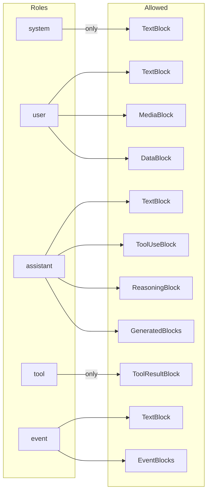
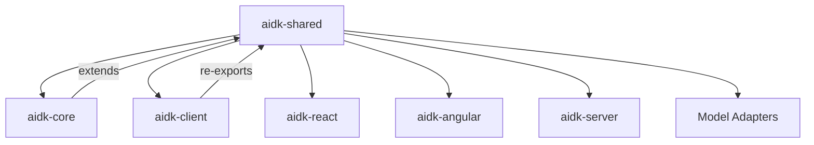

# aidk-shared Architecture

> **Platform-independent type definitions for AIDK**

The shared package provides the foundational types, interfaces, and enums used across all AIDK packages. It defines the canonical data structures for content blocks, messages, streaming, tools, and models - ensuring type consistency between backend and frontend.

---

## Table of Contents

1. [Overview](#overview)
2. [Module Structure](#module-structure)
3. [Core Concepts](#core-concepts)
4. [API Reference](#api-reference)
5. [Type Hierarchies](#type-hierarchies)
6. [Usage Examples](#usage-examples)
7. [Integration Points](#integration-points)

---

## Overview

### What This Package Does

The shared package provides:

- **Content Blocks** - Discriminated union types for all content types (text, images, tools, code, etc.)
- **Messages** - Role-based message types with type-safe content restrictions
- **Streaming Types** - Platform-independent streaming protocol definitions
- **Tool Types** - Tool calling interfaces and execution type classifications
- **Model Types** - Simplified model input/output contracts
- **Input Normalization** - Utilities for normalizing various input formats

### Why It Exists

AIDK spans multiple contexts: backend engines, frontend clients, model adapters, and communication layers. The shared package ensures:

1. **Type Consistency** - Same types used across all packages, no translation errors
2. **Platform Independence** - Types work in both Node.js and browser environments
3. **Provider Normalization** - Canonical block types abstract away provider differences
4. **Clear Contracts** - Well-defined interfaces for package boundaries

### Design Principles

- **Zero AIDK dependencies** - This package has no dependencies on other AIDK packages
- **Browser-compatible** - Works in both Node.js and browser environments
- **Immutable types** - All interfaces use `readonly` for immutability
- **Discriminated unions** - Type-safe pattern matching via `type` discriminants
- **Minimal runtime** - Mostly type definitions, few runtime dependencies

---

## Module Structure

```
┌─────────────────────────────────────────────────────────────────┐
│                        aidk-shared                              │
├─────────────────────────────────────────────────────────────────┤
│                                                                 │
│   ┌─────────────────┐     ┌─────────────────┐                   │
│   │  block-types.ts │     │    blocks.ts    │                   │
│   │  ─────────────  │     │  ─────────────  │                   │
│   │  BlockType      │────▶│  ContentBlock   │                   │
│   │  MessageRole    │     │  MediaSource    │                   │
│   │  MediaSourceType│     │  Type Guards    │                   │
│   │  MimeTypes      │     │  Helpers        │                   │
│   └─────────────────┘     └────────┬────────┘                   │
│                                    │                            │
│   ┌─────────────────┐              │                            │
│   │   messages.ts   │◀─────────────┘                            │
│   │  ─────────────  │                                           │
│   │  Message        │                                           │
│   │  UserMessage    │                                           │
│   │  EventMessage   │                                           │
│   │  Factory fns    │                                           │
│   └────────┬────────┘                                           │
│            │                                                    │
│   ┌────────▼────────┐     ┌─────────────────┐                   │
│   │  streaming.ts   │     │    tools.ts     │                   │
│   │  ─────────────  │     │  ─────────────  │                   │
│   │  StreamChunk    │     │  ToolDefinition │                   │
│   │  StreamChunkType│     │  ToolExecType   │                   │
│   │  StopReason     │     │  AgentToolCall  │                   │
│   └─────────────────┘     └─────────────────┘                   │
│                                                                 │
│   ┌─────────────────┐     ┌─────────────────┐                   │
│   │    models.ts    │     │   timeline.ts   │                   │
│   │  ─────────────  │     │  ─────────────  │                   │
│   │  ModelInput     │     │  TimelineEntry  │                   │
│   │  ModelOutput    │     │                 │                   │
│   │  ModelConfig    │     └─────────────────┘                   │
│   └─────────────────┘                                           │
│                                                                 │
│   ┌─────────────────┐                                           │
│   │    input.ts     │                                           │
│   │  ─────────────  │                                           │
│   │  ContentInput   │                                           │
│   │  MessageInput   │                                           │
│   │  Normalizers    │                                           │
│   └─────────────────┘                                           │
│                                                                 │
│   ┌─────────────────────────────────────────────────────────┐   │
│   │                      testing/                            │   │
│   │  ─────────────────────────────────────────────────────  │   │
│   │  Fixtures: createTextBlock, createUserMessage, etc.     │   │
│   │  Helpers: waitFor, captureAsyncGenerator, createSpy     │   │
│   │  SSE: parseSSEEvent, formatSSEEvent                     │   │
│   └─────────────────────────────────────────────────────────┘   │
│                                                                 │
└─────────────────────────────────────────────────────────────────┘
```

### File Overview

| File             | Lines | Purpose                                       |
| ---------------- | ----- | --------------------------------------------- |
| `block-types.ts` | 109   | Enums for block types, roles, MIME types      |
| `blocks.ts`      | 540   | Content block interfaces and helper functions |
| `messages.ts`    | 139   | Message types and factory functions           |
| `streaming.ts`   | 101   | Streaming protocol types                      |
| `tools.ts`       | 199   | Tool calling interfaces                       |
| `models.ts`      | 170   | Model input/output contracts                  |
| `timeline.ts`    | 68    | Timeline entry types                          |
| `input.ts`       | 92    | Input normalization utilities                 |
| `errors.ts`      | 789   | Structured error hierarchy                    |
| `identity.ts`    | ~30   | Symbol-based identity utilities               |
| `index.ts`       | 9     | Re-exports all modules                        |
| `testing/`       | ~250  | Test utilities, fixtures, and helpers         |

---

## Core Concepts

### 1. Content Blocks

Content blocks are the atomic units of content in AIDK. Each block has a `type` discriminant enabling type-safe pattern matching.

```
┌─────────────────────────────────────────────────────────────────┐
│                        ContentBlock                             │
│                    (Discriminated Union)                        │
├─────────────────────────────────────────────────────────────────┤
│                                                                 │
│  Text & Reasoning          Media                 Tool Calling   │
│  ┌──────────────┐   ┌──────────────┐      ┌──────────────────┐  │
│  │ TextBlock    │   │ ImageBlock   │      │ ToolUseBlock     │  │
│  │ ReasoningBlock│   │ DocumentBlock│      │ ToolResultBlock  │  │
│  │ JsonBlock    │   │ AudioBlock   │      └──────────────────┘  │
│  │ XmlBlock     │   │ VideoBlock   │                            │
│  │ CsvBlock     │   └──────────────┘      AI Generated          │
│  │ HtmlBlock    │                         ┌──────────────────┐  │
│  │ CodeBlock    │   Events                │ GeneratedImage   │  │
│  └──────────────┘   ┌──────────────┐      │ GeneratedFile    │  │
│                     │ UserAction   │      │ ExecutableCode   │  │
│                     │ SystemEvent  │      │ CodeExecResult   │  │
│                     │ StateChange  │      └──────────────────┘  │
│                     └──────────────┘                            │
│                                                                 │
└─────────────────────────────────────────────────────────────────┘
```

**Key insight**: The `type` field enables exhaustive switch statements - TypeScript will error if you miss a case.

### 2. Media Sources

Media blocks (image, document, audio, video) use a `MediaSource` discriminated union for flexible data sourcing:

```typescript
type MediaSource =
  | UrlSource // { type: 'url', url: string }
  | Base64Source // { type: 'base64', data: string }
  | FileIdSource // { type: 'file_id', file_id: string }
  | S3Source // { type: 's3', bucket: string, key: string }
  | GCSSource; // { type: 'gcs', bucket: string, object: string }
```

### 3. Message Roles

Messages have roles that determine their purpose and allowed content blocks:

| Role        | Purpose                 | Allowed Blocks                              |
| ----------- | ----------------------- | ------------------------------------------- |
| `system`    | Behavioral instructions | Text only                                   |
| `user`      | User input              | Text, Media, Data blocks                    |
| `assistant` | Model responses         | Text, ToolUse, Reasoning, Generated content |
| `tool`      | Tool execution results  | ToolResult only                             |
| `event`     | Application events      | Text, UserAction, SystemEvent, StateChange  |

### 4. Tool Execution Types

Tools are classified by WHERE they execute:

```
┌─────────────────────────────────────────────────────────────────┐
│                    ToolExecutionType                            │
├─────────────────────────────────────────────────────────────────┤
│                                                                 │
│  SERVER              CLIENT              PROVIDER    MCP        │
│  ┌──────────┐        ┌──────────┐        ┌────────┐  ┌───────┐  │
│  │ Engine   │        │ Browser  │        │ OpenAI │  │ MCP   │  │
│  │ executes │        │ executes │        │ Google │  │Server │  │
│  │ tool.run │        │ via UI   │        │ etc.   │  │       │  │
│  └──────────┘        └──────────┘        └────────┘  └───────┘  │
│       ▲                   ▲                  ▲           ▲      │
│       │                   │                  │           │      │
│  Calculator          Form, Chart        Grounding    External   │
│  Database            Navigation         CodeInterp   Services   │
│                                                                 │
└─────────────────────────────────────────────────────────────────┘
```

### 5. Tool Intent

Tool intent describes WHAT a tool does, independent of where it runs:

| Intent    | Purpose                            | Examples                 |
| --------- | ---------------------------------- | ------------------------ |
| `render`  | Renders UI in client               | Chart, Form, Document    |
| `action`  | Performs side-effect action        | Navigate, Copy, Notify   |
| `compute` | Computes/transforms data (default) | Calculate, Search, Query |

### 6. Streaming Protocol

The `StreamChunk` type defines the streaming contract between backend and frontend:

```
message_start ─▶ content_start ─▶ content_delta... ─▶ content_end ─▶ message_end
                      │                                    │
                      └──── tool_input_start ─────────────┘
                               │
                               ▼
                      tool_input_delta...
                               │
                               ▼
                      tool_input_end ─▶ tool_result
```

---

## API Reference

### block-types.ts

#### `BlockType` (enum)

All possible content block types:

| Value                   | Description                    |
| ----------------------- | ------------------------------ |
| `TEXT`                  | Plain text content             |
| `IMAGE`                 | Image with source              |
| `DOCUMENT`              | Document (PDF, etc.)           |
| `AUDIO`                 | Audio content                  |
| `VIDEO`                 | Video content                  |
| `TOOL_USE`              | Tool call request              |
| `TOOL_RESULT`           | Tool call result               |
| `REASONING`             | Model's internal reasoning     |
| `JSON`                  | Structured JSON data           |
| `XML`                   | XML data                       |
| `CSV`                   | CSV data                       |
| `HTML`                  | HTML content                   |
| `CODE`                  | Code with language             |
| `GENERATED_IMAGE`       | AI-generated image             |
| `GENERATED_FILE`        | AI-generated file              |
| `EXECUTABLE_CODE`       | AI-executable code             |
| `CODE_EXECUTION_RESULT` | Code execution result          |
| `USER_ACTION`           | User-initiated action (events) |
| `SYSTEM_EVENT`          | System event (events)          |
| `STATE_CHANGE`          | State transition (events)      |

#### `MessageRole` (enum)

| Value       | Description         |
| ----------- | ------------------- |
| `USER`      | User input          |
| `ASSISTANT` | Model response      |
| `SYSTEM`    | System instructions |
| `TOOL`      | Tool results        |
| `EVENT`     | Application events  |

#### MIME Type Enums

- `ImageMimeType` - JPEG, PNG, GIF, WEBP
- `DocumentMimeType` - PDF, TEXT, MARKDOWN
- `AudioMimeType` - MP3, WAV, OGG, M4A
- `VideoMimeType` - MP4, WEBM

#### `CodeLanguage` (enum)

Common programming languages: TypeScript, JavaScript, Python, Java, Go, Rust, etc.

---

### blocks.ts

#### `BaseContentBlock`

Base interface for all content blocks:

```typescript
interface BaseContentBlock {
  readonly type: string | BlockType;
  readonly id?: string;
  readonly messageId?: string;
  readonly createdAt?: string;
  readonly mimeType?: string;
  readonly index?: number;
  readonly metadata?: Record<string, any>;
  readonly summary?: string;
}
```

#### Content Block Interfaces

| Interface             | Key Fields                                   |
| --------------------- | -------------------------------------------- |
| `TextBlock`           | `text: string`                               |
| `ImageBlock`          | `source: MediaSource`, `altText?`            |
| `DocumentBlock`       | `source: MediaSource`, `title?`              |
| `AudioBlock`          | `source: MediaSource`, `transcript?`         |
| `VideoBlock`          | `source: MediaSource`, `transcript?`         |
| `ToolUseBlock`        | `toolUseId`, `name`, `input`                 |
| `ToolResultBlock`     | `toolUseId`, `name`, `content`, `isError?`   |
| `ReasoningBlock`      | `text`, `signature?`, `is_redacted?`         |
| `JsonBlock`           | `text`, `data?`                              |
| `CodeBlock`           | `text`, `language: CodeLanguage`             |
| `GeneratedImageBlock` | `data: string` (base64), `mimeType`          |
| `ExecutableCodeBlock` | `code`, `language?`                          |
| `UserActionBlock`     | `action`, `actor?`, `target?`, `details?`    |
| `SystemEventBlock`    | `event`, `source?`, `data?`                  |
| `StateChangeBlock`    | `entity`, `field?`, `from`, `to`, `trigger?` |

#### Type Guards

```typescript
isTextBlock(block: ContentBlock): block is TextBlock
isToolUseBlock(block: ContentBlock): block is ToolUseBlock
isToolResultBlock(block: ContentBlock): block is ToolResultBlock
isMediaBlock(block: ContentBlock): block is MediaBlock
isEventBlock(block: ContentBlock): block is EventBlock
isUserActionBlock(block: ContentBlock): block is UserActionBlock
isSystemEventBlock(block: ContentBlock): block is SystemEventBlock
isStateChangeBlock(block: ContentBlock): block is StateChangeBlock
```

#### Helper Functions

```typescript
// Extract text from blocks
extractText(blocks: ContentBlock[]): string

// Extract tool uses from blocks
extractToolUses(blocks: ContentBlock[]): ToolUseBlock[]

// Convert buffer to base64 source (browser-compatible)
bufferToBase64Source(buffer: Uint8Array, mimeType?: string): Base64Source

// Convert base64 source back to buffer
base64SourceToBuffer(source: Base64Source): Uint8Array

// Auto-detect URL vs base64 from string
stringToMediaSource(str: string, mimeType?: string): UrlSource | Base64Source
```

---

### messages.ts

#### `Message`

Base message interface:

```typescript
interface Message {
  readonly id?: string;
  readonly role: MessageRoles;
  readonly content: ContentBlock[];
  readonly metadata?: Record<string, any>;
  readonly createdAt?: string | Date;
  readonly updatedAt?: string | Date;
}
```

#### Role-Specific Messages

| Interface          | Role        | Special Fields          |
| ------------------ | ----------- | ----------------------- |
| `UserMessage`      | `user`      | -                       |
| `AssistantMessage` | `assistant` | -                       |
| `SystemMessage`    | `system`    | -                       |
| `ToolMessage`      | `tool`      | `tool_call_id?: string` |
| `EventMessage`     | `event`     | `event_type?: string`   |

#### Factory Functions

```typescript
createUserMessage(content: ContentBlock[] | string, metadata?): UserMessage
createAssistantMessage(content: ContentBlock[] | string, metadata?): AssistantMessage
createSystemMessage(content: ContentBlock[] | string, metadata?): SystemMessage
createToolMessage(content: ContentBlock[] | string, toolCallId?, metadata?): ToolMessage
createEventMessage(content: EventAllowedBlock[] | string, eventType?, metadata?): EventMessage
```

#### Type Guards

```typescript
isUserMessage(message: Message): message is UserMessage
isAssistantMessage(message: Message): message is AssistantMessage
isSystemMessage(message: Message): message is SystemMessage
isToolMessage(message: Message): message is ToolMessage
isEventMessage(message: Message): message is EventMessage
```

---

### streaming.ts

#### `StreamChunkType` (enum)

| Value              | Description                   |
| ------------------ | ----------------------------- |
| `ERROR`            | Stream error                  |
| `CONTENT_DELTA`    | Incremental content update    |
| `CONTENT_START`    | Content block started         |
| `CONTENT_END`      | Content block ended           |
| `CONTENT`          | Full content block            |
| `MESSAGE_START`    | Message started               |
| `MESSAGE_END`      | Message ended                 |
| `MESSAGE`          | Full message                  |
| `TOOL_INPUT_START` | Tool input streaming started  |
| `TOOL_INPUT_DELTA` | Tool input incremental update |
| `TOOL_INPUT_END`   | Tool input streaming ended    |
| `TOOL_CALL`        | Complete tool call            |
| `TOOL_RESULT`      | Tool execution result         |
| `REASONING_START`  | Reasoning started             |
| `REASONING_DELTA`  | Reasoning incremental update  |
| `REASONING_END`    | Reasoning ended               |
| `STEP_START`       | Multi-step execution started  |
| `STEP_END`         | Multi-step execution ended    |

#### `StopReason` (enum)

| Value                 | Description                |
| --------------------- | -------------------------- |
| `MAX_TOKENS`          | Token limit reached        |
| `STOP_SEQUENCE`       | Stop sequence encountered  |
| `CONTENT_FILTER`      | Content filtered           |
| `TOOL_USE`            | Stopped for tool execution |
| `STOP`                | Natural stop               |
| `PAUSED`              | Execution paused           |
| `ERROR`               | Error occurred             |
| `EXPLICIT_COMPLETION` | Explicitly marked complete |
| `NATURAL_COMPLETION`  | Naturally completed        |

#### `StreamChunk`

The streaming protocol contract:

```typescript
interface StreamChunk {
  type: StreamChunkType;
  delta?: string; // Content delta
  reasoning?: string; // Reasoning delta
  id?: string; // Block/message ID
  toolCallId?: string; // Tool use ID
  toolName?: string; // Tool name
  toolResult?: any; // Tool result
  isToolError?: boolean; // Tool error flag
  providerExecuted?: boolean; // Provider-executed tool
  model?: string; // Model identifier
  stopReason?: StopReason; // Why generation stopped
  message?: Message; // Full message
  block?: ContentBlock; // Full content block
  index?: number; // Block position
  createdAt?: string; // ISO 8601 timestamp
  usage?: {
    // Token usage
    inputTokens: number;
    outputTokens: number;
    totalTokens: number;
    reasoningTokens?: number;
    cachedInputTokens?: number;
  };
  // ... additional fields
}
```

---

### tools.ts

#### `ToolExecutionType` (enum)

| Value      | Description                             |
| ---------- | --------------------------------------- |
| `SERVER`   | Engine executes tool.run                |
| `CLIENT`   | Client/browser executes                 |
| `PROVIDER` | LLM provider executes (grounding, etc.) |
| `MCP`      | MCP server executes                     |

#### `ToolIntent` (enum)

| Value     | Description                        |
| --------- | ---------------------------------- |
| `RENDER`  | Renders UI in client               |
| `ACTION`  | Performs side-effect action        |
| `COMPUTE` | Computes/transforms data (default) |

#### `ToolDefinition`

```typescript
interface ToolDefinition {
  name: string;
  description: string;
  parameters: Record<string, unknown>; // JSON Schema
  type?: ToolExecutionType;
  intent?: ToolIntent;
  requiresResponse?: boolean; // Wait for client?
  timeout?: number; // Response timeout (ms)
  defaultResult?: ContentBlock[]; // Default for non-response tools
}
```

#### `ClientToolDefinition`

Simplified interface for client-provided tools:

```typescript
interface ClientToolDefinition {
  name: string;
  description: string;
  parameters: Record<string, unknown>;
  intent?: ToolIntent;
  requiresResponse?: boolean;
  timeout?: number;
  defaultResult?: ContentBlock[];
}
```

#### Tool Call Types

```typescript
// Model's tool call request
interface ModelToolCall {
  id: string;
  name: string;
  input: Record<string, unknown>;
}

// Agent execution context
interface AgentToolCall {
  id: string;
  name: string;
  input: Record<string, unknown>;
  tool_result?: AgentToolResult;
}

// Tool execution result
interface AgentToolResult {
  id?: string;
  toolUseId: string;
  name: string;
  success: boolean;
  content: ContentBlock[];
  error?: string;
  executedBy?: "engine" | "provider" | "adapter" | "client";
  metadata?: {
    executionTimeMs?: number;
    retryCount?: number;
    cacheHit?: boolean;
  };
}
```

#### Tool Confirmation Types

```typescript
// Client's confirmation response (what client sends)
interface ToolConfirmationResponse {
  toolUseId: string; // ID of the tool call being confirmed
  confirmed: boolean; // true = allow, false = deny
  always?: boolean; // "Always allow/deny this tool" preference
}

// Confirmation result (internal, after resolution)
interface ToolConfirmationResult {
  toolUseId: string; // ID of the tool call
  toolName: string; // Name of the tool
  confirmed: boolean; // Whether the user confirmed
  always: boolean; // Whether to persist this preference
}
```

---

### models.ts

#### `ModelInput`

Simplified model input for platform-independent use:

```typescript
interface ModelInput {
  model?: string;
  messages: string | string[] | Message[];
  system?: string;
  temperature?: number;
  maxTokens?: number;
  topP?: number;
  frequencyPenalty?: number;
  presencePenalty?: number;
  stop?: string[];
  tools?: ModelToolReference[];
  stream?: boolean;
}
```

#### `ModelOutput`

Simplified model output:

```typescript
interface ModelOutput {
  model: string;
  createdAt: string;
  messages?: Message[]; // All messages from call
  message?: Message; // Primary assistant message
  stopReason: StopReason;
  usage: {
    inputTokens: number;
    outputTokens: number;
    totalTokens: number;
    reasoningTokens?: number;
    cachedInputTokens?: number;
  };
  toolCalls?: ModelToolCall[];
}
```

#### `ModelConfig`

Model instance configuration:

```typescript
interface ModelConfig {
  id?: string;
  name?: string;
  model?: string;
  temperature?: number;
  maxTokens?: number;
  topP?: number;
  frequencyPenalty?: number;
  presencePenalty?: number;
  stop?: string[];
  tools?: ModelToolReference[];
}
```

---

### timeline.ts

#### `TimelineEntry`

Represents a message or event in conversation history:

```typescript
interface TimelineEntry {
  id?: string;
  kind: "message" | "event";
  message: Message;
  visibility?: "model" | "observer" | "log";
  tags?: string[];
  metadata?: Record<string, unknown>;
}
```

---

### input.ts

#### Input Types

```typescript
// Single content item: string or ContentBlock
type ContentInput = ContentBlock | string;

// Array of content: single or multiple ContentInput
type ContentInputArray = ContentInput | ContentInput[];

// Flexible message input
type MessageInput = ContentInputArray | Message | Message[];
```

#### Type Guards

```typescript
isContentBlock(value: unknown): value is ContentBlock
isMessage(value: unknown): value is Message
```

#### Normalization Functions

```typescript
// String to TextBlock
normalizeContentInput(input: ContentInput): ContentBlock

// Mixed input to ContentBlock[]
normalizeContentArray(input: ContentInputArray): ContentBlock[]

// Any input format to Message[]
normalizeMessageInput(input: MessageInput, role?: Message['role']): Message[]
```

---

### errors.ts

The error module provides a structured error hierarchy for consistent error handling across all AIDK packages.

#### `AIDKError` (Base Class)

All AIDK errors extend this base class:

```typescript
class AIDKError extends Error {
  readonly code: AIDKErrorCode; // Unique error code
  readonly details: Record<string, unknown>; // Additional context

  toJSON(): SerializedAIDKError; // Serialize for transport
  static fromJSON(json: SerializedAIDKError): AIDKError; // Deserialize
}
```

#### Error Classes

| Class             | Error Codes                                                                                                  | Purpose                |
| ----------------- | ------------------------------------------------------------------------------------------------------------ | ---------------------- |
| `AbortError`      | `ABORT_CANCELLED`, `ABORT_TIMEOUT`, `ABORT_SIGNAL`                                                           | Operation cancellation |
| `NotFoundError`   | `NOT_FOUND_MODEL`, `NOT_FOUND_TOOL`, `NOT_FOUND_AGENT`, `NOT_FOUND_EXECUTION`                                | Missing resources      |
| `ValidationError` | `VALIDATION_REQUIRED`, `VALIDATION_TYPE`, `VALIDATION_FORMAT`, `VALIDATION_CONSTRAINT`                       | Input validation       |
| `StateError`      | `STATE_INVALID`, `STATE_TRANSITION`, `STATE_NOT_READY`, `STATE_ALREADY_COMPLETE`                             | Lifecycle state        |
| `TransportError`  | `TRANSPORT_TIMEOUT`, `TRANSPORT_CONNECTION`, `TRANSPORT_RESPONSE`, `TRANSPORT_PARSE`                         | Network/HTTP errors    |
| `AdapterError`    | `ADAPTER_RESPONSE`, `ADAPTER_RATE_LIMIT`, `ADAPTER_AUTH`, `ADAPTER_CONTENT_FILTER`, `ADAPTER_CONTEXT_LENGTH` | Provider errors        |
| `ContextError`    | `CONTEXT_NOT_FOUND`, `CONTEXT_INVALID`                                                                       | Context propagation    |
| `ReactivityError` | `REACTIVITY_CIRCULAR`, `REACTIVITY_DISPOSED`                                                                 | Signal system          |

#### Type Guards

```typescript
isAIDKError(error): error is AIDKError
isAbortError(error): error is AbortError
isNotFoundError(error): error is NotFoundError
isValidationError(error): error is ValidationError
isStateError(error): error is StateError
isTransportError(error): error is TransportError
isAdapterError(error): error is AdapterError
isContextError(error): error is ContextError
isReactivityError(error): error is ReactivityError
```

#### Utility Functions

```typescript
// Ensure value is an Error (wrap if needed)
ensureError(value: unknown): Error

// Wrap any error as AIDKError
wrapAsAIDKError(error: unknown, defaultCode?: AIDKErrorCode): AIDKError
```

#### Static Factory Methods

Each error class provides convenience factory methods:

```typescript
// AbortError
AbortError.fromSignal(signal: AbortSignal): AbortError
AbortError.timeout(timeoutMs: number): AbortError

// ValidationError
ValidationError.required(field: string): ValidationError
ValidationError.type(field: string, expected: string, received?: string): ValidationError

// StateError
StateError.notReady(component: string, current: string): StateError
StateError.alreadyComplete(operation: string): StateError

// TransportError
TransportError.timeout(timeoutMs: number, url?: string): TransportError
TransportError.connection(message: string, url?: string): TransportError
TransportError.http(statusCode: number, url: string): TransportError

// AdapterError
AdapterError.rateLimit(provider: string, retryAfter?: number): AdapterError
AdapterError.contentFiltered(provider: string, reason?: string): AdapterError
AdapterError.contextLength(provider: string, maxTokens: number): AdapterError

// ContextError
ContextError.notFound(): ContextError

// ReactivityError
ReactivityError.circular(signalName?: string): ReactivityError
```

---

### identity.ts

Symbol-based identity utilities for minification-safe type checks.

```typescript
// Symbol for marking host primitives
const HOST_PRIMITIVE_SYMBOL: unique symbol;

// Mark a function as a host primitive
function markAsHostPrimitive<T extends Function>(fn: T): T;

// Check if a function is a host primitive
function isHostPrimitive(fn: unknown): boolean;
```

---

### testing/

Test utilities for AIDK applications. Available via `aidk-shared/testing` subpath import.

```
testing/
├── index.ts       # Re-exports all testing utilities
├── fixtures.ts    # Factory functions for test data
└── helpers.ts     # Async utilities and mocks
```

#### Fixtures (fixtures.ts)

Factory functions for creating test data with sensible defaults:

```typescript
// ID Generation
testId(prefix?: string): string           // Generate unique test ID
resetTestIds(): void                      // Reset counter (call in beforeEach)

// Content Blocks
createTextBlock(text?: string): TextBlock
createImageBlock(url?: string): ImageBlock
createBase64ImageBlock(data?: string, mimeType?: string): ImageBlock
createToolUseBlock(name?: string, input?: object): ToolUseBlock
createToolResultBlock(toolUseId: string, content?: ContentBlock[]): ToolResultBlock
createErrorToolResultBlock(toolUseId: string, errorMessage?: string): ToolResultBlock
createReasoningBlock(text?: string): ReasoningBlock
createCodeBlock(code?: string, language?: CodeLanguage): CodeBlock

// Messages
createUserMessage(content?: string | ContentBlock[]): Message
createAssistantMessage(content?: string | ContentBlock[]): Message
createSystemMessage(content?: string): Message
createToolMessage(toolUseId: string, content?: ContentBlock[]): Message
createConversation(...messages: Array<{role: string, content: string}>): Message[]

// Tools
createToolDefinition(name?: string, description?: string): ToolDefinition
createAgentToolCall(name?: string, input?: object): AgentToolCall
createAgentToolResult(toolUseId: string, content?: ContentBlock[]): AgentToolResult

// Stream Chunks
createStreamChunk(type: StreamChunkType, overrides?: object): StreamChunk
createTextDeltaChunk(delta: string): StreamChunk
createMessageStartChunk(id?: string): StreamChunk
createMessageEndChunk(stopReason?: StopReason): StreamChunk
createToolCallChunk(name: string, input?: object): StreamChunk
createToolResultChunk(toolUseId: string, content?: ContentBlock[]): StreamChunk
createTextStreamSequence(text: string): StreamChunk[]
createToolCallStreamSequence(name: string, input: object): StreamChunk[]
```

#### Helpers (helpers.ts)

Async utilities and mock helpers:

```typescript
// Async Utilities
waitForEvent<T>(emitter, event, timeout?): Promise<T>
waitForEvents<T>(emitter, event, count, timeout?): Promise<T[]>
waitFor(condition: () => boolean, timeout?, interval?): Promise<void>
sleep(ms: number): Promise<void>
createDeferred<T>(): { promise: Promise<T>, resolve: (v: T) => void, reject: (e: any) => void }

// Stream Utilities
captureAsyncGenerator<T>(generator: AsyncIterable<T>): Promise<T[]>
arrayToAsyncGenerator<T>(items: T[]): AsyncGenerator<T>
createControllableGenerator<T>(): {
  generator: AsyncGenerator<T>,
  push: (value: T) => void,
  complete: () => void,
  error: (err: any) => void
}

// SSE Utilities
parseSSEEvent(eventString: string): { event?: string, data?: string, id?: string }
parseSSEBuffer(buffer: string): Array<{ event?: string, data?: string, id?: string }>
formatSSEEvent(data: unknown, event?: string, id?: string): string

// Mock Utilities
createSpy<T extends (...args: any[]) => any>(): T & { calls: Parameters<T>[], reset: () => void }
createMock<T>(implementation?: Partial<T>): T
createMockSequence<T>(values: T[]): () => T
```

#### Usage Example

```typescript
import {
  createUserMessage,
  createAssistantMessage,
  createTextStreamSequence,
  captureAsyncGenerator,
  waitFor,
  createDeferred,
} from "aidk-shared/testing";

describe("My Agent", () => {
  beforeEach(() => {
    resetTestIds(); // Ensure consistent IDs across tests
  });

  it("should process messages", async () => {
    // Create test fixtures
    const messages = [
      createUserMessage("Hello"),
      createAssistantMessage("Hi there!"),
    ];

    // Create stream sequence for testing
    const chunks = createTextStreamSequence("Hello world");

    // Capture async generator output
    const results = await captureAsyncGenerator(myAsyncGenerator());

    // Wait for condition
    await waitFor(() => someCondition === true);

    // Use deferred for manual promise control
    const { promise, resolve } = createDeferred<string>();
    setTimeout(() => resolve("done"), 100);
    await promise;
  });
});
```

---

## Type Hierarchies

### Content Block Hierarchy

```mermaid
graph TD
    CB[ContentBlock]

    CB --> TB[TextBlock]
    CB --> MB[MediaBlock]
    CB --> ToB[ToolBlock]
    CB --> DB[DataBlock]
    CB --> EB[EventBlock]
    CB --> GB[GeneratedBlock]

    MB --> IB[ImageBlock]
    MB --> DOC[DocumentBlock]
    MB --> AB[AudioBlock]
    MB --> VB[VideoBlock]

    ToB --> TUB[ToolUseBlock]
    ToB --> TRB[ToolResultBlock]

    DB --> JB[JsonBlock]
    DB --> XB[XmlBlock]
    DB --> CSV[CsvBlock]
    DB --> HB[HtmlBlock]
    DB --> COB[CodeBlock]

    EB --> UAB[UserActionBlock]
    EB --> SEB[SystemEventBlock]
    EB --> SCB[StateChangeBlock]

    GB --> GIB[GeneratedImageBlock]
    GB --> GFB[GeneratedFileBlock]
    GB --> ECB[ExecutableCodeBlock]
    GB --> CER[CodeExecutionResultBlock]
```



### Role-to-Block Restrictions



---

## Usage Examples

### Creating Messages

```typescript
import {
  createUserMessage,
  createAssistantMessage,
  createSystemMessage,
} from "aidk-shared";

// Simple text message
const userMsg = createUserMessage("Hello, how are you?");

// Message with metadata
const assistantMsg = createAssistantMessage("I am doing well, thank you!", {
  responseTime: 150,
});

// System instruction
const systemMsg = createSystemMessage(
  "You are a helpful assistant that speaks formally.",
);
```

### Working with Content Blocks

```typescript
import {
  type ContentBlock,
  type TextBlock,
  type ToolUseBlock,
  isTextBlock,
  isToolUseBlock,
  extractText,
  extractToolUses,
} from "aidk-shared";

function processBlocks(blocks: ContentBlock[]): void {
  for (const block of blocks) {
    // Type-safe switch on discriminant
    switch (block.type) {
      case "text":
        console.log("Text:", block.text);
        break;
      case "tool_use":
        console.log("Tool call:", block.name, block.input);
        break;
      case "image":
        console.log("Image:", block.source);
        break;
      default:
        console.log("Other block:", block.type);
    }
  }

  // Or use helper functions
  const allText = extractText(blocks);
  const toolCalls = extractToolUses(blocks);
}
```

### Creating Media Blocks

```typescript
import {
  type ImageBlock,
  bufferToBase64Source,
  stringToMediaSource,
} from "aidk-shared";

// From URL
const imageFromUrl: ImageBlock = {
  type: "image",
  source: { type: "url", url: "https://example.com/image.png" },
  altText: "An example image",
};

// From base64 (browser)
const response = await fetch("/image.png");
const arrayBuffer = await response.arrayBuffer();
const imageFromBuffer: ImageBlock = {
  type: "image",
  source: bufferToBase64Source(new Uint8Array(arrayBuffer), "image/png"),
};

// Auto-detect source type
const source = stringToMediaSource(imageData);
// Returns UrlSource if starts with http(s)://, else Base64Source
```

### Defining Tools

```typescript
import {
  type ToolDefinition,
  ToolExecutionType,
  ToolIntent,
} from "aidk-shared";

// Server-executed computation tool
const calculatorTool: ToolDefinition = {
  name: "calculator",
  description: "Performs arithmetic calculations",
  parameters: {
    type: "object",
    properties: {
      expression: { type: "string", description: "Math expression" },
    },
    required: ["expression"],
  },
  type: ToolExecutionType.SERVER,
  intent: ToolIntent.COMPUTE,
};

// Client-rendered tool (no response needed)
const chartTool: ToolDefinition = {
  name: "chart",
  description: "Renders a chart in the UI",
  parameters: {
    type: "object",
    properties: {
      data: { type: "array" },
      type: { enum: ["bar", "line", "pie"] },
    },
  },
  type: ToolExecutionType.CLIENT,
  intent: ToolIntent.RENDER,
  requiresResponse: false,
  defaultResult: [{ type: "text", text: "[Chart rendered]" }],
};

// Client form tool (requires response)
const formTool: ToolDefinition = {
  name: "user_form",
  description: "Collects user information via form",
  parameters: {
    type: "object",
    properties: {
      fields: { type: "array" },
    },
  },
  type: ToolExecutionType.CLIENT,
  intent: ToolIntent.RENDER,
  requiresResponse: true,
  timeout: 60000,
};
```

### Streaming Chunks

```typescript
import { type StreamChunk, StreamChunkType, StopReason } from "aidk-shared";

function handleStreamChunk(chunk: StreamChunk): void {
  switch (chunk.type) {
    case StreamChunkType.MESSAGE_START:
      console.log("Message started:", chunk.id);
      break;

    case StreamChunkType.CONTENT_DELTA:
      process.stdout.write(chunk.delta ?? "");
      break;

    case StreamChunkType.TOOL_CALL:
      console.log("Tool call:", chunk.toolName, chunk.toolCallId);
      break;

    case StreamChunkType.TOOL_RESULT:
      console.log("Tool result:", chunk.toolResult);
      break;

    case StreamChunkType.MESSAGE_END:
      console.log("\nMessage ended. Reason:", chunk.stopReason);
      if (chunk.usage) {
        console.log("Tokens:", chunk.usage.totalTokens);
      }
      break;
  }
}
```

### Input Normalization

```typescript
import {
  normalizeMessageInput,
  normalizeContentArray,
  type Message,
} from "aidk-shared";

// All of these produce the same Message[]
const messages1 = normalizeMessageInput("Hello");
const messages2 = normalizeMessageInput(["Hello", "World"]);
const messages3 = normalizeMessageInput({ type: "text", text: "Hello" });
const messages4 = normalizeMessageInput({
  role: "user",
  content: [{ type: "text", text: "Hello" }],
});

// Normalize content for a message
const content = normalizeContentArray([
  "Hello",
  { type: "image", source: { type: "url", url: "..." } },
]);
```

### Error Handling

```typescript
import {
  NotFoundError,
  ValidationError,
  AbortError,
  AdapterError,
  isAbortError,
  isNotFoundError,
  isAIDKError,
} from "aidk-shared";

// Throwing specific errors
function getModel(id: string) {
  const model = registry.get(id);
  if (!model) {
    throw new NotFoundError("model", id);
  }
  return model;
}

function validateInput(input: unknown) {
  if (!input || typeof input !== "object") {
    throw ValidationError.required("input");
  }
  if (!("messages" in input)) {
    throw ValidationError.required("messages");
  }
}

// Using factory methods
const timeoutError = AbortError.timeout(30000);
const rateLimitError = AdapterError.rateLimit("openai", 60);

// Catching specific errors
try {
  await engine.execute(input);
} catch (error) {
  if (isAbortError(error)) {
    console.log("Operation was cancelled:", error.code);
  } else if (isNotFoundError(error)) {
    console.log(`${error.resourceType} not found: ${error.resourceId}`);
  } else if (isAIDKError(error)) {
    // Handle any AIDK error - can serialize for client
    const serialized = error.toJSON();
    res.status(500).json(serialized);
  } else {
    throw error; // Re-throw unknown errors
  }
}

// Serialization for client/server
const serialized = error.toJSON();
// { name: 'NotFoundError', code: 'NOT_FOUND_MODEL', message: '...', details: {...} }

// Deserialization on client
const reconstructed = AIDKError.fromJSON(serialized);
```

---

## Integration Points

### How Other Packages Use Shared



| Package        | Uses                                   | For                                 |
| -------------- | -------------------------------------- | ----------------------------------- |
| `aidk-core`    | All types                              | Engine, Model, Tool implementations |
| `aidk-client`  | All types (re-exports)                 | Client-side API                     |
| `aidk-react`   | ContentBlock, Message, StreamChunk     | Component props, hooks              |
| `aidk-angular` | ContentBlock, Message, StreamChunk     | Component inputs, services          |
| `aidk-server`  | Message, TimelineEntry, ToolDefinition | HTTP handlers                       |
| Adapters       | ModelInput, ModelOutput, StreamChunk   | Provider normalization              |

### Import Patterns

```typescript
// Main entry point - all exports
import { ContentBlock, Message, StreamChunk } from "aidk-shared";

// Subpath imports for tree-shaking
import { ContentBlock } from "aidk-shared/blocks";
import { Message } from "aidk-shared/messages";
import { StreamChunk } from "aidk-shared/streaming";
import { ToolDefinition } from "aidk-shared/tools";
import { ModelInput } from "aidk-shared/models";
```

### Extension Pattern

Backend packages extend shared types with additional fields:

```typescript
// In aidk-core
import type { ToolDefinition as BaseToolDefinition } from "aidk-shared";

interface ToolDefinition extends BaseToolDefinition {
  // Backend-specific extensions
  providerOptions?: Record<string, unknown>;
  mcpConfig?: McpToolConfig;
  run?: (...args: any[]) => Promise<any>;
}
```

---

## Summary

The shared package provides the foundational type definitions for AIDK:

- **Content Blocks** - 20+ block types with discriminated unions for type safety
- **Messages** - Role-based messages with content restrictions
- **Streaming** - Platform-independent streaming protocol
- **Tools** - Execution types, intents, and definitions
- **Models** - Simplified input/output contracts
- **Input Normalization** - Flexible input handling utilities

All other AIDK packages depend on these shared definitions to ensure type consistency and platform independence across the entire framework.
