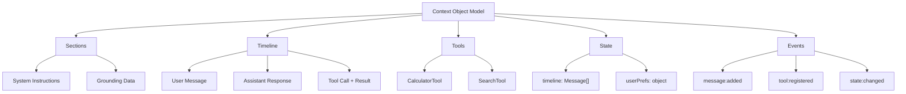

# Context Object Model (COM)

The browser has the DOM. AIDK has the **COM**—the Context Object Model.

## What Is the COM?

The COM is a **mutable state tree** that represents everything the model will see. Components don't return strings—they mutate the COM. Sections, timeline entries, tools, shared state—all nodes in a tree that gets compiled and sent to the model.



## Why COM Matters

The COM is what enables everything else in AIDK:

### 1. Separation of Concerns

Components don't format text—they declare structure. The renderer handles format conversion.

```tsx
// You declare structure
<Section audience="model">
  <H2>Current Cart</H2>
  <Table headers={['Item', 'Price']} rows={items} />
</Section>

// The renderer produces:
// ## Current Cart
// | Item | Price |
// | Widget | $10 |
```

### 2. Reactive State

State changes trigger re-renders. Components subscribe to COM state and react when it changes.

```tsx
class CartDisplay extends Component {
  // This signal is bound to COM state
  private cart = comState<Product[]>('cart', []);

  render() {
    // Automatically re-renders when cart changes
    return <Table rows={this.cart().map(p => [p.name, p.price])} />;
  }
}
```

### 3. Cross-Component Communication

Components share state through the COM without prop drilling.

```tsx
// Component A writes state
com.setState('searchResults', results);

// Component B reads state (reactively)
const results = watch<SearchResult[]>('searchResults');
```

### 4. Tool Integration

Tool results flow back through the COM, and components can react to them.

```tsx
onTickStart(com, state) {
  // Check if a tool was called
  const toolResults = state.current?.toolResults;
  if (toolResults?.some(r => r.name === 'search')) {
    this.hasSearched.set(true);
  }
}
```

## COM Sections

Sections are named content blocks that become system messages or grounding data.

```tsx
// Instructions for the model
<Section id="role" audience="model">
  You are a helpful shopping assistant.
</Section>

// Grounding data (positioned after system message)
<Grounding position="after-system" audience="model">
  <H3>Available Products</H3>
  <Table headers={['Name', 'Price']} rows={products} />
</Grounding>

// Content for users only (not sent to model)
<Section audience="user">
  Processing your request...
</Section>

// Content for both
<Section audience="all">
  Current time: {new Date().toISOString()}
</Section>
```

**Section merging**: Sections with the same `id` are merged. This prevents duplicate system prompts when components add to the same section across ticks.

## COM Timeline

The timeline is the conversation history—user messages, assistant responses, tool calls and results.

```tsx
// Reading timeline from previous response
onTickStart(com, state) {
  if (state.current?.timeline) {
    this.timeline.update(t => [...t, ...state.current.timeline]);
  }
}

// Rendering timeline
render() {
  return (
    <Timeline>
      {this.timeline().map(entry => (
        <Message key={entry.id} role={entry.message.role}>
          {entry.message.content}
        </Message>
      ))}
    </Timeline>
  );
}
```

### Timeline Entries

Each entry has a kind:

```typescript
type TimelineEntry =
  | { kind: 'message'; message: Message }
  | { kind: 'tool_call'; call: ToolCall }
  | { kind: 'tool_result'; result: ToolResult }
  | { kind: 'event'; event: TimelineEvent };
```

### Events in Timeline

Tell the model about things that happened outside the conversation:

```tsx
<Timeline>
  {messages}
  <Event eventType="user_action">
    User clicked "Checkout" button
  </Event>
  <Event eventType="system">
    Payment confirmed via Stripe
  </Event>
</Timeline>
```

## COM State

Shared state that persists across ticks and is accessible to all components.

### Writing State

```tsx
// Direct write
com.setState('key', value);

// Functional update
com.setState('count', prev => prev + 1);
```

### Reading State

```tsx
// Direct read (not reactive)
const value = com.getState<string>('key');

// Reactive read via signal
const value = watch<string>('key');
```

### State Signals

The preferred pattern is `comState` signals—they're reactive and automatically synced with the COM.

```tsx
class MyComponent extends Component {
  // Creates COM-bound signal
  private cart = comState<Product[]>('cart', []);

  addToCart(product: Product) {
    // Updates both signal AND COM state
    this.cart.update(c => [...c, product]);
  }

  render() {
    // Reactive—re-renders when cart changes
    return <CartDisplay items={this.cart()} />;
  }
}
```

### Signal Types Comparison

| Type | Scope | Persists? | Reactive? | Use Case |
|------|-------|-----------|-----------|----------|
| `signal()` | Component | Yes | Yes | Local component state |
| `comState()` | COM | Yes | Yes | Shared state across components |
| `watch()` | COM | N/A | Yes | Read-only observation |
| `computed()` | Derived | Yes | Yes | Derived values |

## COM Events

The COM emits events when mutations occur:

```tsx
// Subscribe to events
com.on('message:added', (message) => {
  console.log('New message:', message);
});

com.on('tool:registered', (tool) => {
  console.log('Tool registered:', tool.name);
});

com.on('state:changed', (key, value) => {
  console.log(`State ${key} changed:`, value);
});
```

This enables loose coupling—components can react to changes without direct dependencies.

## Tick Control

The COM provides process-like control over execution:

```tsx
// Request the tick loop to stop
com.requestStop();

// Request continuation even if model says stop
com.requestContinue();

// Check pending requests
const should = com.resolveTickControl(); // 'stop' | 'continue' | null
```

## COM in Lifecycle Hooks

The COM is available in all lifecycle hooks:

```tsx
class MyAgent extends Component {
  onMount(com) {
    // Initialize COM state
    com.setState('initialized', true);
  }

  onTickStart(com, state) {
    // Read previous response from state
    // Update COM based on it
  }

  render(com, state) {
    // Render to COM via JSX
    return <Section>...</Section>;
  }

  onAfterCompile(com, compiled, state) {
    // Inspect compiled output
    // Optionally request recompile
    if (compiled.tokenCount > 80000) {
      com.requestRecompile('context too large');
    }
  }

  onTickEnd(com, state) {
    // React to model response
    // Update COM state
  }

  onComplete(com, finalState) {
    // Cleanup, persist results
  }
}
```

## The DOM Analogy

If you understand the DOM, you understand the COM:

| DOM | COM |
|-----|-----|
| HTML elements | Sections, Messages, Tools |
| Document tree | Context tree |
| `getElementById` | `com.getState(key)` |
| Event listeners | `com.on(event, handler)` |
| `innerHTML` | Rendered context |
| Virtual DOM diffing | Fiber reconciliation |

The key difference: the DOM renders to pixels. The COM renders to model context.

## What's Next

- [Runtime Architecture](./runtime-architecture.md) — How the tick loop executes
- [Tick Lifecycle](./tick-lifecycle.md) — When each hook fires
- [State Management](../state-management.md) — Deep dive on signals
