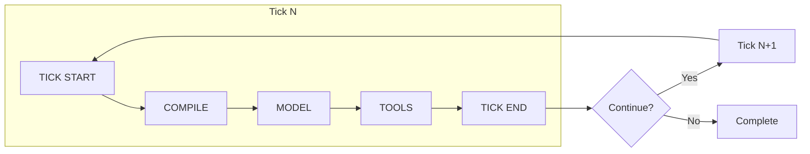

# Runtime Architecture

AIDK is not a template engine. It's not a prompt builder. It's a **runtime execution engine** for model-driven applications.

## The Core Insight

Most AI frameworks treat context generation as a one-shot operation: take some inputs, interpolate them into a template, call the model, done. If the model needs to call tools, you handle callbacks. If you need multiple turns, you loop externally.

AIDK takes a fundamentally different approach: **your code runs on every tick**, between model calls. The model responds, your components re-render, you see what happened, you decide what comes next. This isn't a callback—it's a render cycle.



## The Tick Loop

Each execution runs through discrete **ticks**. Each tick has five phases:

### Phase 1: Tick Start

Before rendering begins:

- Check abort signals
- Call `onTickStart` lifecycle hooks on all mounted components
- Components can react to the previous model response

```tsx
class MyAgent extends Component {
  private timeline = comState<COMTimelineEntry[]>('timeline', []);

  onTickStart(com, state) {
    // state.current contains the previous tick's model response
    if (state.current?.timeline?.length) {
      this.timeline.update(t => [...t, ...state.current.timeline]);
    }
  }
}
```

### Phase 2: Compilation

The JSX tree renders to a compiled structure:

- Components execute their `render()` methods
- The fiber reconciler tracks component instances across ticks
- State persists—components aren't recreated each tick
- The COM (Context Object Model) accumulates sections, timeline, tools

```tsx
render(com: COM, state: TickState) {
  const ctx = context();

  return (
    <>
      <AiSdkModel model={openai('gpt-5.2')} />
      <Timeline>{this.timeline()}</Timeline>
      <Section audience="model">
        You are helping {ctx.user.name}.
      </Section>
      <CalculatorTool />
    </>
  );
}
```

**Compile stabilization**: Components can inspect compiled output via `onAfterCompile` and request recompilation. This enables dynamic context management—like summarizing when context gets too large.

### Phase 3: Model Execution

The compiled context goes to the model:

- Sections become system/user messages
- Timeline becomes conversation history
- Tools become function definitions
- The renderer formats everything for the specific model (Markdown for some, XML for Claude, etc.)

Streaming is native—chunks flow as events through the execution handle.

### Phase 4: Tool Execution

If the model calls tools:

- Tools execute **in parallel** (not sequentially)
- Each tool can require confirmation independently
- Tool results feed back into the execution state
- Tools can render their own context (they're components too)

```tsx
const CalculatorTool = createTool({
  name: 'calculator',
  input: z.object({ expression: z.string() }),
  handler: async ({ expression }) => {
    return [{ type: 'text', text: String(eval(expression)) }];
  },

  // Tools can render context the model sees
  render(com) {
    const history = com.getState<string[]>('calcHistory') || [];
    return history.length > 0 ? (
      <Grounding title="Recent Calculations">
        {history.slice(-5).join('\n')}
      </Grounding>
    ) : null;
  }
});
```

### Phase 5: Tick End

After the model responds:

- Call `onTickEnd` lifecycle hooks
- Resolve tick control (should we continue or stop?)
- Components can request stop/continue
- State updates propagate

```tsx
onTickEnd(com, state) {
  // Check if we should stop
  if (state.current?.stopReason === 'stop') {
    com.requestStop();
  }

  // Or force continuation
  if (needsMoreWork) {
    com.requestContinue();
  }
}
```

## Why This Matters

### Prompt Rendering vs. Runtime Execution

| Prompt Rendering             | AIDK Runtime                    |
| ---------------------------- | ------------------------------- |
| One-shot context generation  | Continuous tick loop            |
| Stateless between calls      | Persistent component state      |
| External loop for multi-turn | Built-in tick iteration         |
| Callbacks for tool results   | Render cycle with results       |
| Template interpolation       | Fiber-based reconciliation      |
| Hope the output is right     | React to what actually happened |

### Your Code Runs Between Model Calls

This is the key insight. In traditional frameworks:

```python
# You configure
agent = Agent(system_prompt="...", tools=[...])
# Framework runs
result = agent.run(input)
# You get the result (maybe)
```

In AIDK:

```tsx
class MyAgent extends Component {
  // Your state persists across ticks
  private attempts = signal(0);

  onTickStart(com, state) {
    // You see what the model said
    const response = state.current?.timeline?.[0];

    // You decide what to do
    if (responseIsConfused(response)) {
      this.attempts.update(n => n + 1);
    }
  }

  render(com, state) {
    // You control what happens next
    if (this.attempts() > 3) {
      return <EscalationAgent />;  // Route to different agent
    }

    return (
      <>
        <AiSdkModel model={this.selectModel()} />  // Dynamic model selection
        <Timeline>{this.timeline()}</Timeline>
        {this.attempts() > 0 && (
          <Section audience="model">
            Previous attempts haven't worked. Try a different approach.
          </Section>
        )}
      </>
    );
  }
}
```

You're not configuring behavior and hoping it works. You're **programming** behavior that reacts to what actually happens.

## Beyond Agents: Model-Driven Applications

While "agent" is a common term, AIDK is designed for broader use. The tick-based architecture supports any model-driven application:

- **Conversational agents**: Multi-turn dialogue with tool use
- **Workflow automation**: Complex multi-step processes with decision points
- **Real-time applications**: As models get faster, tick rates increase
- **World model applications**: The same architecture scales to continuous model-driven systems

The framework doesn't assume you're building a chatbot. It provides primitives for any application where a model drives behavior and your code needs to react, adapt, and control the execution flow.

## Execution Control

### Stopping and Continuing

Components can influence tick control:

```tsx
// Request stop
com.requestStop();

// Request continue (even if model said stop)
com.requestContinue();

// Set max ticks
<Engine maxTicks={10} />
```

### Fork and Spawn

Run parallel executions:

```tsx
// Fork: Child inherits parent's abort signal
<Fork root={<ResearchAgent />} waitUntilComplete={true} />

// Spawn: Independent execution
<Spawn root={<BackgroundLogger />} />
```

### Messages During Execution

Send messages to running executions:

```tsx
const { handle } = await engine.execute.withHandle().call(input, <Agent />);

// Interrupt with new information
handle.sendMessage({
  role: 'user',
  content: [{ type: 'text', text: 'Actually, focus on security.' }]
});
```

## The Execution Handle

Every execution returns a handle for control and observability:

```tsx
const { handle, result } = await engine.execute.withHandle().call(input, <Agent />);

// Stream events
for await (const event of handle.stream()) {
  switch (event.type) {
    case 'tick_start': console.log(`Tick ${event.tick}`); break;
    case 'content_delta': process.stdout.write(event.delta); break;
    case 'tool_call': console.log(`Tool: ${event.name}`); break;
    case 'execution_end': console.log('Execution complete'); break;
  }
}

// Get metrics
const metrics = handle.getMetrics();
// { ticks: 3, modelCalls: 3, toolCalls: 5, tokens: 12000 }

// Get execution graph (for fork/spawn hierarchies)
const graph = handle.getExecutionGraph();
```

## What's Next

- [Context Object Model (COM)](./context-object-model.md) — The shared state tree that enables reactive programming
- [Tick Lifecycle](./tick-lifecycle.md) — Complete reference for lifecycle hooks
- [Tools as Components](../guides/tools.md) — Why tools are first-class components
