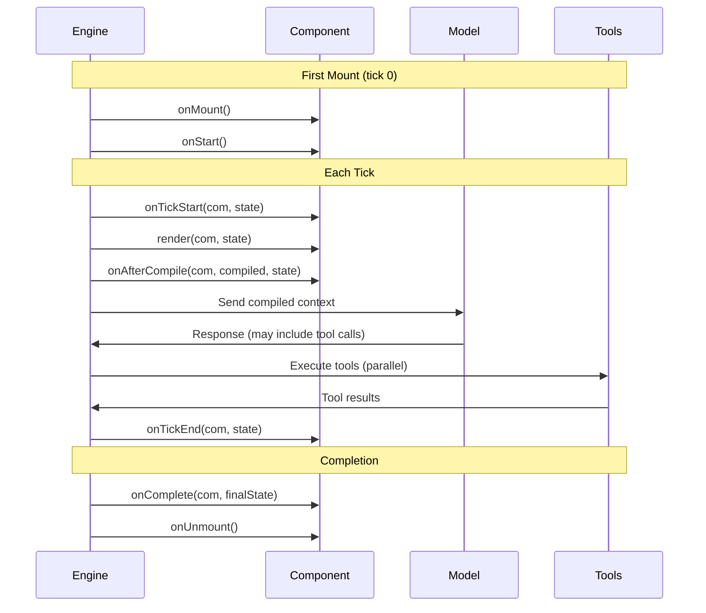

# Tick Lifecycle Reference

Every tick in AIDK follows a defined lifecycle. Understanding when each hook fires helps you put logic in the right place.

## Lifecycle Overview



## Hook Reference

### onMount

**When**: Component is first added to the tree (before first tick)

**Use for**:
- Loading initial data
- Setting up subscriptions
- Initializing COM state

```tsx
class MyAgent extends Component {
  private user = comState<User | null>('user', null);

  async onMount(com: COM) {
    const ctx = context();

    // Load data
    const user = await loadUser(ctx.user.id);
    this.user.set(user);

    // Subscribe to channels
    subscribeChannel('updates', this.handleUpdate);
  }

  onStart(com: COM) {
    if (!this.user()) {
      throw new Error('User not loaded');
    }
  }
}
```

**Note**: `onMount` is `async`—you can `await` operations.

---

### onTickStart

**When**: At the start of each tick, before render — **for components already in the tree**

**Arguments**:
- `com: COM` — The context object model
- `state: TickState` — Current tick state including previous response

**Use for**:
- Accumulating timeline from previous response
- Reacting to model output
- Preparing state for render

```tsx
onTickStart(com: COM, state: TickState) {
  // state.current contains previous tick's response
  if (state.current?.timeline?.length) {
    this.timeline.update(t => [...t, ...state.current.timeline]);
  }

  // Check what happened
  const lastMessage = state.current?.timeline?.[0];
  if (lastMessage?.message.role === 'assistant') {
    this.assistantResponded.set(true);
  }
}
```

**Important notes**:
- `state.tick` gives you the current tick number (1-indexed)
- **onTickStart does NOT fire for newly mounted components.** It only fires for components that already exist in the fiber tree when the tick starts. Newly mounted components receive `onMount` but not `onTickStart` on their first tick—they start receiving `onTickStart` from the next tick onwards.

---

### render

**When**: During compilation phase of each tick

**Arguments**:
- `com: COM` — The context object model
- `state: TickState` — Current tick state

**Returns**: JSX element tree

**Use for**:
- Building the context the model will see
- Conditional rendering based on state
- Composing child components

```tsx
render(com: COM, state: TickState) {
  const ctx = context();

  return (
    <>
      <AiSdkModel model={this.selectModel(state)} />
      <Timeline>{this.timeline()}</Timeline>

      <Section audience="model">
        You are helping {ctx.user.name}.
      </Section>

      {this.needsHelp() && <EscalationSection />}

      <CalculatorTool />
      <SearchTool />
    </>
  );
}
```

**Note**: `render` can be `async`—you can `await` data fetching.

---

### onAfterCompile

**When**: After render completes, before model call

**Arguments**:
- `com: COM` — The context object model
- `compiled: CompiledStructure` — The compiled output
- `state: TickState` — Current tick state

**Use for**:
- Inspecting compiled context (token counting, validation)
- Dynamic context management (summarization, truncation)
- Requesting recompilation

```tsx
onAfterCompile(com: COM, compiled: CompiledStructure, state: TickState) {
  const tokenCount = estimateTokens(compiled);

  if (tokenCount > 80000) {
    // Trigger context reduction
    const timeline = com.getTimeline();
    const summarized = summarizeOlder(timeline, 20);
    com.setTimeline(summarized);

    // Request recompile with new timeline
    com.requestRecompile('context-reduced');
  }
}
```

**Note**: `requestRecompile` triggers another render cycle. Use sparingly to avoid infinite loops.

---

### onTickEnd

**When**: After model responds and tools execute

**Arguments**:
- `com: COM` — The context object model
- `state: TickState` — Updated with current response

**Use for**:
- Processing model response
- Deciding whether to continue or stop
- Triggering side effects based on output

```tsx
onTickEnd(com: COM, state: TickState) {
  // Check stop reason
  if (state.current?.stopReason === 'stop') {
    com.requestStop();
    return;
  }

  // Check for tool calls
  const toolCalls = state.current?.toolCalls;
  if (toolCalls?.some(c => c.name === 'final_answer')) {
    com.requestStop();
  }

  // Log metrics
  const tokens = state.current?.usage?.totalTokens;
  this.totalTokens.update(t => t + (tokens || 0));
}
```

---

### onComplete

**When**: Execution finishes (all ticks done, stop requested, or max ticks)

**Arguments**:
- `com: COM` — Final COM state
- `finalState: TickState` — Final tick state

**Use for**:
- Persisting results
- Cleanup
- Sending final events

```tsx
async onComplete(com: COM, finalState: TickState) {
  const ctx = context();

  // Save conversation
  await saveConversation(ctx.user.id, this.timeline());

  // Publish completion event
  publishChannel('execution', {
    type: 'completed',
    ticks: finalState.tick,
    output: finalState.current
  });
}
```

---

### onUnmount

**When**: Component is removed from tree

**Use for**:
- Cleanup subscriptions
- Disposing resources
- Final state persistence

```tsx
onUnmount(com: COM) {
  // Cleanup subscriptions
  unsubscribeChannel('updates', this.handleUpdate);

  // Dispose signals
  this.timeline.dispose();
}
```

---

### onError

**When**: An error occurs during execution

**Arguments**:
- `com: COM` — The context object model
- `state: TickState` — State at time of error (includes `state.error`)

**Returns**: Recovery action or void

**Use for**:
- Error recovery decisions
- Graceful degradation
- Error logging

```tsx
class MyAgent extends Component {
  private toolFailed = comState<boolean>('toolFailed', false);

  onError(com: COM, state: TickState) {
    const error = state.error;

    // Log error
    console.error('Execution error:', error);

    // Decide recovery
    if (error?.phase === 'tool_execution' && error?.recoverable) {
      this.toolFailed.set(true);
      return {
        continue: true,
        recoveryMessage: 'Tool failed, continuing without result',
      };
    }

    // Don't recover—propagate error
    return { continue: false };
  }
}
```

---

### onMessage

**When**: A message is sent to the running execution

**Arguments**:
- `com: COM` — The context object model
- `message: Message` — The incoming message
- `state: TickState` — Current state

**Use for**:
- Handling user interrupts
- Processing real-time feedback
- Dynamic context injection

```tsx
onMessage(com: COM, message: Message, state: TickState) {
  // Check message type
  const text = message.content.find(b => b.type === 'text')?.text;

  if (text?.includes('stop')) {
    com.requestStop();
    return;
  }

  // Add to context for next render
  this.userFeedback.set(text);
}
```

## Hooks in Function Components

Function components use hook functions instead of methods:

```tsx
function MyAgent(props, com: COM, state: TickState) {
  const timeline = useComState<COMTimelineEntry[]>('timeline', []);
  const attempts = useSignal(0);

  // Equivalent to onMount
  useOnMount(() => {
    console.log('Mounted');
  });

  // Equivalent to onTickStart
  useTickStart((com, state) => {
    if (state.current?.timeline) {
      timeline.update(t => [...t, ...state.current.timeline]);
    }
  });

  // Equivalent to onTickEnd
  useTickEnd((com, state) => {
    attempts.update(n => n + 1);
  });

  // Equivalent to onAfterCompile
  useAfterCompile((com, compiled, state) => {
    if (estimateTokens(compiled) > 80000) {
      com.requestRecompile('too large');
    }
  });

  // Equivalent to onMessage
  useOnMessage((com, message, state) => {
    console.log('Received:', message);
  });

  // render is the return value
  return (
    <>
      <AiSdkModel model={openai('gpt-4o')} />
      <Timeline>{timeline()}</Timeline>
    </>
  );
}
```

## Async Hooks

Unlike React, AIDK hooks are **async-first**. You can `await` inside any hook:

```tsx
class MyAgent extends Component {
  private data = comState<any>('data', null);
  private enriched = comState<any>('enriched', null);

  async onMount(com: COM) {
    const data = await fetch('/api/data').then(r => r.json());
    this.data.set(data);
  }

  async onTickStart(com: COM, state: TickState) {
    const enriched = await enrichData(state.current);
    this.enriched.set(enriched);
  }
}
```

This is because there's no UI thread to block. The engine awaits your hooks before continuing.

## Tick State Shape

The `state` argument contains:

```typescript
interface TickState {
  tick: number;              // Current tick number (1-indexed)
  previous?: COMInput;       // Input from previous tick
  current?: COMOutput;       // Output from current tick (after model)
  error?: ExecutionError;    // Error if one occurred
  queuedMessages: Message[]; // Messages received during execution
  stop: () => void;          // Request stop
}
```

After model execution, `state.current` contains:

```typescript
interface COMOutput {
  timeline: TimelineEntry[];    // New messages/tool calls
  stopReason: StopReason;       // 'stop' | 'tool_call' | 'max_tokens' | etc.
  usage?: TokenUsage;           // Token counts
  toolCalls?: ToolCall[];       // Tool calls made
  toolResults?: ToolResult[];   // Tool results received
}
```

## Execution Order Summary

| Order | Hook | Fires |
|-------|------|-------|
| 1 | `onMount` | Once, when component added |
| 2 | `onStart` | Once, before first tick (engine-level) |
| 3 | `onTickStart` | Every tick, before render (existing components only) |
| 4 | `render` | Every tick |
| 5 | `onAfterCompile` | Every tick, after render |
| 6 | `onTickEnd` | Every tick, after model |
| 7 | `onComplete` | Once, when execution ends |
| 8 | `onUnmount` | Once, when component removed |

`onError` and `onMessage` fire as needed, outside the normal tick flow.

### First Mount vs Subsequent Ticks

| Hook | First Mount (Tick N) | Subsequent Ticks |
|------|---------------------|------------------|
| `onMount` | ✓ | — |
| `onTickStart` | — (not called) | ✓ |
| `render` | ✓ | ✓ |
| `onTickEnd` | ✓ | ✓ |

**Why this matters**: If you need to process `state.current` on the component's first tick, use `render()` or `onTickEnd()` instead of `onTickStart()`. Alternatively, handle initial state in `onMount()` before render.

## What's Next

- [Runtime Architecture](./runtime-architecture.md) — How the tick loop works
- [Context Object Model](./context-object-model.md) — The shared state tree
- [State Management](../state-management.md) — Signals and reactive state
