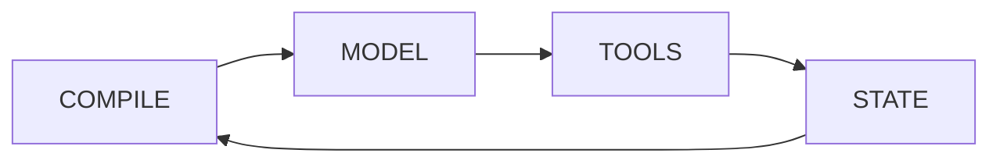

<p align="center" style="margin: 2rem 0;">
  
</p>

<p align="center" style="font-size: 1.2rem; color: var(--vp-c-text-2); margin-bottom: 2rem;">
  <strong>A JSX runtime engine for model-driven applications.</strong><br/>
</p>

## Not a template system. A runtime.

AIDK is a **runtime execution engine**—not a prompt builder, not a template system. It manages component lifecycle, shared state, and tick loops. Your code runs _between_ model calls, with full visibility into what happened and complete control over what comes next.



Each execution runs through discrete **ticks**. Each tick: compile your JSX components, call the model, execute tools, update state, repeat. Your components persist across ticks. State accumulates. You're not configuring an agent—you're **programming** one.

## The Core Insight

Most agent frameworks ask you to describe what you want, then hope the runtime figures it out. You write YAML. You configure state machines. You connect nodes in a graph. And when it doesn't work, you're debugging someone else's abstractions.

AIDK is different. **Your code runs on every tick.** The model responds, your components re-render, you see what happened, you decide what comes next. No graphs. No state machines. No configuration files.

Just like frontend code doesn't just "render UI"—it manages state, handles events, orchestrates data, and defines how the application behaves—your agent code doesn't just build context. It defines execution logic. It reacts to model output. It manages state across ticks. It decides when to stop, when to fork, when to swap models. **You're in control of the loop.**

```tsx
// Use signals for state management
private timeline = comState<COMTimelineEntry[]>('timeline', []);

onTickStart(com, state) {
  // Accumulate new entries from model response
  if (state.current?.timeline?.length) {
    this.timeline.update(t => [...t, ...state.current.timeline]);
  }
}

async render(com: COM, state: TickState) {
  const ctx = context();  // User, auth, metadata—available everywhere
  const lastResponse = state.current?.timeline?.[0];
  const tokenCount = await estimateTokens(this.timeline());

  return (
    <>
      {/* React to response quality—upgrade model if needed */}
      <AiSdkModel model={await selectModel(lastResponse)} />

      {/* React to context size—summarize if too large */}
      <Timeline>{tokenCount > 80000 ? await summarize(this.timeline()) : this.timeline()}</Timeline>

      {/* React to user tier—enable tools conditionally */}
      <Section audience="model">
        <UserInstructions tier={ctx.user.tier} />
      </Section>
      {ctx.user.canUseAdvancedTools && <AdvancedTools />}
    </>
  );
}
```

Your agent is a component. It renders before every model call. You see what happened. You decide what comes next. **This is programming.**

AIDK is a **context engineering framework**—a platform for building applications where humans and models collaborate on the same components, each seeing the information in their native format.

## Quick Links

- [Getting Started](./getting-started.md) - Build your first agent in 5 minutes
- [Runtime Architecture](./concepts/runtime-architecture.md) - Understand the tick loop
- [Context Object Model](./concepts/context-object-model.md) - The shared state tree (like DOM for AI)
- [Tick Lifecycle](./concepts/tick-lifecycle.md) - Complete hook reference
- [State Management](./state-management.md) - Signals and reactive state
- [Examples](https://github.com/rlindgren/aidk/tree/master/example) - Working applications

---

## What AIDK Does

### Re-render on every tick.

Your agent isn't a static configuration. It's a component that renders before every model call. The model responds, your component runs again, you render the next context.

```tsx
class AdaptiveAgent extends Component {
  // Use comState for timeline - persists across ticks
  private timeline = comState<COMTimelineEntry[]>("timeline", []);

  onTickStart(com, state) {
    if (state.current?.timeline?.length) {
      this.timeline.update((t) => [...t, ...state.current.timeline]);
    }
  }

  render(com: COM, state: TickState) {
    const responseQuality = analyzeResponse(state.current);

    // Change strategy based on what's happening
    if (responseQuality === "confused") {
      return (
        <>
          <AiSdkModel model={openai("gpt-4o")} /> {/* Upgrade */}
          <Section audience="model">
            Let's slow down. Break this into smaller steps.
          </Section>
          <Timeline>{this.timeline()}</Timeline>
        </>
      );
    }

    return (
      <>
        <AiSdkModel model={openai("gpt-4o-mini")} />
        <Timeline>{this.timeline()}</Timeline>
        <Section audience="model">Be concise.</Section>
      </>
    );
  }
}
```

### Context available everywhere.

No passing context objects through every function. `context()` returns the execution context anywhere in your code—components, tools, services, utilities.

```tsx
// In your agent
render(com: COM, state: TickState) {
  const ctx = context();
  return <>{ctx.user.isAdmin && <AdminTools />}</>;
}

// In a tool handler
async function handleTool(input: ToolInput) {
  const ctx = context();  // Same context, automatically available
  await logAudit(ctx.user.id, 'tool_used', input);
  return result;
}

// In a service
class OrderService {
  async createOrder(items: Item[]) {
    const ctx = context();  // Still there
    return await db.orders.create({
      userId: ctx.user.id,
      tenantId: ctx.metadata.tenantId,
      items,
    });
  }
}
```

Built on async local storage. The context follows execution automatically.

### Reactive state with signals.

Manage state with signals—a reactive primitive inspired by Angular and SolidJS:

```tsx
class MyAgent extends Component {
  // Local state - component-only
  private startedAt = signal(new Date());

  // COM state - shared across components, persisted across ticks
  private timeline = comState<COMTimelineEntry[]>("timeline", []);

  // Derived state - memoized, auto-updates
  private messageCount = computed(() => this.timeline().length);

  onTickStart(com, state) {
    // Append new entries from model response
    if (state.current?.timeline?.length) {
      this.timeline.update((t) => [...t, ...state.current.timeline]);
    }
  }

  render() {
    return (
      <>
        <Timeline>{this.timeline()}</Timeline>
        <Section audience="user">Messages: {this.messageCount()}</Section>
      </>
    );
  }
}
```

Signals are automatically cleaned up on unmount. No memory leaks. No manual subscription management. See [State Management](./state-management.md) for details.

### Tools are components.

A tool isn't just a function that executes. It's a component that can render context, maintain state, and update in real-time.

```tsx
class Scratchpad extends Component {
  static tool = scratchpadTool; // Registered automatically on mount

  // Use comState for notes - persists across ticks
  private notes = comState<Note[]>("notes", []);

  async onMount(com: COM) {
    const ctx = context();
    const loaded = await loadNotes(ctx.metadata.threadId);
    this.notes.set(loaded);
  }

  render(com: COM) {
    const notes = this.notes();

    return (
      <>
        <Section id="scratchpad" audience="model">
          You have a scratchpad for notes. Current contents:
        </Section>
        <Grounding position="after-system" audience="model">
          {notes.length === 0 ? (
            <Paragraph>No notes yet.</Paragraph>
          ) : (
            <List ordered>
              {notes.map((n) => (
                <ListItem key={n.id}>{n.text}</ListItem>
              ))}
            </List>
          )}
        </Grounding>
      </>
    );
  }
}
```

The model sees the notes. The user sees the notes (via channels). They update together. One source of truth.

### Build context with JSX, not templates.

Forget Jinja. Forget string interpolation. Build your entire context with typed components:

```tsx
// State managed with signals
private timeline = comState<COMTimelineEntry[]>('timeline', []);
private cart = comState<Product[]>('cart', []);

onTickStart(com, state) {
  if (state.current?.timeline?.length) {
    this.timeline.update(t => [...t, ...state.current.timeline]);
  }
}

render(com: COM, state: TickState) {
  const user = context().user;
  const products = this.cart();

  return (
    <>
      <AiSdkModel model={openai('gpt-4o')} />
      <Timeline>{this.timeline()}</Timeline>

      <Section id="instructions" audience="model">
        <H2>Your Role</H2>
        <Paragraph>
          You are a shopping assistant for <strong>{user.name}</strong>.
        </Paragraph>

        <H2>Current Cart</H2>
        {products?.length > 0 ? (
          <Table
            headers={['Product', 'Price', 'Qty']}
            rows={products.map(p => [p.name, `$${p.price}`, String(p.qty)])}
          />
        ) : (
          <Paragraph><em>Cart is empty</em></Paragraph>
        )}

        <H2>Available Actions</H2>
        <List ordered>
          <ListItem>Add items with <inlineCode>add_to_cart</inlineCode></ListItem>
          <ListItem>Remove items with <inlineCode>remove_from_cart</inlineCode></ListItem>
          <ListItem>Check out with <inlineCode>checkout</inlineCode></ListItem>
        </List>
      </Section>

      {/* Multimodal content */}
      <Message role="user">
        <Text>What do you think of this product?</Text>
        <Image source={{ type: 'url', url: productImageUrl }} altText="Product photo" />
      </Message>

      {/* Code examples for the model */}
      <Grounding position="after-system" audience="model">
        <Paragraph>Example API response format:</Paragraph>
        <Code language="json">{`{ "action": "add_to_cart", "product_id": "123" }`}</Code>
      </Grounding>
    </>
  );
}
```

**Semantic primitives:** `H1`, `H2`, `H3`, `Paragraph`, `List`, `ListItem`, `Table`, `Row`, `Column`

**Inline formatting:** `<strong>`, `<em>`, `<inlineCode>`, `<mark>`, `<u>`, `<s>`, `<del>`, `<sub>`, `<sup>`

**Content blocks:** `Text`, `Image`, `Document`, `Audio`, `Video`, `Code`, `Json`

**Renderers:** `<markdown>` wrapper auto-formats semantic blocks

All typed. All composable. All reactive.

### Client tools with real results.

Define tools that execute on the client and wait for the response. True human-in-the-loop.

```tsx
// Define a tool that needs user confirmation
const confirmTool = createTool({
  name: "confirm_action",
  description: "Ask the user to confirm",
  input: z.object({ message: z.string() }),
  executionType: ToolExecutionType.CLIENT,
  requiresResponse: true,
  timeout: 60000,
});

// On the client
client.on("tool_call", async (call) => {
  if (call.name === "confirm_action") {
    const confirmed = await showDialog(call.input.message);
    await client.sendToolResult(call.id, { confirmed });
  }
});
```

The model asks. The user answers. Execution continues with the answer. No polling. No webhooks.

### MCP tools, filtered and prefixed.

Connect to MCP servers. Choose which tools to expose. Prefix names to avoid conflicts.

```tsx
<MCPTool
  server="filesystem"
  config={{ command: 'npx', args: ['-y', '@modelcontextprotocol/server-filesystem', '/data'] }}
  include={['read_file', 'list_directory']}  // Only these
  toolPrefix="fs_"  // fs_read_file, fs_list_directory
/>

<MCPTool
  server="github"
  config={{ command: 'npx', args: ['-y', '@modelcontextprotocol/server-github'] }}
  runtimeConfig={{
    auth: { type: 'bearer', token: context().user.githubToken }
  }}
  exclude={['delete_repository']}  // Not this one
/>
```

### Fork and spawn execution.

Parallel work, background tasks, coordinated results.

```tsx
private timeline = comState<COMTimelineEntry[]>('timeline', []);
private marketData = comState<any>('market', null);
private competitorData = comState<any>('competitors', null);

onTickStart(com, state) {
  if (state.current?.timeline?.length) {
    this.timeline.update(t => [...t, ...state.current.timeline]);
  }
}

render(com: COM, state: TickState) {
  return (
    <>
      <AiSdkModel model={openai('gpt-4o')} />
      <Timeline>{this.timeline()}</Timeline>

      {/* Parallel research, wait for both */}
      <Fork
        root={<ResearchAgent topic="market" />}
        waitUntilComplete={true}
        onComplete={(r) => this.marketData.set(r)}
      />
      <Fork
        root={<ResearchAgent topic="competitors" />}
        waitUntilComplete={true}
        onComplete={(r) => this.competitorData.set(r)}
      />

      {/* Background work, don't wait */}
      <Spawn root={<AuditLogger />} />
    </>
  );
}
```

### Manage context size dynamically.

See what's about to go to the model. React to it.

```tsx
class ContextManager extends Component {
  onAfterCompile(com: COM, compiled: CompiledStructure) {
    const tokens = estimateTokens(compiled);

    if (tokens > 80000) {
      const timeline = com.getTimeline();
      const summarized = summarizeOlderMessages(timeline, 20);
      com.setTimeline(summarized);
      com.requestRecompile("context-reduced");
    }
  }

  render() {
    return null;
  }
}
```

### Events in the timeline.

Tell the model what's happening beyond the conversation.

```tsx
<Timeline>
  {messages.map((m) => (
    <Message key={m.id} {...m} />
  ))}

  <Event eventType="user_action">
    <UserAction action="checkout" actor="user">
      Clicked checkout. Cart total: $149.00
    </UserAction>
  </Event>

  <Event eventType="system">
    <SystemEvent event="payment_success" source="stripe">
      Payment confirmed.
    </SystemEvent>
  </Event>
</Timeline>
```

### Full lifecycle hooks.

Insert your logic at every stage.

```tsx
class MyAgent extends Component {
  onMount(com) {} // Component added to tree
  onStart(com) {} // Before first tick
  onTickStart(com, state) {} // Before each render
  render(com, state) {} // Build context for model
  onAfterCompile(com, compiled, state, ctx) {} // Inspect/modify compiled output
  onTickEnd(com, state) {} // After model responds
  onMessage(com, message, state) {} // Handle messages sent to running execution
  onComplete(com, finalState) {} // Execution finished
  onUnmount(com) {} // Component removed
  onError(com, state) {} // Handle errors, optionally recover
}
```

---

## The Philosophy

### Context is a User Interface—for the model

UI frameworks build User Interfaces. AIDK builds **Model Interfaces**.

A User Interface presents information to humans in formats native to them: buttons, forms, text, images. A Model Interface presents information to LLMs in formats native to them: messages, sections, tool definitions, structured content.

AIDK bridges both. State flows from the server to both audiences—the model sees it as context, the user sees it as UI. Different components, same source of truth.

```tsx
// Server: AIDK component renders context for the model
class Scratchpad extends Component {
  private notes = comState<Note[]>("notes", []);

  render(com: COM) {
    const noteList = this.notes();

    return (
      <Section audience="model">
        <Paragraph>The user has {noteList.length} notes:</Paragraph>
        <List>
          {noteList.map((n) => (
            <ListItem key={n.id}>{n.text}</ListItem>
          ))}
        </List>
      </Section>
    );
  }
}

// Client: React component renders UI for the user
function ScratchpadUI() {
  const notes = useChannel<Note[]>("notes", []);

  return (
    <ul>
      {notes.map((n) => <li key={n.id}>{n.text}</li>)}
    </ul>
  );
}

// Same state, two renderings—one for the model, one for the user
```

This is **context engineering**—the discipline of crafting what the model sees. AIDK gives you the tools to do it programmatically, reactively, and at scale.

### The Context Object Model

The browser has the DOM. AIDK has the **COM**—the Context Object Model.

Your components don't build strings. They mutate a structured object that represents what the model will see. Sections, messages, tools, timeline entries—all nodes in a tree. The engine compiles the tree, renders it to the model's format, executes, and your components run again with the result.

```tsx
// Components mutate the COM, like React components mutate the virtual DOM
// State is managed via comState (class) or useComState (functional)
private processingStep = comState<number>('processingStep', 0);

render(com: COM, state: TickState) {
  this.processingStep.set(3);                  // State lives in the COM

  return (
    <>
      <Section audience="model">...</Section>   {/* Adds a section node */}
      <Timeline>{messages}</Timeline>           {/* Adds timeline nodes */}
      <CalculatorTool />                        {/* Registers a tool */}
    </>
  );
}
```

This isn't a metaphor. It's the architecture. And it's why everything else works.

### Components all the way down

Components aren't flat. They nest. They compose. They form trees.

```tsx
// An agent is a component
class CustomerServiceAgent extends Component {
  private timeline = comState<COMTimelineEntry[]>("timeline", []);
  private customer = comState<Customer | null>("customer", null);
  private needsEscalation = signal(false);

  onTickStart(com, state) {
    if (state.current?.timeline?.length) {
      this.timeline.update((t) => [...t, ...state.current.timeline]);
    }
  }

  render(com, state) {
    return (
      <>
        <AiSdkModel model={openai("gpt-4o")} />
        <Timeline>{this.timeline()}</Timeline>

        {/* Tools are components */}
        <OrderLookup />
        <RefundProcessor />

        {/* Sections are components */}
        <CustomerContext customer={this.customer()} />

        {/* Other agents are components */}
        {this.needsEscalation() && <EscalationAgent />}
      </>
    );
  }
}
```

Every component in that tree:

- Has its own `render()` that contributes to the context
- Has lifecycle hooks (`onMount`, `onTickStart`, `onComplete`, etc.)
- Can read and write to the COM
- Can access `context()` for execution context
- Can respond to state changes and events

Build a tool once, use it in any agent. Build a context section once, compose it anywhere. Build an agent, render it from another agent.

### Agents rendering agents

Routing isn't configuration. It's rendering.

```tsx
class OrchestratorAgent extends Component {
  private detectedIntent = comState<string | null>("detectedIntent", null);

  render(com: COM, state: TickState) {
    const intent = this.detectedIntent();

    // Route by rendering the appropriate agent
    switch (intent) {
      case "billing":
        return <BillingAgent />;
      case "technical":
        return <TechnicalSupportAgent />;
      case "sales":
        return <SalesAgent />;
      default:
        return (
          <TriageAgent onIntentDetected={(i) => this.detectedIntent.set(i)} />
        );
    }
  }
}
```

No router configuration. No intent mapping files. The orchestrator IS the routing logic. It runs every tick. It can change its mind. It can escalate. It can fall back. It's just code.

```tsx
// Multi-agent coordination is just rendering
class ResearchCoordinator extends Component {
  private phase = comState<string>("phase", "gather");
  private webResults = comState<any>("web", null);
  private dbResults = comState<any>("db", null);
  private apiResults = comState<any>("api", null);
  private sources = comState<any>("sources", null);
  private report = comState<any>("report", null);

  render(com: COM, state: TickState) {
    if (this.phase() === "gather") {
      return (
        <>
          {/* Parallel research agents */}
          <Fork
            root={<WebResearchAgent />}
            onComplete={(r) => this.webResults.set(r)}
          />
          <Fork
            root={<DatabaseAgent />}
            onComplete={(r) => this.dbResults.set(r)}
          />
          <Fork
            root={<APIAgent />}
            onComplete={(r) => this.apiResults.set(r)}
          />
        </>
      );
    }

    if (this.phase() === "synthesize") {
      return <SynthesisAgent sources={this.sources()} />;
    }

    return <DeliveryAgent report={this.report()} />;
  }
}
```

### Reusable across everything

The same component works everywhere:

```tsx
// A reusable context component
class UserProfile extends Component {
  render(com: COM) {
    const user = context().user;
    return (
      <Section id="user-profile" audience="model">
        <Paragraph>Current user: {user.name} ({user.email})</Paragraph>
        <Paragraph>Account tier: {user.tier}</Paragraph>
        <Paragraph>Member since: {user.createdAt}</Paragraph>
      </Section>
    );
  }
}

// Use it in any agent
<CustomerServiceAgent>
  <UserProfile />
  <OrderHistory />
</CustomerServiceAgent>

<SalesAgent>
  <UserProfile />
  <RecommendationEngine />
</SalesAgent>

<AdminAgent>
  <UserProfile />
  <AuditLog />
</AdminAgent>
```

Build once. Compose anywhere. This is the React model applied to AI agents.

### No prompt templates

Other frameworks:

```python
prompt = PromptTemplate("""
You are a {role} assistant.
The user's name is {user_name}.

- {{ item.name }}: ${{ item.price }}

""")
```

AIDK:

```tsx
<Section audience="model">
  <Paragraph>You are a {role} assistant.</Paragraph>
  <Paragraph>The user's name is {user.name}.</Paragraph>
  <Table
    headers={["Item", "Price"]}
    rows={cart.map((i) => [i.name, `$${i.price}`])}
  />
</Section>
```

Templates are strings with holes. Components are typed, composable, testable code. You can refactor them. You can unit test them. Your IDE understands them.

### Streaming is the API

Other frameworks add streaming as an option:

```python
# The "normal" way
result = agent.run(input)

# The streaming way (different API, different handling)
for chunk in agent.stream(input):
    handle(chunk)
```

AIDK: streaming is the primitive. Everything flows through it.

```tsx
// Pure streaming — iterate events
for await (const event of engine.stream(input, <Agent />)) {
  // tick_start, content_delta, tool_call, tick_end, complete
}

// Pure result — just get the output
const result = await engine.execute(input, <Agent />);
```

### The execution handle

Sometimes you want both: subscribe to events AND get the final result. Use `.withHandle()`:

```tsx
const { handle, result } = await engine.execute
  .withContext({ user, tenantId, metadata })
  .withHandle()
  .run(input, <Agent />);

// Subscribe to events as they happen
handle.on('tick_start', (e) => console.log(`Tick ${e.tick} started`));
handle.on('content_delta', (e) => process.stdout.write(e.delta));
handle.on('tool_call', (e) => console.log(`Tool: ${e.name}`));
handle.on('error', (e) => console.error(e));

// Also await the final result
const output = await result;
console.log('Done:', output);
```

### Fluent execution API

Chain modifiers for full control:

```tsx
const { handle, result } = await engine.execute
  .use(loggingMiddleware)           // Per-call middleware
  .use(rateLimitMiddleware)         // Stack them
  .withContext({                    // Execution context
    userId: user.id,
    tenantId: tenant.id,
    threadId: thread.id,
    metadata: { source: 'api' },
  })
  .withHandle()                     // Return handle + result
  .run(input, <TaskAssistant />);   // Execute
```

### Direct model and tool calls

Models and tools are Procedures. They have the same fluent API:

```tsx
import { createAiSdkModel } from "aidk-ai-sdk";
import { openai } from "@ai-sdk/openai";

const model = createAiSdkModel({ model: openai("gpt-4o") });

// Direct model call with handle
const { handle, result } = model.generate
  .withContext({ userId })
  .withHandle()
  .run({
    messages: [{ role: "user", content: [{ type: "text", text: "Hello" }] }],
  });

handle.events.on("chunk", (chunk) => stream.write(chunk.delta));
const response = await result;

// Direct tool call with the same pattern
const { handle: toolHandle, result: toolResult } = Calculator.run
  .withContext({ userId })
  .withHandle()
  .run({ expression: "2 + 2" });

toolHandle.events.on("complete", () => console.log("Tool finished"));
const answer = await toolResult;

// Or just call directly
const answer = await Calculator.run({ expression: "2 + 2" });
```

Events flow. Your client connects. Updates stream in real-time. This isn't a feature—it's how the engine works.

### Programmatic model instances

Create model instances outside of JSX. Call them directly with the full Procedure API.

```tsx
import { createAiSdkModel } from 'aidk-ai-sdk';
import { openai } from '@ai-sdk/openai';

// Create a reusable model instance
const gpt4 = createAiSdkModel({ model: openai('gpt-4o') });

// Direct call
const response = await gpt4.generate({
  messages: [{ role: 'user', content: [{ type: 'text', text: 'Summarize this' }] }],
  tools: [summarizeTool],
});

// With handle (subscribe to events AND get result)
const { handle, result } = gpt4.generate
  .withHandle()
  .run({ messages });

handle.events.on('chunk', (chunk) => process.stdout.write(chunk.delta));
const output = await result;

// With context
const response = await gpt4.generate
  .withContext({ userId: 'user-123' })
  .run({ messages });

// Stream directly
const stream = await gpt4.stream({ messages });
for await (const chunk of stream) {
  process.stdout.write(chunk.delta);
}

// Use it in JSX
<Model model={gpt4} />
```

### Global middleware

Set middleware at the engine level. It runs for every execution, model call, or tool call.

```tsx
const engine = createEngine({
  middleware: {
    // Runs on every agent execution
    execute: [loggingMiddleware, authMiddleware, rateLimitMiddleware],
    // Runs on every model call
    model: [tokenCountingMiddleware, cacheMiddleware, retryMiddleware],
    // Runs on every tool call
    tool: [auditMiddleware, validationMiddleware],
  },
});

// Or add middleware after creation
engine.use("execute", telemetryMiddleware);
engine.use("model", costTrackingMiddleware);
engine.use("tool", sandboxMiddleware);
```

Per-call middleware stacks on top:

```tsx
// Global middleware + per-call middleware
const result = await engine.execute
  .use(requestSpecificMiddleware)  // Added for this call only
  .run(input, <Agent />);
```

### One engine or many

Run one engine for your whole application:

```tsx
// Singleton engine for your app
export const engine = createEngine({ middleware: {...} });

// All requests share it
app.post('/chat', (req, res) => {
  engine.stream(req.body, <ChatAgent />);
});
```

Or create engines for isolated execution:

```tsx
// One-off engine for a specific task
const isolatedEngine = createEngine({
  middleware: { execute: [specialMiddleware] },
});

const result = await isolatedEngine.execute(input, <OneOffAgent />);
```

### Programmatic fork and spawn

Use JSX or call directly:

```tsx
// JSX style
<Fork root={<ResearchAgent />} waitUntilComplete={true} onComplete={(r) => {...}} />
<Spawn root={<BackgroundAgent />} />

// Programmatic style
const forkedHandle = await engine.fork(
  <ResearchAgent />,
  { query: 'market analysis' },
  { inherit: { context: true } }
);

const spawnedHandle = await engine.spawn(
  <BackgroundAgent />,
  { task: 'cleanup' }
);
```

### Send messages to running executions

Send messages to running executions and handle them in your agent:

```tsx
const { handle } = await engine.execute
  .withHandle()
  .run(input, <InteractiveAgent />);

// Send a message to the running execution
await handle.sendMessage({
  role: 'user',
  content: [{ type: 'text', text: 'Actually, focus on security instead' }],
});

// Or send control signals
handle.emitSignal('interrupt', 'User requested pause');
handle.emitSignal('resume', 'Continue execution');
```

The agent receives messages via the `onMessage` lifecycle hook:

```tsx
class InteractiveAgent extends Component {
  private userFeedback = comState<string | null>('userFeedback', null);

  onMessage(com, message, state) {
    // Handle incoming messages during execution
    if (message.role === 'user') {
      const text = message.content.find(b => b.type === 'text')?.text;
      if (text) {
        this.userFeedback.set(text);
      }
    }
  }

  render(com, state) {
    return (
      <>
        <Model model={openai('gpt-4o')} />
        <System>You are a helpful assistant.</System>

        {this.userFeedback() && (
          <Grounding title="User Feedback">
            {this.userFeedback()}
          </Grounding>
        )}

        <Timeline>{/* ... */}</Timeline>
      </>
    );
  }
}
```

### Trace the execution graph

See how agents, forks, and spawns relate:

```tsx
const { handle, result } = await engine.execute
  .withHandle()
  .run(input, <OrchestratorAgent />);

handle.on('fork', (e) => {
  console.log(`Forked: ${e.forkId} from ${e.parentId}`);
});

handle.on('spawn', (e) => {
  console.log(`Spawned: ${e.spawnId}`);
});

const output = await result;

// Get the full execution graph
const graph = handle.getExecutionGraph();
console.log(graph);
// {
//   root: { id: 'exec-1', agent: 'OrchestratorAgent', children: [...] },
//   forks: [{ id: 'fork-1', parent: 'exec-1', agent: 'ResearchAgent' }],
//   spawns: [{ id: 'spawn-1', agent: 'AuditLogger' }],
// }
```

### OpenTelemetry integration

Plug in your OTel provider. Every tick, model call, and tool call becomes a span.

```tsx
import { NodeTracerProvider } from "@opentelemetry/sdk-trace-node";
import { OTLPTraceExporter } from "@opentelemetry/exporter-trace-otlp-http";

const provider = new NodeTracerProvider();
provider.addSpanProcessor(new BatchSpanProcessor(new OTLPTraceExporter()));
provider.register();

const engine = createEngine({
  telemetry: {
    provider,
    // What to trace
    traceExecutions: true,
    traceModelCalls: true,
    traceToolCalls: true,
    traceLifecycle: true,
    // What to record
    recordTokenUsage: true,
    recordLatency: true,
    recordErrors: true,
  },
});
```

Spans include:

- Execution ID, tick number, agent name
- Model calls with token counts, latency, cost
- Tool calls with input/output, duration
- Errors with full context
- Parent-child relationships for forks/spawns

```
[execution:start] OrchestratorAgent
  └─[tick:1]
      ├─[model:call] gpt-4o (tokens: 1234, latency: 850ms)
      └─[tool:call] search_orders (duration: 120ms)
  └─[tick:2]
      └─[fork:start] ResearchAgent
          └─[tick:1]
              └─[model:call] gpt-4o-mini (tokens: 567, latency: 320ms)
```

### Type safety, not type hints

Other frameworks: "TypeScript support" means the library has `.d.ts` files.

AIDK: types flow through your entire agent.

```tsx
// Tool input schemas are Zod schemas
const searchTool = createTool({
  name: "search",
  input: z.object({
    query: z.string(),
    limit: z.number().optional().default(10),
  }),
  handler: async ({ query, limit }) => {
    // Inferred types
    // ...
  },
});

// Content blocks are typed
const block: TextBlock = { type: "text", text: "Hello" };

// Events are typed
engine.on("tool_call", (event: ToolCallEvent) => {
  // event.name, event.input, event.id — all typed
});
```

Your tools validate input automatically. Your IDE autocompletes everything. Runtime errors become compile-time errors.

### No configuration files

Other frameworks:

```yaml
# agent_config.yaml
name: customer_service_agent
model: gpt-4
temperature: 0.7
tools:
  - name: search_orders
    enabled: true
  - name: refund
    enabled: false
max_iterations: 10
```

AIDK: your agent IS the code.

```tsx
class CustomerServiceAgent extends Component {
  render(com: COM, state: TickState) {
    const ctx = context();

    return (
      <>
        <AiSdkModel model={openai("gpt-4")} temperature={0.7} />
        <SearchOrdersTool />
        {ctx.user.canRefund && <RefundTool />}
        {state.tick > 10 && state.stop("Max iterations reached")}
      </>
    );
  }
}
```

No separate config to keep in sync. No runtime loading. No "where is that setting defined?" The agent's behavior is right there, in the component.

---

## Capabilities

| Capability                   | How                                                        |
| ---------------------------- | ---------------------------------------------------------- |
| React to model output        | `render()` every tick                                      |
| Swap models mid-execution    | Render different `<Model />`                               |
| Nested component trees       | Components render components                               |
| Agent routing                | Render different agent based on state                      |
| Reusable components          | Same component works in any agent                          |
| Context everywhere           | `context()`                                                |
| Full lifecycle hooks         | `onMount`, `onTickStart`, `onComplete`, etc.               |
| Execution handles            | `.withHandle()` → `{ handle, result }`                     |
| Fluent API                   | `.use().withContext().withHandle().run()`                  |
| Programmatic model instances | `createModel()` → call directly or use in JSX              |
| Direct model/tool calls      | `engine.model.run()`, `engine.tool.run()`                  |
| Global middleware            | Engine-level middleware for execute/model/tool             |
| Per-call middleware          | `.use(middleware)` on any call                             |
| Send messages to executions  | `handle.send()` to running forks/spawns                    |
| Execution graph tracing      | `handle.getExecutionGraph()`                               |
| OpenTelemetry integration    | Spans for every tick, model call, tool call                |
| JSX content primitives       | `<H1>`, `<Paragraph>`, `<List>`, `<Table>`, `<Code>`, etc. |
| Multimodal content           | `<Image>`, `<Audio>`, `<Video>`, `<Document>`              |
| Tools that render state      | Tools with `render()` method                               |
| Client-executed tools        | `ToolExecutionType.CLIENT`                                 |
| MCP integration              | `<MCPTool include={} exclude={} toolPrefix={} />`          |
| Parallel execution           | `<Fork />` (JSX) or `engine.fork()` (programmatic)         |
| Background tasks             | `<Spawn />` (JSX) or `engine.spawn()` (programmatic)       |
| Context management           | `onAfterCompile` + `requestRecompile()`                    |
| Real-time sync               | Channels (SSE/WebSocket)                                   |
| Timeline events              | `<Event>` component                                        |

---

## How AIDK Compares

The landscape is evolving fast. Here's how AIDK's approach differs:

|                       | Traditional Frameworks           | AIDK                                                           |
| --------------------- | -------------------------------- | -------------------------------------------------------------- |
| **Mental model**      | Configure agents, wire workflows | Components render before every model call                      |
| **React to output**   | Callbacks after completion       | Re-render with full state access                               |
| **Context building**  | Templates, string interpolation  | Typed JSX components                                           |
| **Configuration**     | YAML, JSON, Python dicts         | Just code—your agent IS the config                             |
| **Model swapping**    | Reinitialize or reconfigure      | Render a different `<Model />` component                       |
| **Agent routing**     | Graph edges, orchestrator config | Render a different agent component                             |
| **Composition**       | Chain functions, wire nodes      | Nested component trees, shared via import                      |
| **Execution control** | Run or stream                    | Handle + result, fluent `.use().withContext().withHandle()`    |
| **Middleware**        | Callbacks at hook points         | Typed middleware for engine, model, and tool—global + per-call |

**Note on the ecosystem:** LangChain, Vercel AI SDK, AutoGen, and CrewAI are excellent tools with OpenTelemetry support, MCP adapters, and streaming. AIDK isn't competing on features—it's offering a different mental model. We think of context as a _Model Interface_, analogous to a User Interface. Components bridge both: the same state renders to users in their native format (UI) and to models in theirs (context). This makes AIDK a **context engineering framework**—a platform for building applications where humans and models collaborate on shared, typed, reactive components.

### The core difference

Other frameworks ask: _"How do I configure this agent?"_

AIDK asks: _"What should this agent render right now, given what just happened?"_

That's the shift. Configuration → Programming. Static → Reactive. Hope → Control.

---

## Adapters, Not Reinvention

AIDK doesn't reinvent model APIs. It adapts to them.

The Vercel AI SDK is excellent. OpenAI's client is solid. Anthropic's too. We don't compete with these—we use them.

```tsx
// Vercel AI SDK adapter — use any AI SDK provider
<AiSdkModel model={openai('gpt-4o')} />
<AiSdkModel model={anthropic('claude-4-sonnet')} />
<AiSdkModel model={google('gemini-2.0-flash')} />

// Or use provider-specific adapters when you need raw access
<OpenAIModel client={openaiClient} model="gpt-4o" />
<GoogleModel client={googleClient} model="gemini-2.0-flash" />
```

The model adapter is just a component. Swap it. Condition it. The rest of your agent doesn't care.

---

## Packages

| Package        | Purpose                                |
| -------------- | -------------------------------------- |
| `aidk`         | Core framework                         |
| `aidk-kernel`  | Execution primitives, context          |
| `aidk-server`  | Server utilities, channel broadcasting |
| `aidk-client`  | Browser client                         |
| `aidk-express` | Express.js integration                 |
| `aidk-nestjs`  | NestJS integration                     |
| `aidk-react`   | React hooks and components             |
| `aidk-angular` | Angular services and components        |
| `aidk-ai-sdk`  | Vercel AI SDK adapter                  |
| `aidk-openai`  | OpenAI direct adapter                  |
| `aidk-google`  | Google AI adapter                      |

---

## What AIDK Is Not

**Not a no-code builder.** This is a programming framework. If you want to drag and drop agents, look elsewhere.

**Not a model provider.** We don't host models. We orchestrate them. Bring your own API keys.

**Not a prompt library.** We don't give you templates for "customer service agent" or "code assistant." You write your agent's behavior.

**Not trying to hide the LLM.** Some frameworks abstract the model away entirely. We think that's a mistake. You should see what's going to the model. You should control it.

---

## Coming Soon

- **Soft/Hard Interrupts** — Configurable interruption modes for client-initiated stops
- **Message Queueing** — Queue messages during execution for ordered processing
- **Memory Primitives** — Built-in episodic and semantic memory components

---

## Get Started

```bash
pnpm add aidk aidk-express aidk-ai-sdk ai @ai-sdk/openai
```

[Getting Started Guide →](./getting-started.md)

---

<div align="center">

**Stop configuring. Start programming.**

</div>
