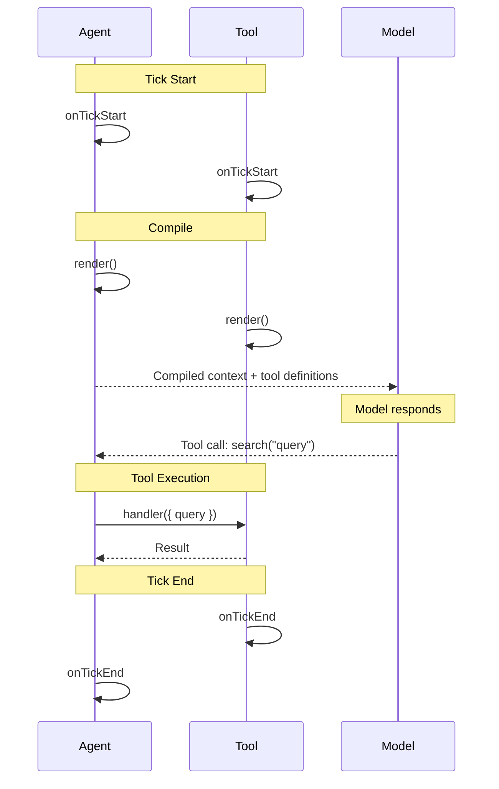

# Tools as Components

This tutorial explains the key insight that makes AIDK's tool system powerful: **tools are components**.

## Beyond Execution

In most frameworks, tools are functions that execute when called:

```typescript
// Traditional tool
const searchTool = {
  name: "search",
  handler: async (query) => {
    return await searchService.query(query);
  }
};
```

In AIDK, tools have the full component lifecycle:

```tsx
const SearchTool = createTool({
  name: "search",
  description: "Search for information",
  input: z.object({
    query: z.string(),
  }),

  // Execute when called
  handler: async ({ query }) => {
    return await searchService.query(query);
  },

  // Load state on mount
  async onMount(com) {
    const recentSearches = await searchService.getRecent();
    com.setState("recent", recentSearches);
  },

  // Render context for the model
  render(com) {
    const recent = com.getState("recent") || [];
    return (
      <Grounding title="Recent Searches">
        {recent.map(s => (
          <Text key={s.id}>{s.query}: {s.resultCount} results</Text>
        ))}
      </Grounding>
    );
  },
});
```

## The Three Capabilities

### 1. Execution (handler)

The `handler` runs when the model calls the tool. This is what traditional tools do.

```tsx
handler: async ({ query }) => {
  const results = await searchService.query(query);
  return { results, count: results.length };
}
```

### 2. State (lifecycle hooks)

Tools can have state that persists across ticks. Use `onMount` to initialize, other hooks to update.

```tsx
async onMount(com) {
  // Load initial state
  const config = await loadToolConfig();
  com.setState("config", config);
},

async onTickStart(com) {
  // Refresh on each tick if needed
  if (this.needsRefresh()) {
    const fresh = await refreshData();
    com.setState("data", fresh);
  }
}
```

### 3. Rendering (render)

Tools can render context that the model sees. This is powerful for grounding the model with current state.

```tsx
render(com, state) {
  const tasks = com.getState("tasks") || [];

  return (
    <Grounding title="Current Tasks">
      <List>
        {tasks.map(task => (
          <ListItem key={task.id}>
            [{task.done ? "x" : " "}] {task.text}
          </ListItem>
        ))}
      </List>
    </Grounding>
  );
}
```

## Why This Matters

### Grounding Without Repetition

Instead of stuffing state into the system prompt, tools render their own context:

```tsx
// Before: Everything in the agent
class TaskAgent extends Component {
  private tasks = comState<Task[]>("tasks", []);

  render(com, state) {
    return (
      <>
        <System>
          You manage tasks. Current tasks:
          {this.tasks().map(t => `- ${t.text}`).join("\n")}
        </System>
        <TaskTool />
      </>
    );
  }
}

// After: Tool renders its own context
const TaskTool = createTool({
  name: "task",
  handler: async (input) => TaskService.perform(input),

  async onMount(com) {
    com.setState("tasks", await TaskService.getTasks());
  },

  render(com) {
    const tasks = com.getState("tasks") || [];
    return (
      <Grounding title="Current Tasks">
        {tasks.map(t => <Text key={t.id}>[{t.done ? "x" : " "}] {t.text}</Text>)}
      </Grounding>
    );
  },
});

// Agent is now simpler
class TaskAgent extends Component {
  render() {
    return (
      <>
        <System>You manage tasks.</System>
        <TaskTool /> {/* Tool handles its own context */}
      </>
    );
  }
}
```

### Real-Time State

Tools update state in lifecycle hooks, and the handler returns content blocks:

```tsx
const InventoryTool = createTool({
  name: "inventory",
  input: z.object({
    action: z.enum(["add", "remove", "check"]),
    item: z.string(),
    quantity: z.number().optional(),
  }),

  // Handler only receives input, returns ContentBlock[]
  handler: async (input) => {
    const result = await InventoryService.perform(input);
    return [{ type: "text", text: result.message }];
  },

  async onMount(com) {
    com.setState("inventory", await InventoryService.getAll());
  },

  // Refresh state after each tick (tool results trigger new tick)
  async onTickStart(com) {
    com.setState("inventory", await InventoryService.getAll());
  },

  render(com) {
    const inventory = com.getState("inventory") || [];

    return (
      <Grounding title="Current Inventory">
        <Table>
          <TableHeader>
            <Cell>Item</Cell>
            <Cell>Quantity</Cell>
          </TableHeader>
          {inventory.map(item => (
            <TableRow key={item.id}>
              <Cell>{item.name}</Cell>
              <Cell>{item.quantity}</Cell>
            </TableRow>
          ))}
        </Table>
      </Grounding>
    );
  },
});
```

The handler executes, returns a result, and the next tick's `onTickStart` refreshes state. The model always sees current inventory.

### Separation of Concerns

Tools encapsulate their domain completely:

```tsx
// Database tool handles its own connection and state
// Note: Connection is managed via a singleton service, not COM state
const DatabaseTool = createTool({
  name: "database",
  input: z.object({
    query: z.string(),
  }),

  async onMount(com) {
    await DatabaseService.connect();
    const tables = await DatabaseService.getTables();
    com.setState("tables", tables);
  },

  async onUnmount(com) {
    await DatabaseService.disconnect();
  },

  // Handler only receives input
  handler: async ({ query }) => {
    const result = await DatabaseService.execute(query);
    return [{ type: "text", text: JSON.stringify(result) }];
  },

  render(com) {
    const tables = com.getState("tables") || [];
    return (
      <Grounding title="Available Tables">
        {tables.map(t => <Text key={t}>{t}</Text>)}
      </Grounding>
    );
  },
});
```

The agent doesn't need to know about database connections. The tool manages everything.

## Tool Lifecycle in the Tick Loop

Tools participate in the same tick loop as components:



## Practical Example: File Manager Tool

Here's a complete example of a tool that manages file operations with full state and rendering:

```tsx
const FileManagerTool = createTool({
  name: "file_manager",
  description: "Read, write, and manage files",
  input: z.object({
    action: z.enum(["read", "write", "list", "delete"]),
    path: z.string(),
    content: z.string().optional(),
  }),

  // Dangerous operations need confirmation
  requiresConfirmation: (input) =>
    input.action === "delete" || input.action === "write",

  confirmationMessage: (input) =>
    input.action === "delete"
      ? `Delete ${input.path}?`
      : `Write to ${input.path}?`,

  async onMount(com) {
    // Load initial file tree
    const files = await FileService.listAll();
    com.setState("files", files);
  },

  // Refresh file list on each tick
  async onTickStart(com) {
    com.setState("files", await FileService.listAll());
  },

  // Handler only receives input, returns ContentBlock[]
  handler: async (input) => {
    const result = await FileService.perform(input);
    return [{ type: "text", text: result }];
  },

  render(com) {
    const files = com.getState("files") || [];

    return (
      <Grounding title="File Tree">
        {files.map(f => (
          <Text key={f.path}>
            {f.isDirectory ? "📁" : "📄"} {f.path}
          </Text>
        ))}
      </Grounding>
    );
  },
});
```

## Key Takeaways

1. **Tools have lifecycle**: `onMount`, `onTickStart`, `render`, `onTickEnd`, `onUnmount`
2. **Tools have state**: Use `com.setState()`/`com.getState()` for state
3. **Tools render context**: The model sees what tools render
4. **Tools are self-contained**: Encapsulate domain logic completely
5. **Tools participate in ticks**: They're part of the runtime loop, not just callbacks

## Next Steps

- [Reactive State](./reactive-state) - Signals and COM state patterns
- [Creating Tools](/docs/guides/tools) - Complete tool API reference
- [Dynamic Models](./dynamic-models) - Model switching based on context
