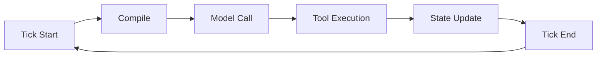

# Understanding the Tick Loop

This tutorial explains the core execution model that makes AIDK different from template-based frameworks.

## What is a Tick?

A **tick** is one complete cycle of the runtime loop:



Every interaction with a model happens inside a tick. Your components compile, the model responds, tools execute, state updates—then the next tick begins.

## Why Ticks Matter

In traditional frameworks, you build a prompt and call the model once:

```typescript
// Traditional approach
const prompt = buildPrompt(context);
const response = await model.generate(prompt);
```

In AIDK, your code runs **between** model calls:

```tsx
class MyAgent extends Component {
  // Accumulate timeline entries across ticks
  private timeline = comState<COMTimelineEntry[]>("timeline", []);

  onTickStart(com, state) {
    // state.current?.timeline contains only THIS tick's entries
    // We accumulate them ourselves
    if (state.current?.timeline) {
      this.timeline.set([...this.timeline(), ...state.current.timeline]);
    }
  }

  render(com, state) {
    // This runs on EVERY tick
    console.log(`Tick ${state.tick}`);

    return (
      <>
        <Model model={openai("gpt-5.2")} />
        <System>You are a helpful assistant.</System>
        <Timeline>
          {this.timeline().map(entry => (
            <Message key={entry.id} {...entry.message} />
          ))}
        </Timeline>
      </>
    );
  }
}
```

Note: `state.current?.timeline` only contains entries from the current tick, not the full history. Components accumulate the timeline themselves.

## Tick Phases

Each tick has distinct phases where different hooks fire:

### 1. Tick Start (`onTickStart`)

The tick begins. Use this for per-tick setup.

```tsx
class MyAgent extends Component {
  private data = comState<DataType>("data", null);

  async onTickStart(com, state) {
    // Refresh data that might have changed
    const freshData = await fetchLatestData();
    this.data.set(freshData);
  }

  render() {
    return <>{/* ... */}</>;
  }
}
```

### 2. Compilation (`render`)

Your component tree compiles to model context. This is where JSX becomes the system prompt, user messages, and tool definitions.

```tsx
render(com, state) {
  return (
    <>
      <System>You are an assistant.</System>
      {/* This conditional changes what the model sees */}
      {state.tick > 3 && (
        <System>The user seems to need more help. Be more detailed.</System>
      )}
    </>
  );
}
```

### 3. After Compile (`onAfterCompile`)

Compilation is done. You can inspect the result and request a recompile if needed.

```tsx
async onAfterCompile(com, compiledOutput) {
  const tokenCount = estimateTokens(compiledOutput);

  if (tokenCount > 100000) {
    // Too large! Summarize old messages
    await this.summarizeOldMessages(com);
    com.requestRecompile(); // Compile again with summarized context
  }
}
```

### 4. Model Execution

The compiled context goes to the model. The model responds with text and/or tool calls.

### 5. Tool Execution

Any tools the model called are executed. Tool results are added to the timeline.

### 6. Tick End (`onTickEnd`)

The tick completes. Use this for cleanup or logging.

```tsx
async onTickEnd(com, state) {
  await analytics.logTick({
    tick: state.tick,
    tokensUsed: state.current?.usage?.totalTokens,
  });
}
```

## When Does the Loop Stop?

The tick loop continues until:

1. **No tool calls**: The model responds with just text (no tools to execute)
2. **Stop condition**: Your component returns a stop signal
3. **Error**: An unrecoverable error occurs
4. **Manual stop**: You call `executionHandle.stop()`

```tsx
render(com, state) {
  // After 10 ticks, stop the agent
  if (state.tick >= 10) {
    return <Stop reason="Max ticks reached" />;
  }

  return (
    <>
      <Model model={openai("gpt-5.2")} />
      {/* ... */}
    </>
  );
}
```

## Practical Example: Dynamic Context

Here's how ticks enable dynamic behavior:

```tsx
class AdaptiveAgent extends Component {
  private complexity = signal(0);
  private timeline = comState<COMTimelineEntry[]>("timeline", []);

  onTickStart(com, state) {
    // Accumulate timeline entries
    if (state.current?.timeline) {
      this.timeline.set([...this.timeline(), ...state.current.timeline]);
    }
  }

  async onTickEnd(com, state) {
    // Analyze this tick's response
    const lastResponse = state.current?.timeline.at(-1);
    if (lastResponse?.message.role === "assistant") {
      const responseLength = getTextContent(lastResponse.message).length;

      // If responses are getting long, bump complexity
      if (responseLength > 1000) {
        this.complexity.set(this.complexity() + 1);
      }
    }
  }

  render(com, state) {
    const complexity = this.complexity();

    return (
      <>
        {/* Switch models based on conversation complexity */}
        <Model model={complexity > 2 ? openai("gpt-5.2") : openai("gpt-5.2-mini")} />

        <System>
          You are a helpful assistant.
          {complexity > 2 && " The conversation is complex. Take your time."}
        </System>

        <Timeline>
          {this.timeline().map(entry => (
            <Message key={entry.id} {...entry.message} />
          ))}
        </Timeline>
      </>
    );
  }
}
```

On each tick:

1. `onTickStart` accumulates new timeline entries
2. The agent compiles with the current complexity level
3. The model responds
4. `onTickEnd` analyzes the response
5. If complexity increased, the next tick uses a different model

This pattern is impossible with static prompts. The runtime makes it natural.

## Key Takeaways

1. **Ticks are the heartbeat**: Every model interaction is a tick
2. **Your code runs between calls**: Not once, but on every tick
3. **State persists across ticks**: Use signals and COM state to track conversation evolution
4. **Hooks give you control**: Intercept any phase of execution
5. **Context is dynamic**: What the model sees can change based on conversation state

## Next Steps

- [Tools as Components](./tools-as-components) - Learn how tools participate in the tick loop
- [Reactive State](./reactive-state) - Deep dive into signals and COM state
- [Tick Lifecycle Reference](/docs/concepts/tick-lifecycle) - Complete hook reference
