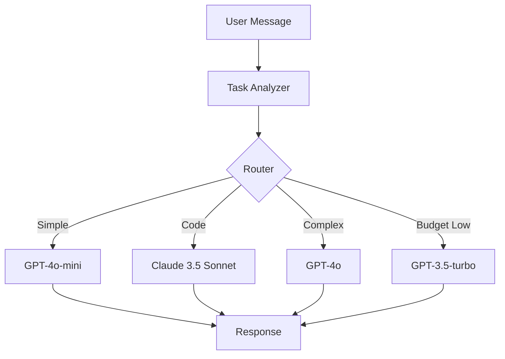

# Dynamic Model Router Example

An agent that dynamically selects models based on task complexity, cost constraints, and conversation context.

## What You'll Build

- A router that analyzes incoming messages
- Automatic model selection based on task type
- Cost-aware routing with budget tracking
- Fallback handling for rate limits

## Architecture



## The Router Agent

```tsx
// agents/smart-router.tsx
import {
  Component,
  Model,
  System,
  Timeline,
  Message,
  signal,
  computed,
} from "aidk";
import { aisdk } from "aidk-ai-sdk";
import { openai } from "@ai-sdk/openai";
import { anthropic } from "@ai-sdk/anthropic";

type TaskType = "simple" | "code" | "analysis" | "creative" | "complex";
type ModelTier = "fast" | "balanced" | "powerful" | "specialized";

interface UsageStats {
  totalTokens: number;
  totalCost: number;
  requestCount: number;
}

export class SmartRouter extends Component {
  // Task classification
  private taskType = signal<TaskType>("simple");
  private confidence = signal(0);

  // Cost tracking
  private usage = signal<UsageStats>({
    totalTokens: 0,
    totalCost: 0,
    requestCount: 0,
  });
  private budget = 1.0; // $1 budget

  // Error tracking for fallback
  private consecutiveErrors = signal(0);
  private lastErrorModel = signal<string | null>(null);

  // Computed model selection
  private selectedTier = computed<ModelTier>(() => {
    const stats = this.usage();
    const errors = this.consecutiveErrors();
    const task = this.taskType();

    // Fallback if we're hitting errors
    if (errors >= 2) {
      return "fast";
    }

    // Budget constraint
    if (stats.totalCost > this.budget * 0.8) {
      return "fast";
    }

    // Task-based selection
    switch (task) {
      case "code":
        return "specialized";
      case "complex":
      case "analysis":
        return "powerful";
      case "creative":
        return "balanced";
      default:
        return "fast";
    }
  });

  async onMessage(message) {
    if (message.role === "user") {
      // Classify the incoming message
      const classification = this.classifyTask(message.content);
      this.taskType.set(classification.type);
      this.confidence.set(classification.confidence);
    }
  }

  async onTickEnd(com, state) {
    const usage = state.current?.usage;
    if (usage) {
      // Track usage
      const cost = this.estimateCost(usage, this.selectedTier());
      this.usage.set({
        totalTokens: this.usage().totalTokens + usage.totalTokens,
        totalCost: this.usage().totalCost + cost,
        requestCount: this.usage().requestCount + 1,
      });

      // Reset error count on success
      this.consecutiveErrors.set(0);
    }
  }

  async onError(error, com) {
    const errors = this.consecutiveErrors() + 1;
    this.consecutiveErrors.set(errors);
    this.lastErrorModel.set(this.getModelName(this.selectedTier()));

    // Retry with fallback
    if (errors < 3) {
      return { retry: true, retryDelay: 1000 * errors };
    }

    return { continue: false };
  }

  render(com, state) {
    const tier = this.selectedTier();
    const model = this.getModel(tier);
    const stats = this.usage();

    return (
      <>
        <Model model={model} />

        <System>
          You are a helpful assistant.
          {tier === "specialized" && " You are an expert programmer."}
          {tier === "powerful" && " Take your time with complex analysis."}
          {stats.totalCost > this.budget * 0.5 && " Be concise to save resources."}
        </System>

        {/* Show routing info in dev mode */}
        {process.env.NODE_ENV === "development" && (
          <System audience="developer">
            [Router: {tier} model, task: {this.taskType()},
            budget: ${(this.budget - stats.totalCost).toFixed(2)} remaining]
          </System>
        )}

        <Timeline>
          {state.current?.timeline?.map((entry) => (
            <Message key={entry.id} {...entry.message} />
          ))}
        </Timeline>
      </>
    );
  }

  private classifyTask(content: string): { type: TaskType; confidence: number } {
    const lower = content.toLowerCase();

    // Code indicators
    const codePatterns = [
      /\b(code|function|class|bug|error|implement|refactor)\b/,
      /```/,
      /\.(js|ts|py|go|rs|java)\b/,
    ];
    if (codePatterns.some((p) => p.test(lower))) {
      return { type: "code", confidence: 0.9 };
    }

    // Analysis indicators
    const analysisPatterns = [
      /\b(analyze|compare|evaluate|assess|review)\b/,
      /\b(pros and cons|trade-?offs|differences)\b/,
    ];
    if (analysisPatterns.some((p) => p.test(lower))) {
      return { type: "analysis", confidence: 0.85 };
    }

    // Creative indicators
    const creativePatterns = [
      /\b(write|create|generate|imagine|story)\b/,
      /\b(poem|essay|article|blog)\b/,
    ];
    if (creativePatterns.some((p) => p.test(lower))) {
      return { type: "creative", confidence: 0.8 };
    }

    // Complex indicators (length, multiple questions)
    if (content.length > 500 || (content.match(/\?/g) || []).length > 2) {
      return { type: "complex", confidence: 0.7 };
    }

    return { type: "simple", confidence: 0.6 };
  }

  private getModel(tier: ModelTier) {
    const models = {
      fast: aisdk({ model: openai("gpt-4o-mini") }),
      balanced: aisdk({ model: openai("gpt-4o") }),
      powerful: aisdk({ model: openai("gpt-4o"), temperature: 0.7 }),
      specialized: aisdk({ model: anthropic("claude-3-5-sonnet-20241022") }),
    };
    return models[tier];
  }

  private getModelName(tier: ModelTier): string {
    const names = {
      fast: "gpt-4o-mini",
      balanced: "gpt-4o",
      powerful: "gpt-4o",
      specialized: "claude-3-5-sonnet",
    };
    return names[tier];
  }

  private estimateCost(usage: { promptTokens: number; completionTokens: number }, tier: ModelTier): number {
    // Approximate costs per 1K tokens
    const costs = {
      fast: { input: 0.00015, output: 0.0006 },
      balanced: { input: 0.0025, output: 0.01 },
      powerful: { input: 0.0025, output: 0.01 },
      specialized: { input: 0.003, output: 0.015 },
    };

    const { input, output } = costs[tier];
    return (usage.promptTokens * input + usage.completionTokens * output) / 1000;
  }
}
```

## Advanced: Multi-Stage Router

For complex queries, use a two-stage approach:

```tsx
// agents/two-stage-router.tsx
import {
  Component,
  Model,
  System,
  Fork,
  signal,
  Grounding,
} from "aidk";
import { aisdk } from "aidk-ai-sdk";
import { openai } from "@ai-sdk/openai";

interface RoutingDecision {
  model: string;
  systemPrompt: string;
  temperature: number;
  reasoning: string;
}

export class TwoStageRouter extends Component {
  private routingDecision = signal<RoutingDecision | null>(null);
  private userQuery = signal<string | null>(null);

  async onMessage(message) {
    if (message.role === "user" && !this.routingDecision()) {
      this.userQuery.set(message.content);
    }
  }

  render(com, state) {
    const decision = this.routingDecision();
    const query = this.userQuery();

    // Stage 1: Route the query
    if (query && !decision) {
      return (
        <>
          {/* Use fast model for routing decision */}
          <Fork
            waitUntilComplete={true}
            onComplete={(result) => this.routingDecision.set(result)}
          >
            <RouterAgent query={query} />
          </Fork>
        </>
      );
    }

    // Stage 2: Execute with selected model
    if (decision) {
      const model = this.getModelFromDecision(decision);

      return (
        <>
          <Model model={model} temperature={decision.temperature} />

          <System>{decision.systemPrompt}</System>

          {process.env.NODE_ENV === "development" && (
            <Grounding title="Routing Decision">
              Model: {decision.model}
              Reasoning: {decision.reasoning}
            </Grounding>
          )}

          <Timeline>
            {state.current?.timeline?.map((entry) => (
              <Message key={entry.id} {...entry.message} />
            ))}
          </Timeline>
        </>
      );
    }

    // Waiting for query
    return (
      <>
        <Model model={aisdk({ model: openai("gpt-4o-mini") })} />
        <System>You are a helpful assistant.</System>
      </>
    );
  }

  private getModelFromDecision(decision: RoutingDecision) {
    // Map decision to actual model
    const models: Record<string, any> = {
      "gpt-4o-mini": openai("gpt-4o-mini"),
      "gpt-4o": openai("gpt-4o"),
      "claude-3-5-sonnet": anthropic("claude-3-5-sonnet-20241022"),
      "o1-preview": openai("o1-preview"),
    };
    return aisdk({ model: models[decision.model] || models["gpt-4o-mini"] });
  }
}

// The routing agent
class RouterAgent extends Component<{ query: string }> {
  render() {
    const { query } = this.props;

    return (
      <>
        <Model model={aisdk({ model: openai("gpt-4o-mini") })} />

        <System>
          You are a routing assistant. Analyze the user query and decide:
          1. Which model is best suited (gpt-4o-mini, gpt-4o, claude-3-5-sonnet, o1-preview)
          2. What system prompt would help
          3. What temperature setting (0-1)

          Consider:
          - gpt-4o-mini: Simple questions, quick responses
          - gpt-4o: General tasks, balanced performance
          - claude-3-5-sonnet: Code, technical writing, analysis
          - o1-preview: Complex reasoning, math, logic puzzles
        </System>

        <Grounding title="Query to Route">{query}</Grounding>

        <RoutingTool />
      </>
    );
  }
}

// Tool to capture routing decision
const RoutingTool = createTool({
  name: "route_query",
  parameters: z.object({
    model: z.enum(["gpt-4o-mini", "gpt-4o", "claude-3-5-sonnet", "o1-preview"]),
    systemPrompt: z.string(),
    temperature: z.number().min(0).max(1),
    reasoning: z.string(),
  }),
  handler: async (input) => input,
});
```

## User Preference Routing

Let users influence model selection:

```tsx
// agents/preference-router.tsx
export class PreferenceRouter extends Component {
  render(com, state) {
    // Get user preferences from context
    const prefs = com.getState("userPreferences") || {};

    let model;
    let systemNote = "";

    if (prefs.preferSpeed) {
      model = aisdk({ model: openai("gpt-4o-mini") });
      systemNote = "Respond quickly and concisely.";
    } else if (prefs.preferQuality) {
      model = aisdk({ model: anthropic("claude-3-5-sonnet-20241022") });
      systemNote = "Take your time to provide thorough responses.";
    } else if (prefs.preferCost) {
      model = aisdk({ model: openai("gpt-3.5-turbo") });
      systemNote = "Be efficient with your responses.";
    } else {
      model = aisdk({ model: openai("gpt-4o") });
    }

    return (
      <>
        <Model model={model} />
        <System>
          You are a helpful assistant.
          {systemNote && ` ${systemNote}`}
        </System>
        {/* ... */}
      </>
    );
  }
}
```

## A/B Testing Models

Compare model performance:

```tsx
// agents/ab-test-router.tsx
export class ABTestRouter extends Component {
  private variant = signal<"A" | "B">("A");
  private sessionId = signal<string>("");

  async onMount(com) {
    // Assign variant based on session
    const sessionId = com.getState("sessionId") || crypto.randomUUID();
    this.sessionId.set(sessionId);

    // Deterministic assignment based on session hash
    const hash = this.hashString(sessionId);
    this.variant.set(hash % 2 === 0 ? "A" : "B");
  }

  async onTickEnd(com, state) {
    // Log metrics for analysis
    await fetch("/api/ab-metrics", {
      method: "POST",
      body: JSON.stringify({
        sessionId: this.sessionId(),
        variant: this.variant(),
        tick: state.tick,
        latency: state.current?.latency,
        tokens: state.current?.usage?.totalTokens,
      }),
    });
  }

  render() {
    const variant = this.variant();

    const model = variant === "A"
      ? aisdk({ model: openai("gpt-4o") })
      : aisdk({ model: anthropic("claude-3-5-sonnet-20241022") });

    return (
      <>
        <Model model={model} />
        <System>You are a helpful assistant.</System>
        {/* ... */}
      </>
    );
  }

  private hashString(str: string): number {
    let hash = 0;
    for (let i = 0; i < str.length; i++) {
      hash = (hash << 5) - hash + str.charCodeAt(i);
      hash |= 0;
    }
    return Math.abs(hash);
  }
}
```

## Monitoring Dashboard

Track routing decisions:

```tsx
// components/RouterDashboard.tsx
import { useExecution } from "aidk-react";
import { useState, useEffect } from "react";

interface RoutingStats {
  modelCounts: Record<string, number>;
  avgLatency: Record<string, number>;
  totalCost: number;
  errorRate: number;
}

export function RouterDashboard() {
  const [stats, setStats] = useState<RoutingStats | null>(null);
  const { subscribe } = useExecution();

  useEffect(() => {
    return subscribe((event) => {
      if (event.type === "channel" && event.channel === "router-stats") {
        setStats(event.payload);
      }
    });
  }, [subscribe]);

  if (!stats) return null;

  return (
    <div className="router-dashboard">
      <h3>Router Stats</h3>

      <div className="stat-grid">
        <div className="stat">
          <label>Total Cost</label>
          <value>${stats.totalCost.toFixed(4)}</value>
        </div>

        <div className="stat">
          <label>Error Rate</label>
          <value>{(stats.errorRate * 100).toFixed(1)}%</value>
        </div>
      </div>

      <h4>Model Distribution</h4>
      <div className="model-bars">
        {Object.entries(stats.modelCounts).map(([model, count]) => (
          <div key={model} className="model-bar">
            <span className="model-name">{model}</span>
            <div className="bar" style={{ width: `${count}%` }} />
            <span className="count">{count}</span>
          </div>
        ))}
      </div>
    </div>
  );
}
```

## Key Concepts Demonstrated

### Signal-Based State

```tsx
private taskType = signal<TaskType>("simple");
private usage = signal<UsageStats>({ totalTokens: 0, totalCost: 0 });
```

Signals track routing state across ticks.

### Computed Values

```tsx
private selectedTier = computed<ModelTier>(() => {
  const stats = this.usage();
  const task = this.taskType();
  // Selection logic...
});
```

Computed values automatically update when dependencies change.

### Dynamic Model Selection

```tsx
render() {
  const tier = this.selectedTier();
  const model = this.getModel(tier);

  return <Model model={model} />;
}
```

Model selection happens on every render based on current state.

### Error-Based Fallback

```tsx
async onError(error) {
  this.consecutiveErrors.set(this.consecutiveErrors() + 1);
  return { retry: true };
}
```

Track errors and fall back to more reliable models.

## Best Practices

1. **Start simple**: Begin with task classification, add complexity as needed
2. **Track everything**: Log routing decisions for analysis
3. **Set budgets**: Prevent runaway costs with hard limits
4. **Plan fallbacks**: Always have a cheaper/more reliable backup
5. **A/B test**: Compare models empirically, not just by spec

## Next Steps

- Implement caching for repeated queries
- Add user feedback to improve routing
- Build a routing decision dashboard
- Experiment with different classification methods

See the full source in the [example directory](https://github.com/rlindgren/aidk/tree/main/example).
