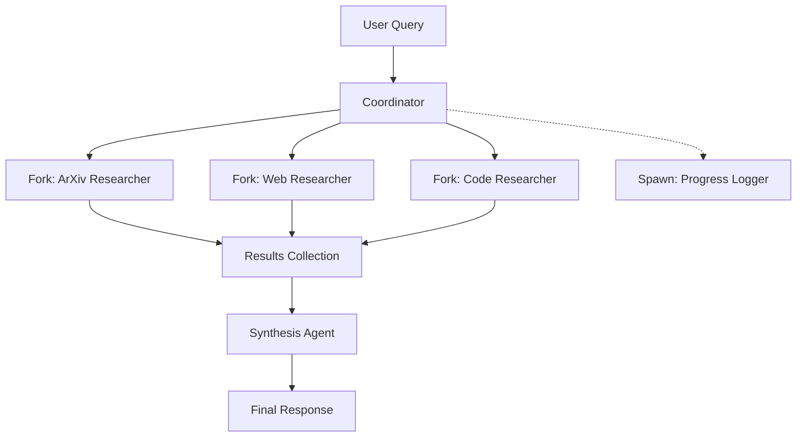

# Multi-Agent Example

A research coordinator that uses Fork and Spawn to orchestrate multiple specialized agents working in parallel.

## What You'll Build

- A coordinator agent that manages parallel research tasks
- Specialized sub-agents for different research sources
- Real-time progress tracking via channels
- Result synthesis from multiple agents

## Architecture



## The Coordinator Agent

The coordinator manages the overall research flow:

```tsx
// agents/research-coordinator.tsx
import {
  Component,
  Model,
  System,
  Fork,
  Spawn,
  Grounding,
  Section,
  comState,
  signal,
} from "aidk";
import { aisdk } from "aidk-ai-sdk";
import { openai, anthropic } from "@ai-sdk/openai";

interface ResearchResult {
  source: string;
  findings: string[];
  confidence: number;
}

export class ResearchCoordinator extends Component {
  // Track results from parallel researchers
  private results = comState<ResearchResult[]>("results", []);
  private phase = signal<"research" | "synthesis" | "complete">("research");
  private query = signal<string | null>(null);

  // Track which researchers have completed
  private completedSources = signal<string[]>([]);
  private targetSources = ["arxiv", "web", "github"];

  async onMessage(message) {
    // Capture the research query
    if (message.role === "user") {
      this.query.set(message.content);
    }
  }

  render(com, state) {
    const phase = this.phase();
    const query = this.query();
    const results = this.results();

    // Phase 1: Dispatch parallel researchers
    if (phase === "research" && query) {
      return (
        <>
          <Model model={aisdk({ model: openai("gpt-4o") })} />

          <System>
            You are a research coordinator. A query has been received and
            researchers are gathering information. Wait for their results.
          </System>

          {/* Log progress in background */}
          <Spawn>
            <ProgressLogger
              query={query}
              sources={this.targetSources}
            />
          </Spawn>

          {/* Fork parallel researchers */}
          <Fork
            waitUntilComplete={true}
            onComplete={(result) => this.handleResearchComplete("arxiv", result)}
          >
            <ArxivResearcher query={query} />
          </Fork>

          <Fork
            waitUntilComplete={true}
            onComplete={(result) => this.handleResearchComplete("web", result)}
          >
            <WebResearcher query={query} />
          </Fork>

          <Fork
            waitUntilComplete={true}
            onComplete={(result) => this.handleResearchComplete("github", result)}
          >
            <CodeResearcher query={query} />
          </Fork>

          <Grounding title="Research Status">
            <Section title="Query">{query}</Section>
            <Section title="Progress">
              {this.completedSources().length} / {this.targetSources.length} sources complete
            </Section>
          </Grounding>
        </>
      );
    }

    // Phase 2: Synthesize results
    if (phase === "synthesis") {
      return (
        <>
          {/* Use a more capable model for synthesis */}
          <Model model={aisdk({ model: anthropic("claude-3-5-sonnet") })} />

          <System>
            You are a research synthesizer. Analyze the findings from multiple
            sources and create a comprehensive summary. Highlight agreements,
            disagreements, and gaps in the research.
          </System>

          <Grounding title="Research Findings">
            {results.map((result, i) => (
              <Section key={i} title={`${result.source} (confidence: ${result.confidence})`}>
                {result.findings.map((f, j) => (
                  <p key={j}>• {f}</p>
                ))}
              </Section>
            ))}
          </Grounding>

          <SynthesisTool onComplete={() => this.phase.set("complete")} />
        </>
      );
    }

    // Phase 3: Complete
    return (
      <>
        <Model model={aisdk({ model: openai("gpt-4o") })} />
        <System>Research complete. Answer any follow-up questions.</System>
      </>
    );
  }

  private handleResearchComplete(source: string, result: ResearchResult) {
    // Add result
    this.results.set([...this.results(), { ...result, source }]);

    // Track completion
    const completed = [...this.completedSources(), source];
    this.completedSources.set(completed);

    // Move to synthesis when all complete
    if (completed.length >= this.targetSources.length) {
      this.phase.set("synthesis");
    }
  }
}
```

## Specialized Researcher Agents

Each researcher focuses on a specific source:

```tsx
// agents/arxiv-researcher.tsx
import { Component, Model, System, Grounding } from "aidk";
import { aisdk } from "aidk-ai-sdk";
import { openai } from "@ai-sdk/openai";

interface ArxivResearcherProps {
  query: string;
}

export class ArxivResearcher extends Component<ArxivResearcherProps> {
  render(com, state) {
    const { query } = this.props;

    return (
      <>
        <Model model={aisdk({ model: openai("gpt-4o-mini") })} />

        <System>
          You are an academic research specialist. Search arXiv for papers
          related to the query. Return structured findings with:
          - Key papers and their contributions
          - Main conclusions
          - Confidence level (0-1)

          Focus on recent, highly-cited work.
        </System>

        <Grounding title="Research Query">{query}</Grounding>

        <ArxivSearchTool />
        <FindingsTool />
      </>
    );
  }
}

// agents/web-researcher.tsx
export class WebResearcher extends Component<{ query: string }> {
  render() {
    const { query } = this.props;

    return (
      <>
        <Model model={aisdk({ model: openai("gpt-4o-mini") })} />

        <System>
          You are a web research specialist. Search the web for authoritative
          sources on the query. Focus on:
          - Official documentation
          - Expert blog posts
          - Industry reports

          Return structured findings with confidence levels.
        </System>

        <Grounding title="Research Query">{query}</Grounding>

        <WebSearchTool />
        <FindingsTool />
      </>
    );
  }
}

// agents/code-researcher.tsx
export class CodeResearcher extends Component<{ query: string }> {
  render() {
    const { query } = this.props;

    return (
      <>
        <Model model={aisdk({ model: openai("gpt-4o-mini") })} />

        <System>
          You are a code research specialist. Search GitHub for implementations
          and examples related to the query. Focus on:
          - Popular repositories
          - Code patterns and best practices
          - Common issues and solutions

          Return structured findings with confidence levels.
        </System>

        <Grounding title="Research Query">{query}</Grounding>

        <GitHubSearchTool />
        <FindingsTool />
      </>
    );
  }
}
```

## Background Progress Logger

A spawned agent that logs progress without blocking:

```tsx
// agents/progress-logger.tsx
import { Component, Model, System } from "aidk";
import { aisdk } from "aidk-ai-sdk";
import { openai } from "@ai-sdk/openai";

interface ProgressLoggerProps {
  query: string;
  sources: string[];
}

export class ProgressLogger extends Component<ProgressLoggerProps> {
  async onMount(com) {
    const { query, sources } = this.props;

    // Log to analytics/monitoring service
    await fetch("/api/analytics/research-started", {
      method: "POST",
      body: JSON.stringify({
        query,
        sources,
        timestamp: Date.now(),
      }),
    });
  }

  async onComplete(com, result) {
    // Log completion
    await fetch("/api/analytics/research-completed", {
      method: "POST",
      body: JSON.stringify({
        result,
        timestamp: Date.now(),
      }),
    });
  }

  render() {
    // Minimal render - this agent just logs
    return (
      <>
        <Model model={aisdk({ model: openai("gpt-4o-mini") })} maxTokens={10} />
        <System>Acknowledge and complete.</System>
      </>
    );
  }
}
```

## Tools

```tsx
// tools/findings-tool.tsx
import { createTool } from "aidk";
import { z } from "zod";

export const FindingsTool = createTool({
  name: "submit_findings",
  description: "Submit research findings to the coordinator",
  parameters: z.object({
    findings: z.array(z.string()).describe("List of key findings"),
    confidence: z.number().min(0).max(1).describe("Confidence in findings"),
    sources: z.array(z.string()).optional().describe("Source URLs"),
  }),

  handler: async (input) => {
    // The findings are captured by the Fork's onComplete callback
    return {
      success: true,
      findings: input.findings,
      confidence: input.confidence,
    };
  },
});

// tools/synthesis-tool.tsx
// Note: Tool signals completion via its result; parent component
// checks the result and advances the phase
export const SynthesisTool = createTool({
  name: "submit_synthesis",
  description: "Submit the final synthesized research summary",
  parameters: z.object({
    summary: z.string().describe("Comprehensive summary"),
    agreements: z.array(z.string()).describe("Points where sources agree"),
    disagreements: z.array(z.string()).describe("Points of contention"),
    gaps: z.array(z.string()).describe("Areas needing more research"),
    recommendations: z.array(z.string()).describe("Action items"),
  }),

  // Handler only receives input
  handler: async (input) => {
    return [{
      type: "text",
      text: `Synthesis complete:\n\n${input.summary}\n\nAgreements: ${input.agreements.length}\nDisagreements: ${input.disagreements.length}`,
    }];
  },
});
```

## Real-Time Progress with Channels

Track research progress in real-time:

```tsx
// channels/research.channel.ts
import { ChannelRouter } from "aidk";

export const researchChannel = new ChannelRouter<{
  sessionId: string;
}>("research", {
  scope: { session: "sessionId" },
});

// Broadcast progress updates from researchers
function broadcastProgress(sessionId: string, update: {
  source: string;
  status: "started" | "searching" | "analyzing" | "complete";
  progress?: number;
}) {
  researchChannel
    .publisher()
    .to(sessionId)
    .broadcast({ type: "progress", payload: update });
}
```

## Frontend Integration

```tsx
// components/ResearchProgress.tsx
import { useState, useEffect } from "react";
import { useExecution } from "aidk-react";

interface ProgressState {
  [source: string]: {
    status: string;
    progress: number;
  };
}

export function ResearchProgress() {
  const [progress, setProgress] = useState<ProgressState>({});
  const { subscribe } = useExecution();

  useEffect(() => {
    return subscribe((event) => {
      if (event.type === "channel" && event.channel === "research") {
        const { source, status, progress: pct } = event.payload;
        setProgress((prev) => ({
          ...prev,
          [source]: { status, progress: pct || 0 },
        }));
      }
    });
  }, [subscribe]);

  const sources = Object.entries(progress);

  if (sources.length === 0) return null;

  return (
    <div className="research-progress">
      <h3>Research Progress</h3>
      {sources.map(([source, { status, progress }]) => (
        <div key={source} className="source-progress">
          <span className="source-name">{source}</span>
          <div className="progress-bar">
            <div
              className="progress-fill"
              style={{ width: `${progress}%` }}
            />
          </div>
          <span className="status">{status}</span>
        </div>
      ))}
    </div>
  );
}
```

## Running the Example

```bash
# Start backend
cd example/express
pnpm dev

# Start frontend
cd example/react
pnpm dev
```

Try queries like:
- "Research the current state of quantum computing"
- "What are best practices for building LLM applications?"
- "Compare React, Vue, and Svelte for large applications"

## Key Concepts Demonstrated

### Fork for Parallel Work

```tsx
<Fork waitUntilComplete={true} onComplete={handleResult}>
  <ResearcherAgent query={query} />
</Fork>
```

Multiple Fork components run their agents in parallel. The coordinator waits for all to complete via `waitUntilComplete={true}`.

### Spawn for Background Tasks

```tsx
<Spawn>
  <ProgressLogger query={query} />
</Spawn>
```

Spawn creates independent processes that don't block the parent. Used for logging, notifications, and analytics.

### Phase-Based Rendering

The coordinator uses signals to track phase and renders different content:
- **Research phase**: Fork parallel researchers
- **Synthesis phase**: Combine results with a powerful model
- **Complete phase**: Answer follow-up questions

### Result Aggregation

```tsx
private handleResearchComplete(source: string, result: ResearchResult) {
  this.results.set([...this.results(), { ...result, source }]);

  if (this.completedSources().length >= this.targetSources.length) {
    this.phase.set("synthesis");
  }
}
```

Results accumulate as forks complete. When all sources report in, move to synthesis.

### Model Selection by Task

- **Researchers**: Use fast, cheap models (`gpt-4o-mini`)
- **Coordinator**: Use capable model for orchestration (`gpt-4o`)
- **Synthesizer**: Use best model for analysis (`claude-3-5-sonnet`)

## Patterns You Can Apply

1. **Fan-out/Fan-in**: Fork multiple workers, collect results, synthesize
2. **Pipeline**: Each phase uses results from the previous
3. **Background processing**: Spawn for non-blocking side effects
4. **Progressive enhancement**: Start with fast models, upgrade for synthesis
5. **Real-time progress**: Broadcast updates via channels

## Next Steps

- Add caching for repeated queries
- Implement retry logic for failed researchers
- Add user feedback to improve results
- Store research history for future reference

See the full source in the [example directory](https://github.com/rlindgren/aidk/tree/main/example).
